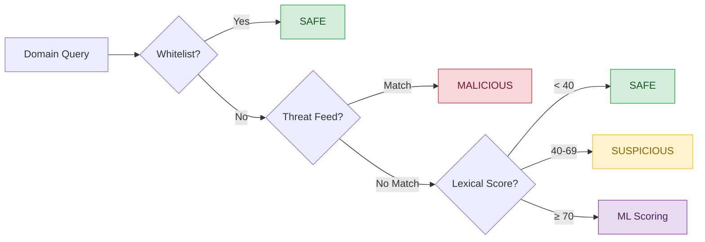
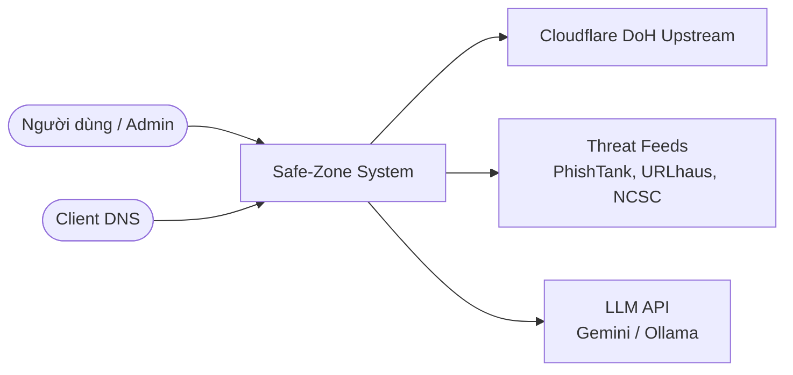
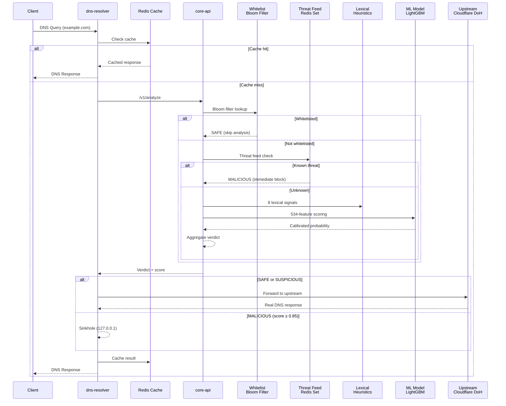
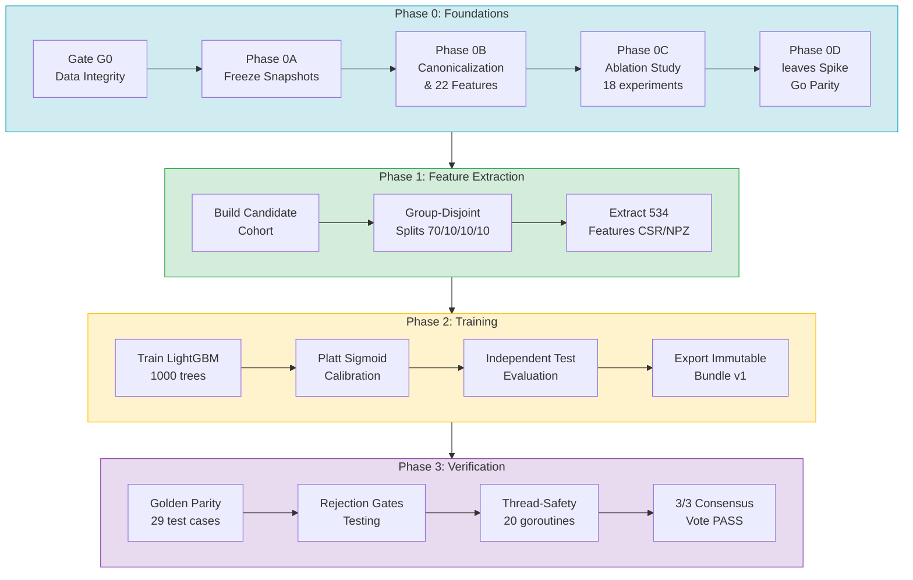
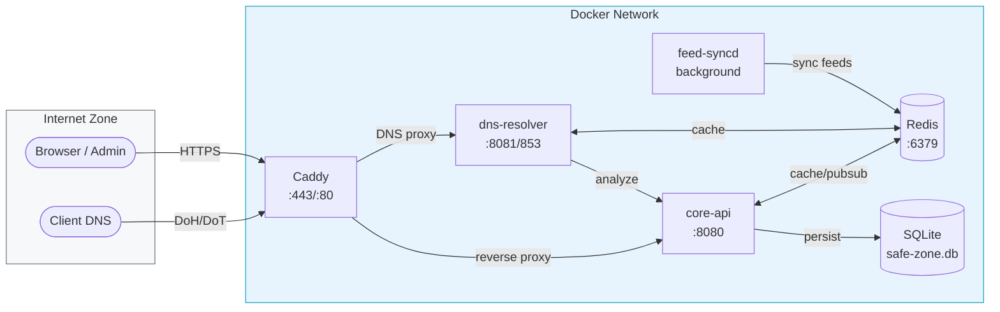

# Kỹ năng Vẽ Sơ đồ Kỹ thuật — Safe-Zone

> **Phạm vi:** Áp dụng khi AI agent cần vẽ sơ đồ kiến trúc, flowchart, sequence diagram, pipeline, hoặc wireframe cho dự án Safe-Zone.

---

## 1. Nguyên tắc Thiết kế

### 1.1. Mỗi sơ đồ — Một mục đích

Trước khi vẽ, xác định rõ sơ đồ trả lời câu hỏi nào:
- **"Hệ thống gồm những gì?"** → Architecture / Container diagram
- **"Dữ liệu đi qua đâu?"** → Flowchart / Sequence diagram
- **"Quy trình gồm mấy bước?"** → Pipeline / Activity diagram
- **"Ai giao tiếp với ai?"** → Sequence / Interaction diagram

### 1.2. Tối giản & Rõ ràng

- Giới hạn **7 ± 2 node** mỗi sơ đồ. Nếu vượt quá → chia thành sub-diagrams.
- Mỗi node có **tên ngắn** (2-4 từ) và **mô tả 1 dòng** nếu cần.
- Loại bỏ node không đóng góp vào câu trả lời chính.

### 1.3. Luồng Một chiều Nhất quán

- **Trên → Dưới** (TB): cho pipeline, quy trình tuần tự.
- **Trái → Phải** (LR): cho kiến trúc hệ thống, data flow.
- Tránh mũi tên ngược chiều trừ khi thể hiện feedback loop rõ ràng.

### 1.4. Ký hiệu Hình khối Chuẩn

| Hình | Ý nghĩa | Mermaid syntax |
|---|---|---|
| Hình chữ nhật bo tròn | Service / Process | `A([Service Name])` |
| Hình chữ nhật vuông | Module / Component | `A[Module Name]` |
| Hình thoi | Quyết định / Điều kiện | `A{Condition?}` |
| Hình trụ | Database / Storage | `A[(Database)]` |
| Hình bình hành | Input / Output | `A[/Data Input/]` |
| Hình tròn | Bắt đầu / Kết thúc | `A((Start))` |

---

## 2. Công cụ & Cú pháp

### 2.1. Ưu tiên: Mermaid.js

Sử dụng Mermaid cho tất cả sơ đồ trong file Markdown, README, và tài liệu GitHub. Lý do: render trực tiếp trên GitHub, không cần toolchain bên ngoài, dễ version control (text-based).

### 2.2. LaTeX TikZ (Khi viết paper)

Chỉ dùng TikZ khi xuất sơ đồ cho báo cáo khoa học PDF/LaTeX. Khi đó:
- Dùng `inner sep=8pt` để tránh chữ bị cắt.
- Dùng `label=above left` thay vì `fit` overlay khi annotate.
- Bo tròn góc: `rounded corners=4pt`.

### 2.3. Quy tắc Cú pháp Mermaid

```
%% Tránh lỗi render:
- Quote nhãn chứa ký tự đặc biệt: id["Label (Extra Info)"]
- Không dùng HTML tags trong labels
- Không dùng emoji trong node labels (một số renderer không hỗ trợ)
- Dùng subgraph cho nhóm logic, đặt tên rõ ràng
```

---

## 3. Bảng Màu Chuẩn

### 3.1. Nguyên tắc Màu sắc

- **Nền chính:** Nhạt, sạch — White, Light Gray (#F7F8FA), Very Light Blue (#F0F4F8).
- **Giới hạn 3-4 màu accent** mỗi sơ đồ.
- **Pastel** cho nền node. Không dùng màu đậm/neon cho background.
- **Viền (stroke)** đậm hơn nền 2-3 shade để tạo độ tương phản.

### 3.2. Bảng Màu Phán định Rủi ro (Risk Verdict Palette)

Áp dụng nhất quán trong mọi sơ đồ liên quan tới threat scoring:

| Trạng thái | Màu nền | Màu viền | Mã hex | Dải điểm |
|---|---|---|---|---|
| **SAFE** | Xanh lá nhạt | Xanh lá đậm | `#D4EDDA` / `#28A745` | Score < 40 |
| **SUSPICIOUS** | Vàng nhạt | Vàng đậm | `#FFF3CD` / `#FFC107` | 40 ≤ Score < 70 |
| **MALICIOUS** | Đỏ nhạt | Đỏ đậm | `#F8D7DA` / `#DC3545` | Score ≥ 70 |
| **3rd Party / External** | Xám nhạt | Xám đậm | `#E9ECEF` / `#6C757D` | N/A |
| **AI / ML** | Tím nhạt | Tím đậm | `#E8DAEF` / `#8E44AD` | N/A |
| **Info / Neutral** | Xanh dương nhạt | Xanh dương đậm | `#D1ECF1` / `#17A2B8` | N/A |

### 3.3. Áp dụng Màu trong Mermaid



---

## 4. Khung Kiến trúc C4 Model

Áp dụng 3 mức đầu tiên của C4 Model. Bỏ qua Mức 4 (Code) vì mã nguồn tự giải thích.

### Mức 1: System Context (Ngữ cảnh Hệ thống)

Trả lời: "Safe-Zone tương tác với hệ thống nào bên ngoài?"



### Mức 2: Container (Thùng chứa)

Trả lời: "Safe-Zone gồm những service/container nào?"

Các container chính cần thể hiện:
- `Caddy` (reverse proxy, TLS termination)
- `core-api` (HTTP API, Go, port 8080)
- `dns-resolver` (DNS server, DoH/DoT, port 8081/853)
- `feed-syncd` (background daemon, threat feed sync)
- `Redis` (cache, pub/sub)
- `SQLite` (persistent storage, WHOIS cache)
- `React SPA` (embedded UI)

### Mức 3: Component (Thành phần)

Trả lời: "Bên trong core-api có những module nào?"

Các component chính trong `internal/`:
- `analysis` — Multi-layer risk scoring engine
- `risk` — Risk aggregation & verdict
- `ai` — LLM integration (Gemini, Ollama)
- `store` — SQLite repository
- `cache` — Redis client
- `config` — Dynamic configuration (hot-reload)
- `api` — HTTP handlers & middleware

---

## 5. Template Sơ đồ Safe-Zone

### 5.1. DNS Resolution Flow (Sequence Diagram)



### 5.2. ML Training Pipeline (Flowchart)



### 5.3. Container Architecture (LR Layout)



---

## 6. Phong cách Sơ đồ UI Dashboard

Khi vẽ wireframe hoặc layout cho SOC Dashboard:

- **Theme:** Modern Light SOC — lấy cảm hứng Windows 11 / Zorin OS.
- **Nền:** Trắng (#FFFFFF) hoặc xám rất nhạt (#F7F8FA).
- **Card:** Glassmorphism — `backdrop-blur`, viền mờ, đổ bóng nhẹ.
- **Bo tròn:** `border-radius: 12px` cho cards, `8px` cho buttons.
- **Typography:** Inter hoặc system font stack.
- **Biểu đồ:** Recharts (SVG) hoặc ApexCharts. Dùng pastel fills, không dùng pattern phức tạp.
- **State colors:** Theo Risk Verdict Palette (Section 3.2).

---

## 7. Pre-flight Checklist

Trước khi xuất sơ đồ, AI agent **PHẢI** kiểm tra:

```
□ Sơ đồ trả lời đúng 1 câu hỏi rõ ràng?
□ Số node ≤ 9? (Nếu > 9 → cần chia nhỏ)
□ Luồng đi theo 1 hướng nhất quán (TB hoặc LR)?
□ Có dùng đúng Risk Verdict Palette cho trạng thái rủi ro?
□ Tên node/service khớp với codebase (core-api, dns-resolver, feed-syncd)?
□ Label trên mũi tên có mô tả hành động (không để trống)?
□ Không có mũi tên chéo ngoằn ngoèo (crossing arrows)?
□ Cú pháp Mermaid render được (không lỗi parse)?
□ Node chứa ký tự đặc biệt đã được quote ["..."]?
□ subgraph có tên mô tả rõ ràng?
```
