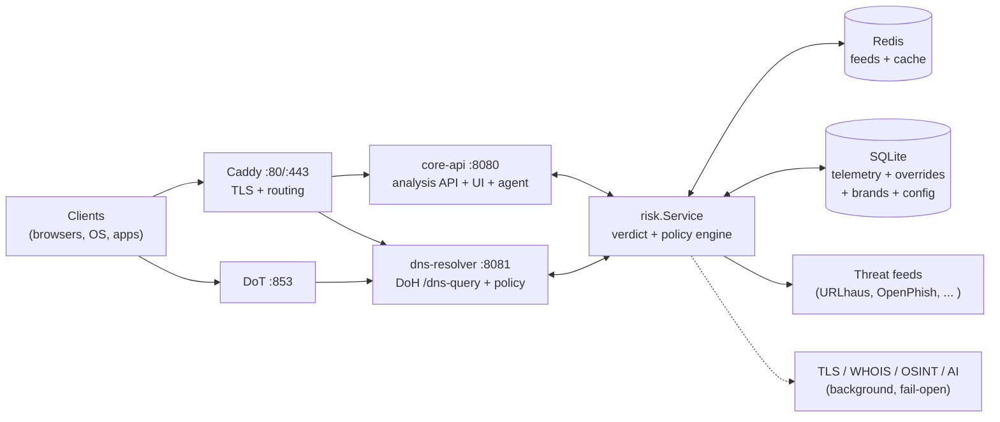

# 🛡️ Safe Zone

[](https://github.com/vmcchooky/safe-zone/actions/workflows/ci.yml)
[](https://github.com/vmcchooky/safe-zone/actions/workflows/security.yml)
[](https://go.dev/)
[](LICENSE)
[](docs/runbooks/production-edge.md)
[](docker-compose.production.yml)

🌐 **Language / Ngôn ngữ:** [English](README.md) | [Tiếng Việt](README.vi.md)

**DNS-level anti-phishing for Vietnam.** Safe Zone is an open-source, nonprofit
project that blocks phishing and impersonation websites at the DNS layer —
before the browser ever loads them — with a self-hosted operator control plane
you fully own: no SaaS account, no third-party control plane, no data leaving
your VPS.

> **Status: Release Candidate** (`RELEASE_CANDIDATE_SHADOW_READY`). Core engine
> and URL-ML shadow integration passed local capacity testing; final VPS
> validation is in progress. Not every deployment scenario is production-ready —
> see [Project status](#-project-status) and the operator source of truth,
> [docs/production-completion-checklist.md](docs/production-completion-checklist.md).

## 📑 Contents

- [✨ Features](#-features)
- [🏗️ Architecture](#️-architecture)
- [🚀 Quickstart](#-quickstart)
- [🔍 Try it](#-try-it)
- [⚙️ Configuration](#️-configuration)
- [🧠 Threat intel & ML](#-threat-intel--ml)
- [🧪 Evaluation](#-evaluation)
- [🔒 Security](#-security)
- [📦 Deployment](#-deployment)
- [🗺️ Project status](#️-project-status)
- [🤝 Contributing](#-contributing)
- [🙏 Credits](#-credits)
- [📄 License](#-license)

## ✨ Features

**Protect**
- 🧬 **Layered domain verdicts** — deterministic lexical scoring (typosquat,
  brand-abuse, DGA/entropy, IDN homoglyphs), live threat-feed matching, and
  background TLS/WHOIS enrichment that can only promote with corroboration.
- 📡 **DoH + DoT out of the box** — DNS-over-HTTPS at `/dns-query` and
  DNS-over-TLS on `:853`, with CNAME uncloaking and sinkhole / NXDOMAIN /
  refused / null-IP block strategies.
- 🚫 **Ads, trackers & telemetry as policy** — content blocking stays a
  *policy action*, never mislabeled as malware (e.g. telemetry endpoints are
  `SUSPICIOUS`/policy-block, not `MALICIOUS`).

**Operate**
- 🖥️ **Operator UI + API** — React dashboard at `/app/`, cached analysis,
  overrides, groups, reports, and Prometheus-style `/metrics`.
- 🔁 **Fail-open by design** — Redis, feeds, OSINT, AI, and enrichment outages
  degrade coverage, never take down resolution. SQLite persistence is required
  in production so operator intent is never lost silently.
- 📉 **Budget-VPS friendly** — single-node Compose stack, ~$10/month baseline,
  5% telemetry write sampling in production.

**Extend**
- 🤖 **Optional local AI/ML** — Gemini/Ollama refinement and a LightGBM domain
  classifier with `disabled → shadow → canary → enforce` gates. Off by default.
- 🧩 **Evidence-led evaluation** — versioned truth/contract corpora with
  provenance discipline (`unknown` never counts toward precision/recall).

## 🏗️ Architecture



Internal ports `:8080`/`:8081` stay **loopback-only** in production; only
`80`, `443`, and `853` are published (verified — see
[edge verification](docs/deployment/edge-verification-2026-09-20.md)).

## 🚀 Quickstart

Prerequisites: Go 1.26+ (or Docker).

```bash
git clone https://github.com/vmcchooky/safe-zone.git
cd safe-zone

# Terminal 1 — API + dashboard at http://localhost:8080/app/
go run ./cmd/core-api

# Terminal 2 — DNS policy + DoH at http://localhost:8081/dns-query
go run ./cmd/dns-resolver
```

With Docker (dev stack, loopback-only bindings):

```bash
cp .env.example .env
docker compose -f docker-compose.yml -f docker-compose.dev.yml up --build
```

Point a test client at it and query:

```bash
# DNS-over-HTTPS (RFC 8484): example.com IN A
curl -s 'http://localhost:8081/dns-query?dns=EjQBAAABAAAAAAAAB2V4YW1wbGUDY29tAAABAAE' \
  -H 'accept: application/dns-message' | xxd | head -3
```

## 🔍 Try it

```bash
# Verdict + reasons for a suspicious domain
curl "http://localhost:8080/v1/analyze?domain=secure-login-wallet-example.com"

# Policy decision the DNS layer will enforce
curl "http://localhost:8081/v1/policy?domain=secure-login-wallet-example.com"

# Service health and feed freshness
curl "http://localhost:8080/v1/status"
curl "http://localhost:8080/metrics"
```

Blocked-domain UX: plain-HTTP sinkhole renders the block page with a user
report form; `https://$SAFE_ZONE_PUBLIC_HOST/block?domain=…` is the canonical
HTTPS explanation page. (Direct HTTPS to an arbitrary blocked third-party
domain still shows that domain's certificate warning first — a TLS limit shared
by every non-MITM DNS filter, not a bug.)

## ⚙️ Configuration

| Variable | Default | What it does |
|---|---|---|
| `SAFE_ZONE_ENV` | `local` | Set `production` to require strong admin secrets and SQLite |
| `SAFE_ZONE_REDIS_ADDR` | _(unset)_ | Enables Redis cache/feeds, e.g. `localhost:6379` |
| `SAFE_ZONE_PUBLIC_HOST` | `localhost` | Public hostname for Caddy TLS + DoH |
| `SAFE_ZONE_ADMIN_PASSWORD` / `SAFE_ZONE_ADMIN_API_KEY` | _(generated locally)_ | Required (or `*_FILE`) in production |
| `SAFE_ZONE_ML_MODE` | `disabled` | `disabled` / `shadow` / canary / `enforce` (gated) |
| `SAFE_ZONE_TELEMETRY_WRITE_PERCENT` | `100` locally, `5` prod | Telemetry sampling ([sizing](docs/runbooks/production-edge.md)) |
| `SAFE_ZONE_WHOIS_CACHE_TTL_DAYS` | `7` | WHOIS cache TTL in SQLite |

Secrets accept `VAR_FILE=./ops/secrets/name` (works for local runs, Compose,
and host-side helpers — see [ops/secrets/README.md](ops/secrets/README.md)).
Admins can hot-tune lexical scoring without restarts via
`GET/PUT /v1/config/analysis` (revisioned, with multi-node propagation).

## 🧠 Threat intel & ML

- **Feeds** live in Redis set `safe-zone:threat:feed`. Start manually, then
  schedule the daemon:
  ```bash
  go run ./cmd/feed-sync -source ./feeds/local.txt -dry-run
  go run ./cmd/feed-sync -source ./feeds/local.txt -redis-addr localhost:6379
  ```
  Free presets: `SAFE_ZONE_AGENT_FEED_PRESET=production-free` (URLhaus +
  OpenPhish) or `production-vn` (adds PhishDestroy + Phishing.Database for
  Vietnamese deployments). Source policy:
  [threat-intelligence-sources.md](docs/research/security/threat-intelligence-sources.md).
- **Domain ML** (LightGBM, 534 features, calibrated) ships as a signed bundle
  mounted read-only; `shadow` observes without changing verdicts until gates
  pass. See [safe-zone-ai-plan.md](docs/specs/safe-zone-ai-plan.md).
- **Agent engine** (audit, feed sync, OSINT, alerts, whitelist refresh) is
  opt-in with per-task config and rollback drills — don't enable production
  schedules from the minimal example alone.

## 🧪 Evaluation

Behavior is pinned by frozen offline corpora — truth, contract, and FP-guard
(21 production hosts, 21/21 allow, FPR 0):

```bash
mise run eval:decision
# go run ./cmd/eval-decision check --corpus internal/eval/testdata/corpus.v2.json \
#   --expected internal/eval/testdata/expected.v2.json   (+ 3 more pairs)
```

Labels require provenance (capture, warning, ownership doc, or recorded owner
review). `unknown` never enters precision/recall/FPR denominators. Full gate
definition: [decision-engine-rebuttal-plan.md](docs/research/security/decision-engine-rebuttal-plan.md).

## 🔒 Security

- Threat model with release blockers: [docs/security/threat-model.md](docs/security/threat-model.md)
- Pre-release checklist: [docs/security/pre-release-security-checklist.md](docs/security/pre-release-security-checklist.md)
- Found a vulnerability? **Do not open a public issue.** See
  [docs/runbooks/credential-rotation.md](docs/runbooks/credential-rotation.md)
  for secret handling, and contact the maintainers privately via the project
  page: <https://www.quorix.io.vn/projects/safe-zone/>.

## 📦 Deployment

Single budget VPS (Hetzner CPX21-class, 2 vCPU / 4 GB, ~$10/mo ceiling):

```bash
docker compose -f docker-compose.yml -f docker-compose.production.yml up -d --build
```

Day-to-day ops (`pwsh ./scripts/ops/safe-zone.ps1 …` or `scripts/ops/safe-zone.sh`
on Linux): `deploy`, `status`, `backup`, `restore`, `prune`, `feed-sync`.
Full edge guide (firewall, DoT certs, DuckDNS, cron): [production-edge.md](docs/runbooks/production-edge.md).
Cost policy: [Safe_Zone_OPEX_Estimate.md](docs/deployment/Safe_Zone_OPEX_Estimate.md).

## 🗺️ Project status

Release Candidate (`RELEASE_CANDIDATE_SHADOW_READY`): engine + URL-ML shadow
passed local capacity (`LOCAL_CAPACITY_PASS_BELOW_200K`); production traffic
validation is `PENDING_VPS`, and URL-ML promotion stays `SHADOW_OBSERVER_ONLY`
until external evidence lands. Canonical status:
[release-manifest-r5.md](docs/deployment/release-manifest-r5.md) ·
[production-completion-checklist.md](docs/production-completion-checklist.md).

## 🤝 Contributing

Issues and PRs are welcome. Please read the
[PR template](.github/pull_request_template.md) (cost-sensitive checklist
included) and run `mise run ci` before pushing — CI covers lint, tests, React
typecheck, Playwright E2E, `gosec`, `govulncheck`, and Docker builds. Every
claim in a PR needs evidence: tests run, numbers measured, docs updated.

## 🙏 Credits

Tools and organizations that supported development:

- [Codex](https://github.com/codex)
- [Google Antigravity](https://github.com/google-antigravity)
- [Z.ai](https://github.com/zai-org)
- [dependabot\[bot\]](https://github.com/apps/dependabot) — automated dependency updates

## 📄 License

MIT — see [LICENSE](LICENSE).
