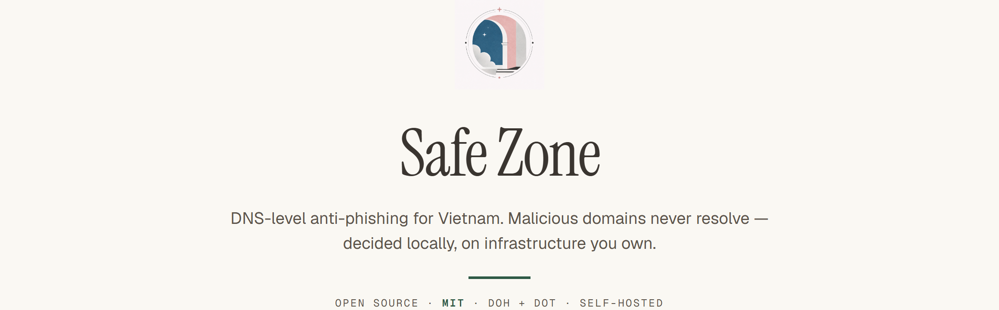
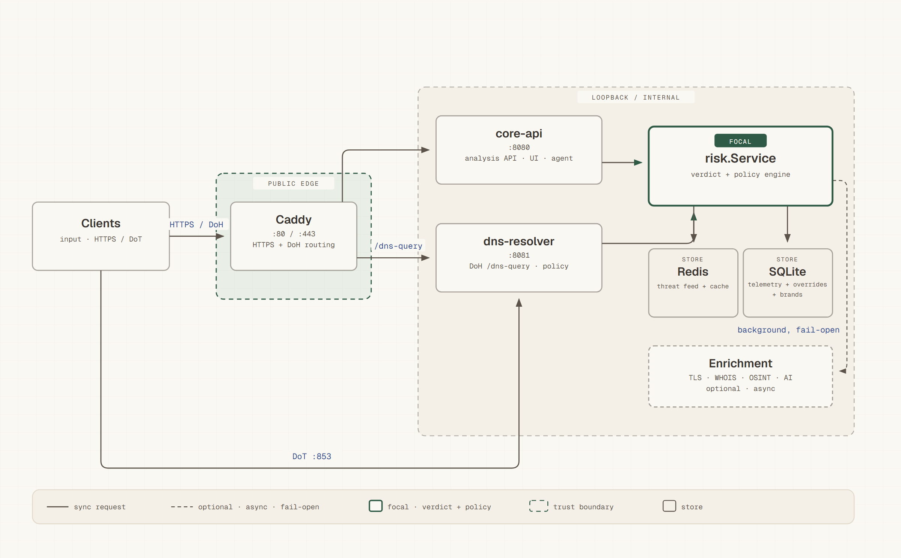
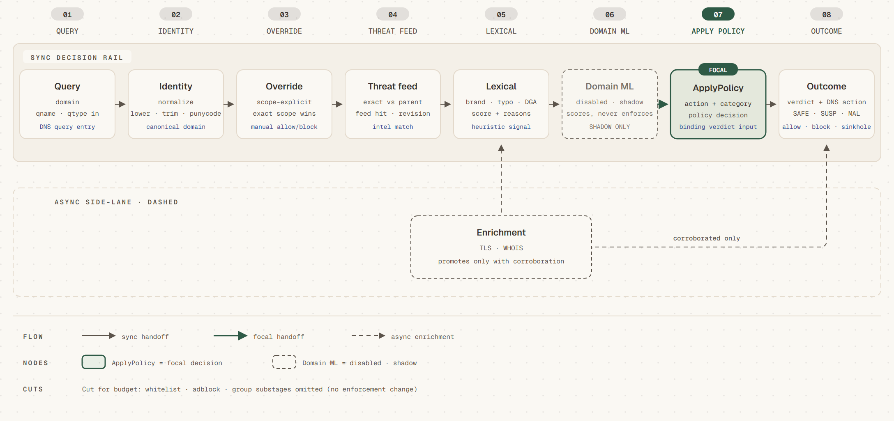
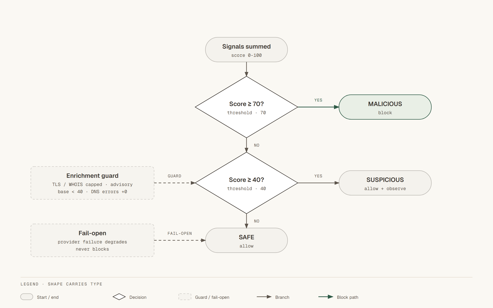

<div align="center">
  <h1>Safe Zone</h1>
  <p><strong>Chống lừa đảo ở tầng DNS cho Việt Nam.</strong></p>
  <p>
    <a href="https://github.com/vmcchooky/safe-zone/actions/workflows/ci.yml"></a>
    <a href="https://github.com/vmcchooky/safe-zone/actions/workflows/security.yml"></a>
    <a href="https://go.dev/"></a>
    <a href="LICENSE"></a>
    <a href="docs/runbooks/production-edge.md"></a>
    <a href="docker-compose.production.yml"></a>
  </p>
  <p><a href="README.md">English</a> | Tiếng Việt</p>
</div>



Safe Zone là dự án mã nguồn mở, phi lợi nhuận, chặn website phishing và giả
mạo thương hiệu ngay tại lớp DNS — trước khi trình duyệt kịp tải chúng. Hệ
thống vận hành như một control plane self-hosted mà bạn sở hữu hoàn toàn:
không tài khoản SaaS, không control plane của bên thứ ba, không dữ liệu nào
rời khỏi VPS của bạn.

> **Trạng thái: Release Candidate** (`RELEASE_CANDIDATE_SHADOW_READY`). Engine
> lõi và URL-ML shadow đã vượt qua kiểm tra công suất cục bộ; xác thực cuối
> trên VPS đang tiến hành. Không phải mọi kịch bản triển khai đều sẵn sàng
> production — xem [Trạng thái dự án](#trạng-thái-dự-án) và nguồn sự thật cho
> người vận hành,
> [docs/production-completion-checklist.md](docs/production-completion-checklist.md).

## Mục lục

- [Tính năng](#tính-năng)
- [Kiến trúc](#kiến-trúc)
- [Bắt đầu nhanh](#bắt-đầu-nhanh)
- [Dùng thử](#dùng-thử)
- [Cấu hình](#cấu-hình)
- [Threat intel và ML](#threat-intel-và-ml)
- [Đánh giá](#đánh-giá)
- [Bảo mật](#bảo-mật)
- [Triển khai](#triển-khai)
- [Trạng thái dự án](#trạng-thái-dự-án)
- [Đóng góp](#đóng-góp)
- [Ghi nhận](#ghi-nhận)
- [Giấy phép](#giấy-phép)

## Tính năng

**Bảo vệ**
- **Verdict nhiều lớp** — chấm điểm lexical deterministic (typosquat, lạm
  dụng thương hiệu, phân tích DGA/entropy, homoglyph IDN), đối chiếu
  threat-feed trực tiếp, và enrichment TLS/WHOIS nền chỉ promote verdict khi
  có bằng chứng corroboration.
- **DoH và DoT sẵn dùng** — DNS-over-HTTPS tại `/dns-query` và DNS-over-TLS
  tại cổng `853`, kèm bóc CNAME và các chiến lược chặn sinkhole, NXDOMAIN,
  refused, null-IP.
- **Ads, tracker và telemetry là policy** — chặn nội dung luôn là *policy
  action*, không bao giờ bị gán nhãn malware. Ví dụ endpoint telemetry chỉ
  `SUSPICIOUS` kèm policy-block, không phải `MALICIOUS`.

**Vận hành**
- **UI và API cho operator** — dashboard React tại `/app/`, phân tích có
  cache, override, nhóm client, báo cáo người dùng và `/metrics` kiểu
  Prometheus.
- **Fail-open theo thiết kế** — sự cố Redis, feed, OSINT, AI hay enrichment
  chỉ giảm độ bao phủ, không bao giờ làm sập phân giải. SQLite bắt buộc ở
  production để ý chí operator không bao giờ mất trong im lặng.
- **Thân thiện VPS giá rẻ** — stack Compose một node, baseline khoảng
  $10/tháng, production sample 5% telemetry write.

**Mở rộng**
- **AI/ML local tùy chọn** — tinh chỉnh Gemini/Ollama và classifier LightGBM
  với cổng `disabled → shadow → canary → enforce`. Mặc định tắt.
- **Đánh giá dựa trên evidence** — corpora truth và contract phiên bản hóa
  với kỷ luật provenance: `unknown` không bao giờ lọt vào precision/recall.

## Kiến trúc



Các cổng nội bộ `:8080` và `:8081` **chỉ mở trên loopback** ở production; bên
ngoài chỉ thấy `80`, `443` và `853` (đã kiểm chứng — xem
[edge verification](docs/deployment/edge-verification-2026-09-20.md)).

| Pipeline quyết định | Chấm điểm |
|---|---|
|  |  |

Sơ đồ khác: [deployment](docs/diagrams/deployment.png) ·
[DoH sequence](docs/diagrams/doh-sequence.png) ·
[defense layers](docs/diagrams/defense-layers.png).
Bản HTML tương tác nằm cùng thư mục PNG trong [`docs/diagrams/`](docs/diagrams/).

## Bắt đầu nhanh

Yêu cầu: Go 1.26+ (hoặc Docker).

```bash
git clone https://github.com/vmcchooky/safe-zone.git
cd safe-zone

# Terminal 1 — API và dashboard tại http://localhost:8080/app/
go run ./cmd/core-api

# Terminal 2 — DNS policy và DoH tại http://localhost:8081/dns-query
go run ./cmd/dns-resolver
```

Với Docker (dev stack, binding loopback-only):

```bash
cp .env.example .env
docker compose -f docker-compose.yml -f docker-compose.dev.yml up --build
```

Trỏ client thử nghiệm vào đó rồi truy vấn:

```bash
# DNS-over-HTTPS (RFC 8484): example.com IN A
curl -s 'http://localhost:8081/dns-query?dns=EjQBAAABAAAAAAAAB2V4YW1wbGUDY29tAAABAAE' \
  -H 'accept: application/dns-message' | xxd | head -3
```

## Dùng thử

```bash
# Verdict và lý do cho một tên miền nghi ngờ
curl "http://localhost:8080/v1/analyze?domain=secure-login-wallet-example.com"

# Quyết định policy mà lớp DNS sẽ thực thi
curl "http://localhost:8081/v1/policy?domain=secure-login-wallet-example.com"

# Sức khỏe dịch vụ và độ tươi của feed
curl "http://localhost:8080/v1/status"
curl "http://localhost:8080/metrics"
```

Trải nghiệm chặn: sinkhole HTTP thường render trang block kèm form báo cáo
người dùng; `https://$SAFE_ZONE_PUBLIC_HOST/block?domain=…` là trang giải
thích HTTPS chuẩn. Truy cập HTTPS trực tiếp vào tên miền bên thứ ba bị chặn
vẫn hiện cảnh báo chứng chỉ của chính tên miền đó trước — giới hạn TLS chung
của mọi DNS filter không MITM, không phải bug.

## Cấu hình

| Biến | Mặc định | Tác dụng |
|---|---|---|
| `SAFE_ZONE_ENV` | `local` | Đặt `production` để bắt buộc admin secret mạnh và SQLite |
| `SAFE_ZONE_REDIS_ADDR` | _(trống)_ | Bật cache/feed Redis, ví dụ `localhost:6379` |
| `SAFE_ZONE_PUBLIC_HOST` | `localhost` | Hostname công khai cho Caddy TLS và DoH |
| `SAFE_ZONE_ADMIN_PASSWORD` / `SAFE_ZONE_ADMIN_API_KEY` | _(tự sinh local)_ | Bắt buộc (hoặc `*_FILE`) ở production |
| `SAFE_ZONE_ML_MODE` | `disabled` | `disabled` / `shadow` / canary / `enforce` (có cổng) |
| `SAFE_ZONE_TELEMETRY_WRITE_PERCENT` | `100` local, `5` prod | Sample telemetry ([cách tính](docs/runbooks/production-edge.md)) |
| `SAFE_ZONE_WHOIS_CACHE_TTL_DAYS` | `7` | TTL cache WHOIS trong SQLite |

Secret nhận `VAR_FILE=./ops/secrets/name` (local run, Compose và helper phía
host — xem [ops/secrets/README.md](ops/secrets/README.md)). Admin có thể
chỉnh lexical scoring nóng không cần restart qua `GET/PUT /v1/config/analysis`
(có revision, có lan truyền multi-node).

## Threat intel và ML

- **Feed** nằm trong Redis set `safe-zone:threat:feed`. Chạy tay trước, rồi
  đặt lịch daemon:
  ```bash
  go run ./cmd/feed-sync -source ./feeds/local.txt -dry-run
  go run ./cmd/feed-sync -source ./feeds/local.txt -redis-addr localhost:6379
  ```
  Preset miễn phí: `SAFE_ZONE_AGENT_FEED_PRESET=production-free` (URLhaus và
  OpenPhish) hoặc `production-vn` (thêm PhishDestroy và Phishing.Database cho
  triển khai Việt Nam). Chính sách nguồn:
  [threat-intelligence-sources.md](docs/research/security/threat-intelligence-sources.md).
- **Domain ML** (LightGBM, 534 feature, đã calibrate) phân phối dưới dạng
  bundle ký số mount read-only; chế độ `shadow` chỉ quan sát, không đổi
  verdict cho tới khi vượt cổng. Xem [safe-zone-ai-plan.md](docs/specs/safe-zone-ai-plan.md).
- **Agent engine** (audit, sync feed, OSINT, cảnh báo, refresh whitelist) là
  opt-in với config từng task và drill rollback — đừng bật lịch production từ
  ví dụ tối thiểu.

## Đánh giá

Hành vi được ghim bằng corpora offline đóng băng — truth, contract và FP-guard
(21 host production, 21/21 allow, FPR 0):

```bash
mise run eval:decision
# go run ./cmd/eval-decision check --corpus internal/eval/testdata/corpus.v2.json \
#   --expected internal/eval/testdata/expected.v2.json   (+ 3 cặp nữa)
```

Nhãn yêu cầu provenance (capture, warning, ownership-doc hoặc owner review có
ghi nhận). `unknown` không bao giờ vào tử số/mẫu số precision/recall/FPR.
Định nghĩa cổng đầy đủ:
[decision-engine-rebuttal-plan.md](docs/research/security/decision-engine-rebuttal-plan.md).

## Bảo mật

- Threat model và release blocker: [docs/security/threat-model.md](docs/security/threat-model.md)
- Checklist tiền phát hành: [docs/security/pre-release-security-checklist.md](docs/security/pre-release-security-checklist.md)
- Phát hiện lỗ hổng? **Đừng mở issue công khai.** Xem
  [docs/runbooks/credential-rotation.md](docs/runbooks/credential-rotation.md)
  về xử lý secret, và liên hệ maintainer riêng qua trang dự án:
  <https://www.quorix.io.vn/projects/safe-zone/>.

## Triển khai

Một VPS giá rẻ (lớp Hetzner CPX21, 2 vCPU / 4 GB, trần khoảng $10/tháng):

```bash
docker compose -f docker-compose.yml -f docker-compose.production.yml up -d --build
```

Vận hành hàng ngày (`pwsh ./scripts/ops/safe-zone.ps1 …` hoặc
`scripts/ops/safe-zone.sh` trên Linux): `deploy`, `status`, `backup`,
`restore`, `prune`, `feed-sync`. Hướng dẫn edge đầy đủ (firewall, cert DoT,
DuckDNS, cron): [production-edge.md](docs/runbooks/production-edge.md).
Chính sách chi phí: [Safe_Zone_OPEX_Estimate.md](docs/deployment/Safe_Zone_OPEX_Estimate.md).

## Trạng thái dự án

Release Candidate (`RELEASE_CANDIDATE_SHADOW_READY`): engine và URL-ML shadow
đã qua kiểm tra công suất cục bộ (`LOCAL_CAPACITY_PASS_BELOW_200K`); xác thực
traffic production đang `PENDING_VPS`, và URL-ML promotion giữ
`SHADOW_OBSERVER_ONLY` cho tới khi có evidence external. Trạng thái chuẩn:
[release-manifest-r5.md](docs/deployment/release-manifest-r5.md) ·
[production-completion-checklist.md](docs/production-completion-checklist.md).

## Đóng góp

Chào đón issue và PR. Vui lòng đọc
[PR template](.github/pull_request_template.md) (kèm checklist chi phí) và chạy
`mise run ci` trước khi push — CI gồm lint, test, typecheck React, E2E
Playwright, `gosec`, `govulncheck` và build Docker. Mọi claim trong PR cần
evidence: test đã chạy, số đã đo, docs đã cập nhật.

## Ghi nhận

Các công cụ và tổ chức đã hỗ trợ phát triển:

- [Codex](https://github.com/codex)
- [OpenCode](https://opencode.ai)
- [Kiro](https://kiro.dev)
- [Google Antigravity](https://github.com/google-antigravity)
- [Z.ai](https://github.com/zai-org)
- [dependabot\[bot\]](https://github.com/apps/dependabot) — bot tự động cập nhật dependency

## Giấy phép

MIT — xem [LICENSE](LICENSE).
