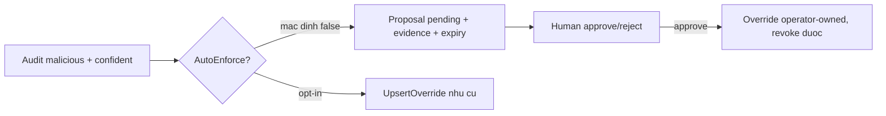

# Agent containment: proposal thay auto-override (PR-02/H3)

> **Tài liệu Living Document** — Cập nhật đồng bộ mỗi khi có thay đổi.
> Tuân thủ quy tắc tại `.agents/AGENTS.md` Section 5.

## ★ Tóm tắt (Abstract)

Branch `codex/agent-containment` khóa quyền tự ghi override của Agent Audit: phát hiện malicious mặc định thành proposal chờ duyệt (bảng `agent_proposals`, actor `agent:audit`, scope `exact`, expiry 7 ngày) thay vì block toàn cục không hết hạn. Opt-in `AutoEnforce` giữ đường legacy cho operator chủ đích. Kèm API review `GET/POST /v1/agent/proposals` (approve tạo override operator-owned qua đường override hiện có) và skip-check tôn trọng group override. Ba test audit, ba test store và ba test handler fail-before/pass-after; suite `agent`/`store`/`api`/`core-api` xanh, lint và gosec sạch.

## Sơ đồ Tổng quan

## ★ Containment Agent Audit

### ★ Mục tiêu (Objectives)

Mục tiêu là xóa khả năng heuristic TLS/WHOIS tự khuếch đại thành block vĩnh viễn: score cộng dồn thiếu corroboration, confidence là hàm của score, override không TTL và audit không nhìn thấy group policy. Phạm vi PR chỉ gồm audit task, proposal store, review API tối thiểu và wiring flag; không đổi OSINT task, feed sync hay engine.

### ★ Phương pháp & Lý do (Methodology & Rationale)

| Quyết định | Phương pháp chọn | Các phương pháp thay thế | Lý do |
|---|---|---|---|
| Default contained | `AutoEnforce=false` khi không set | Giữ auto-block + thêm confirm sau | Mọi deployment bật Agent sau này đều an toàn mặc định; opt-in tường minh cho operator cần phản ứng nhanh |
| Proposal có expiry, không sweeper | `expires_at` + lọc lúc đọc, approve từ chối row hết hạn | Job quét dọn nền | Không thêm moving part; expired không bao giờ tự enforce nên sweeper là cosmetic |
| Approve tạo override thường | Dùng `UpsertOverride` hiện có, reason ghi provenance proposal + reviewer | Override loại riêng có TTL | Tái dùng đường revoke/audit sẵn có; quyết định của human thì human sở hữu và chịu trách nhiệm |
| Skip-check thêm group | `HasGroupOverrideForDomain` duyệt suffix mọi group | Chỉ check local như cũ | Agent mù group intent là đúng lỗi đã ghi: global block của agent đè group-allow ở parent |
| Seam `enrich` trong test | Field func override được | Mock network/DNS thực | Test hermetic, không phụ thuộc Internet; production dùng implementation song song trích nguyên từ code cũ |

### ★ Cách thức Thực hiện (Implementation Details)

Hệ thống thêm bảng `agent_proposals` (migration `CREATE TABLE IF NOT EXISTS`, index status/domain) và `internal/store/proposals.go` (`CreateAgentProposal` dedupe pending theo domain+action bằng refresh, `ListAgentProposals` lọc pending chưa hết hạn, `ReviewAgentProposal` chuyển trạng thái có kiểm expiry, `HasGroupOverrideForDomain`). `internal/agent/audit.go` thêm `AutoEnforce`/`ProposalTTL` vào config, nhánh `proposeBlock` ghi evidence TLS/WHOIS/AI + event `proposal_created`, `AuditResult` thêm `Proposed`; enrich tách thành `enrichDomainSignals` qua field override được. API `AgentProposalsHandler` (GET list, POST approve/reject) gắn route `/v1/agent/proposals` với `RequireAdminForMutationFunc` (đọc cho authed user, quyết định cho admin), wiring env `SAFE_ZONE_AGENT_AUDIT_AUTO_ENFORCE` default false. Nếu dùng AI agent: mô hình `muse-spark`, chiến lược đọc caller/store trước, test vòng đời store trước khi sửa audit, vai trò con người duyệt.

### ★ Số liệu (Metrics & Results)

- Fail-before: audit ghi override trực tiếp (không test nào khóa hành vi này — chính là test gap của H3); pass-after: 3 test audit (contained/propose, opt-in legacy, group-skip), 3 test store (lifecycle, expiry, group-lookup), 3 test handler (list+approve+provenance, reject, invalid input).
- Hồi quy: suite `agent` (13.2s), `store`, `api/...`, `cmd/core-api` xanh; `golangci-lint` 0 issues; `gosec` 0 issues; `go build` sạch.
- Tương thích: schema additive (DB cũ tự migrate khi mở); `AuditResult` thêm field JSON mới không xóa cũ; event `auto_block` chỉ còn phát sinh ở opt-in.

### Liên kết Artifacts

- Code: `internal/agent/audit.go`, `internal/store/proposals.go`, `internal/api/handlers/agent_proposals.go`, `internal/api/server/router.go`, `cmd/core-api/main.go`
- Kế hoạch: `docs/research/security/decision-engine-rebuttal-plan.md` (Giai đoạn 6, PR-03)

---

## Lịch sử Thay đổi (Version History)

| Ngày | Thay đổi | Tác giả |
|---|---|---|
| 2026-09-10 | Agent containment: proposal thay auto-override (branch `codex/agent-containment`, chưa merge) | Muse Spark |
