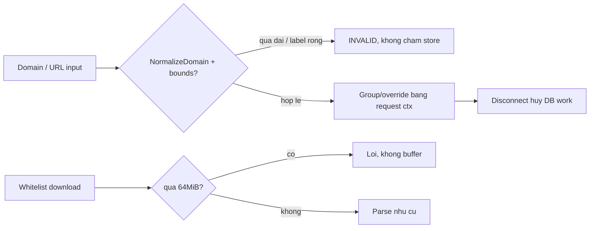

# Bounded identity và admission (PR-03/H4)

> **Tài liệu Living Document** — Cập nhật đồng bộ mỗi khi có thay đổi.
> Tuân thủ quy tắc tại `.agents/AGENTS.md` Section 5.

## ★ Tóm tắt (Abstract)

Branch `codex/bounded-identity` đóng khuếch đại tài nguyên ở đầu vào: `NormalizeDomain` từ chối tên không thể là DNS name (quá 253 byte, label quá 63 byte, label rỗng) trước mọi suffix expansion và truy vấn store; `Analyze`/`Policy` truyền request context thay vì `context.Background()` vào lookup group/override; download whitelist updater bị chặn 64MiB trước khi buffer. Ba test fail-before/pass-after; suite 7 package liên quan xanh, lint/vet/build sạch. IDNA canonicalization đầy đủ để dành PR sau.

## Sơ đồ Tổng quan

## ★ Giới hạn identity và admission

### ★ Mục tiêu (Objectives)

Mục tiêu là chặn input hợp charset nhưng không hợp DNS đi vào vòng lặp suffix (`GetEffectiveOverride`, `IsAllowed`, `ThreatFeedCandidates` đều duyệt từng parent với `strings.Join` O(n²)) và hàng chục nghìn query SQLite, đồng thời cho phép hủy ngang khi caller disconnect. Kèm byte-cap cho download whitelist (buffer vô hạn trước parse-cap 128MiB).

### ★ Phương pháp & Lý do (Methodology & Rationale)

| Quyết định | Phương pháp chọn | Các phương pháp thay thế | Lý do |
|---|---|---|---|
| Bounds ở `NormalizeDomain` | 253 total / 63 label (byte, RFC 1035) + cấm label rỗng | Giới hạn số label / regex hostname web | Total-cap đã giới hạn label ở ≤127 một cách tự nhiên (128 label cần ≥255 byte) nên cap số lượng là dead code; byte (octet) mới là đơn vị giới hạn thật trên wire |
| Một choke point | Mọi caller (API, DNS, feed, OSINT, brand CRUD) hưởng chung | Vá từng caller | 24 callsite; sửa một chỗ, test một chỗ |
| Context thay Background | Chỉ 4 lookup đọc trước verdict (group + override ở Analyze/Policy) | Đổi toàn bộ kể cả telemetry writes | Telemetry best-effort sau response giữ nguyên để không làm chậm response; fail-open khi cancel (group default + lexical) đã được test pin |
| Whitelist cap 64MiB | `LimitReader(cap+1)` + lỗi khi vượt, field config được | Giữ buffer vô hạn | Tranco top-1M chỉ tens of MB; 64MiB đủ headroom mà VPS nhỏ không OOM; redirect/egress validation để follow-up riêng |

### ★ Cách thức Thực hiện (Implementation Details)

Hệ thống thêm const `maxDomainLength`/`maxDomainLabelLength` và khối kiểm tra trong `NormalizeDomain` (`internal/analysis/analysis.go`) sau trim-suffix/port-strip, trước kiểm charset. Bốn callsite store trong `AnalyzeWithOptions`/`Policy` (`internal/risk/service.go`) đổi `context.Background()` thành `ctx`. `WhitelistUpdateConfig` thêm `MaxDownloadBytes` (default 64MiB trong constructor) và `downloadAndParse` đọc qua `LimitReader` (`internal/agent/whitelist_update.go`). Không đổi taxonomy, scoring hay admission mode. Nếu dùng AI agent: mô hình `muse-spark`, chiến lược đếm callsite rồi chọn choke point duy nhất, kiểm soát bằng test fail-before, vai trò con người duyệt.

### ★ Số liệu (Metrics & Results)

- Fail-before: input `a.`×5000+`com` đi vào store và trả SAFE (thay vì INVALID); label 64 byte và label rỗng pass normalize.
- Pass-after: `TestNormalizeDomainDNSBounds` (9 case gồm biên 253/63), `TestAnalyzeRejectsOversizedDomainBeforeStore` (INVALID trong 0.03s thay vì duyệt store), `TestAnalyzeCanceledContextFailsOpen`, `TestWhitelistDownloadEnforcesByteCap`.
- Hồi quy: suite `analysis`, `risk`, `agent`, `api/handlers`, `feed`, `osint`, `dns/...` xanh; `golangci-lint` 0 issues; `go vet`/`gofmt`/`go build` sạch.
- Residual: IDNA canonicalization (punycode/UTS #46) chưa làm — bounds byte là xấp xỉ đúng cho ASCII, có thể over-reject IDN exotic; ghi nhận để PR follow-up.

### Liên kết Artifacts

- Code: `internal/analysis/analysis.go`, `internal/risk/service.go`, `internal/agent/whitelist_update.go`
- Test: `internal/analysis/normalize_bounds_test.go`, `internal/risk/context_cancel_test.go`, `internal/agent/whitelist_download_cap_test.go`
- Kế hoạch: `docs/research/security/decision-engine-rebuttal-plan.md` (Giai đoạn 6)

---

## Lịch sử Thay đổi (Version History)

| Ngày | Thay đổi | Tác giả |
|---|---|---|
| 2026-09-10 | Bounded identity/admission (branch `codex/bounded-identity`, chưa merge) | Muse Spark |
