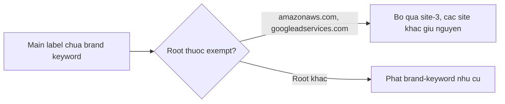

# Miễn brand-keyword substring cho cloud-infra root

> **Tài liệu Living Document** — Cập nhật đồng bộ mỗi khi có thay đổi.
> Tuân thủ quy tắc tại `.agents/AGENTS.md` Section 5.

## ★ Tóm tắt (Abstract)

Branch `codex/brand-infra-substring-guard` sửa false positive có quan sát trên production: mọi host dưới `amazonaws.com` ăn +50 brand vì nhãn `amazonaws` chứa chuỗi `amazon` (OnePlus OMADM, `s3-w...`, `execute-api` đều thành MALICIOUS), tương tự `googleadservices.com` chứa `google`. Hệ thống thêm map `brandKeywordExemptRoots` và chỉ miễn đúng site main-label keyword; typosquat, subdomain-abuse, feed, OSINT và override giữ nguyên. Hai test mới fail-before/pass-after; suite `analysis` và `risk` xanh, lint sạch.

## Sơ đồ Tổng quan

## ★ Miễn substring hẹp

### ★ Mục tiêu (Objectives)

Mục tiêu là dừng MALICIOUS oan trên hạ tầng cloud thật mà không mở vùng mù mới: token dán như `amazon-payments.evil.com`, campaign `vietcombank-...` và rule bảo vệ `dichvucong` phải tiếp tục bắt.

### ★ Phương pháp & Lý do (Methodology & Rationale)

| Quyết định | Phương pháp chọn | Các phương pháp thay thế | Lý do |
|---|---|---|---|
| Miễn theo root, không theo token | Map `brandKeywordExemptRoots` so với `rootDomain` ở site-3 | Bỏ hẳn nhánh Contains-fallback; token-boundary cho mọi brand | Bỏ hẳn làm mù phishing dán (`shopeepay.evil.com`, `dichvucongvn.com` ở site-4); token-boundary mù cả glued-token. Miễn theo root giữ nguyên mọi detection ngoài root đó |
| Chỉ site-3 (main-label) | Subdomain-abuse (site-4) và typosquat giữ nguyên | Miễn cả site-4 cho label `amazonaws` | Label `amazonaws` ở vị trí subdomain (`login.amazonaws.evil.com`) vẫn đáng ngờ; bucket đặt tên `amazon-payments` vẫn bắt qua token-part exact |
| Hardcode thay vì config | Map trong `brand.go` cạnh `cdnRoots` | Thêm vào `AnalysisConfig` | Cloud root đổi chậm; mỗi lần thêm cần review vì thu hẹp detection — hardcode bắt buộc review qua PR, đúng yêu cầu không whitelist lén |

### ★ Cách thức Thực hiện (Implementation Details)

Hệ thống thêm `brandKeywordExemptRoots` (`amazonaws.com`, `googleadservices.com`) và helper `isBrandKeywordExemptRoot` trong `internal/analysis/brand.go`, gating đúng nhánh "Suspicious Brand Keyword Mention". Không chạm `isSuspiciousLabel`, site typosquat/subdomain, `getRootDomain`, feed hay trusted-suffix bypass. Không áp dụng cho `b-msedge.net` (label `microsoft` exact ở site-4 — vấn đề ownership, operator có thể thêm alt-domain qua brands API mà không cần sửa code). Nếu dùng AI agent: mô hình `muse-spark`, chiến lược trace reason prod về đúng site phát hiện trước khi sửa, kiểm soát bằng test hai chiều (sạch + vẫn bắt), vai trò con người duyệt.

### ★ Số liệu (Metrics & Results)

- Fail-before: 4/4 host infra mang reason brand-keyword (3 AWS + 1 Google); pass-after: hết reason, không còn MALICIOUS từ substring (AWS về SAFE 15–25; `googleadservices` còn SUSPICIOUS 35 do entropy — đúng thiết kế, policy allow).
- Guard negatives xanh: `amazon-payments.evil.com`, `shopeepay.evil.com`, `vietcombank-secure-login-verify.top` (MALICIOUS 100), `dichvucongvn.com` (floor 75), `login.amazonaws.evil.com` đều giữ hành vi.
- Hồi quy: suite `analysis` + `risk` xanh; `golangci-lint` 0 issues; `go vet`/`gofmt`/`go build` sạch.

### Liên kết Artifacts

- Code: `internal/analysis/brand.go`; test: `internal/analysis/brand_keyword_exempt_test.go`
- Bằng chứng prod: telemetry `*.amazonaws.com` và `www.googleadservices.com` MALICIOUS tuần 30/8–7/9

---

## Lịch sử Thay đổi (Version History)

| Ngày | Thay đổi | Tác giả |
|---|---|---|
| 2026-09-10 | Miễn brand-keyword cho cloud-infra root (branch `codex/brand-infra-substring-guard`, chưa merge) | Muse Spark |
