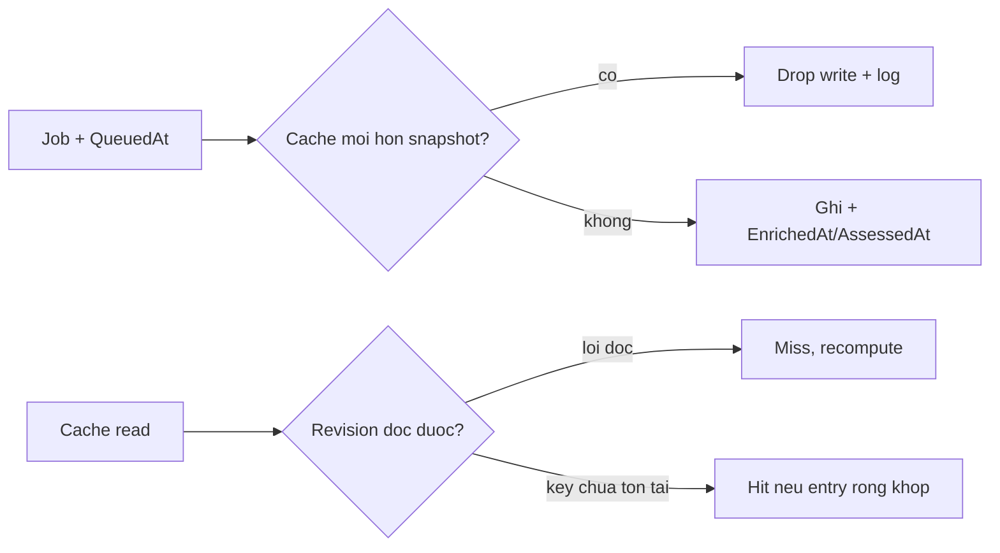

# Cache generation và coherence (PR-05/M1-M2)

> **Tài liệu Living Document** — Cập nhật đồng bộ mỗi khi có thay đổi.
> Tuân thủ quy tắc tại `.agents/AGENTS.md` Section 5.

## ★ Tóm tắt (Abstract)

Branch `codex/cache-coherence` đóng hai lỗi cache: worker enrichment ghi đè evaluation mới hơn bằng snapshot cũ (M1) và revision rỗng được coi bằng nhau khi Redis lỗi từng phần (M2). Worker giờ mang `QueuedAt`, bỏ write khi cache có marker mới hơn; `cacheEpoch` phân biệt key-chưa-tồn-tại với đọc-lỗi; OSINT cache key bao hàm hash cấu hình nguồn. Ba test fail-before/pass-after; 19 package xanh, lint và gosec sạch. Race liên process trong cửa sổ đọc-ghi và parent-child invalidation để dành PR-08.

## Sơ đồ Tổng quan

## ★ Coherence cache

### ★ Mục tiêu (Objectives)

Mục tiêu là chấm dứt ghi đè stale có thứ tự (worker 90→35 đã tái hiện) và chấp nhận stale khi revision không đọc được, trong khi giữ cache hoạt động cho deployment chưa từng sync feed. Không đụng scoring, TTL hay admission.

### ★ Phương pháp & Lý do (Methodology & Rationale)

| Quyết định | Phương pháp chọn | Các phương pháp thay thế | Lý do |
|---|---|---|---|
| Recency thay vì max-score | So timestamp snapshot với marker mới nhất của entry | Giữ verdict/score lớn nhất | Max-score giữ FP cũ vĩnh viễn, vi phạm yêu cầu không đánh đổi; recency phản ánh đúng thứ tự evidence |
| GET-rồi-SET thay vì WATCH/Lua | Dùng `GetJSON`/`SetJSON` hiện có + log khi skip | Thêm CAS nguyên tử vào wrapper Redis | Sửa đúng failure đã chứng minh (snapshot cũ đè mới); race liên process còn lại ở mức mili-giây và được ghi nhận, fencing đầy đủ thuộc evidence ledger PR-08 |
| Revision strict có phân biệt | `(string, bool)`: key-vắng = known-absent, lỗi đọc = unknown | Ép miss khi key vắng | Deployment chưa sync feed sẽ mất cache hoàn toàn — hồi quy availability; phân biệt hai trạng thái giữ cả hai tính chất |
| OSINT key + config hash | `v2:domain` thành `v2:cfghash:domain` | Chỉ bump revision | Bump suông vẫn tái dùng chéo khi operator đổi nguồn; hash khiến đổi config tự tách namespace (entry cũ hết hạn tự nhiên theo TTL 6h) |

### ★ Cách thức Thực hiện (Implementation Details)

Hệ thống thêm `AssessedAt` vào `analysisCacheEntry` (ghi ở final SET và OSINT-apply), `QueuedAt` vào `enrichmentJob` (đặt ở cả hai điểm enqueue), helper `entryAssessedAt`/`jobQueuedAt`, và guard trong `processEnrichmentJob` bỏ write khi entry mới hơn snapshot. `currentFeedRevision`/`currentBrandRevision` trả thêm cờ known (phân biệt `redis.Nil` với lỗi); `entryMatchesRevision` gom logic hit-check cũ thành hàm thuần có test. OSINT thêm `sourceRevision` (sha256 sources+trusted) và `evidenceCacheKey`. Nếu dùng AI agent: mô hình `muse-spark`, chiến lược trích helper thuần trước để test ma trận revision, kiểm soát bằng replay ordering cũ đảo expectation, vai trò con người duyệt.

### ★ Số liệu (Metrics & Results)

- Fail-before: worker ghi đè 90→35; revision lỗi vẫn hit; key OSINT dùng chung cross-config.
- Pass-after: worker skip giữ M90 + `EnrichedAt` trống; recompute mới hơn được giữ; ma trận revision 8 case; key khác config/khác domain.
- Hồi quy: 19 package (`risk`, `osint`, `store`, `agent`, `api/...`, `analysis`, `dns/...`, `cmd/...`) xanh; `golangci-lint` 0 issues; `gosec` 0 issues; `go build`/`go vet`/`gofmt` sạch.
- Residual ghi nhận: race liên process trong cửa sổ read-modify-write; parent→child invalidation; seed-ghi-đè brand (để PR-08/theo dõi riêng).

### Liên kết Artifacts

- Code: `internal/risk/service.go`, `internal/osint/osint.go`
- Test: `internal/risk/cache_coherence_test.go`, `internal/osint/cache_key_test.go`
- Kế hoạch: `docs/research/security/decision-engine-rebuttal-plan.md` (Giai đoạn 6, PR-05)

---

## Lịch sử Thay đổi (Version History)

| Ngày | Thay đổi | Tác giả |
|---|---|---|
| 2026-09-12 | Cache generation/coherence (branch `codex/cache-coherence`, chưa merge) | Muse Spark |
