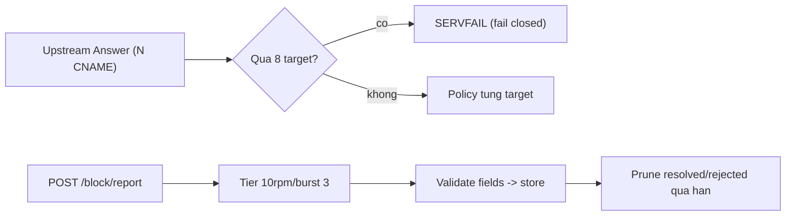

# CNAME cap và block-report limits (P-1/P-2)

> **Tài liệu Living Document** — Cập nhật đồng bộ mỗi khi có thay đổi.
> Tuân thủ quy tắc tại `.agents/AGENTS.md` Section 5.

## ★ Tóm tắt (Abstract)

Branch `codex/cname-report-limits` đóng hai vector khuếch đại/kiệt tài nguyên: vòng CNAME uncloaking không giới hạn (upstream trả N record thành N full Policy eval) và block report công khai không giới hạn (ghi DB + không retention). CNAME cap 8, vượt fail-closed thành SERVFAIL; `/block/report` vào tier riêng 10rpm/burst 3 (trích builder testable); contact/note/path giới hạn 256/2000/2048; cleanup xóa report đã xử lý quá retention (giữ pending). Bốn test fail-before/pass-after; suite 8 package xanh, lint và gosec sạch.

## Sơ đồ Tổng quan

## ★ Giới hạn khuếch đại và spam

### ★ Mục tiêu (Objectives)

Mục tiêu là chặn hai đường tiêu thụ tài nguyên không giới hạn bằng input của đối phương (số record upstream, số report công khai) mà không đổi hành vi hợp lệ: chain CNAME thật luôn dưới handful record, report thật luôn dưới vài trăm byte.

### ★ Phương pháp & Lý do (Methodology & Rationale)

| Quyết định | Phương pháp chọn | Các phương pháp thay thế | Lý do |
|---|---|---|---|
| Cap 8 + fail-closed | Vượt cap trả lỗi (transport SERVFAIL sẵn có) | Đánh giá N đầu, bỏ đuôi | Bỏ đuôi cho phép padding 8 record lành để che 1 target độc ở vị trí 9 — fail-closed là semantics đúng cho DNS security |
| Tier riêng report | Limiter + env keys riêng, trích builder testable | Dùng chung telemetryLimiter | Đối tượng và tần suất khác hẳn telemetry; env riêng cho operator tuning; trích builder để pin wiring (tier thiếu rơi về default là lỗi từng xảy ra) |
| Prune chỉ decided | `resolved`/`rejected` quá retention; giữ `pending` | Prune mọi report cũ | Pending là hàng đợi review của operator; mất nó là mất dữ liệu người dùng — chỉ prune cái đã xử lý |
| Field caps ở handler | 256/2000/2048 + 400 rõ ràng | Chỉ dựa body 16KiB | Body cap vẫn cho kilobyte rác mỗi row; caps theo ngữ nghĩa field (contact email/phone, note review, path URL) |

### ★ Cách thức Thực hiện (Implementation Details)

Hệ thống thêm const `maxCNAMEPolicyChecks` và đếm trong vòng uncloak (`internal/dns/resolver/resolver.go`), trích `newTieredMiddleware` kèm `reportLimiter` (`cmd/core-api`), validate độ dài trong `BlockReportHandler` (`internal/api/handlers/block.go`), và `DELETE` decided-quá-hạn trong `cleanup` với cutoff đúng format `CURRENT_TIMESTAMP` (`internal/store/sqlite.go`). Không đổi strategy block, taxonomy report hay retention telemetry. Nếu dùng AI agent: mô hình `muse-spark`, chiến lược đọc callers/tiers trước khi thêm nhánh, kiểm soát bằng test biên (đúng cap, vượt 1, field vượt 1 byte), vai trò con người duyệt.

### ★ Số liệu (Metrics & Results)

- Fail-before: flood 11 CNAME forward êm (miss target block ở vị trí 9); report không tier (6 POST liên tiếp pass); field dài pass; decided cũ tồn tại sau cleanup.
- Pass-after: flood SERVFAIL + log warn; đúng cap forward đủ 8; 429 ở request thứ 4; 400 đúng field; prune giữ pending + new-resolved.
- Hồi quy: 8 package xanh; `golangci-lint` 0 issues; `gosec` 0 issues; `go build`/`go vet`/`gofmt` sạch.

### Liên kết Artifacts

- Code: `internal/dns/resolver/resolver.go`, `cmd/core-api/main.go`, `cmd/core-api/ratelimit.go`, `internal/api/handlers/block.go`, `internal/store/sqlite.go`
- Test: `internal/dns/resolver/cname_cap_test.go`, `cmd/core-api/ratelimit_test.go`, `internal/api/handlers/block_limits_test.go`, `internal/store/prune_test.go`

---

## Lịch sử Thay đổi (Version History)

| Ngày | Thay đổi | Tác giả |
|---|---|---|
| 2026-09-12 | CNAME cap + block-report limits (branch `codex/cname-report-limits`, chưa merge) | Muse Spark |
