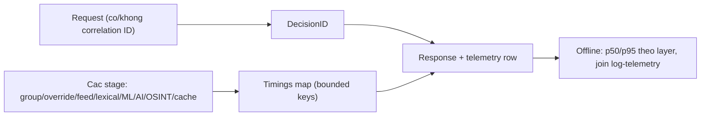

# Decision trace: ID, timings, persistence (PR-06)

> **Tài liệu Living Document** — Cập nhật đồng bộ mỗi khi có thay đổi.
> Tuân thủ quy tắc tại `.agents/AGENTS.md` Section 5.

## ★ Tóm tắt (Abstract)

Branch `codex/decision-trace` gắn khả năng quan sát vào mọi đánh giá: `DecisionID` (tái dùng request correlation ID, fallback eval ID duy nhất), `Assessment.Timings` theo vocabulary layer bounded (microseconds), và persist cả hai xuống cột telemetry `decision_id`/`trace` kèm migration. Không đổi scoring, verdict hay enforcement. Ba test fail-before/pass-after; một test shadow cũ phải nới so sánh byte (giữ nguyên invariant enforcement, loại trừ metadata quan sát); suite 11 package xanh, lint và gosec sạch.

## Sơ đồ Tổng quan

## ★ Trace quan sát quyết định

### ★ Mục tiêu (Objectives)

Mục tiêu là trả lời "verdict này tốn bao lâu ở đâu và join với log nào" mà không thêm cardinality metrics hay đổi hành vi: ID duy nhất mỗi evaluation, timings theo đúng gate code đã chạy, persist đủ để phân tích offline trong tuần monitor.

### ★ Phương pháp & Lý do (Methodology & Rationale)

| Quyết định | Phương pháp chọn | Các phương pháp thay thế | Lý do |
|---|---|---|---|
| DecisionID | Tái dùng `correlation.RequestID`, fallback `NewID("eval")` | UUID/thời gian | Join được với request log hiện có; fallback đảm bảo duy nhất khi caller không truyền ID (DNS/DoT) |
| Timings đo đúng gate | Bọc đúng callsite đã chạy (cache/feed/lexical/ML/AI/OSINT/enforcement/DB lookups) | Một timer bao toàn hàm | Timer thô không trả lời được layer nào đắt; bọc đúng gate khiến skipped-layers và timings nhất quán nhau theo construction |
| Vocabulary bounded | Tái dùng const Layer, test assert keys ⊆ tập hợp | Key tự do theo tên hàm | Metrics/log series không bùng cardinality; test khóa tính chất này |
| Persist trace JSON | Cột `trace` + `decision_id`, migration theo pattern `block_reports` | Chỉ trả response, không lưu | Tuần monitor cần p50/p95 offline; response không được thu thập tập trung trong khi telemetry đã có pipeline |
| Không registry metrics mới | Service không giữ registry; aggregation làm offline từ telemetry | Nhét histogram vào Service | Tránh stateful thêm trong hot path; đúng ranh giới PR-06 (quan sát) trước PR-09 (gates) |
| Sửa test shadow | So sánh sau khi zero DecisionID/Timings, giữ assert assessment parity | Giữ so sánh byte tuyệt đối | Byte tuyệt đối mâu thuẫn với observability theo thiết kế; invariant thật (enforcement không đổi) được giữ và còn mạnh hơn (thêm assessment parity) |

### ★ Cách thức Thực hiện (Implementation Details)

Hệ thống thêm `DecisionID` trên `Analysis`/`Policy`, `Timings map[string]int64` (microseconds) trên `Assessment`, helper `decisionIDFor`/`layerTimer.measure`/`mergeTimings`/`encodeTrace` (`internal/risk/service.go`); `analyze()` time 6 stage, `Analyze`/`Policy` time group/override/whitelist/enforcement và merge; `recordTelemetry` persist ID + trace; store thêm 2 cột + migration + đọc/ghi (`internal/store/sqlite.go`). `encodeTrace` không bao giờ fail (fallback coverage-only). Nếu dùng AI agent: mô hình `muse-spark`, chiến lược liệt kê return site trước khi thread field, kiểm soát bằng test vocabulary, vai trò con người duyệt.

### ★ Số liệu (Metrics & Results)

- Fail-before: thiếu field biên dịch; legacy source `lexical`; trace rỗng.
- Pass-after: ID tái dùng request ID + duy nhất khi tự sinh; timings chỉ chứa key bounded, engine có đủ feed/lexical, policy có group_policy; telemetry persist đúng ID + trace JSON; migration DB cũ.
- Hồi quy: 11 package (`risk`, `store`, `api/...`, `agent`, `analysis`, `dns/...`, `osint`, `core-api`) xanh; `golangci-lint` 0 issues; `gosec` 0 issues; `go build`/`go vet`/`gofmt` sạch.
- Overhead: vài `time.Now()` mỗi request (nanoseconds), một marshal JSON nhỏ ở telemetry async — không đo được trên p50 ở quy mô này; số đo thật lấy từ chính trace sau deploy.

### Liên kết Artifacts

- Code: `internal/risk/service.go`, `internal/store/sqlite.go`
- Test: `internal/risk/decision_trace_test.go`, `internal/store/trace_columns_test.go` (+ nới `adblock_shadow_test.go`)
- Kế hoạch: `docs/research/security/decision-engine-rebuttal-plan.md` (Giai đoạn 6)

---

## Lịch sử Thay đổi (Version History)

| Ngày | Thay đổi | Tác giả |
|---|---|---|
| 2026-09-12 | Decision trace ID/timings/persistence (branch `codex/decision-trace`, chưa merge) | Muse Spark |
