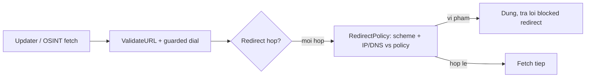

# Egress guards cho whitelist updater và OSINT redirects (O-9/O-10)

> **Tài liệu Living Document** — Cập nhật đồng bộ mỗi khi có thay đổi.
> Tuân thủ quy tắc tại `.agents/AGENTS.md` Section 5.

## ★ Tóm tắt (Abstract)

Branch `codex/egress-guards` đóng hai lỗ hổng egress còn sót trong khi feed sync đã được guard: whitelist updater dùng `http.Client` trần với redirect mặc định (SSRF + poison allowlist qua redirect), và OSINT chấp nhận mọi redirect (tối đa 3 hop, không validate lại). Cả hai giờ dùng chung `netguard.RedirectPolicy` có tham số hóa; whitelist thêm cờ `AllowPrivateSources` (mặc định deny, mirror OSINT). Bốn test fail-before/pass-after; suite 10 package xanh, lint sạch.

## Sơ đồ Tổng quan

## ★ Guard egress thống nhất

### ★ Mục tiêu (Objectives)

Mục tiêu là mọi HTTP egress do server khởi tạo đều đi qua một chính sách duy nhất (validate URL đầu, PIN IP lúc dial, validate từng redirect hop), không có ngoại lệ client trần. Phạm vi PR chỉ gồm whitelist updater và OSINT redirects; WHOIS/DoH/enrichment đã an toàn theo audit.

### ★ Phương pháp & Lý do (Methodology & Rationale)

| Quyết định | Phương pháp chọn | Các phương pháp thay thế | Lý do |
|---|---|---|---|
| Factory `RedirectPolicy(allowPrivate)` | Giữ `CheckRedirect` cũ (deny) + thêm factory | Sửa `CheckRedirect` nhận flag, đổi mọi caller | Không đụng feed-sync đang chạy ổn; opt-in tường minh từng service |
| Whitelist default-deny + flag | `AllowPrivateSources` mặc định false, mirror OSINT | Ép deny cứng không flag | Test loopback và intranet warning pages cần opt-in hợp lệ; flag đặt tên giống OSINT để nhất quán |
| Không đụng limit 10 hop của netguard | Giữ nguyên (OSINT cũ là 3) | Giữ 3 cho OSINT | 10 là bound đã review của shared policy; redirect hợp lệ hiếm khi quá 2-3 hop, hop xấu bị chặn bởi validation chứ không phải đếm |
| Test offline-deterministic | IP literal + `.invalid` (RFC 2606) + unit matrix | Môi trường DNS thật trong test | IP literal không cần DNS; `.invalid` fail chắc chắn cả khi có/không mạng; matrix 7 case pin semantics gồm cả opt-in trade-off |

### ★ Cách thức Thực hiện (Implementation Details)

Hệ thống thêm `netguard.RedirectPolicy` (`internal/netguard/http.go`); OSINT thay closure 3-hop bằng `RedirectPolicy(s.allowPrivateSources)` (`internal/osint/osint.go`); whitelist updater validate URL đầu + client guarded + redirect policy theo flag mới (`internal/agent/whitelist_update.go`). Test hiện có dùng fixture loopback được gắn flag opt-in (đúng semantics mới). Ghi nhận trung thực: opt-in `allowPrivate` cho phép cả link-local (test pin điều này để luôn hiển thị) — metadata-service chỉ an toàn khi giữ default-deny. Nếu dùng AI agent: mô hình `muse-spark`, chiến lược đọc caller ít guard nhất trước (updater), kiểm soát bằng test phân biệt message lỗi, vai trò con người duyệt.

### ★ Số liệu (Metrics & Results)

- Fail-before: redirect/link-local đi qua (updater fetch thử dial; OSINT trả về transport error thay vì policy error).
- Pass-after: 2 test whitelist (initial-deny + redirect-policy), 2 test OSINT (redirect-block + same-host pass), 7-case matrix netguard; suite 10 package xanh; `golangci-lint` 0 issues; `go build`/`go vet`/`gofmt` sạch.
- Không đổi hành vi production (updater tắt theo Agent; OSINT tắt): hiệu lực khi các task được bật; redirect hợp lệ cùng host vẫn đi qua.

### Liên kết Artifacts

- Code: `internal/netguard/http.go`, `internal/osint/osint.go`, `internal/agent/whitelist_update.go`
- Test: `internal/netguard/redirect_policy_test.go`, `internal/agent/whitelist_egress_test.go`, `internal/osint/redirect_policy_test.go`

---

## Lịch sử Thay đổi (Version History)

| Ngày | Thay đổi | Tác giả |
|---|---|---|
| 2026-09-12 | Egress guards O-9/O-10 (branch `codex/egress-guards`, chưa merge) | Muse Spark |
