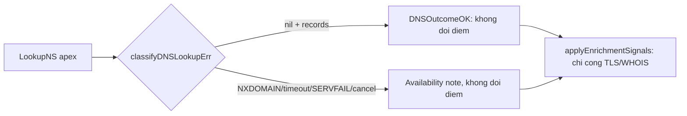

# Typed DNS outcome cho background enrichment (PR-01/H1)

> **Tài liệu Living Document** — Cập nhật đồng bộ mỗi khi có thay đổi.
> Tuân thủ quy tắc tại `.agents/AGENTS.md` Section 5.

## ★ Tóm tắt (Abstract)

Branch `codex/pr01-typed-dns-outcome` loại bỏ cơ chế nâng floor 75/MALICIOUS từ lỗi lookup NS ở worker enrichment nền. Hệ thống thay boolean `DNSFailed` bằng enum `DNSOutcome` có 7 trạng thái, trong đó mọi outcome khác OK chỉ để lại availability note mà không cộng điểm. Regression test ghi nhận lỗi trước bản sửa (SUSPICIOUS 55 thành MALICIOUS 75 trên cả 4 biến thể lỗi), sau bản sửa toàn bộ 52 case đi qua và 9 package liên quan giữ xanh. Revision thuật toán được bump để thải cache mang verdict floor cũ.

## Sơ đồ Tổng quan

## ★ PR-01 — Typed DNS outcome

### ★ Mục tiêu (Objectives)

Mục tiêu là đóng finding H1: timeout, cancel, SERVFAIL hoặc thiếu NS ở worker nền có thể biến kết quả lexical lành tính thành MALICIOUS persistent trong cache 6h, kèm reason NXDOMAIN sai sự thật. Phạm vi PR chỉ gồm phân loại outcome, scorer và test; không đổi contract API/DNS, TTL hay admission.

### ★ Phương pháp & Lý do (Methodology & Rationale)

| Quyết định | Phương pháp chọn | Các phương pháp thay thế | Lý do |
|---|---|---|---|
| Biểu diễn lỗi | Enum `DNSOutcome` 7 trạng thái + `String()` bounded | Giữ boolean; xóa hẳn nhánh DNS | Boolean gộp NXDOMAIN thật với timeout; xóa nhánh mất availability evidence phục vụ đo outage 7 ngày |
| NXDOMAIN đã xác nhận | Ghi note, không cộng điểm | Giữ floor cho NXDOMAIN | NXDOMAIN đơn lẻ không phân biệt typo/parked/expired với malicious; feed IOC vẫn bắt đúng mục tiêu |
| Thải cache cũ | Bump `analysisAlgorithmRevision` | Giữ revision, chờ TTL 6h | Verdict floor cũ là sai sự thật, không được sống tới hết TTL |
| TTL | Giữ nguyên `ttlFor` theo verdict | Thêm TTL 5 phút cho availability-note | Không cần thiết vì verdict/score không còn bị outcome ảnh hưởng; tránh mở rộng phạm vi PR |

### ★ Cách thức Thực hiện (Implementation Details)

Hệ thống sửa `internal/risk/service.go`: thay trường `DNSFailed bool` bằng `DNS DNSOutcome` trong `enrichmentSignals`; thêm `classifyDNSLookupErr` phân biệt nil/cancel/`net.DNSError` (`IsNotFound` → NXDOMAIN, `IsTimeout` → timeout, còn lại → server failure) và answer rỗng → `NoData`; `applyEnrichmentSignals` bỏ nhánh floor-75, chỉ append một availability note cho outcome khác OK; bump revision `2026-09-trusted-brand-v3` thành `2026-09-dns-outcome-v1`. Zero value `DNSOutcomeOK` giữ test cũ (`TestSuspiciousDomainEnrichmentRunsInBackgroundAndUpdatesCache` dùng `enrichmentSignals{}`) đi qua không cần sửa. Nếu dùng AI agent: mô hình `muse-spark`, chiến lược đọc trực tiếp và đếm tham chiếu toàn repo trước khi sửa, kiểm soát bằng regression test viết trước (fail-before/pass-after), vai trò con người duyệt phạm vi PR-01.

### ★ Số liệu (Metrics & Results)

- Fail-before: `TestDNSFailureMustNotPromoteSecurityVerdict` đỏ 4/4 (55 thành 75/MALICIOUS, reason NXDOMAIN giả).
- Pass-after: ma trận 42 case (2 base × 7 outcome × 3 mix) + 9 case classifier + 1 end-to-end worker/miniredis, tất cả xanh trong 0.220s.
- Hồi quy: 9 package xanh (`risk` 10.756s, `analysis`, `osint`, `ai`, `dns/doh`, `dns/resolver`, `tlsinspect`, `agent` 13.410s, `store`); `go vet` sạch; `gofmt` sạch; `go build ./cmd/... ./internal/...` thành công (`go build ./...` vấp thư mục báo cáo untracked có dấu cách — tồn tại từ trước PR).
- Paired before/after trên corpus: verdict chỉ đổi ở path từng floor-sai (SUSPICIOUS-55 + timeout giữ 55 thay vì thành 75); không đổi lexical, feed, ML, AI, OSINT.

### Liên kết Artifacts

- Code: `internal/risk/service.go`, test: `internal/risk/enrichment_dns_outcome_test.go`
- Kế hoạch: `docs/research/security/decision-engine-rebuttal-plan.md` (Giai đoạn 9)
- Bằng chứng lỗi gốc: `docs/GPT 6 Astra report/runtime-enrichment.log:2`

---

## Lịch sử Thay đổi (Version History)

| Ngày | Thay đổi | Tác giả |
|---|---|---|
| 2026-09-08 | PR-01: typed DNS outcome, bỏ floor-75, bump revision (branch `codex/pr01-typed-dns-outcome`, chưa merge) | Muse Spark |
