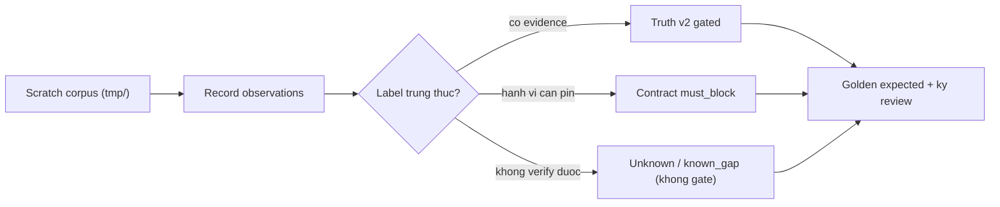

# Eval corpus v2: truth expansion + contract VN/shared-host pins (A2)

> **Tài liệu Living Document** — Cập nhật đồng bộ mỗi khi có thay đổi.
> Tuân thủ quy tắc tại `.agents/AGENTS.md` Section 5.

## ★ Tóm tắt (Abstract)

Mở rộng khung eval PR-07 mà không đụng runtime: truth `corpus.v1` (26 case)
lên `corpus.v2` (32 case) — 5 benign mới có provenance, 1 unknown tenant
shared-host, tái khẳng định `unk-003`/replay-0101 giữ unresolved; contract
10 lên 16 case — 3 must_block (shared-host parent blast radius, 2 biến thể
VN đã bắt) và 3 known_gap VN (dạng viết tắt/gạch nối còn lọt). Mọi label mới
đều observe thực nghiệm bằng runner hermetic trước khi chốt; 26/26 case cũ
ổn định tuyệt đối. `mise eval:decision` chuyển sang v2; v1 giữ trên đĩa làm
lịch sử (chạy tay được, CI không gate nữa).

## Sơ đồ Tổng quan

## ★ Corpus v2

### ★ Mục tiêu (Objectives)

Mục tiêu là tăng mẫu verified-benign cho gate PR-09 (gated 18→23), pin
coverage VN hai chiều (bắt được và còn lọt), pin blast radius shared-host đã
admit, và đóng disposition replay-0101 bằng văn bản — tất cả không đổi một
dòng runtime và không bịa provenance (bài học replay-0101).

### ★ Phương pháp & Lý do (Methodology & Rationale)

| Quyết định | Phương pháp chọn | Các phương pháp thay thế | Lý do |
|---|---|---|---|
| Observe trước, label sau | Record scratch corpus 13 candidate, chỉ encode điều đã thấy | Gán nhãn theo suy luận | Ngăn lặp lại lỗi replay-0101 (nhãn claim vượt evidence) |
| replay-0101 giữ unresolved | Tăng nặng note, không đổi label | Đảo nhãn / xóa case | Không có capture đúng thời điểm; fetch live vi phạm ranh giới an toàn; xóa case là giấu nợ |
| Truth-safe mới ở tầng infrastructure | outlook/gstatic/example.org/jsdelivr/tuoitre (lớp đã có precedent) | Long-tail lạ chưa verify | Safe/high không đòi reviewer nên càng phải giữ chuẩn evidence công khai, indisputable |
| VN lọt → known_gap, VN bắt được → must_block | Ba gap (dvcgov, vcb-otp, e-gov-vn) + hai pin (dichvucong-online, vietcombank-secure) | Ép tất cả thành truth-malicious | Không có per-domain evidence cho domain tổng hợp; known_gap đo trung thực, must_block pin hành vi đã quan sát |
| Tenant myshopify → unknown | Golden pin, không gate | Ép safe hoặc malicious | Content tenant chưa quan sát; unknown là hạng nhất, pin vẫn bắt drift scoring |
| v1 giữ trên đĩa, CI sang v2 | `mise eval:decision` check v2 | Xóa v1 / giữ gate cả hai | Xóa mất lịch sử đối chiếu; gate cả hai là trùng lặp — v2 đã chứa toàn bộ v1 ổn định 26/26 |
| URL-path negatives để ngoài | Không đưa vào decision corpus | Nhét URL vào runner domain-only | Runner hermetic là lexical domain-only (ML tắt, không URL context); negatives URL thuộc ml-replay/URL eval, sai harness sẽ cho số giả |

### ★ Cách thức Thực hiện (Implementation Details)

Hệ thống thêm `corpus.v2.json` (copy v1 + 6 case + note unk-003), mở rộng
`contract.v1.json` tại chỗ (feed_members thêm `contract-shared.test`, 6 case
mới — cùng cách PR-08a đã làm), regenerate cả hai expected (diff contract
đúng 6 NEW, truth cũ 26/26 ổn định), ký `operator/2026-09-13`, chuyển mise
sang v2, xóa scratch. Định dạng giữ nguyên ước lệ: corpus single-line
`sort_keys`, expected indent-2 CRLF. Nếu dùng AI agent: mô hình `muse-spark`,
chiến lược evidence-trước-label, kiểm soát bằng compare v1→v2 và review từng
dòng golden, vai trò con người duyệt.

### ★ Số liệu (Metrics & Results)

- Truth v2: 32 case, gated 23 (+5 TN), TP 2, FP 0, FN 0, unknown loại 7,
  policy 22/22, deterministic; label-gap duy nhất vẫn là cdn-001 cũ.
- Contract: 16 case, must_block 9 (+3), must_allow 2, known_gap 5 (+3),
  characterize 0, mismatches 0, deterministic.
- Hồi quy: `eval` package xanh; cả hai `check` exit 0; chưa đổi runtime nên
  suite Go còn lại không chịu ảnh hưởng (CI sẽ xác nhận).
- Chưa hứa precision production: 23 gated vẫn kém xa ngưỡng PR-09 (≥30k
  benign/≥1k malicious) — v2 là regression baseline tốt hơn, không phải
  benchmark dân số.

### Liên kết Artifacts

- Corpus: `internal/eval/testdata/corpus.v2.json`, `expected.v2.json`,
  `contract.v1.json`, `expected-contract.v1.json` (v1 giữ làm lịch sử)
- Runner/validator: `internal/eval/runner.go`, `corpus.go` (không đổi)
- Gate: `mise.toml` (`eval:decision` → v2)
- Kế hoạch: `docs/research/security/decision-engine-rebuttal-plan.md`
  (Giai đoạn 6, PR-07; Giai đoạn 7 corpus)

---

## Lịch sử Thay đổi (Version History)

| Ngày | Thay đổi | Tác giả |
|---|---|---|
| 2026-09-13 | Eval corpus v2 + contract VN/shared-host pins (chưa merge) | Muse Spark |
