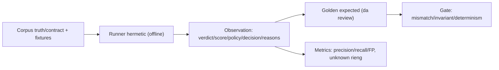

# End-to-end decision evaluation (PR-07/A2)

> **Tài liệu Living Document** — Cập nhật đồng bộ mỗi khi có thay đổi.
> Tuân thủ quy tắc tại `.agents/AGENTS.md` Section 5.

## ★ Tóm tắt (Abstract)

Branch `codex/eval-framework` xây khung đánh giá end-to-end cho decision engine: hai corpus versioned (truth 26 cases có provenance, contract 10 cases behavioral), runner hermetic offline (miniredis feed, adblock snapshot đóng băng, lexical-only, default group), so sánh paired Security+Policy với golden expected có chữ ký review, và metrics tách unknown khỏi denominator. Truth baseline: precision/recall 1.0 trên malicious decisions, 1 label-gap đo được (Baishan SUSPICIOUS-vs-safe), 6 unknown loại trừ. Không đổi runtime; wire vào `mise check`.

## Sơ đồ Tổng quan

## ★ Khung eval quyết định

### ★ Mục tiêu (Objectives)

Mục tiêu là cho PR-08 trở đi một cửa đo: replay deterministic phát hiện mọi drift verdict/policy/decision/reasons, metrics trung thực với denominator explicit, và nhãn không bao giờ bịa (provenance bắt buộc, unknown hạng nhất, replay-0101 giữ unresolved).

### ★ Phương pháp & Lý do (Methodology & Rationale)

| Quyết định | Phương pháp chọn | Các phương pháp thay thế | Lý do |
|---|---|---|---|
| Hai corpus truth/contract | Truth claim cần provenance; contract pin hành vi/intent | Một corpus chung | Trộn ground truth với fixture tổng hợp là nguồn gốc nhãn bẩn (đúng lỗi replay-0101); tách file, validator khác nhau |
| Golden expected + chữ ký review | `record` xuất unsigned; `check` từ chối thiếu `reviewed_by` + lệch corpus hash | Expected tự sinh pass luôn | Golden chỉ có giá trị khi con người đọc từng dòng; tool ép quy trình đó bằng mã |
| Label-gap đo, không gate | Truth mismatch ghi `label-gap`, gate qua golden diff | Fail khi verdict khác label | Engine cải thiện (sửa FP) sẽ làm đỏ gate — sai khuyến khích; golden diff bắt mọi drift cả hai chiều, metrics giữ sự thật |
| Runner hermetic offline | miniredis + fixtures, ML/AI/OSINT/enrichment tắt | Dùng production/Redis thật | Determinism là điều kiện golden có nghĩa; ML đã có ml-replay riêng; unknown-label và timing bị loại khỏi so sánh |
| Wire vào `mise check` | Task `eval:decision` trong depends | Chạy tay khi cần | Gate không chạy tự động là theater; suite offline vài giây, deterministic nên không flake CI |

### ★ Cách thức Thực hiện (Implementation Details)

Hệ thống thêm package `internal/eval` (`corpus.go`: schema v1, validator provenance — malicious/high đòi evidence trực tiếp + reviewer + ngày; `runner.go`: frozen service, fixtures, compare, metrics, determinism double-run) và CLI `cmd/eval-decision` (`check` exit 0/2/1, `record` xuất unsigned). Corpus v1: 26 truth (5 benign/high, 3 benign/medium, 2 malicious/medium có provenance advisory/pattern, 6 unknown gồm replay-0101 unresolved, 4 brand-infra operator-verified, 3 policy có MS/DPIA provenance, 2 dead unknown, 2 adversarial INVALID) + 10 contract (feed exact/parent, H2-tension characterize, adblock hai chiều, 2 known-gap VN, lexical control). Invariant block-trên-SAFE-đòi-Decision được re-assert ở tầng eval. Nếu dùng AI agent: mô hình `muse-spark`, chiến lược đọc tooling hiện có trước (tái dùng pattern miniredis/adblock-override), kiểm soát bằng hand-verify từng expected, vai trò con người duyệt (countersign ở merge).

### ★ Số liệu (Metrics & Results)

- Truth: gated 18 (TP 2, TN 15, FP 0, FN 0), unknown loại 6, policy agreement 17/17, 1 label-gap (cdn-001) đo được không gate.
- Contract: must_block 5, must_allow 2 pass; known-gap 2 + characterize 1 theo dõi không gate.
- Determinism: double-run identical cả hai corpus; check exit 0.
- Hồi quy: package `eval` (5 test), `risk` nguyên vẹn; `golangci-lint` 0 issues (kể cả staticcheck S1016 đã sửa); `gosec` 0 issues; `go build` sạch; TOML `mise` parse hợp lệ.
- Không hứa precision production: corpus 26 truth case là regression baseline, không phải benchmark dân số — PR-09 đặt ngưỡng số khi high-confidence labels đủ.

### Liên kết Artifacts

- Code: `internal/eval/`, `cmd/eval-decision/`, `mise.toml`
- Corpus: `internal/eval/testdata/corpus.v1.json`, `contract.v1.json`, `expected.v1.json`, `expected-contract.v1.json`
- Kế hoạch: `docs/research/security/decision-engine-rebuttal-plan.md` (Giai đoạn 6, PR-07)

---

## Lịch sử Thay đổi (Version History)

| Ngày | Thay đổi | Tác giả |
|---|---|---|
| 2026-09-12 | Eval framework end-to-end (branch `codex/eval-framework`, chưa merge) | Muse Spark |
