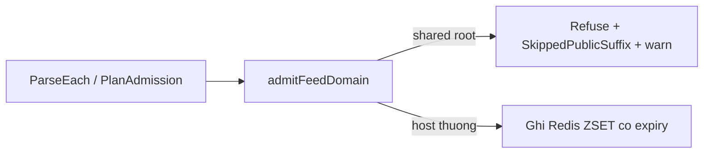

# Từ chối public-suffix member ở feed sync

> **Tài liệu Living Document** — Cập nhật đồng bộ mỗi khi có thay đổi.
> Tuân thủ quy tắc tại `.agents/AGENTS.md` Section 5.

## ★ Tóm tắt (Abstract)

Branch `codex/feed-psl-guard` thêm guard vào `feed.Sync`: mọi member là public suffix (root dùng chung như `github.io`, leaf wildcard PSL như `ec2-1-2-3.compute-1.amazonaws.com`) bị từ chối admit ở mọi admission mode, đếm vào `ParseStats.SkippedPublicSuffix` và log warn từng entry. Dry-run trên snapshot 2026-09-10 cho thấy list Phishing.Database ACTIVE chứa 98 member dạng này — không có guard, 98 entry sẽ thành IOC host-wide với hiệu lực tới 14 ngày. Ba test mới fail-before/pass-after; suite `feed` và `risk` xanh, lint và gosec sạch.

## Sơ đồ Tổng quan

## ★ Guard admit feed

### ★ Mục tiêu (Objectives)

Mục tiêu là chặn overblock diện rộng khi bật preset `production-vn`: matcher duyệt mọi parent suffix, nên một member là shared root sẽ chặn toàn bộ tenant bên dưới. Guard phải bao phủ mọi admission mode (Legacy, Shadow, Filter-plan) và phản ánh đúng số liệu trong dry-run report.

### ★ Phương pháp & Lý do (Methodology & Rationale)

| Quyết định | Phương pháp chọn | Các phương pháp thay thế | Lý do |
|---|---|---|---|
| Nhận diện shared root | `publicsuffix.PublicSuffix(domain) == domain` (cả ICANN và private) | Danh sách root cấm viết tay | Không tốn bảo trì; bao phủ TLD đa cấp (`co.uk`), root dùng chung (`github.io`, `workers.dev`) và leaf wildcard (`*.compute-1.amazonaws.com`) bằng một luật |
| Vị trí chặn | Choke point `queueDomain` + lọc `plannedDomains` + closure dry-run Legacy | Chỉ chặn ở write path | Dry-run phải nói thật số sẽ admit; plan mode không đi qua `queueDomain` |
| Đánh đổi recall | Chấp nhận mất exact-match trên ~98 leaf ephemeral/snapshot | Admit hết rồi xử lý FP sau | Harm bất đối xứng: overblock region endpoint kéo dài 14 ngày TTL, trong khi leaf ephemeral churn nhanh và lexical vẫn đánh giá; số refused là metric giám sát mỗi sync |
| IP literal | Luôn admit, không qua guard | Áp cùng luật | Địa chỉ IP đã là identity hẹp nhất, đúng như comment admission |

### ★ Cách thức Thực hiện (Implementation Details)

Hệ thống thêm `isPublicSuffixMember`, `admitFeedDomain`, `filterPublicSuffixMembers` trong `internal/feed/sync.go`, counter `SkippedPublicSuffix` trong `ParseStats` (`internal/feed/parse.go`), dùng thư viện `golang.org/x/net/publicsuffix` đã có sẵn qua `domaintrie`. Chuẩn hóa lowercase/trim-dot trước khi so; `PublicSuffix` không trả lỗi nên chỉ cần so `EqualFold` với input. Nếu dùng AI agent: mô hình `muse-spark`, chiến lược đọc `Sync` tìm choke point duy nhất trước khi sửa, kiểm soát bằng test viết trước trên 3 mode, vai trò con người duyệt bật feed.

### ★ Số liệu (Metrics & Results)

- Fail-before: 3 test mới đỏ (field chưa tồn tại); pass-after trong 0.5s.
- Dry-run 2026-09-10: URLhaus 5.053 valid; OpenPhish 270; PhishDestroy 124.929; Phishing.Database 385.671 valid + `skipped_public_suffix: 98` (chủ yếu EC2/DO/Linode regionals, OVH clusters, IPFS gateways) — 0 parser-drift cả 4 nguồn, tổng ~516k IOC (~25MB Redis).
- Hồi quy: suite `feed` và `risk` xanh; `golangci-lint` 0 issues; `gosec` 0 issues; `go build ./cmd/... ./internal/...` thành công.
- Quét exact-match 24 shared host nguy hiểm trên snapshot ACTIVE: 0 bare parent (github.io, appspot.com...) — rủi ro overblock diện rộng ở hiện tại thấp, guard là bảo hiểm cho churn tương lai.

### Liên kết Artifacts

- Code: `internal/feed/sync.go`, `internal/feed/parse.go`; test: `internal/feed/psl_guard_test.go`
- Quyết định bật feed: tài liệu phản biện `docs/research/security/decision-engine-rebuttal-plan.md` (Giai đoạn 4–6)

---

## Lịch sử Thay đổi (Version History)

| Ngày | Thay đổi | Tác giả |
|---|---|---|
| 2026-09-10 | Guard public-suffix cho feed sync (branch `codex/feed-psl-guard`, chưa merge) | Muse Spark |
