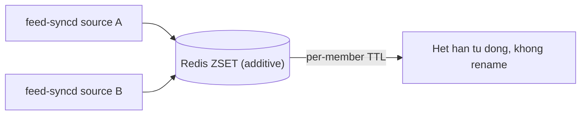

# feed-syncd: replace mặc định false

> **Tài liệu Living Document** — Cập nhật đồng bộ mỗi khi có thay đổi.
> Tuân thủ quy tắc tại `.agents/AGENTS.md` Section 5.

## ★ Tóm tắt (Abstract)

Branch `codex/feed-syncd-replace-default` đổi default flag `-replace` của daemon feed-syncd từ `true` thành `false`, đồng nhất với one-shot feed-sync. Default cũ khiến nhiều writer chung một feed key (một daemon mỗi nguồn) xóa lẫn nhau qua staging rename. Single-source freshness sau đổi chuyển sang dựa vào per-member TTL expiry. Hai test mới fail-before/pass-after; suite `feed-syncd`/`feed-sync` xanh, lint sạch.

## Sơ đồ Tổng quan

## ★ Sửa default replace

### ★ Mục tiêu (Objectives)

Mục tiêu là loại bẫy tự xóa: N daemon feed-syncd chung một key, mỗi chu kỳ staging rename của writer sau ghi đè toàn bộ member của writer trước. Daemon chỉ nhận một source duy nhất và không hiểu preset, nên multi-source bằng daemon là cấu hình dễ vấp mà default cũ biến thành mất feed lặng lẽ.

### ★ Phương pháp & Lý do (Methodology & Rationale)

| Quyết định | Phương pháp chọn | Các phương pháp thay thế | Lý do |
|---|---|---|---|
| Default `false` | Additive + expiry cleanup, đồng nhất one-shot | Giữ `true` + cảnh báo docs | Cảnh báo không ngăn được lỗi cấu hình; staleness của single-source bị giới hạn bởi TTL (14 ngày) trong khi clobber multi-source mất toàn bộ key ngay lập tức |
| Giữ flag `-replace` | Opt-in kèm warn lúc startup khi bật | Xóa flag | Operator dùng một key riêng cho một daemon vẫn cần xóa delisted member ngay; warn ghi rõ yêu cầu exclusive ownership |
| Không thêm preset cho daemon | Ngoài phạm vi | Thêm `ResolveSources` vào daemon | Đường multi-source được hỗ trợ là one-shot loop (`safe-zone.sh feed-sync`) + cron; mở rộng daemon là feature riêng |

### ★ Cách thức Thực hiện (Implementation Details)

Hệ thống sửa default trong `parseSyncSettings` (`cmd/feed-syncd/main.go`), bổ sung comment giải thích và `logjson.Warn` khi operator bật `-replace` explicit. Không đổi `feed.Sync`, không đổi one-shot feed-sync (đã `false` từ trước). Nếu dùng AI agent: mô hình `muse-spark`, chiến lược đọc cả hai entrypoint so contract trước khi chọn default chung, kiểm soát bằng test default và opt-in, vai trò con người duyệt vá.

### ★ Số liệu (Metrics & Results)

- Fail-before: `TestSyncSettingsReplaceDefaultsFalse` đỏ; pass-after cùng `TestSyncSettingsReplaceExplicitOptIn` trong 1.062s.
- Hồi quy: suite `cmd/feed-syncd` (6 test) và `cmd/feed-sync` xanh; `golangci-lint` 0 issues; `go build`/`go vet` sạch.
- Không đổi hành vi runtime đơn-source ngoài việc delisted member hết hạn theo TTL thay vì bị xóa ngay.

### Liên kết Artifacts

- Code: `cmd/feed-syncd/main.go`; test cùng package
- Bối cảnh multi-source: `docs/research/backend/feed-public-suffix-guard.md`

---

## Lịch sử Thay đổi (Version History)

| Ngày | Thay đổi | Tác giả |
|---|---|---|
| 2026-09-10 | feed-syncd replace mặc định false (branch `codex/feed-syncd-replace-default`, chưa merge) | Muse Spark |
