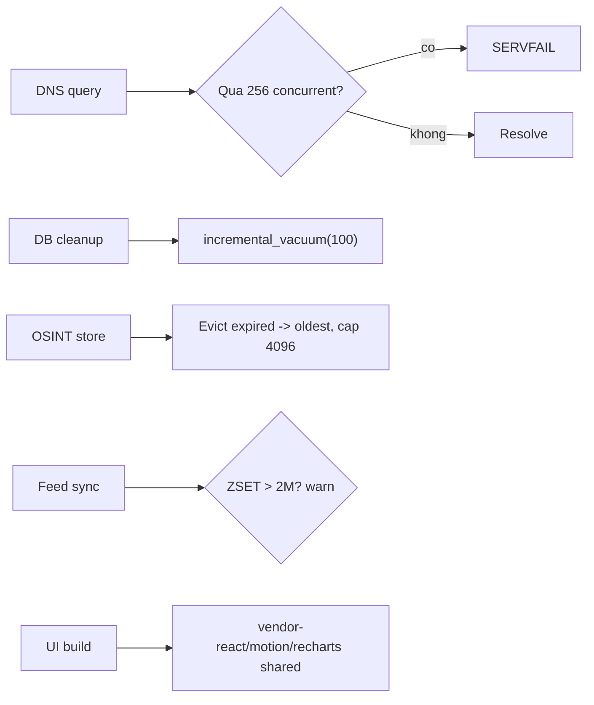

# Lows hardening batch: vacuum, eviction, caps, feed watch, chunks

> **Tài liệu Living Document** — Cập nhật đồng bộ mỗi khi có thay đổi.
> Tuân thủ quy tắc tại `.agents/AGENTS.md` Section 5.

## ★ Tóm tắt (Abstract)

Branch `codex/low-hardening-batch` gom 5 lows còn tồn từ audit hiệu suất/bảo trì: SQLite incremental vacuum (one-time convert + bounded vacuum mỗi cleanup), OSINT memory cap 4096 kèm evict-expired-first, global concurrency cap 256 cho DNS (fail-closed SERVFAIL), tripwire tăng trưởng feed (warn trên 2M members, default), và tách vendor chunks UI (TelemetryPage 425KB thành 31KB + shared chunks, hết cảnh báo build). Bảy test fail-before/pass-after; suite 7 package xanh, lint sạch, build UI + typecheck xanh, smoke preview không lỗi chunk.

## Sơ đồ Tổng quan

## ★ Gom lows tồn đọng

### ★ Mục tiêu (Objectives)

Mục tiêu là đóng các rủi ro nhỏ đã biết mà không đáng một PR riêng: file DB phình, map unbounded, flood phân tán, feed tăng lặng lẽ và chunk UI nặng — mỗi cái vài chục dòng, có test và bound rõ ràng, không đổi hành vi hợp lệ.

### ★ Phương pháp & Lý do (Methodology & Rationale)

| Quyết định | Phương pháp chọn | Các phương pháp thay thế | Lý do |
|---|---|---|---|
| VACUUM incremental + convert một lần | Pragma cho DB mới, `VACUUM` một lần có flag, `incremental_vacuum(100)` mỗi cleanup | Full VACUUM định kỳ | Full VACUUM block writes; incremental bounded 100 pages mỗi cycle; flag tránh rebuild lặp |
| OSINT cap 4096, evict expired trước | Quét xóa hết hạn, còn đầy mới xóa oldest theo CheckedAt | LRU phức tạp / singleflight | Redis TTL copy tồn tại nên evict chỉ tốn refetch; oldest-fallback đơn giản và đủ cho map phụ |
| Global cap 256 fail-closed | Atomic counter ở `ResolveQuery` (choke point DoH+DoT) | Cap theo IP (đã có) / queue | Per-IP không chặn flood phân tán; 256 vượt xa peak hợp lệ của household; SERVFAIL nhất quán với CNAME cap |
| Feed warn không cap cứng | Tripwire log trên ngưỡng env (default 2M) | Giới hạn số members | Cắt IOC lặng lẽ nguy hiểm hơn phình DB; warn để operator quyết (xem lại preset/TTL) |
| Vendor chunks rolldown | 3 group `advancedChunks` (react/motion/recharts) | Tăng `chunkSizeWarningLimit` | Tăng limit là giấu cảnh báo; tách vendor là chuẩn, bundler đảm bảo graph, preview smoke xác nhận không lỗi chunk |

### ★ Cách thức Thực hiện (Implementation Details)

Hệ thống thêm pragma + convert một lần + vacuum bounded (`internal/store/sqlite.go`), `maxMemoryReports` + `evictForInsertLocked` (`internal/osint/osint.go`), `MaxConcurrentQueries`/counter/atomic (`internal/dns/resolver/resolver.go`), `SAFE_ZONE_FEED_MAX_MEMBERS_WARN` + đếm ZCARD sau sync (`cmd/feed-sync/main.go`), 3 chunk groups (`ui/vite.config.ts`). Trong lúc làm phát hiện và sửa đúng một hiểu sai mode SQLite (0=none, 1=full, 2=incremental) trước khi merge. Nếu dùng AI agent: mô hình `muse-spark`, chiến lược gom theo chủ đề resource-bounds sau audit, kiểm soát bằng test biên từng món, vai trò con người duyệt.

### ★ Số liệu (Metrics & Results)

- Fail-before: mode vacuum không phải incremental; map vượt cap; query thứ 257 vẫn vào; feed 3M im lặng; TelemetryPage 425KB + cảnh báo build.
- Pass-after: 7 test (vacuum mode/convert/cleanup, evict 2 chiều, concurrency fail-closed + bình thường, feed warn trên/dưới ngưỡng); TelemetryPage 31KB, index 678KB thành 301KB, hết cảnh báo >500KB; preview smoke: 0 chunk lỗi, 0 page error (502 duy nhất là session check thiếu backend, đúng kỳ vọng).
- Hồi quy: 7 package xanh; `golangci-lint` 0 issues; `go build`/`npm run check` xanh; `gosec` chạy ở bước PR.

### Liên kết Artifacts

- Code: `internal/store/sqlite.go`, `internal/osint/osint.go`, `internal/dns/resolver/resolver.go`, `cmd/feed-sync/main.go`, `ui/vite.config.ts`
- Test: `internal/store/vacuum_test.go`, `internal/osint/memory_evict_test.go`, `internal/dns/resolver/concurrency_test.go`, `cmd/feed-sync/warn_test.go`

---

## Lịch sử Thay đổi (Version History)

| Ngày | Thay đổi | Tác giả |
|---|---|---|
| 2026-09-12 | Lows hardening batch (branch `codex/low-hardening-batch`, chưa merge) | Muse Spark |
