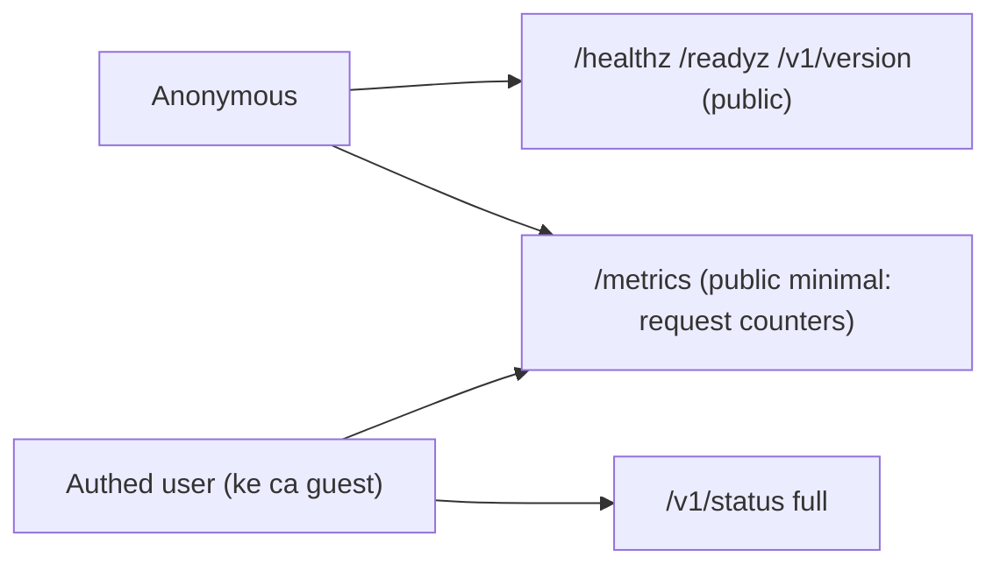

# Harden observability endpoints (O-6/P-3)

> **Tài liệu Living Document** — Cập nhật đồng bộ mỗi khi có thay đổi.
> Tuân thủ quy tắc tại `.agents/AGENTS.md` Section 5.

## ★ Tóm tắt (Abstract)

Branch `codex/observability-hardening` đóng recon + DoS nhẹ trên hai endpoint công khai: `/v1/status` (lộ Redis/feed/adblock/ML-threshold/OSINT/config revision) giờ yêu cầu auth; `/metrics` công khai chỉ còn `{service, status, metrics.request_summary}` đúng phần Grafana và UI dùng, bỏ runtime/STW, Redis, feed, adblock, ML và timestamp. Thêm tier rate-limit cho `/metrics`. Ba test fail-before/pass-after; suite api/core-api/risk xanh, lint và gosec sạch. Không đổi contract authed nào.

## Sơ đồ Tổng quan

## ★ Thu hẹp bề mặt quan sát công khai

### ★ Mục tiêu (Objectives)

Mục tiêu là xóa recon miễn phí (model version/threshold/canary %, feed sources, OSINT sources, Redis/config) và vector STW-DoS (`ReadMemStats` không giới hạn) khỏi endpoint ẩn danh, trong khi Grafana, healthcheck Docker và dashboard UI hoạt động y như cũ không cần cấu hình lại.

### ★ Phương pháp & Lý do (Methodology & Rationale)

| Quyết định | Phương pháp chọn | Các phương pháp thay thế | Lý do |
|---|---|---|---|
| `/v1/status` → RequireAuth | Mọi role authed (kể cả guest) đọc full | Public rút gọn + authed full (hai shape) | Một shape duy nhất, không fork contract; healthcheck riêng đã có `/healthz`; UI SystemPage vốn sau login |
| `/metrics` public tối thiểu | Giữ đúng `{service, status, metrics}` UI/Grafana dùng | Auth toàn bộ `/metrics` | Grafana scrape không auth sẽ gãy, phải cấu hình lại phía operator; counters per-endpoint là public surface vốn có |
| Bỏ runtime khỏi `/metrics` | Xóa `ReadMemStats` + heap/goroutines | Cache 5s | Xóa hẳn vừa hết STW-DoS vừa hết recon tài nguyên; không consumer nào (UI/Grafana) dùng các field này — đã kiểm chứng code |
| Tier cho `/metrics` | `dashboardLimiter` 240rpm có sẵn | Limiter riêng | Chung nhóm dashboard là đúng đối tượng; 240rpm dư cho scrape 30-60s |
| `/` fallback | Gate khi serve status (UI-less builds) | Để public | Tránh rò cùng payload qua đường khác; redirect `/app/` giữ public vì chỉ là chuyển hướng |

### ★ Cách thức Thực hiện (Implementation Details)

Hệ thống bọc `/v1/status` (và nhánh `/` fallback) bằng `RequireAuthFunc`, rút `MetricsHandler` còn 3 field, thêm tier `/metrics` trong `cmd/core-api/main.go`, cập nhật `TestMetricsEndpointHTTP` sang shape mới + assert absence 7 key nhạy cảm, thêm test router 401. Phát hiện phụ khi audit (không đổi code): đã có CSRF Origin-check cho cookie POST — kết luận CSRF Low trước đây được rút lại thành verified-negative. Nếu dùng AI agent: mô hình `muse-spark`, chiến lược liệt kê consumer (UI/Grafana/healthcheck/test) trước khi cắt field, kiểm soát bằng test absence, vai trò con người duyệt.

### ★ Số liệu (Metrics & Results)

- Fail-before: `/metrics` công khai 7 nhóm internals; `/v1/status` ẩn danh 200.
- Pass-after: `/metrics` đúng 3 key; `/v1/status` ẩn danh 401 qua full router; authed UI/Grafana không đổi (đã đối chiếu query dashboard + type UI).
- Hồi quy: suite `api/...` + `core-api` + `risk` xanh; `golangci-lint` 0 issues (kể cả ineffassign đã sửa); `gosec` 0 issues; `go build`/`go vet`/`gofmt` sạch.

### Liên kết Artifacts

- Code: `internal/api/handlers/status.go`, `internal/api/server/router.go`, `cmd/core-api/main.go`
- Test: `internal/api/handlers/status_test.go`, `internal/api/server/router_test.go`

---

## Lịch sử Thay đổi (Version History)

| Ngày | Thay đổi | Tác giả |
|---|---|---|
| 2026-09-12 | Harden observability endpoints (branch `codex/observability-hardening`, chưa merge) | Muse Spark |
