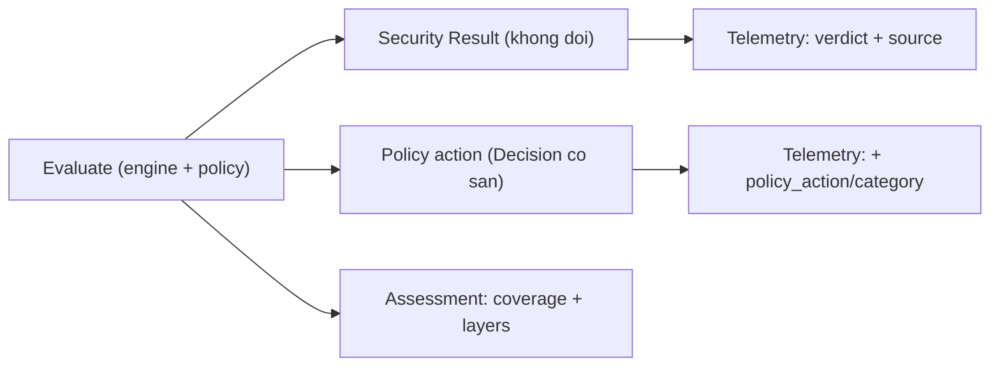

# Tách trục policy/security ở contract và telemetry (PR-04/M6)

> **Tài liệu Living Document** — Cập nhật đồng bộ mỗi khi có thay đổi.
> Tuân thủ quy tắc tại `.agents/AGENTS.md` Section 5.

## ★ Tóm tắt (Abstract)

Branch `codex/policy-contract-v2` tách ba trục verdict bảo mật, policy action và coverage trong contract và telemetry mà không đổi hành vi scoring hay enforcement: struct `Assessment` (coverage, evaluated/skipped layers) trên mọi response `Analyze`/`Policy`; `Decision` trên `Analyze` cho override/allowlist/legacy; cột `policy_action`/`policy_category` trong `analysis_log` kèm migration; `inferSource` sửa misattribution legacy-adblock thành source `adblock`. Wire shape legacy giữ nguyên theo test đã khóa. Ba test fail-before/pass-after; suite 10 package xanh, lint và gosec sạch.

## Sơ đồ Tổng quan

## ★ Contract tách trục

### ★ Mục tiêu (Objectives)

Mục tiêu là làm cho cùng một input cho cùng security verdict ở API và DNS (parity), mọi content block trên verdict không-malicious đều mang Decision显式, và telemetry phân biệt được security-block với policy-block theo category. Không đổi điểm số, ngưỡng, thứ tự tầng hay enforcement.

### ★ Phương pháp & Lý do (Methodology & Rationale)

| Quyết định | Phương pháp chọn | Các phương pháp thay thế | Lý do |
|---|---|---|---|
| Assessment dạng envelope | Struct mới trên `Analyze`/`Policy`, `analyze()` trả thêm assessment | Nhét layers vào `analysis.Result` | `Result` nằm trong cache/Index ML contract; envelope tránh coupling cache và giữ JSON tương thích (field mới, client cũ bỏ qua) |
| Legacy giữ nguyên wire | Chỉ thêm Assessment marker + telemetry columns, không chạm Result/Decision legacy | Gắn Decision cho legacy | Ba test khóa rollback contract (`policy_semantics`, `adblock_exceptions`, `adblock_shadow`) assert legacy không Decision — đổi là phá rollback đã cam kết |
| Policy override/whitelist không Decision | Attribution qua telemetry columns | Gắn Decision admin/allowlist | Hai test khóa `TestAdminOverrideWinsOverException`, `TestWhitelistPrecedenceLockedWithException` assert nil — tôn trọng pin, telemetry vẫn ghi đủ |
| Telemetry columns thay vì bảng mới | `ALTER ADD COLUMN` + migration PRAGMA theo pattern `block_reports` | Bảng policy_decisions riêng + join | Đọc telemetry hiện tại là SELECT phẳng; join làm chậm dashboard path và phức tạp retention delete |
| inferSource adblock | Map reason `"adblock"` | Giữ lexical | 483 rows legacy prod đang bị gán nhầm nguồn lexical — sửa mapping là điều kiện đo policy FP |

### ★ Cách thức Thực hiện (Implementation Details)

Hệ thống thêm const layer (`identity` → `website_content`), struct `Assessment`, field `Assessment` trên `Analyze`/`Policy` và `Decision` trên `Analyze` (`internal/risk/service.go`); `analyze()` trả assessment thứ tư (cache-hit liệt kê `result_cache`, miss liệt kê feed/lexical/ML/AI/enrichment/OSINT theo đúng gate code); mọi return site gắn evaluated/skipped; `recordTelemetry` đọc `Decision` ra cột mới; migration `policy_action`/`policy_category` (`internal/store/sqlite.go`) + đọc/ghi đầy đủ. Kind mới `admin`/`allowlist`, category `custom` cho quyết định operator; legacy dùng `legacy_policy_fused` + category `unknown` (không tái dùng `adware`). Nếu dùng AI agent: mô hình `muse-spark`, chiến lược đọc test khóa trước khi thiết kế (tránh phá rollback), kiểm soát bằng parity invariant, vai trò con người duyệt.

### ★ Số liệu (Metrics & Results)

- Fail-before: thiếu field biên dịch; legacy telemetry source `lexical`; override rows không policy columns.
- Pass-after: parity API/DNS trên 2 domain engine; invariant block-trên-SAFE-đòi-Decision; legacy source `adblock` + `block`/`unknown`; override telemetry `block`/`custom`; migration DB cũ (columns rỗng cho rows legacy).
- Hồi quy: 10 package xanh (`risk`, `store`, `api/...`, `agent`, `analysis`, `dns/...`, `core-api`); `golangci-lint` 0 issues; `gosec` 0 issues; `go build`/`go vet`/`gofmt` sạch.
- Tương thích: payload JSON cũ decode bình thường (test có sẵn giữ xanh); DB cũ tự migrate khi mở; UI không cần đổi (bỏ qua field mới).

### Liên kết Artifacts

- Code: `internal/risk/service.go`, `internal/store/sqlite.go`
- Test: `internal/risk/policy_contract_test.go`, `internal/store/policy_columns_test.go`
- Kế hoạch: `docs/research/security/decision-engine-rebuttal-plan.md` (Giai đoạn 6, PR-04)

---

## Lịch sử Thay đổi (Version History)

| Ngày | Thay đổi | Tác giả |
|---|---|---|
| 2026-09-10 | Contract tách trục policy/security (branch `codex/policy-contract-v2`, chưa merge) | Muse Spark |
