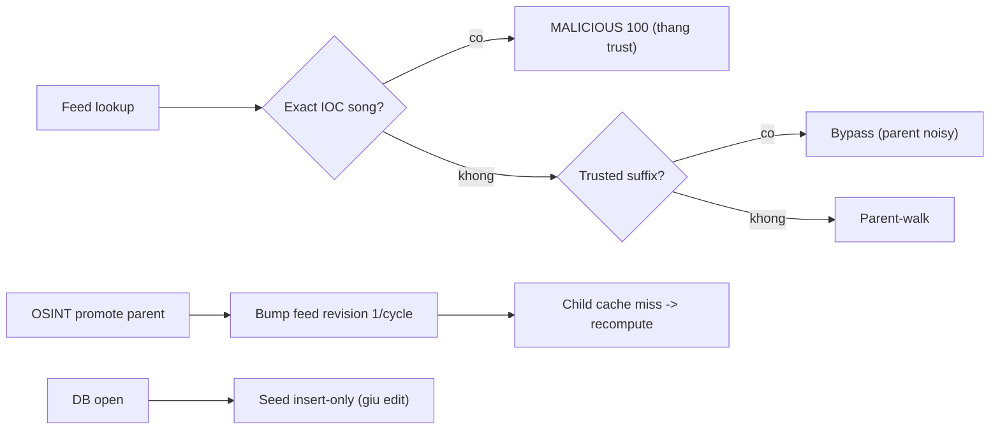

# Scope authority lát 1: exact IOC, parent-child, brand seed (PR-08a/H2-M2)

> **Tài liệu Living Document** — Cập nhật đồng bộ mỗi khi có thay đổi.
> Tuân thủ quy tắc tại `.agents/AGENTS.md` Section 5.

## ★ Tóm tắt (Abstract)

Lát đầu tiên của PR-08 (shared reducer + scope authority), cắt phạm vi hẹp để
không làm sai lệch hai baseline đang chạy (DNS-outcome 7 ngày, feed tuần đầu):
exact threat-feed IOC thắng trusted-suffix bypass (H2), chu kỳ OSINT có
promotion bump feed revision một lần để thải cache SAFE cũ của domain con
(M2 parent-child), và seed brand mặc định chuyển insert-only để giữ sửa đổi
của operator qua restart (M2 seed-ghi-đè). Ba test fail-before/pass-after;
suite 6 package xanh, race + lint + gosec sạch, eval contract `feed-003`
chuyển characterize thành must_block đã ký review. Không đụng admission
M7 (Shadow vẫn nạp Contextual) — để PR-08b sau khi baseline đủ.

## Sơ đồ Tổng quan

## ★ Scope authority lát 1

### ★ Mục tiêu (Objectives)

Mục tiêu là đóng phần H2/M2 đã chứng minh xong mà không đổi coverage feed:
host bị compromise vẫn block được dù nằm dưới trusted root (exact), một IOC
parent noisy không lan thành block cả shared root, promote parent không để
lại child SAFE cũ, và restart không xóa sửa brand của operator. Không đổi
TTL, admission mode, contract hay scoring.

### ★ Phương pháp & Lý do (Methodology & Rationale)

| Quyết định | Phương pháp chọn | Các phương pháp thay thế | Lý do |
|---|---|---|---|
| Exact trước, trust sau | `matchExactThreatFeed` (1 ZScore) rồi mới `IsTrustedBrandSuffix`, parent-walk chỉ `candidates[1:]` | Đảo toàn bộ thứ tự / corroboration engine | Blast radius nhỏ nhất: thêm đúng một lookup exact, giữ nguyên fail-open khi Redis lỗi và bypass parent hiện có |
| Parent noisy vẫn bypass | Test khóa `TestThreatFeedTrustedBrandSuffixBypass` giữ xanh + test guardrail mới | Exact-hoá toàn bộ feed | Một IOC parent như `googlevideo.com` block cả root là FP diện rộng; corroboration thuộc reducer đầy đủ PR-08 |
| Bump revision 1/cycle thay vì xóa child | `INCR feed.RevisionKey` khi `promoted > 0`, tái dùng epoch check sẵn có | SCAN `*parent` xóa child | SCAN leading-wildcard O(N) mỗi promote (tối đa 50/cycle); bump tối đa 1/giờ, đúng contract `feed.Sync` đã dùng khi ghi members |
| Seed insert-only | `ON CONFLICT(name) DO NOTHING` | Version marker / tombstone | DO NOTHING vừa giữ edit vừa chèn default mới cho DB cũ; tombstone cho brand bị xóa cố ý để dành ledger đầy đủ |
| Không đụng M7 | Shadow giữ nguyên | Gộp Filter vào cùng PR | Đổi admission lúc này làm sai lệch baseline feed tuần đầu đang chạy |

### ★ Cách thức Thực hiện (Implementation Details)

Hệ thống tách `matchThreatFeed` thành `matchExactThreatFeed` (`candidates[:1]`)
và `matchParentThreatFeed` (`candidates[1:]`); `feedResult` kiểm exact trước,
bypass trust ở giữa, parent-walk cuối, gom verdict qua `threatFeedHit`.
`OSINTTask.Run` gọi `bumpFeedRevision` (best-effort, có event
`threat_feed_revision_bump` / `..._failed`) đúng một lần mỗi cycle có
promotion; cycle không promotion giữ revision nguyên. `SeedDefaultBrands`
chuyển DO UPDATE thành DO NOTHING. Corpus contract `feed-003`
(`evil.sharepoint.com`) chuyển characterize/unknown thành
must_block/malicious, regenerate expected (diff duy nhất đúng verdict mới) và
ký review. Nếu dùng AI agent: mô hình `muse-spark`, chiến lược test
fail-before cho cả ba mảng trước khi sửa, kiểm soát bằng guardrail test
parent-bypass + truth corpus giữ nguyên, vai trò con người duyệt.

### ★ Số liệu (Metrics & Results)

- Fail-before: exact IOC dưới trust trả SAFE rỗng reasons; re-seed ghi đè
  `acb.com.vn` lên edit; cycle có promotion để revision rỗng, child giữ SAFE.
- Pass-after: exact → MALICIOUS 100 + feed reason; parent-only dưới trust vẫn
  bypass; child recompute → MALICIOUS sau promote; edit brand sống qua re-seed.
- Hồi quy: 6 package (`risk`, `store`, `agent`, `eval`, `feed`, `analysis`)
  xanh; risk feed/policy/cache/enrich/DNS ×3 + agent OSINT ×2; `-race` sạch;
  `golangci-lint` 0 issues; `gosec` 0 issues; `go vet`/`gofmt` sạch.
- Eval: contract must_block 5→6, characterize 1→0, mismatches 0,
  deterministic; truth giữ nguyên (precision/recall 1.0, 1 label-gap cũ).
- Residual ghi nhận: xóa brand mặc định cố ý vẫn resurrect sau restart (cần
  tombstone ở ledger đầy đủ); race liên process read-modify-write (giữ từ
  PR-05); M7 admission + reducer thuần + unknown verdict để PR-08b/09.

### Liên kết Artifacts

- Code: `internal/risk/service.go` (`feedResult`, `matchExact/ParentThreatFeed`,
  `threatFeedHit`), `internal/agent/osint.go` (`bumpFeedRevision`),
  `internal/store/brand.go` (`SeedDefaultBrands`)
- Test: `internal/risk/service_scope_test.go`,
  `internal/agent/osint_coherence_test.go`,
  `internal/store/seed_preservation_test.go`
- Eval: `internal/eval/testdata/contract.v1.json` + `expected-contract.v1.json`
  (`feed-003` must_block, corpus `81705931…`)
- Kế hoạch: `docs/research/security/decision-engine-rebuttal-plan.md`
  (Giai đoạn 6, PR-08)

---

## Lịch sử Thay đổi (Version History)

| Ngày | Thay đổi | Tác giả |
|---|---|---|
| 2026-09-13 | Scope authority lát 1: exact-wins, parent-child revision bump, seed insert-only (chưa merge) | Muse Spark |
