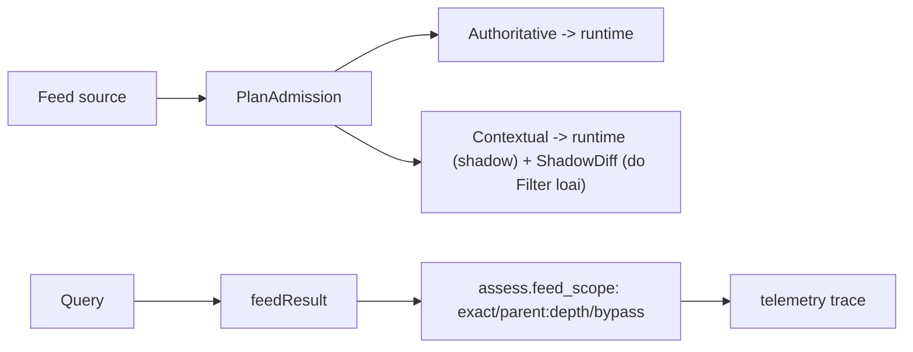

# PR-08b shadow: admission gap + feed-scope trace (M7, không đổi enforce)

> **Tài liệu Living Document** — Cập nhật đồng bộ mỗi khi có thay đổi.
> Tuân thủ quy tắc tại `.agents/AGENTS.md` Section 5.

## ★ Tóm tắt (Abstract)

Lát shadow của PR-08: đo thay vì đổi. Sync ghi thêm `ShadowDiff`
(contextual nào Filter sẽ loại) vào report + Redis status (lộ ra
`/v1/status`); engine gắn `feed_scope` (exact/parent-depth/trust-bypass)
vào assessment trên live evaluation, chảy vào cột trace của telemetry.
Không đổi tập runtime, verdict, policy hay TTL. Kèm parity proof
Legacy≡Shadow (cấu trúc + test) để flip prod sang Shadow an toàn.

## Sơ đồ Tổng quan

## ★ Shadow đo lường

### ★ Mục tiêu (Objectives)

Mục tiêu là trả lời câu hỏi M7 bằng số prod ("bao nhiêu member runtime là
URL-only contextual", "parent-match/bypass xảy ra bao nhiêu") mà không đổi
một verdict nào — bắt buộc trong bối cảnh traffic 1 user thưa, nơi chờ
baseline thụ động không bao giờ đủ mẫu.

### ★ Phương pháp & Lý do (Methodology & Rationale)

| Quyết định | Phương pháp chọn | Các phương pháp thay thế | Lý do |
|---|---|---|---|
| Đo ở 2 đầu (sync + query) | ShadowDiff lúc nạp, feed_scope lúc match | Chỉ một đầu | Sync cho biết Filter sẽ loại gì; query cho biết matcher chạm gì — hai số khác nhau, cần cả hai |
| Parity cấu trúc + test | `ParseEach` delegate `ParseEachIndicator`; union Auth∪Ctx = all-valid | Chỉ test mẫu | Chứng minh flipping Legacy→Shadow giữ nguyên tập runtime với mọi source, không chỉ fixture |
| Scope vào assessment, không vào cache entry | `assess.Feed` live-only, omitempty | Persist scope trong entry | Entry schema + 3 write paths + back-compat là việc của ledger (reducer PR); first-touch rows ở sampling 100% đủ đo tần suất path |
| TrustBypassed không claim parent-match | Ghi "bypass đã đánh giá", không lookup thêm | Lookup parent sau bypass để biết "đáng lẽ match" | Lookup thêm tốn 1 ZScore mọi trusted query vì mục đích quan sát — sai giá phải trả |
| Hoãn package reducer thuần | Trace + diff cho dữ liệu quyết định trước | Dựng `internal/decision` ngay | Song song 2 engine duplicate logic = rủi ro divergence; đo trước, tách sau (PR-08c) |

### ★ Cách thức Thực hiện (Implementation Details)

Feed: `ShadowDiff{contextual_loaded, contextual_psl_refused, sample≤50
sorted}` tính thuần trên `plan.Contextual` (không chạm stats counters),
gắn `SyncReport.Shadow` + `SourceStatus.Shadow` (tới `/v1/status` qua
`recordSyncSuccess`). Risk: `FeedScope{exact_match, candidate, depth,
trust_bypassed}` từ `feedResult` (matcher trả candidate thay vì bool),
`assess.Feed` set khi hit/bypass trên cả Analyze lẫn Policy; miss/cache
giữ nil. Ops độc lập: `SAFE_ZONE_AGENT_FEED_ADMISSION_MODE=shadow` trên
prod (Shadow hỗ trợ từ binary hiện tại; tập runtime chứng minh tương
đương). Nếu dùng AI agent: mô hình `muse-spark`, chiến lược observability
trước refactor, kiểm soát bằng parity test + golden eval đứng yên, vai trò
con người duyệt.

### ★ Số liệu (Metrics & Results)

- Fail-before: không áp dụng dạng đỏ-trước (tính năng quan sát mới);
  test khóa parity + diff + 4 scope-trace (exact/parent-depth/bypass/miss).
- Pass-after: parity Legacy≡Shadow trên fixture hosts+URL; diff đếm đúng
  contextual/PSL/sample; scope trace đúng 4 trạng thái cả Analyze+Policy.
- Hồi quy: risk/feed/agent/store/eval xanh; eval v2 + contract đứng yên
  tuyệt đối (0 drift — đúng kỳ vọng không đổi hành vi); lint 0 issues.
- Residual: scope vắng trên cache-hit rows; reducer thuần + Filter enforce
  để PR-08c sau khi ShadowDiff đủ 1–2 chu kỳ sync; URL-path negatives vẫn
  thuộc ml-replay harness.

### Liên kết Artifacts

- Code: `internal/feed/admission.go` (`ShadowDiff`, `SummarizeShadowGap`),
  `sync.go`, `status.go`; `internal/risk/service.go` (`FeedScope`,
  `feedResult`, matcher candidate)
- Test: `internal/feed/admission_shadow_test.go`,
  `internal/risk/service_scope_test.go`
- Kế hoạch: `docs/research/security/decision-engine-rebuttal-plan.md`
  (Giai đoạn 6, PR-08)

---

## Lịch sử Thay đổi (Version History)

| Ngày | Thay đổi | Tác giả |
|---|---|---|
| 2026-09-13 | PR-08b shadow: admission gap + feed-scope trace (chưa merge) | Muse Spark |
