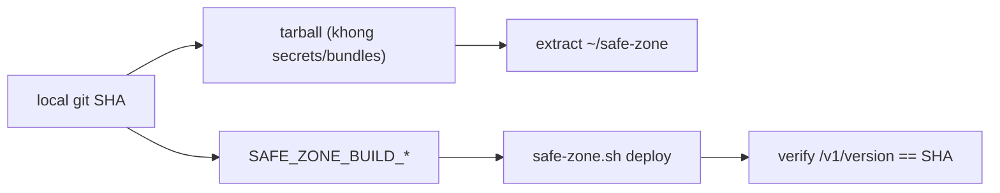

# Fix deploy.ps1: remote path, version stamping, secret hygiene (ops)

> **Tài liệu Living Document** — Cập nhật đồng bộ mỗi khi có thay đổi.
> Tuân thủ quy tắc tại `.agents/AGENTS.md` Section 5.

## ★ Tóm tắt (Abstract)

`deploy.ps1` gãy ba chỗ, phát hiện khi deploy `5503d88`: hardcode
`/opt/safe-zone` (prod thật ở `~/safe-zone`), version stamp lấy từ `.git`
stale trên VPS (build báo `5bbaac9-dirty` dù source mới), và tarball mang
theo dev secrets/model-bundle (chỉ thoát nạn nhờ perms prod từ chối ghi).
Bản sửa: param `RemoteDir` (default `~/safe-zone`, bỏ sudo), version
resolve từ local git truyền qua env, loại 2 cây host-local khỏi tarball +
tạo skeleton, verify version sau deploy (fail khi mismatch).

## Sơ đồ Tổng quan

## ★ Deploy script fix

### ★ Mục tiêu (Objectives)

Mục tiêu là deploy một lệnh ra đúng SHA báo đúng version, không rò secret,
không phụ thuộc `.git` trên VPS — mọi lỗi đều fail-fast trừ verify skeleton
đã bao trong lệnh remote.

### ★ Phương pháp & Lý do (Methodology & Rationale)

| Quyết định | Phương pháp chọn | Các phương pháp thay thế | Lý do |
|---|---|---|---|
| Param RemoteDir, bỏ sudo | Default `~/safe-zone`, tree user-owned | Giữ `/opt` + sudo | `/opt` không tồn tại; sudo đẻ file root-owned và phá `~` expansion |
| Version từ local git | `git rev-parse` + env override, param cho phép ghi đè | Sửa `.git` trên VPS | Server-side đã ưu tiên env (`set_build_metadata_env`); không mổ git prod |
| Loại secrets/bundles khỏi tarball | Exclude + `mkdir -p` skeleton remote | Giữ nguyên + chịu lỗi tar | Lỗi tar cũ làm `&&` ngắt deploy; dev secrets không bao giờ được lên prod |
| Verify version fail-close | So `/v1/version` với SHA đã ship | Chỉ in version | Chính incident này (SHA sai mà deploy "thành công") chứng minh cần gate |

### ★ Cách thức Thực hiện (Implementation Details)

Hệ thống thêm param `RemoteDir`/`BuildVersion`/`BuildCommit` (hai cái sau
default từ local git, fail khi không resolve), remote command một dòng:
mkdir skeleton, extract, chmod, deploy với env version, dọn tarball; cuối
so version container báo về. Nếu dùng AI agent: mô hình `muse-spark`, chiến
lược validate syntax PSParser + render thử remote command + test exclude
bằng tarball thật 300MB, vai trò con người duyệt.

### ★ Số liệu (Metrics & Results)

- Fail-before: `/opt` không tồn tại (deploy gãy); version báo
  `5bbaac9-dirty` cho source `5503d88`; tarball chứa dev secrets.
- Pass-after: syntax PSParser OK; remote command render đúng; tarball test
  0 entry secrets/bundles; verify mismatch fail-close.
- Hồi quy: không đụng Go/UI; CI sẽ xác nhận (script không có lint riêng).
- Residual: default `TargetHost` (`experiment-mode`) vẫn chết — giữ nguyên
  vì ngoài phạm vi (ghi nhận để sửa riêng nếu muốn).

### Liên kết Artifacts

- Code: `deploy.ps1`
- Quy ước server: `scripts/ops/safe-zone.sh` (`set_build_metadata_env`)

---

## Lịch sử Thay đổi (Version History)

| Ngày | Thay đổi | Tác giả |
|---|---|---|
| 2026-09-13 | Fix deploy.ps1 remote path + version stamping (chưa merge) | Muse Spark |
