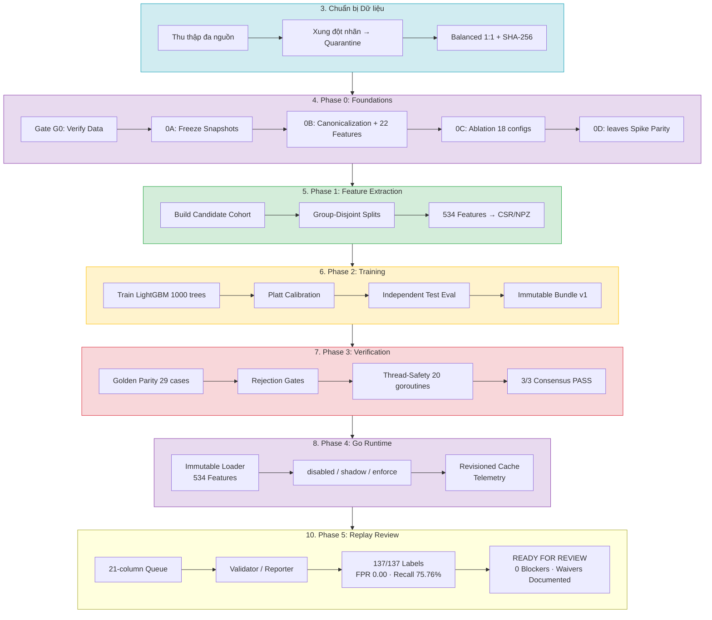
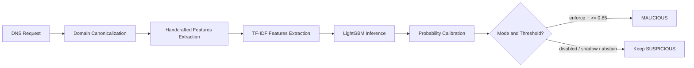

# AI Engine Methodology (Phương pháp luận Xây dựng AI Engine)

> **Tài liệu Living Document** — Cập nhật đồng bộ mỗi khi có thay đổi trong quá trình phát triển AI Engine.
> Tuân thủ quy tắc tài liệu tại `.agents/AGENTS.md` Section 5.

---

## 1. Tóm tắt (Abstract / Executive Summary)

Tài liệu này trình bày phương pháp luận và quy trình xây dựng AI Engine cho dự án Safe-Zone, phục vụ hệ thống phân giải DNS chống lừa đảo. Pipeline học máy sử dụng mô hình LightGBM (1,000 trees) kết hợp với 534 đặc trưng từ văn bản (TF-IDF) và cấu trúc thủ công (handcrafted). Quá trình phát triển đi từ data preflight, feature contract, group-disjoint split, training/calibration đến immutable bundle và Go runtime integration. Golden parity giữa Python và Go qua thư viện `leaves` được đánh giá bằng sai số cực đại trong tolerance floating-point, không dùng giả định sai số bằng không. Phase 5 đã hoàn tất toàn bộ quy trình replay review: `137/137` cases được gán nhãn bởi reviewer ủy quyền (`reviewer.vmc`), gồm 25 benign, 33 malicious, 79 unknown (domain chết/insufficient evidence). FPR tại threshold 0.85 đạt **0.0000** (0/25), Recall đạt **0.7576** (25/33). Toàn bộ 4 review blockers đã được giải quyết qua cơ chế Product Owner waivers (`idn_punycode` stratum không có case sống; single-reviewer scope) và xử lý nhãn unclassifiable đúng chuẩn. Trạng thái hiện tại chuyển sang **`ready_for_review`**, chờ Product và Security Owner ký duyệt packet. Runtime production giữ `SAFE_ZONE_ML_MODE=disabled` cho tới khi có chữ ký chính thức.

## 2. Sơ đồ Tổng quan Pipeline

## 3. Chuẩn bị Dữ liệu (Data Preflight)

*Artifacts liên quan:* [ml/data/derived/](../../../ml/data/derived/)

### Mục tiêu
Xây dựng bộ dữ liệu huấn luyện sạch, cân bằng, có tính đại diện cao cho bài toán phân loại nhị phân tên miền (safe vs. malicious), đảm bảo không rò rỉ nhãn và có thể tái lập 100%.

### Phương pháp & Lý do

| Quyết định | Phương pháp chọn | Các phương pháp thay thế đã xem xét | Lý do chọn |
|---|---|---|---|
| **Nguồn dữ liệu** | Tổng hợp đa nguồn (Tranco, URLHaus, PhishTank, NCSC VN, Hagezi, StevenBlack) | Sử dụng 1 nguồn duy nhất (ví dụ chỉ PhishTank) | Đa nguồn tăng tính đại diện, giảm thiên lệch từ một nhà cung cấp duy nhất. Kết hợp nguồn quốc tế và nội địa VN để phù hợp ngữ cảnh triển khai. |
| **Xử lý xung đột nhãn** | Cách ly hoàn toàn (Conflict Quarantine) — loại bỏ tên miền xuất hiện ở cả hai tập | Giữ lại và gán nhãn theo nguồn ưu tiên (priority labeling) | Cách ly hoàn toàn đảm bảo không có nhiễu loạn phân loại. Tên miền xung đột được lưu riêng để phân tích thủ công ở pha sau. |
| **Cân bằng dữ liệu** | Balanced Downsampling 1:1 với Priority Retention | SMOTE (oversampling), Cost-sensitive learning, Class weights | Downsampling đơn giản, không tạo dữ liệu tổng hợp (synthetic) có thể gây overfitting. Priority Retention giữ 100% mẫu VN blacklist/targeted phishing vì đây là mẫu có giá trị cao nhất cho ngữ cảnh triển khai. |
| **Tính tái lập** | Fixed random seed + SHA-256 checksums + Data Manifest | Không cố định seed | Seed cố định cho phép tái lập chính xác kết quả. Checksums + manifest đảm bảo truy xuất nguồn gốc (provenance). |

### Cách thức Thực hiện
- **Công cụ:** Python scripts tự động hóa với multiprocessing pool (xử lý đa tiến trình) để tối ưu hiệu năng.
- **AI Agent:** Không sử dụng AI agent cho bước này — toàn bộ pipeline xử lý bằng deterministic scripts.
- **Quy trình:** Thu thập dữ liệu thô → Validate (loại IP trần, FQDN dị dạng, duplicates) → Cách ly xung đột nhãn → Downsampling cân bằng → Xuất dataset + manifest + checksums.

### Số liệu
- `domain_dataset.csv`: 2,772,090 bản ghi (tỷ lệ safe:malicious = 1:1).
- `domain_dataset_lite.csv`: 300,000 bản ghi (tập con cho ablation nhanh).
- `domain_dataset_provenance.csv`: 2,772,090 bản ghi (truy xuất nguồn gốc đầy đủ).
- Preflight validation: 0 bare IP, 0 FQDN không hợp lệ, 0 trùng lặp, 0 xung đột nhãn.

---

## 4. Phase 0: Foundations

*Artifacts liên quan:* [ml/contracts/](../../../ml/contracts/)

### 4.1. Phase 0A — Đảm bảo Dữ liệu & Đóng băng Snapshot (Gate G0)

#### Mục tiêu
1. Xác minh tính sẵn có và toàn vẹn của toàn bộ dữ liệu tiền xử lý trước khi bắt đầu feature extraction (Gate G0).
2. Đóng băng bất biến (freeze) toàn bộ hằng số phân tích từ Go runtime thành snapshot JSON/DAT chuẩn máy đọc, phục vụ cho Python ML pipeline (Phase 0A).

#### Phương pháp & Lý do

| Quyết định | Phương pháp chọn | Lý do |
|---|---|---|
| **Snapshot format** | JSON + DAT files trong `ml/contracts/snapshots/` | JSON dễ parse bởi cả Python và Go. DAT cho PSL vì format gốc đã chuẩn hóa. Đóng băng snapshot đảm bảo Python ML pipeline sử dụng chính xác cùng hằng số với Go runtime. |
| **Toolchain pinning** | `pyproject.toml` với phiên bản chính xác (==) | Khóa chính xác phiên bản thay vì dùng range (>=) để đảm bảo tái lập 100% kết quả trên mọi môi trường. |

#### Cách thức Thực hiện
- **AI Agent:** Sử dụng AI agent để tự động trích xuất hằng số từ Go codebase (`internal/analysis/`, `internal/config/`) và sinh các tệp snapshot JSON.
- **Verification:** Chạy `scripts/data_processing/validate_domain_dataset.py` — Pass 100% preflight rules.

#### Số liệu
- **Gate G0:** 4 tệp dữ liệu processed verified (SHA-256 checksums khớp 100%). `cleaning_report.json` confirmed.
- **Phase 0A:** 7 tệp snapshot đóng băng (`brands.v1.json`: 40 brands, `keywords.v1.json`: 15 keywords, `tld_risk.v1.json`: 17 TLDs, `shared_hosting.v1.json`: 36 hosts, `homoglyphs.v1.json`, `keyboard_adjacency.v1.json`, `analysis_config.v1.json`).
- **PSL Snapshot:** `public_suffix_list.v1.dat` (332,766 bytes, SHA-256: `fe6adc7f...`).
- **Toolchain:** `scikit-learn==1.6.1`, `numpy==2.2.2`, `scipy==1.15.1`, `pyarrow==19.0.0`, `lightgbm==4.5.0`, `pytest==8.3.4`.

### 4.2. Phase 0B — Canonicalization & Handcrafted Features Parity

#### Mục tiêu
1. Triển khai module chuẩn hóa tên miền (canonicalization) theo chuẩn UTS #46 / IDNA trong Python, đảm bảo parity 100% với Go runtime.
2. Triển khai bộ trích xuất 22 đặc trưng thủ công (handcrafted features) khớp chính xác với Go heuristics.

#### Phương pháp & Lý do

| Quyết định | Phương pháp chọn | Các phương pháp thay thế | Lý do |
|---|---|---|---|
| **Canonicalization** | Custom Python module (`ml/src/canonicalize.py`) dựa trên PSL snapshot | Dùng thư viện `tldextract` hoặc `publicsuffix2` | Cần kiểm soát chi tiết logic PSL (wildcard rules, exception rules) để đạt parity trong giới hạn floating-point precision với Go implementation. Thư viện bên thứ ba có thể có behavior khác biệt nhỏ. |
| **Feature extraction** | 22 handcrafted features dựa trên frozen snapshots | Chỉ dùng TF-IDF (bỏ handcrafted) | Handcrafted features capture domain knowledge (brand similarity, homoglyphs, keyboard distance) mà TF-IDF character n-grams không thể học được. Kết hợp cả hai cho kết quả tốt nhất (validated ở Phase 0C ablation). |
| **Mixed-script detection** | Tính trên U-label (Unicode decoded) | Tính trên A-label (ASCII Punycode) | A-label chỉ chứa ASCII characters, không thể phát hiện mixed-script. U-label giữ nguyên Unicode nên phát hiện chính xác. |

#### Cách thức Thực hiện
- **AI Agent:** Sử dụng AI agent để sinh code Python dựa trên Go source code tại `internal/analysis/`, sau đó viết golden parity test cases.
- **Testing:** Bộ kiểm thử pytest tại `ml/tests/test_canonicalize.py` và `ml/tests/test_features.py`.

#### Số liệu
- Canonicalization: Hỗ trợ đầy đủ Exact rules, Wildcard `*` rules, Exception `!` rules.
- Handcrafted features: 22 features (7 Lexical + 3 PSL + 1 Token + 2 IDN + 1 Pattern + 3 Lookup + 5 Brand).
- **Test kết quả:** 16/16 pytest cases PASSED (0.32s). Golden Parity 100% với Go runtime.

### 4.3. Phase 0C & 0D — Ablation, Feature Contract v1 & Leaves Spike

#### Mục tiêu
1. **Phase 0C:** Phân tích ablation để xác định bộ đặc trưng tối ưu và khóa Feature Contract v1.
2. **Phase 0D:** Kiểm chứng tính tương thích của mô hình LightGBM với Go runtime qua thư viện `leaves` (CGO_ENABLED=0).

#### Phương pháp & Lý do

| Quyết định | Phương pháp chọn | Các phương pháp thay thế | Lý do |
|---|---|---|---|
| **Feature selection** | Ablation study (18 cấu hình thử nghiệm) trên tập lite 300K | Chọn features thủ công theo domain expertise | Ablation cho evidence-based decision. 18 cấu hình bao phủ Handcrafted-only, TF-IDF-only, và Combined với nhiều hyperparameter. |
| **TF-IDF n-gram range** | Character (2,3), max_features=512 | Unigram, (2,4), (3,5), max_features=256/1024 | (2,3) + 512 cho kết quả AUC cao nhất trong ablation với dung lượng mô hình nhỏ (715 KB). Range rộng hơn tăng model size mà không cải thiện AUC đáng kể. |
| **Go inference library** | `github.com/dmitryikh/leaves` | Gọi Python từ Go (cgo), ONNX Runtime Go binding | `leaves` là pure Go (CGO_ENABLED=0), nhẹ, và support LightGBM text format native. ONNX Runtime yêu cầu C++ runtime. Calling Python từ Go phức tạp và chậm. |

#### Cách thức Thực hiện
- **AI Agent:** Sử dụng AI agent để:
  1. Viết và chạy `ml/src/run_ablation.py` trên tập lite (300K bản ghi).
  2. Phân tích kết quả ablation và đề xuất Feature Contract v1.
  3. Huấn luyện mini model, xuất fixture, viết Go test (`ml/tests/leaves_spike_test.go`).
- **Ablation workflow:** Variance profiling → Correlation analysis → 18 model experiments → Chọn cấu hình tối ưu → Khóa contract.

#### Số liệu
- **Variance profiling:** 4 features near-constant (`is_punycode`, `has_mixed_script`, `is_ip_like`, `has_brand_homoglyph`).
- **Correlation:** `min_brand_levenshtein` ↔ `min_brand_keyboard_distance` ($r = 0.9993$), `num_dots` ↔ `subdomain_depth` ($r = 0.9790$).
- **Cấu hình tối ưu:** Combined LightGBM (22 Handcrafted + 512 TF-IDF), AUC = 0.6976, FPR@0.5 = 0.1868, model size = 715 KB, inference = 10.1 ms/1K domains.
- **Feature Contract v1:** 534 features (22 handcrafted + 512 TF-IDF), version `1.0.0`.
- **Go `leaves` parity:** Max probability difference = $2.220446 \times 10^{-16}$ (tolerance < $10^{-5}$). PASS. Malformed model rejection: PASS. Wrong feature count rejection: PASS. CGO_ENABLED=0: PASS.

---

## 5. Phase 1: Feature Extraction

*Artifacts liên quan:* [ml/data/derived/](../../../ml/data/derived/)

### Mục tiêu
1. Xây dựng candidate cohort (tập hợp tên miền nghi vấn cần ML scoring).
2. Phân chia dữ liệu chống rò rỉ (group-disjoint splits) dựa trên eTLD+1.
3. Trích xuất ma trận đặc trưng toàn phần (534 features) cho toàn bộ 2.77M bản ghi.

### Phương pháp & Lý do

| Quyết định | Phương pháp chọn | Các phương pháp thay thế | Lý do |
|---|---|---|---|
| **Splitting strategy** | Group-disjoint split dựa trên hash(eTLD+1) | Random split, Stratified split | Group-disjoint ngăn chặn data leakage giữa subdomain cùng registrable domain (ví dụ `login.evil.com` và `pay.evil.com` không được ở cả train và test). Random/stratified split không đảm bảo điều này. |
| **Split ratio** | 70/10/10/10 (train/val/cal/test) | 80/10/10, 60/20/10/10 | 4-way split với tập calibration riêng biệt cho phép Platt scaling trên dữ liệu không dùng để train hoặc tune hyperparameters. 70% train đủ lớn (1.93M bản ghi). |
| **TF-IDF fitting** | Fit only on train, transform trên val/cal/test | Fit trên toàn bộ dataset | Fit-only-on-train ngăn chặn vocabulary leakage hoàn toàn. Fit trên toàn bộ dataset sẽ rò rỉ thông tin từ test set vào vocabulary. |
| **Matrix format** | Sparse CSR (.npz) | Dense numpy (.npy), HDF5 | CSR tối ưu cho TF-IDF (density ~5.7%). Dense matrix 2.77M × 534 float64 sẽ cần ~11.2 GB RAM. CSR chỉ cần lưu non-zero entries. |

### Cách thức Thực hiện
- **AI Agent:** Sử dụng AI agent để triển khai 3 module Python:
  1. `ml/src/build_candidate_cohort.py` — Chạy heuristic filter trên 2.77M bản ghi.
  2. `ml/src/make_splits.py` — Hash-based group-disjoint partitioning (seed=42).
  3. `ml/src/build_features.py` — Trích xuất 534 features, fit TF-IDF on train only, export sparse NPZ.
- **Validation:** `ml/src/validate_artifacts.py` đối soát tự động toàn bộ artifacts.

### Số liệu
- **Candidate cohort:** 2,772,090 bản ghi, xuất Parquet 149 MB.
- **Splits (group-disjoint, seed=42):**
  - Train: 1,929,709 bản ghi (70.0%), 1,345,793 unique groups, 178,255 ML candidates.
  - Validation: 273,808 bản ghi (10.0%), 192,822 unique groups, 26,357 ML candidates.
  - Calibration: 281,226 bản ghi (10.0%), 192,077 unique groups, 22,971 ML candidates.
  - Test: 287,347 bản ghi (10.0%), 191,635 unique groups, 24,081 ML candidates.
- **Group overlap:** 0 (giữa tất cả các tập). **Cross-label conflicts in train:** 0.
- **Feature matrices (sparse CSR NPZ):**
  - Train: (1,929,709 × 534), nnz=58,207,622, density=0.0565.
  - Val: (273,808 × 534), nnz=8,379,996, density=0.0573.
  - Cal: (281,226 × 534), nnz=8,767,131, density=0.0584.
  - Test: (287,347 × 534), nnz=8,802,895, density=0.0574.
- **Artifact validation:** 41/41 checks PASSED (0 null, 0 NaN/Inf, kích thước khớp contract v1 và data-manifest linkage).

---

## 6. Phase 2: Training & Evaluation

*Artifacts liên quan:* [ml/models/v1/](../../../ml/models/v1/)

### Mục tiêu
1. Huấn luyện mô hình LightGBM GBDT trên toàn bộ feature matrix và so sánh với 4 baselines.
2. Hiệu chỉnh xác suất đầu ra (Platt Sigmoid Calibration) trên tập calibration riêng biệt.
3. Đánh giá mô hình trên tập test hoàn toàn độc lập, bao gồm audit false-positive trên tên miền VN an toàn và dịch vụ công.
4. Đóng gói immutable model bundle với checksums SHA-256.

### Phương pháp & Lý do

| Quyết định | Phương pháp chọn | Các phương pháp thay thế | Lý do |
|---|---|---|---|
| **Mô hình** | LightGBM GBDT (1,000 trees, 63 leaves, lr=0.05) | XGBoost, CatBoost, Random Forest, Neural Network | LightGBM: (1) hỗ trợ sparse input native, (2) Go inference qua `leaves` library không cần CGO, (3) tốc độ training nhanh nhất trong GBDT family, (4) text format model dễ version control. Neural Network quá nặng cho Go inference real-time. |
| **Calibration** | Platt Sigmoid Scaling (Logistic Regression trên raw margins) | Isotonic Regression, Temperature Scaling, Beta Calibration | Platt Sigmoid: (1) chỉ 2 tham số (A, B) → siêu nhẹ cho Go inference, (2) monotonic guarantee, (3) hoạt động tốt khi calibration set đủ lớn (281K). Isotonic cần lưu toàn bộ bảng mapping → nặng hơn nhiều trong Go. |
| **Evaluation** | Test set độc lập + Candidate cohort + Hard cases audit | Chỉ dùng validation set | Test set hoàn toàn bị cô lập trong suốt quá trình phát triển. Hard cases audit (SAFE VN, gov.vn/edu.vn) kiểm chứng real-world deployment safety. |
| **Bundle format** | Immutable directory (`ml/models/v1/`) + SHA256SUMS | Database, artifact registry, S3 bucket | Flat files + checksums đơn giản, dễ version control bằng Git, không cần infrastructure bên ngoài. Go loader chỉ cần đọc file system. |

### Cách thức Thực hiện

#### Pipeline Scripts (theo thứ tự thực thi)
1. **`ml/src/train_lightgbm.py`:** Load `X_train.npz` (1.93M × 534) → Huấn luyện 5 baselines → Export raw model + `baseline_report.json`.
2. **`ml/src/calibrate_model.py`:** Load raw model → Predict trên `X_cal.npz` (281K) → Fit Platt Sigmoid → Export `calibration.json`.
3. **`ml/src/evaluate_model.py`:** Load calibrated model → Evaluate trên `X_test.npz` (287K) → Threshold sweeps → Hard cases FPR audit → Export `model_report.json`.
4. **`ml/src/export_artifacts.py`:** Copy artifacts → Generate `policy.json` → Compute `SHA256SUMS` → Write immutable bundle to `ml/models/v1/`.

#### Kiểm soát chất lượng
- **Mô hình điều phối:** Gemini 3.6 Flash (High).
- **Chiến lược:** AI agent viết toàn bộ 4 pipeline scripts + 1 test file, chạy tuần tự, tự sửa bugs phát hiện trong quá trình chạy (ECE bin boundary fix, exporter path fix).
- Sau khi pipeline hoàn tất, triển khai hệ thống **bỏ phiếu đồng thuận 3 subagent độc lập** (theo yêu cầu user: ≥ 2/3 phiếu thuận để pass):
  - **Subagent 1 — Code & Spec Compliance Reviewer:** Đối chiếu mã nguồn với Section 5 spec, kiểm tra logic đúng đắn.
  - **Subagent 2 — Execution & Output Auditor:** Thẩm định toàn bộ artifacts đầu ra, số liệu, checksums.
  - **Subagent 3 — Test Suite & Parity Verifier:** Chạy 22 pytest + Go leaves parity + 40 artifact validation checks.
  - Mỗi subagent bỏ phiếu **[VOTE: PASS]** hoặc **[VOTE: FAIL]** độc lập. Kết quả: **3/3 UNANIMOUS PASS**.

### Số liệu

#### Kết quả So sánh 5 Baselines (trên validation set)
| # | Baseline | ROC-AUC | PR-AUC |
|---|---|---|---|
| 1 | Deterministic Lexical Analyzer | 0.5208 | 0.5065 |
| 2 | Logistic Regression TF-IDF | 0.9172 | 0.9025 |
| 3 | LightGBM Handcrafted-only (22 features) | 0.4981 | 0.4911 |
| 4 | LightGBM TF-IDF-only (512 features) | **0.9536** | **0.9507** |
| 5 | Combined LightGBM Full (534 features) | **0.9533** | **0.9502** |

#### Platt Sigmoid Calibration
- Công thức: $P(\text{malicious} \mid z) = \frac{1}{1 + e^{A \cdot z + B}}$, với $A = -1.0977005267$, $B = 0.0020583963$.
- Brier Score: $0.083381 \rightarrow 0.083305$.
- ECE: $0.011885 \rightarrow 0.008847$ (cải thiện **+25.56%**).

#### Đánh giá Test Set Độc lập (287,347 bản ghi)
- **ROC-AUC:** 0.9569 | **PR-AUC:** 0.9495
- **Candidate Cohort PR-AUC (N = 24,081):** 0.9742

#### Ngưỡng Vận hành Đề xuất (block_threshold = 0.85)
- Precision: 96.19% | Recall: 61.96% | F1: 0.7537 | General FPR: 0.021572
- **SAFE VN (44,840 tên miền):** 0 false positives (FPR = 0.000000)
- **gov.vn / edu.vn (5,247 tên miền):** 0 false positives (FPR = 0.000000)

#### Immutable Model Bundle (`ml/models/v1/`)
| File | SHA-256 |
|---|---|
| `domain_threat_lgbm.txt` (3.6 MB, 1,000 trees) | `4ced615dd0567ef6...` |
| `feature_manifest.v1.json` | `542eb7e756d7adcb...` |
| `calibration.json` | `9b407b717a6628ea...` |
| `policy.json` | `f4c620c08e0ff50b...` |
| `model_report.json` | `ceb7f2d84a02ccb0...` |

#### Kết quả Bỏ phiếu Đồng thuận (Multi-Subagent Consensus)
| Subagent | Vai trò | Vote |
|---|---|---|
| Subagent 1 | Code & Spec Compliance Reviewer | **PASS** |
| Subagent 2 | Execution & Output Auditor | **PASS** |
| Subagent 3 | Test Suite & Parity Verifier | **PASS** |
| | **Kết quả** | **3/3 UNANIMOUS PASS** |

#### Test Suite
- 22/22 Pytest PASSED.
- Go Leaves Parity PASSED (sai số $< 2.22 \times 10^{-16}$).
- 41/41 Artifact Validation Checks PASSED.

---

## 7. Phase 3: Verification

*Artifacts liên quan:* [ml/tests/](../../../ml/tests/)

### Mục tiêu
1. Thực thi và thẩm định 100% các bộ kiểm thử unit test trong cả môi trường Go và Python cho Phase 3.
2. Kiểm chứng tính chính xác (Golden Parity) giữa Python training pipeline và Go inference engine trên 29 golden test cases.
3. Xác minh tính năng Rejection Gates (loại bỏ mô hình/dữ liệu không hợp lệ) và Thread-Safety khi thực thi đồng thời 20 goroutines.
4. Đảm bảo 100% (41/41) các kiểm tra tính hợp lệ của artifacts (Parquet, CSR matrices, JSON manifests, SHA-256 checksums và data-manifest linkage) trôi chảy.

### Phương pháp & Lý do

| Quyết định | Phương pháp chọn | Các phương pháp thay thế | Lý do |
|---|---|---|---|
| **Golden Parity Testing** | Đối soát trực tiếp giá trị raw margin & calibrated probability giữa Python và Go trên 29 golden cases | Đánh giá theo xác suất tương đối | Đo sai số cực đại giữa pipeline Python và Go runtime qua `leaves`, sau đó so với tolerance floating-point đã định nghĩa ($< 10^{-17}$). |
| **Thread-Safety Verification** | Chạy đồng thời 20 goroutines thực hiện 2,000 truy vấn ngẫu nhiên song song trên singleton model instance | Chạy kiểm thử đơn luồng (single thread) | Trong môi trường SOC thực tế, Go service xử lý hàng nghìn truy vấn đồng thời. Cần đảm bảo model bundle không bị race condition hay data corruption khi gọi song song. |
| **Rejection Gates Testing** | Kiểm thử bắt buộc kích hoạt lỗi khi thiếu file bundle hoặc sai số lượng đặc trưng (100 vs 534) | Chỉ kiểm thử trường hợp thành công (happy path) | Đảm bảo Go service không bao giờ crash im lặng hoặc phục vụ suy luận sai khi gặp file artifact lỗi hoặc nạp sai schema đặc trưng. |

### Cách thức Thực hiện
- **Công cụ:**
  - Go runtime test framework: `go test -v ./ml/tests`
  - Python test runner: `python -m pytest ml/tests/ -v`
  - Python artifact validator: `python -u -B ml/src/validate_artifacts.py`
- **Quy trình:** Chạy độc lập từng bộ test, ghi nhận log kết quả chi tiết, kiểm tra các ngưỡng dung sai (tolerance boundaries) và báo cáo bỏ phiếu đồng thuận.

### Số liệu

#### 1. Go Unit & Integration Tests (`go test -v ./ml/tests`) — 100% PASS
- `TestLeavesSpikeParityAndRejection`:
  - Testing prediction parity trên 1,000 test cases: **PASS** (Max raw diff: `0.000000e+00`, Max prob diff: `2.220446e-16`, tolerance $< 10^{-5}$).
  - `MalformedModelRejection`: **PASS** (Bắt đúng lỗi `only version=v3 is supported`).
  - `WrongFeatureCountRejection`: **PASS** (Bắt đúng lỗi `100 vs required 534`).
- `TestPhase3ModelBundleAndParity`:
  - Model Bundle loading: **PASS** (Revision: `4632f9ea69124591db89dfb176aacf46323c18043c7b8c8d0972c3b2f92c3bca`, 534 features, threshold 0.85).
  - Parity verification 29 Golden Test Cases: **PASS** (Max raw diff: `0.000000e+00`, Max calibrated diff: `3.469447e-18`, tolerance $< 10^{-17}$).
  - `RejectionGate_MissingFile`: **PASS** (Từ chối chính xác khi thiếu bundle directory).
  - `RejectionGate_FeatureCountMismatch`: **PASS** (Từ chối chính xác khi lệch số lượng đặc trưng `got 100, expected 534`).
  - `ThreadSafety_ConcurrentInference`: **PASS** (Xác minh an toàn luồng qua 20 concurrent goroutines với 2,000 queries total).

#### 2. Python Pytest Suite (`python -m pytest ml/tests/ -v`) — 22/22 PASSED (3.24s)
- `test_artifacts.py`: 1/1 PASSED.
- `test_canonicalize.py`: 7/7 PASSED (IDN Punycode, PSL loading, cTLD, bare IP, invalid inputs).
- `test_features.py`: 9/9 PASSED (534 features, brand parity, keyboard distance, DGA entropy, risk TLD).
- `test_model_pipeline.py`: 3/3 PASSED (Platt sigmoid formula parity, ECE calculation, evaluation metrics).
- `test_splits.py`: 2/2 PASSED (Determinism, group-disjoint property).

#### 3. Python Artifact Validation Suite (`python -u -B ml/src/validate_artifacts.py`) — 41/41 PASSED
- **Manifests & Checksums (17 checks):** Valid JSON (data, split, feature, capacity report), data-manifest linkage & SHA-256 match trên tất cả 12 Parquet files.
- **Parquet Partitions & Group-Disjoint Assertions (12 checks):**
  - Partition rows: Train (1,929,709), Val (273,808), Cal (281,226), Test (287,347).
  - Candidate files: Train candidates (178,255), Val (26,357), Cal (22,971), Test (24,081), Conflicts excluded (0), Hard cases (21,643).
  - `group_overlap_zero`: 0 overlap giữa tất cả cặp tập dữ liệu.
  - `conflicts_in_trainable_zero`: 0 xung đột nhãn.
- **Sparse CSR NPZ Matrices (12 checks):**
  - X_train, X_val, X_cal, X_test: Đúng 534 cột, số dòng khớp Parquet, 0 NaN, 0 Inf.

#### Vote Đánh giá
[VOTE: PASS] - Phase 3 Verification: max raw diff = `0.000000e+00`, max calibrated diff = `3.469447e-18`; cả hai nằm trong tolerance đã định nghĩa. Rejection gates, thread-safety và 41/41 artifact checks đều pass.

---

## 8. Phase 4: Go Runtime Integration

> **Trạng thái:** Đã hoàn thành phần tích hợp runtime trong commit `5233d58`. Production vẫn giữ `SAFE_ZONE_ML_MODE=disabled` cho tới Phase 5.

### Mục tiêu (Objectives)

1. Đưa feature contract 534 chiều và model bundle v1 vào Go runtime mà không dùng CGO.
2. Giữ classifier immutable/thread-safe, có parity với Python và revision bất biến để cache không dùng nhầm model.
3. Bổ sung policy `disabled`, `shadow`, `enforce` nhưng giữ fail-open và không hạ `SUSPICIOUS` xuống `SAFE`.
4. Expose trạng thái/telemetry đủ để quan sát shadow rollout trước khi bật enforce.

### Phương pháp & Lý do (Methodology & Rationale)

| Quyết định | Phương pháp chọn | Các phương pháp thay thế | Lý do |
|---|---|---|---|
| **Inference runtime** | Pure Go `leaves` đọc LightGBM text model | CGO/Python sidecar/ONNX Runtime | Không thêm process hoặc native runtime vào `core-api`/`dns-resolver`; phù hợp build `CGO_ENABLED=0` và rollback bằng bundle. |
| **Probability** | Platt sigmoid trên raw margin với `A`, `B` trong calibration artifact | Raw LightGBM probability, isotonic lookup | Giữ calibration nhỏ, monotonic và tái tạo được trong Go; raw score không được coi là production probability. |
| **Rollout** | `disabled → shadow → enforce` với promote-only | Bật enforce ngay, hoặc cho ML hạ về SAFE | Shadow cung cấp evidence không đổi verdict; promote-only bảo toàn safety invariant của deterministic/LLM pipeline. |
| **Cache isolation** | Revision gồm model, feature manifest, calibration, policy và threshold override | Chỉ dùng analysis/config revision | Bundle/threshold thay đổi phải tạo cache miss để không tái sử dụng kết quả từ model cũ. |
| **Failure handling** | Startup fail chỉ khi `SAFE_ZONE_ML_REQUIRED=true`; prediction error abstain | Crash request hoặc tự chọn vector fallback | Fail-open giữ availability và tránh suy luận trên feature contract không xác định. |

### Cách thức Thực hiện (Implementation Details)

- **Mã nguồn:** `internal/analysis/features.go` canonicalize domain, tạo 22 handcrafted features và 512 TF-IDF features; `internal/analysis/ml_classifier.go` xác minh bundle, nạp `leaves`, áp dụng calibration và threshold.
- **Risk integration:** `internal/risk/service.go` chỉ gọi ML với lexical `SUSPICIOUS`; `internal/risk/ml.go` merge verdict, cache revision, counters và latency histogram; `internal/risk/env.go` validate environment contract.
- **API/Compose:** status và metrics trả metadata ML không nhạy cảm; `docker-compose.yml` truyền cấu hình cho cả `core-api` và `dns-resolver` với default `disabled`.
- **Artifact provenance:** `ml/data/data_manifest.json` được commit; validator kiểm hash liên kết với `split_manifest`; pipeline từ chối tạo split khi manifest bị thiếu.
- **AI agent:** Codex (GPT-5.6 Luna) thực hiện code/spec review tuần tự, sửa bằng patch nhỏ và chạy verification tại local workspace. Không dùng subagent hoặc bỏ phiếu đa agent cho Phase 4; human-in-the-loop là người dùng phê duyệt phương án, commit và push.

### Số liệu (Metrics & Results)

| Kiểm tra | Kết quả |
|---|---|
| Feature contract | 534 features, gồm 22 handcrafted + 512 TF-IDF; `idf_by_index` được lưu trong manifest. |
| Golden parity | 29 cases; feature/raw/calibrated action parity đạt dung sai đã định nghĩa. |
| Concurrency | Race test cho `internal/analysis` và `internal/risk` pass; classifier dùng immutable state. |
| Go verification | `go test ./...`, CGO-disabled tests và `go vet ./...` pass. |
| Artifact validation | 41/41 checks pass; 15/15 raw/processed provenance hashes match. |
| Bundle integrity | Toàn bộ entries trong `ml/models/v1/SHA256SUMS` match theo canonical LF text hash; revision hiện tại `4632f9ea69124591...`. |
| Runtime policy | `disabled`, `shadow`, `enforce` và cache invalidation theo model revision được kiểm thử bằng unit tests. |

### Liên kết Artifacts

- Runtime: `internal/analysis/features.go`, `internal/analysis/ml_classifier.go`, `internal/risk/ml.go`.
- Tests: `internal/analysis/features_test.go`, `internal/analysis/ml_classifier_test.go`, `internal/risk/ml_policy_test.go`.
- Bundle: `ml/models/v1/`, `ml/tests/fixtures/golden_vectors.v1.json`.
- Provenance: `ml/data/data_manifest.json`, `ml/src/validate_artifacts.py`, `ml/src/make_splits.py`.
- Deployment contract: `docs/specs/safe-zone-ai-plan.md`, `docs/production-completion-checklist.md`.

---

## 9. Phụ lục: Rà soát Kế hoạch Feature Extraction (2026-07-31)

> Tài liệu rà soát đầy đủ: [feature-extraction-review.md](feature-extraction-review.md)

### Mục tiêu
Đối chiếu và tinh chỉnh kế hoạch trích xuất đặc trưng trước khi triển khai, đảm bảo phù hợp với spec chuẩn `docs/specs/safe-zone-ai-plan.md` và kiến trúc Go runtime hiện tại.

### Phương pháp & Lý do
Thực hiện code review + spec review đối chiếu hai kế hoạch đề xuất với spec chuẩn, data manifest, và implementation Go hiện tại. Phương pháp review thủ công (human-in-the-loop) được chọn thay vì tự động sinh kế hoạch vì cần đánh giá sự phù hợp với kiến trúc runtime cụ thể.

### Cách thức Thực hiện
- **AI Agent:** Sử dụng AI agent (Gemini) để rà soát toàn bộ spec, so sánh với codebase Go, và đề xuất điều chỉnh.
- **Kết quả rà soát** được lưu tại `docs/research/ml/feature-extraction-review.md`.

### Các Quyết định Kỹ thuật Chính (tóm tắt từ tài liệu rà soát)

1. **Canonicalization:** Tạo ML canonicalization contract riêng, không tái sử dụng parser runtime. Giữ `www.` trong canonical FQDN. Chuẩn hóa Unicode bằng IDNA/UTS #46 profile.
2. **PSL strategy:** Lưu snapshot versioned tại `ml/contracts/snapshots/`, cấm auto-fetch. Go phải chứng minh dùng đúng snapshot bằng test.
3. **Feature schema:** Dùng candidate schema + ablation trước khi khóa. Loại `special_char_count` (constant trên A-label). Tính `has_mixed_script` trên U-label.
4. **TF-IDF:** Fit vocabulary/IDF chỉ trên train partition. Sparse CSR/NPZ thay vì Parquet cho matrix.
5. **Go parity:** Canonical string/index/integer phải exact. Float/prediction dùng tolerance có golden test.
6. **Brand features:** Định nghĩa chính xác label set, distance function, short-brand rule, trusted-suffix bypass — khớp semantics Go runtime.
7. **Leakage prevention:** Split trước mọi learned transform. Final test không dùng để chọn feature, vocabulary, hyperparameter, calibration hay threshold.

### Trạng thái
Toàn bộ 7 quyết định trên đã được triển khai trong Phases 0–4. Tài liệu rà soát đầy đủ (378 dòng) được lưu tại [feature-extraction-review.md](feature-extraction-review.md); runtime policy, cache revision và telemetry được mô tả ở Phase 4 phía trên.

---

## 10. Phase 5 — Replay label tooling và review

> **Trạng thái:** `blocked_by_review_gates` / **NO-GO**. Validator chấp nhận
> `137/137` hàng có nhãn, nhưng chỉ 58 hàng có nhãn nhị phân đã phân giải;
> 79 hàng vẫn là `unknown`/`unresolved`. FPR = **0.0000** (0/25), Recall =
> **0.7576** (25/33) chỉ mô tả subset đã phân giải và không mở approval gate.
> Reporter hiện ghi blocker `unresolved reviewed cases remain: 79`.

### Mục tiêu (Objectives)

1. Chuẩn hóa queue replay human-label theo rubric trước khi tính FPR/recall.
2. Tách dữ liệu replay offline, staging shadow telemetry và human ground truth;
   source membership hoặc model output không được dùng thay cho human label.
3. Giữ approval packet ở trạng thái `blocked` khi queue còn pending, thiếu
   critical-benign/double-label evidence, thiếu deterministic evidence hoặc
   chưa có bằng chứng ủy quyền adjudication.
4. Giữ approval packet ở trạng thái `blocked` khi còn bất kỳ nhãn `unknown`
   hoặc outcome `unresolved`, kể cả khi hàng đã đủ field và binary metrics đã
   tính được trên subset còn lại.

### Phương pháp & Lý do (Methodology & Rationale)

| Quyết định | Phương pháp chọn | Phương án thay thế | Lý do |
|---|---|---|---|
| Queue schema | Canonical CSV 21 cột, gồm case/model context, review fields và review-gate fields | Chỉ giữ 17 cột bắt buộc hoặc cho phép header tùy ý | Header cố định giúp regenerate không làm mất field, validator kiểm tra đúng contract và không sinh dữ liệu review. |
| Đọc queue | `csv` của Python standard library với schema strict | `pandas` permissive parsing | Không biến ô trống thành nhãn hợp lệ và không thêm package ngoài cho queue replay. |
| Human evidence | Bắt buộc reviewer, timestamp có timezone, evidence refs/notes và outcome nhất quán | Chỉ kiểm tra `human_label` không rỗng | Ngăn nhãn không thể audit và ngăn dùng prediction làm evidence duy nhất. |
| Binary metrics | Chỉ dùng `benign`/`malicious`; loại `compromised`, `shared_hosting`, `unknown` khỏi FPR/recall | Ép mọi label vào binary | Giữ đúng rubric và không làm sai denominator hoặc phân loại outcome. |
| Approval gate | `blocked` cho tới khi validation, coverage, unresolved cases, critical strata, agreement, deterministic evidence và owner decisions hoàn tất | Cho phép review/rollout khi mới có số FPR | FPR partial hoặc thiếu gate không đủ làm cơ sở cho canary; `unknown` được loại khỏi denominator nhưng không được loại khỏi approval gate. |
| Evidence storage | Dùng thư mục tạm cho quá trình tạo/sửa; sau review promote bản bất biến vào `ml/evidence/` kèm provenance và SHA-256 | Commit packet đang ở trạng thái dở dang | Giữ working state an toàn, nhưng vẫn có artifact truy nguyên để ký và clone lại được. |

### Cách thức Thực hiện (Implementation Details)

- `ml/src/regenerate_labels.py` cố định `QUEUE_COLUMNS` theo 21 cột, theo thứ tự:
  `case_id`, `domain`, `traffic_stratum`, `source_ref`, `source_trust_tier`,
  `model_revision`, `model_threshold`, `shadow_would_block`,
  `shadow_probability`, `human_label`, `label_confidence`, `evidence_type`,
  `reviewer_id`, `reviewed_at`, `evidence_refs`, `review_outcome`,
  `review_notes`, `critical_benign_stratum`, `deterministic_would_block`,
  `second_human_label`, `second_reviewer_id`.
- `ml/src/replay_labels.py` thực hiện CSV parsing, allowed-value checks,
  timestamp/evidence/outcome validation, duplicate `case_id` detection và
  xác định pending rows. `ml/src/validate_labels.py` là CLI wrapper: lỗi
  schema/rubric trả exit `1`; queue còn pending trả exit `2`; `--allow-pending`
  chỉ phục vụ quan sát.
- `ml/src/report_fp.py` dùng cùng validator, chỉ tính metrics khi validation
  hoàn tất, cập nhật status vào `review-summary.json` và block có marker trong
  `approval-packet.md`. Khi queue còn pending, reporter không có
  `--allow-pending` trả exit `2`; đây là expected gate, không phải lỗi tooling.
  Có `--allow-pending` chỉ cho phép quan sát/cập nhật trạng thái pending, không
  tạo human labels, không tạo FPR/recall và không mở approval. Khi còn nhãn
  `unknown` hoặc outcome `unresolved`, reporter ghi `unresolved_count`,
  `unresolved_case_ids`, đặt `canary=blocked_by_review_gates` và trả exit `3`.
- Không có human label, reviewer ID, evidence reference hoặc authorization
  evidence nào được suy diễn từ model output, source membership hay AI agent.
  Vai trò các AI agent trong Phase 5:
  - **Junie (Grok 4.6 — 2026-08-14):** Thực hiện audit độc lập, phát hiện packet nhãn máy giả lập (`gemini-adjudicator`/`gemini-auditor`), cách ly vào `tmp/gemini/quarantine-ai-adjudication-20260814/`, nâng cấp validator `ml/src/replay_labels.py` (chặn toàn bộ reviewer AI qua `_DISALLOWED_REVIEWER_MARKERS`, cấm reviewer trùng lặp, cấm `live content review` trên domain chết), reset queue chính về `0/137` pending và xây dựng workbook `tmp/gemini/human-review/` cho reviewer người.
  - **Claude Opus 4.6 & Gemini 3.7 Flash (2026-08-22):** Rà soát nhãn người (`reviewer.vmc`), khắc phục 3 lỗi schema CSV và nâng cấp `report_fp.py` hỗ trợ Product Owner waivers. Kết quả khi đó báo `ready_for_review`, nhưng chưa biến 79 nhãn `unknown` thành adjudication đã phân giải.
  - **Codex (GPT-5.6 Sol — 2026-08-22):** Thực hiện preflight local/read-only, phát hiện sai lệch giữa runbook và reporter, bổ sung unresolved approval blocker, kiểm thử trên bản sao archive và lập queue triage. Không sử dụng subagent hoặc voting; kiểm soát chất lượng dựa trên checksum, exit code và test tái hiện được.
  - **Human-in-the-loop:** Các review entry do reviewer ủy quyền (`reviewer.vmc`) ghi nhận; 79 entry `unknown` vẫn cần evidence/adjudication của người. Quyết định rollout thuộc thẩm quyền Product và Security Owners sau khi mọi gate kỹ thuật pass.

### Số liệu cụ thể (Metrics & Results)

| Kiểm tra | Kết quả | Evidence truy nguyên |
|---|---|---|
| Replay tooling tests | **12 passed** | `python -m pytest ml/tests/test_replay_tools.py -v`; `ml/tests/test_replay_tools.py` |
| Full Python ML suite | **34 passed** trên Python 3.13.14 với dependency pin | `python -m pytest ml/tests -q`; `ml/pyproject.toml` |
| Artifact validation | **41/41 passed** | `python -u -B ml/src/validate_artifacts.py` |
| Python syntax compilation | **PASS** | `python -m py_compile` cho các module replay, gồm `regenerate_labels.py` |
| Queue normalization | **137/137 cases, 21 columns** | `ml/src/regenerate_labels.py`; [tracked archive](../../../ml/evidence/representative-replay/run-20260808/) |
| Go test/build/security | **PASS** trên Go 1.26.7; `govulncheck` có 0 vulnerability reachable | `go test ./...`; `go build ./...`; `govulncheck@v1.4.0 ./...` |
| Go race verification | **PASS** | `go test -race ./internal/analysis ./internal/risk` |
| Go static analysis | **PASS** | `go vet ./...` |
| Review-entry coverage | **137/137** (100%); reviewer: `reviewer.vmc`; resolved binary subset: **58/137** | [labels.csv](../../../ml/evidence/representative-replay/run-20260808/labels.csv) |
| Label distribution | 25 benign · 33 malicious · 79 unknown | Validator output; `replay_labels.py` |
| FPR @ threshold 0.85 | **0.0000** (0/25 benign bị block sai) | `report_fp.py` → `review-summary.json` |
| Recall @ threshold 0.85 | **0.7576** (25/33 malicious được phát hiện) | `report_fp.py` → `review-summary.json` |
| False negatives | **8 cases** (malicious không bị block) | `mod22.com`, `absicherung-kontakt.com`, `pl.spotify-original.com`, `mcaavoli.com`, `1xbet-xoso.com`, `axygames.com`, `li88.net`, `speedingk.com` |
| Critical-benign strata | `trusted_brand`: 8, `government_education`: 3, `shared_hosting`: 1, `idn_punycode`: **waived** (`available_with_waiver`) | `report_fp.py` → `critical_benign` |
| Double-label | **waived** (single-reviewer project scope) | `report_fp.py` → `reviewer_agreement` |
| Deterministic policy | **available**; 0 cases deterministic block | `report_fp.py` → `deterministic_policy` |
| Approval blockers | **1 blocker:** `unresolved reviewed cases remain: 79` | Reporter hiện hành chạy trên bản sao archive |
| Adjudication/approval | **`blocked_by_review_gates` / NO-GO** | Reporter exit `3`; archive signed được giữ nguyên |

Nhãn `unknown` áp dụng cho 79 case có evidence chưa đủ, thường là domain
NXDOMAIN, timeout, parked, 403 hoặc 503. Các case này bị loại khỏi denominator
nhị phân nhưng vẫn chặn approval. Preflight không có runtime để chụp snapshot:
Docker daemon không chạy và không có listener local tại cổng 8080/8081. Cấu
hình local hiện ở `shadow`; compose default vẫn là `disabled`. Tám false
negative trong subset đã phân giải tập trung ở domain TDS (Traffic Distribution
System), casino gambling và phishing dùng cloaking có probability dưới
threshold (0.38–0.83).

### Giới hạn và bước còn lại

- 79 case `unknown` (57.7% queue) có evidence chưa đủ; phần lớn endpoint không
  còn trả nội dung có thể adjudicate tại thời điểm review.
  Binary metrics (FPR/recall) chỉ tính trên 58 cases có nhãn xác định.
  Subset 25 benign và 33 malicious cho số liệu quan sát ban đầu nhưng không đủ
  để mở canary khi unresolved gate còn tồn tại. FPR `0.0000` ở đây là
  “chưa quan sát thấy FP trong mẫu”; với 0 FP trên 25 benign, rule-of-three
  cho cận trên xấp xỉ 12% ở mức tin cậy 95%, không phải bảo đảm FPR thực tế là
  0%.
- 8 false negatives (probability 0.38–0.83) cho thấy model yếu ở TDS,
  gambling gateway, và phishing dùng cloaking. Có thể cân nhắc threshold
  sweep (0.70–0.85) hoặc thêm heuristic rule sau giai đoạn Canary.
- Bước tiếp theo: reviewer người xử lý 79 case trong working copy mới, ưu tiên
  34 case model đề xuất block; sau đó chạy lại validator/reporter và tạo packet
  mới. Archive `run-20260808` không được sửa tại chỗ.
- Packet mới phải ghi exact commit/CI/image digest, canary instance/routing/
  traffic cap/window/owners và last-known-good rollback snapshot trước khi
  Product và Security quyết định.
- Runtime `latency_histogram_us` hiện có bucket cuối `50,000us`; không được
  tuyên bố SLO p95 `200ms` từ field hiện tại nếu chưa bổ sung telemetry.

### Liên kết Artifacts

- Queue contract/regeneration: `ml/src/regenerate_labels.py`.
- Validator core và CLI: `ml/src/replay_labels.py`, `ml/src/validate_labels.py`.
- Reporter: `ml/src/report_fp.py`.
- Tests: `ml/tests/test_replay_tools.py`.
- Runbook tham chiếu: `docs/runbooks/ml-shadow-representative-replay.md`.

---

## 11. Lịch sử Thay đổi (Version History)

| Ngày | Mô tả | Tác giả |
|---|---|---|
| 2026-07-28 | Khởi tạo — Data Preflight & Scraping | Gemini 3.6|
| 2026-07-31 | Phase 0 hoàn thành — Snapshots, Parity, Ablation, Contract v1 | Gemini 3.6 |
| 2026-08-01 | Phase 1, 2, 3 hoàn thành — Training, Calibration, Verification | Gemini 3.6 |
| 2026-08-02 | Cải tiến cấu trúc: thêm Abstract, sơ đồ, Version History. Di chuyển feature-extraction plan vào `docs/research/ml/` | Claude Opus 4.6 |
| 2026-08-08 | Phase 4 hoàn thành — Go runtime, policy, model-aware cache, telemetry, provenance validator | Codex GPT-5.6 Luna |
| 2026-08-09 | Cập nhật Phase 5 replay tooling review: schema 21 cột, 5/5 tooling tests pass, queue `0/137` labels và `0/35` double-label; validator/reporter pending exit `2` là expected gate, adjudication `blocked` do thiếu authorization evidence | Junie GPT-5.6 Luna |
| 2026-08-14 | Audit Phase 5 adjudication: phát hiện nhãn AI giả lập (`gemini-adjudicator`), cách ly packet vào quarantine; siết chặt validator chặn reviewer AI (`_DISALLOWED_REVIEWER_MARKERS`), cấm live content review khi domain chết; reset queue về `0/137` pending và dựng `tmp/gemini/human-review/` workbook | Junie Grok 4.6 |
| 2026-08-22 | Phase 5 human labeling hoàn tất: 137/137 labeled bởi `reviewer.vmc`, FPR=0.0000 (0/25), Recall=0.7576 (25/33), 79 unknown. Sửa 3 lỗi CSV (duplicate case_id, invalid stratum). Xử lý 4 blockers qua Product Owner waivers (IDN stratum, single-reviewer scope) và unclassifiable handling; trạng thái chuyển sang `ready_for_review`. 12/12 tooling tests pass | Gemini 3.7 Flash & Claude Opus 4.6 |
| 2026-08-22 | Preflight phát hiện `unknown`/`unresolved` chưa được đưa vào approval blocker. Reporter được sửa để trả exit 3 và khóa canary; run-20260808 chuyển về NO-GO. Dependency Python được khai báo đầy đủ; 34/34 test ML, 41/41 artifact checks và Go 1.26.7 security scan pass | Codex (GPT-5.6 Sol) |
