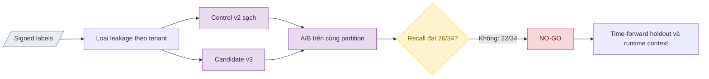

# Phân tích 13 false-negative của representative replay

> **Tài liệu Living Document** — Cập nhật đồng bộ mỗi khi có thay đổi.
> Tuân thủ quy tắc tại `.agents/AGENTS.md` Section 5.

## Tóm tắt (Abstract)

Candidate v2 suffix-debiased giữ representative benign FPR ở `0/25` nhưng chỉ phát hiện `21/34` malicious case tại threshold `0,92`, tạo 13 false-negative. Phân tích `pred_contrib` và bounded Firecrawl cho thấy model domain-only thiếu tín hiệu về redirect, cloaking, security interstitial và exact threat-feed membership; Firecrawl chỉ được dùng làm evidence transport, không làm adjudicator. Vòng A/B ngày 2026-08-24 phát hiện representative packet đã giao với các partition cũ và sửa phép loại leakage theo tenant trên shared hosting, tránh loại nhầm 18.173 train rows. Feature contract v3 bổ sung ba keyword, một brand và ba shared-hosting root có snapshot, đồng thời áp dụng monotone constraint cho `tld_risk_score`; candidate tăng representative recall từ `21/34` lên `22/34`, giữ benign FP `0/25` và SAFE VN runtime-candidate FP `0/1.400`. Kết quả vẫn thấp hơn gate `26/34`; các ablation positive weighting, hard-positive mining và candidate-only training cũng không đạt đồng thời recall/FPR guardrail. Candidate v3 giữ trạng thái private `NO-GO`, không được export, provision hoặc restart vào local staging.

## Sơ đồ Tổng quan

## Phân tích nguyên nhân và phương án remediation

### Mục tiêu (Objectives)

- Xác định nguyên nhân khiến 13 malicious case nằm dưới threshold `0,92` mà không thay đổi evidence hoặc nhãn đã được owner duyệt.
- Phân biệt lỗi quan sát hiện tại của website với lỗi phân loại lexical của model.
- Xây dựng hướng hard-positive độc lập, group-disjoint và không rò rỉ frozen representative set.
- Xác định guardrail bắt buộc trước khi retrain, replay hoặc xem xét restart local staging ở `shadow`.

### Phương pháp & Lý do (Methodology & Rationale)

| Quyết định | Phương pháp chọn | Các phương pháp thay thế | Lý do |
|---|---|---|---|
| Giải thích model | LightGBM `pred_contrib=True`, tách handcrafted và TF-IDF contribution | Chỉ so probability; dùng global feature importance | Contribution theo từng case cho biết feature nào đẩy margin lên hoặc xuống; global importance không giải thích 13 lỗi cụ thể |
| Xác minh trạng thái web | Firecrawl `/v2/scrape`, exact URL, schema-constrained JSON, cache tắt, không crawl/agent | Browser thủ công; Firecrawl Agent/Crawl | Scrape có giới hạn giảm external requests và tạo record checksum-pinned; kết quả extractor không được dùng làm nhãn |
| Ground truth | Giữ quyết định malicious trong owner-approved addendum | Relabel theo website hiện tại; yêu cầu owner review lại toàn bộ | Domain có thể chết, đổi nội dung hoặc chặn crawler sau thời điểm review; trạng thái hiện tại không phủ định bằng chứng lịch sử |
| Remediation dữ liệu | Hard-positive time-forward từ source độc lập, loại toàn bộ representative registrable groups | Đưa chính 13 case vào train; oversample ngẫu nhiên mọi malicious row | Giữ 13 case làm regression độc lập và tránh leakage |
| Remediation kiến trúc | Kết hợp feature v3 có kiểm soát với exact threat-feed/runtime context | Chỉ hạ threshold; đổi ngay model family | Threshold `0,85` vẫn chỉ đạt `25/34` và tạo `1/25` FP; nhiều hành vi không thể suy ra từ hostname |

### Cách thức Thực hiện (Implementation Details)

Phân tích sử dụng model revision `97b2ef1f3f6e77e043b3c26502a919f69fd2ca225140a3b13f4dfbafea3aa691`, feature contract `2.0.0` và threshold `0,92`. Offline probabilities của v1/v2 được nối với 13 label malicious trong owner-approved addendum; LightGBM raw margin được phân rã thành bias, 22 handcrafted feature và 512 TF-IDF feature. Việc tái kiểm tra web chỉ gọi Firecrawl scrape trên exact domain, tắt cache, không dùng crawl hoặc agent, không ghi API key vào request artifact và lưu output trong thư mục Git-ignored.

AI agent sử dụng Codex (GPT-5) với chiến lược đối chiếu ba lớp: signed evidence, model contribution và current scrape. Số subagent là `0`; không dùng voting. Kiểm soát chất lượng gồm SHA-256 verification, schema/result count, feature extraction chạy lại từ snapshot contract và so sánh threshold sweep đã có. Con người giữ vai trò phê duyệt ground truth trong addendum trước đó; vòng phân tích này không tạo yêu cầu review lại 13 domain.

Firecrawl không phải adjudicator. `1xbet-xoso.com` trả nội dung cờ bạc đang hoạt động nhưng extractor ghi `observed_category=benign_content`; `yvan.acces11506256.pro` và `gbeq.netlify.app` cũng nhận category benign khi trang hiện tại bị chặn hoặc trả trạng thái không hoạt động. Các record này chứng minh extractor category có thể sai trong chính cohort đang kiểm tra.

### Số liệu (Metrics & Results)

#### Contribution audit

| Chỉ số | Kết quả |
|---|---:|
| False-negative tại threshold `0,92` | 13/34 malicious case |
| Xác suất giảm từ v1 sang v2 | 8/13 |
| Mean probability v1 | 0,753660 |
| Mean probability v2 | 0,742047 |
| Mean delta v2 − v1 | −0,011613 |
| `tld_risk_score=0` | 13/13 |
| `phishing_keyword_count=0` | 13/13 |
| Shared hosting được nhận diện | 1/13 |
| Brand main/subdomain/homoglyph flag bật | 0/13 |
| TF-IDF contribution âm | 4/13 |
| Handcrafted contribution âm | 2/13 |
| Mean `tld_risk_score` contribution | −0,350826 raw-margin unit |

`tld_risk_score=0` là feature có mean contribution âm lớn nhất trong cohort. Giá trị `0` hiện mang nghĩa “TLD không có trong snapshot rủi ro”, nhưng cây đã học nhánh này như tín hiệu benign mạnh; đây là correlation do phân phối train, không phải bằng chứng rằng TLD phổ biến làm domain an toàn. Feature v3 cần tách `unknown/neutral` khỏi risk flag hoặc điều chỉnh source balancing để nhánh zero không lấn át các tín hiệu khác.

#### Case audit

| Case | Domain | v1 | v2 | Delta | Nhóm nguyên nhân chính | Firecrawl 2026-08-24 |
|---|---|---:|---:|---:|---|---|
| replay-0054 | `litetotolubu.com` | 0,853041 | 0,783453 | −0,069588 | redirect/gambling không được keyword feature nhận diện | live gambling |
| replay-0056 | `mod22.com` | 0,832536 | 0,727916 | −0,104620 | short domain + TDS rotating redirect | fetch lỗi HTTP 500 |
| replay-0071 | `absicherung-kontakt.com` | 0,723373 | 0,836679 | +0,113306 | security-feed evidence, TF-IDF contribution âm | Firecrawl `success=false` |
| replay-0083 | `mcaavoli.com` | 0,816538 | 0,805115 | −0,011423 | ordinary-looking hostname, threat visible qua interstitial | phishing interstitial |
| replay-0097 | `yvan.acces11506256.pro` | 0,871053 | 0,892814 | +0,021760 | numeric/subdomain signal chưa đủ threshold | access blocked; category không tin cậy |
| replay-0099 | `500326.com` | 0,924396 | 0,889313 | −0,035083 | numeric threat từng vượt threshold, phụ thuộc feed/interstitial | Firecrawl `success=false` |
| replay-0108 | `gbeq.netlify.app` | 0,922205 | 0,776493 | −0,145712 | shared-hosting subdomain; suffix debias làm mất signal | access blocked/404 |
| replay-0113 | `pl.spotify-original.com` | 0,427092 | 0,651373 | +0,224281 | brand trong compound registrable label không bật brand flag | phishing interstitial |
| replay-0119 | `1xbet-xoso.com` | 0,800885 | 0,909618 | +0,108734 | gambling token không nằm trong keyword snapshot | live gambling; extractor gọi benign |
| replay-0123 | `axygames.com` | 0,379730 | 0,434954 | +0,055223 | redirect gateway không quan sát được từ hostname | redirect landing |
| replay-0132 | `li88.net` | 0,626056 | 0,611222 | −0,014834 | short numeric gambling domain; handcrafted sum âm | HTTP 403/access blocked |
| replay-0133 | `merrychampionstream.pro` | 0,928835 | 0,874820 | −0,054014 | cloaking; TF-IDF contribution âm | live content, category unknown |
| replay-0135 | `speedingk.com` | 0,692135 | 0,452841 | −0,239293 | threat-feed evidence, lexical n-gram mang tín hiệu benign | Firecrawl `success=false` sau retry |

Giá trị v1 của `500326.com`, `gbeq.netlify.app` và `merrychampionstream.pro` đều từng vượt `0,92` nhưng v2 kéo xuống dưới threshold. Đây là regression do thay đổi phân phối feature, không phải 13 domain mới chưa từng được model nhận diện.

#### Firecrawl refresh

| Chỉ số | Kết quả |
|---|---:|
| Exact domain planned | 13 |
| Schema-valid sau initial + bounded retry | 9/13 |
| Current live content | 3/13 (`litetotolubu.com`, `1xbet-xoso.com`, `merrychampionstream.pro`) |
| Security interstitial | 2/13 |
| Redirect landing | 1/13 |
| Access blocked/404/403 | 3/13 |
| Không lấy được record | 4/13 |
| Crawl/Agent request | 0 |
| API key xuất hiện trong artifact | 0 |

Bốn domain không có current record là `mod22.com`, `absicherung-kontakt.com`, `500326.com` và `speedingk.com`. Các lỗi này được ghi nhận là thiếu current scrape, không phải thiếu ground truth. Hai `results.jsonl` khớp SHA-256 trong manifest tương ứng.

## Thử nghiệm leakage-free feature contract v3

### Mục tiêu (Objectives)

- Loại mọi domain hoặc tenant group trong owner-approved representative packet khỏi train, validation, calibration và test trước khi đo candidate mới.
- So sánh control v2 và candidate v3 trên cùng partition, vocabulary, IDF, seed và threshold `0,92`.
- Kiểm tra liệu feature snapshot có mục tiêu cải thiện 13 false-negative mà không vượt benign guardrail đã khóa.
- Chỉ cho phép restart local staging ở `shadow` khi representative malicious recall đạt tối thiểu `26/34`.

### Phương pháp & Lý do (Methodology & Rationale)

| Quyết định | Phương pháp chọn | Các phương pháp thay thế | Lý do |
|---|---|---|---|
| Đơn vị loại leakage | eTLD+1 cho ordinary domains; tenant label + provider root cho shared hosting | Loại toàn bộ provider root; chỉ loại exact FQDN | Loại provider root làm mất 18.173 train rows; exact FQDN cho phép sibling subdomain cùng tenant rò rỉ. Tenant-aware grouping loại đúng case review nhưng giữ tenant độc lập |
| A/B control | Dựng `v2-leakage-free-control` và v3 từ cùng source partition | So v3 với report v2 cũ | Report cũ đã giao với 137 representative rows theo 135 registrable groups, nên không còn là holdout hợp lệ |
| Feature update | Giữ 534 chiều; snapshot-pin `xbet/casino/slot`, Spotify và ba shared-hosting root | Thêm nhiều keyword; crawl feature; đổi model family | Thay đổi bounded giữ latency/bundle contract; crawl feature không deterministic và không phù hợp DNS-path inference |
| TLD policy | Monotone increasing chỉ cho `tld_risk_score` theo tên feature | Không constraint; raw index vector | Named constraint tránh lệch feature order. Ablation không constraint giảm full-test FP nhưng tạo `1/1.400` SAFE VN candidate FP |
| Positive remediation | Không dùng generic positive reweighting/OHEM sau ablation | Weight toàn bộ malicious candidate; đưa 13 case vào train | Reweighting chỉ đạt `18–19/34`; đưa frozen case vào train làm mất giá trị regression |
| Threshold | Giữ policy `0,92`; validation-only matching được audit riêng | Hạ threshold theo representative/test | Tuning theo frozen packet hoặc final test tạo leakage. Validation-only threshold `0,920459` vẫn không vượt final gate |
| Runtime action | `NO-GO`, không export/restart | Restart local staging ở `shadow` vì benign guardrail xanh | Gate yêu cầu `26/34`; candidate chỉ đạt `22/34`, nên parity/runtime replay không thể thay thế model-quality gate |

Monotone constraint sử dụng cơ chế chính thức của [LightGBM](https://lightgbm.readthedocs.io/en/stable/Parameters.html#monotone_constraints). Việc tách train/validation/calibration/test và không tiếp tục chọn hyperparameter sau final test tuân theo nguyên tắc holdout của [Google Machine Learning](https://developers.google.com/machine-learning/crash-course/overfitting/dividing-datasets). Spotify được thêm bằng snapshot contract với official domain lấy từ [Spotify Support](https://support.spotify.com/us/article/spotify-email-legit/), không suy ra từ Firecrawl output.

### Cách thức Thực hiện (Implementation Details)

`ml/src/training_data.py` đọc checksum của owner-approved labels, canonicalize toàn bộ 137 domain và xây evaluation group. Với shared-hosting provider, group dùng tenant gần provider nhất: `login.victim.weebly.com` ánh xạ thành `victim.weebly.com`; tenant khác trên `weebly.com` vẫn được giữ. Shared-hosting root được sắp xếp theo độ dài giảm dần để kết quả deterministic khi snapshot có suffix lồng nhau. Manifest ghi label SHA-256, shared-hosting snapshot SHA-256, số tenant group và số hàng bị loại theo từng partition.

Feature contract `3.0.0` giữ nguyên 22 handcrafted + 512 TF-IDF features. `snapshot_policy` khai báo chính xác base files, ba keyword extensions (`xbet`, `casino`, `slot`), Spotify brand record và ba roots (`weebly.com`, `weeblysite.com`, `godaddysites.com`). Python builder và Go runtime cùng reject v3 manifest không khớp exact snapshot policy. Training config dùng seed `42`, LightGBM tối đa 1.000 trees, broad benign proxy weight `1,5`, evidence hard-negative weight `3,0` cho 252 rows và monotone increasing constraint theo tên `tld_risk_score`.

Control và candidate được build, validate, train, Platt calibrate và evaluate độc lập. Cả hai có partition SHA-256 giống nhau, feature-name order giống nhau và `idf_by_index` giống nhau. Representative binary subset chỉ được feature-transform sau training. Không có signed evidence nào bị sửa; toàn bộ matrices, models và ablation reports nằm trong `ml/data/derived/` bị Git ignore.

AI agent sử dụng Codex (GPT-5) với chiến lược constraint-first: xác minh leakage và provenance trước, chạy một biến thay đổi cho từng ablation, sau đó áp gate đã ghi trong tài liệu. Số subagent là `0`; không dùng voting. Kiểm soát chất lượng gồm unit tests Python/Go, artifact validator, checksum comparison, full-test/candidate-cohort audit và frozen representative replay. Con người giữ quyền duyệt ground truth; agent chỉ quyết định `NO-GO` theo gate có sẵn và không thay đổi traffic scope.

### Số liệu (Metrics & Results)

#### Integrity và partition

| Chỉ số | Kết quả |
|---|---:|
| Owner-approved evaluation cases | 137 |
| Shared-hosting tenant groups | 17 |
| Evaluation rows loại khỏi train/val/cal/test | 321 / 9 / 13 / 543 |
| Combined challenge + evaluation rows loại | 323 / 9 / 14 / 543 |
| Rows sau loại train/val/cal/test | 1.929.386 / 273.799 / 281.212 / 286.804 |
| Group overlap sau loại | 0 |
| Validator control v2 | 35/35 pass |
| Validator candidate v3 | 35/35 pass |
| A/B partition SHA giống nhau | 4/4 |
| Feature order và IDF giống nhau | pass |

Phép loại cũ theo provider eTLD+1 đã loại 18.173 train rows của representative set. Tenant-aware policy giảm con số này còn 321, nhưng vẫn giữ overlap bằng 0. Đây là thay đổi phương pháp đo có ảnh hưởng lớn hơn mọi hyperparameter ablation trong vòng thử nghiệm.

#### Control v2 và candidate v3 tại threshold `0,92`

| Chỉ số | Control v2 sạch | Candidate v3 | Delta v3 − v2 |
|---|---:|---:|---:|
| Full-test ROC-AUC | 0,9565 | 0,9565 | 0,0000 |
| Full-test PR-AUC | 0,9507 | 0,9503 | −0,0004 |
| Full-test Brier | 0,082046 | 0,081909 | −0,000137 |
| Full-test ECE | 0,008124 | 0,008245 | +0,000121 |
| Full-test FP | 1.501 | 1.545 | +44 |
| Full-test TP | 70.506 | 70.573 | +67 |
| Runtime-candidate FP / 9.504 benign | 168 | 164 | −4 |
| Runtime-candidate TP / 14.572 malicious | 11.278 | 11.256 | −22 |
| Runtime-candidate FPR | 1,7677% | 1,7256% | −0,0421 điểm % |
| Runtime-candidate recall | 77,3950% | 77,2440% | −0,1510 điểm % |
| SAFE VN benign FP / 44.833 | 4 | 2 | −2 |
| SAFE VN candidate FP / 1.400 | 0 | 0 | 0 |
| Representative benign FP / 25 | 0 | 0 | 0 |
| Representative malicious TP / 34 | 21 | 22 | +1 |
| Targeted benign challenge FP / 3 | 0 | 0 | 0 |

V3 đưa `1xbet-xoso.com` từ `0,900078` lên `0,966539` và Spotify compound-domain case từ `0,619158` lên `0,720186`. Mười hai malicious case vẫn dưới threshold. Candidate cải thiện FPR trong runtime-candidate cohort nhưng giảm 22 true positive trên cohort test; mức đổi này không bù được việc thiếu bốn true positive so với gate representative `26/34`.

#### Ablation bị loại

| Ablation | Kết quả chính | Quyết định |
|---|---|---|
| Generic malicious-candidate weight `1,25–2,0` | Representative `18–19/34`; SAFE VN candidate FP `9–16` trong proxy audit | Loại |
| Mined hard-positive/OHEM | Representative `18/34`; SAFE VN candidate FP `5–8` | Loại |
| V3 không monotone | Representative `22/34`; full-test FP `1.456`; SAFE VN candidate FP `1/1.400` | Loại vì phá guardrail targeted benign |
| Candidate-only train/calibration | Tại `0,92`: test candidate TP `11.804`, FP `183`, SAFE VN candidate FP `2`; validation-constrained threshold `0,976108` giảm representative còn `20/34` | Loại |
| Validation-only threshold match | Threshold `0,920459`; representative `22/34`; final full-test FP `1.531` | Không promote; final test không được dùng để tune tiếp |

Kết quả không hỗ trợ restart local staging. Signed packet vẫn là frozen regression; lần phát triển kế tiếp cần một time-forward holdout mới trước khi thử thêm model/data policy.

### Phương án candidate kế tiếp

Candidate kế tiếp cần thực hiện đồng thời ba lớp, theo thứ tự sau:

1. Đóng băng một time-forward holdout mới từ OpenPhish/Phishing Army/verified-online/Hagezi có checksum và collected-at rõ ràng trước khi tiếp tục tuning; loại toàn bộ group của packet hiện tại khỏi mọi partition.
2. Tách hai phép đo: lexical-model generalization trên hostname và end-to-end runtime recall có exact threat-feed membership. Redirect, cloaking và security interstitial thuộc runtime/evidence context, không bị ép thành lexical ground truth.
3. Chỉ thử data/feature policy được định nghĩa trước khi mở holdout mới, ưu tiên categorical TLD state `risky/neutral/unknown` và time-forward ordinary-looking common-TLD threats. Không thêm exact 12 domain còn lại hoặc token chỉ xuất hiện trong frozen packet.

Không chọn phương án chỉ hạ threshold. Sweep hiện tại cho thấy threshold `0,90` đạt `22/34` recall với `0/25` FP; threshold `0,85` đạt `25/34` nhưng tạo `1/25` FP. Candidate mới chỉ được xem xét cho local staging `shadow` khi đạt tối thiểu baseline representative recall `26/34`, giữ representative benign FP `0/25`, targeted benign challenge `0/3`, cross-service probability/response parity trong tolerance `10^-6`, ML errors bằng `0` và enforce promotions bằng `0`.

### Liên kết Artifacts

- Owner-approved labels: `ml/evidence/representative-replay/run-20260823-owner-approved-addendum/`
- Candidate v2 report: `docs/research/ml/suffix-debiased-hard-negative-candidate.md`
- Private contribution report: `ml/data/derived/v2-suffix-debiased-hard-negatives/representative-fn-contributions-00b6bab.json` (Git-ignored; SHA-256 `a3fbd8638121ad638473081dd8e8afaf39d8b4cde7b8fba54f2b18b91806e088`)
- Private initial Firecrawl results: `ml/data/derived/v2-suffix-debiased-hard-negatives/firecrawl-fn-refresh-20260824/results.jsonl` (Git-ignored; SHA-256 `c40b7111c0b20b5218df6cd9e4865a4ae798182494fffc0a55c4195887627866`)
- Private retry Firecrawl results: `ml/data/derived/v2-suffix-debiased-hard-negatives/firecrawl-fn-refresh-20260824-retry1/results.jsonl` (Git-ignored; SHA-256 `d68a1039b330e8a3ca0c30275e297b4fae080b13c9699cddb10c73e76376247a`)
- Feature implementation: `ml/src/build_features.py`
- Leakage policy: `ml/src/training_data.py`
- Control config: `ml/configs/v2-leakage-free-control.json`
- Candidate config: `ml/configs/v3-leakage-free-context.json`
- Feature contracts: `ml/contracts/domain_feature_contract.v2.json`, `ml/contracts/domain_feature_contract.v3.json`
- Private control report: `ml/data/derived/v2-leakage-free-control/models/model_report.json` (Git-ignored; SHA-256 `90f87d51c579e80fccc0c91f0b9a37dcc2ca3da2c307b5867e7ba1aa8663f718`)
- Private candidate report: `ml/data/derived/v3-leakage-free-context/models/model_report.json` (Git-ignored; SHA-256 `062f36178aa6792812a8ff9eab0eb4170d206472ef5b902fe4e27d79ebd45794`)
- Private candidate model: `ml/data/derived/v3-leakage-free-context/models/domain_threat_lgbm_raw.txt` (Git-ignored; SHA-256 `e375ec1720af854362084d509e262dd0c7e1e6e91c48a4cb50060630ab2d463a`)
- Private generic-weight ablation: `ml/data/derived/v2-suffix-debiased-hard-negatives/candidate-positive-ablation-20260824.json` (Git-ignored; SHA-256 `70afbaa09eb98b0b1bd89045a76c1c2afff08cc3f5695e5e485c244aa01a48ac`)
- Private hard-positive ablation: `ml/data/derived/v2-suffix-debiased-hard-negatives/hard-positive-mining-ablation-20260824.json` (Git-ignored; SHA-256 `e6924c03d149455d5228b6b98040fb89314054ba7057c1ef84da7c75b9838b93`)

---

## Lịch sử Thay đổi (Version History)

| Ngày | Thay đổi | Tác giả |
|---|---|---|
| 2026-08-24 | Sửa leakage theo shared-hosting tenant, dựng control v2 sạch, triển khai/evaluate feature contract v3 và ghi nhận quyết định `NO-GO` sau năm ablation | Codex (GPT-5) |
| 2026-08-24 | Phân tích contribution của 13 false-negative, chạy bounded Firecrawl refresh và xác định hướng hard-positive/feature v3 không leakage | Codex (GPT-5) |
