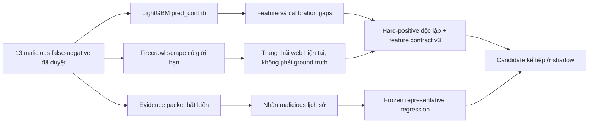

# Phân tích 13 false-negative của representative replay

> **Tài liệu Living Document** — Cập nhật đồng bộ mỗi khi có thay đổi.
> Tuân thủ quy tắc tại `.agents/AGENTS.md` Section 5.

## Tóm tắt (Abstract)

Candidate v2 suffix-debiased giữ representative benign FPR ở `0/25` nhưng chỉ phát hiện `21/34` malicious case tại threshold `0,92`, tạo 13 false-negative. Phân tích `pred_contrib` cho thấy xác suất giảm ở 8/13 case so với v1; trung bình giảm `0,011613`. Cả 13 case có `tld_risk_score=0`, không kích hoạt `phishing_keyword_count`, và không kích hoạt brand flag; chỉ một case được nhận diện là shared hosting. Firecrawl scrape có giới hạn thu được record có schema hợp lệ cho 9/13 domain, nhưng phân loại nội dung của extractor mâu thuẫn với bằng chứng đã duyệt ở một số case, vì vậy kết quả này chỉ được dùng làm evidence transport. Nguyên nhân chính không nằm ở một threshold đơn lẻ: model domain-only thiếu tín hiệu về redirect, cloaking, security interstitial và exact threat-feed membership, đồng thời feature contract hiện tại bỏ sót một số token cờ bạc, brand-in-compound-label và shared-hosting pattern. Candidate v2 tiếp tục ở trạng thái private `NO-GO`; 13 case được giữ nguyên làm frozen regression và không được đưa trực tiếp vào train.

## Sơ đồ Tổng quan

## Phân tích nguyên nhân và phương án remediation

### Mục tiêu (Objectives)

- Xác định nguyên nhân khiến 13 malicious case nằm dưới threshold `0,92` mà không thay đổi evidence hoặc nhãn đã được owner duyệt.
- Phân biệt lỗi quan sát hiện tại của website với lỗi phân loại lexical của model.
- Xây dựng hướng hard-positive độc lập, group-disjoint và không rò rỉ frozen representative set.
- Xác định guardrail bắt buộc trước khi retrain, replay hoặc xem xét restart local staging ở `shadow`.

### Phương pháp & Lý do (Methodology & Rationale)

| Quyết định | Phương pháp chọn | Các phương pháp thay thế | Lý do |
|---|---|---|---|
| Giải thích model | LightGBM `pred_contrib=True`, tách handcrafted và TF-IDF contribution | Chỉ so probability; dùng global feature importance | Contribution theo từng case cho biết feature nào đẩy margin lên hoặc xuống; global importance không giải thích 13 lỗi cụ thể |
| Xác minh trạng thái web | Firecrawl `/v2/scrape`, exact URL, schema-constrained JSON, cache tắt, không crawl/agent | Browser thủ công; Firecrawl Agent/Crawl | Scrape có giới hạn giảm external requests và tạo record checksum-pinned; kết quả extractor không được dùng làm nhãn |
| Ground truth | Giữ quyết định malicious trong owner-approved addendum | Relabel theo website hiện tại; yêu cầu owner review lại toàn bộ | Domain có thể chết, đổi nội dung hoặc chặn crawler sau thời điểm review; trạng thái hiện tại không phủ định bằng chứng lịch sử |
| Remediation dữ liệu | Hard-positive time-forward từ source độc lập, loại toàn bộ representative registrable groups | Đưa chính 13 case vào train; oversample ngẫu nhiên mọi malicious row | Giữ 13 case làm regression độc lập và tránh leakage |
| Remediation kiến trúc | Kết hợp feature v3 có kiểm soát với exact threat-feed/runtime context | Chỉ hạ threshold; đổi ngay model family | Threshold `0,85` vẫn chỉ đạt `25/34` và tạo `1/25` FP; nhiều hành vi không thể suy ra từ hostname |

### Cách thức Thực hiện (Implementation Details)

Phân tích sử dụng model revision `97b2ef1f3f6e77e043b3c26502a919f69fd2ca225140a3b13f4dfbafea3aa691`, feature contract `2.0.0` và threshold `0,92`. Offline probabilities của v1/v2 được nối với 13 label malicious trong owner-approved addendum; LightGBM raw margin được phân rã thành bias, 22 handcrafted feature và 512 TF-IDF feature. Việc tái kiểm tra web chỉ gọi Firecrawl scrape trên exact domain, tắt cache, không dùng crawl hoặc agent, không ghi API key vào request artifact và lưu output trong thư mục Git-ignored.

AI agent sử dụng Codex (GPT-5) với chiến lược đối chiếu ba lớp: signed evidence, model contribution và current scrape. Số subagent là `0`; không dùng voting. Kiểm soát chất lượng gồm SHA-256 verification, schema/result count, feature extraction chạy lại từ snapshot contract và so sánh threshold sweep đã có. Con người giữ vai trò phê duyệt ground truth trong addendum trước đó; vòng phân tích này không tạo yêu cầu review lại 13 domain.

Firecrawl không phải adjudicator. `1xbet-xoso.com` trả nội dung cờ bạc đang hoạt động nhưng extractor ghi `observed_category=benign_content`; `yvan.acces11506256.pro` và `gbeq.netlify.app` cũng nhận category benign khi trang hiện tại bị chặn hoặc trả trạng thái không hoạt động. Các record này chứng minh extractor category có thể sai trong chính cohort đang kiểm tra.

### Số liệu (Metrics & Results)

#### Contribution audit

| Chỉ số | Kết quả |
|---|---:|
| False-negative tại threshold `0,92` | 13/34 malicious case |
| Xác suất giảm từ v1 sang v2 | 8/13 |
| Mean probability v1 | 0,753660 |
| Mean probability v2 | 0,742047 |
| Mean delta v2 − v1 | −0,011613 |
| `tld_risk_score=0` | 13/13 |
| `phishing_keyword_count=0` | 13/13 |
| Shared hosting được nhận diện | 1/13 |
| Brand main/subdomain/homoglyph flag bật | 0/13 |
| TF-IDF contribution âm | 4/13 |
| Handcrafted contribution âm | 2/13 |
| Mean `tld_risk_score` contribution | −0,350826 raw-margin unit |

`tld_risk_score=0` là feature có mean contribution âm lớn nhất trong cohort. Giá trị `0` hiện mang nghĩa “TLD không có trong snapshot rủi ro”, nhưng cây đã học nhánh này như tín hiệu benign mạnh; đây là correlation do phân phối train, không phải bằng chứng rằng TLD phổ biến làm domain an toàn. Feature v3 cần tách `unknown/neutral` khỏi risk flag hoặc điều chỉnh source balancing để nhánh zero không lấn át các tín hiệu khác.

#### Case audit

| Case | Domain | v1 | v2 | Delta | Nhóm nguyên nhân chính | Firecrawl 2026-08-24 |
|---|---|---:|---:|---:|---|---|
| replay-0054 | `litetotolubu.com` | 0,853041 | 0,783453 | −0,069588 | redirect/gambling không được keyword feature nhận diện | live gambling |
| replay-0056 | `mod22.com` | 0,832536 | 0,727916 | −0,104620 | short domain + TDS rotating redirect | fetch lỗi HTTP 500 |
| replay-0071 | `absicherung-kontakt.com` | 0,723373 | 0,836679 | +0,113306 | security-feed evidence, TF-IDF contribution âm | Firecrawl `success=false` |
| replay-0083 | `mcaavoli.com` | 0,816538 | 0,805115 | −0,011423 | ordinary-looking hostname, threat visible qua interstitial | phishing interstitial |
| replay-0097 | `yvan.acces11506256.pro` | 0,871053 | 0,892814 | +0,021760 | numeric/subdomain signal chưa đủ threshold | access blocked; category không tin cậy |
| replay-0099 | `500326.com` | 0,924396 | 0,889313 | −0,035083 | numeric threat từng vượt threshold, phụ thuộc feed/interstitial | Firecrawl `success=false` |
| replay-0108 | `gbeq.netlify.app` | 0,922205 | 0,776493 | −0,145712 | shared-hosting subdomain; suffix debias làm mất signal | access blocked/404 |
| replay-0113 | `pl.spotify-original.com` | 0,427092 | 0,651373 | +0,224281 | brand trong compound registrable label không bật brand flag | phishing interstitial |
| replay-0119 | `1xbet-xoso.com` | 0,800885 | 0,909618 | +0,108734 | gambling token không nằm trong keyword snapshot | live gambling; extractor gọi benign |
| replay-0123 | `axygames.com` | 0,379730 | 0,434954 | +0,055223 | redirect gateway không quan sát được từ hostname | redirect landing |
| replay-0132 | `li88.net` | 0,626056 | 0,611222 | −0,014834 | short numeric gambling domain; handcrafted sum âm | HTTP 403/access blocked |
| replay-0133 | `merrychampionstream.pro` | 0,928835 | 0,874820 | −0,054014 | cloaking; TF-IDF contribution âm | live content, category unknown |
| replay-0135 | `speedingk.com` | 0,692135 | 0,452841 | −0,239293 | threat-feed evidence, lexical n-gram mang tín hiệu benign | Firecrawl `success=false` sau retry |

Giá trị v1 của `500326.com`, `gbeq.netlify.app` và `merrychampionstream.pro` đều từng vượt `0,92` nhưng v2 kéo xuống dưới threshold. Đây là regression do thay đổi phân phối feature, không phải 13 domain mới chưa từng được model nhận diện.

#### Firecrawl refresh

| Chỉ số | Kết quả |
|---|---:|
| Exact domain planned | 13 |
| Schema-valid sau initial + bounded retry | 9/13 |
| Current live content | 3/13 (`litetotolubu.com`, `1xbet-xoso.com`, `merrychampionstream.pro`) |
| Security interstitial | 2/13 |
| Redirect landing | 1/13 |
| Access blocked/404/403 | 3/13 |
| Không lấy được record | 4/13 |
| Crawl/Agent request | 0 |
| API key xuất hiện trong artifact | 0 |

Bốn domain không có current record là `mod22.com`, `absicherung-kontakt.com`, `500326.com` và `speedingk.com`. Các lỗi này được ghi nhận là thiếu current scrape, không phải thiếu ground truth. Hai `results.jsonl` khớp SHA-256 trong manifest tương ứng.

### Phương án candidate kế tiếp

Candidate kế tiếp cần thực hiện đồng thời ba lớp, theo thứ tự sau:

1. Tạo malicious hard-positive cohort time-forward từ OpenPhish/Phishing Army/verified-online/Hagezi đã checksum-pin. Cohort phải group-disjoint theo registrable domain, loại toàn bộ 137 representative case, ba frozen benign challenge và mọi registrable group liên quan.
2. Chia cohort độc lập thành bốn strata: ordinary-looking common-TLD threats; short/numeric/gambling domains; shared-hosting subdomains; brand token nằm trong compound label. Mỗi stratum phải có provenance/source distribution riêng và một holdout time-forward không tham gia train.
3. Thử feature contract v3: chuyển TLD thành categorical state `risky/neutral/unknown`; mở rộng keyword snapshot với token có provenance và test collision benign; nhận diện brand token trong hyphenated compound label; audit shared-hosting suffix theo Mozilla PSL. Exact threat-feed membership, redirect và security-interstitial evidence phải ở policy/runtime context, không ép lexical model tự suy ra nội dung website.

Không chọn phương án chỉ hạ threshold. Sweep hiện tại cho thấy threshold `0,90` đạt `22/34` recall với `0/25` FP; threshold `0,85` đạt `25/34` nhưng tạo `1/25` FP. Candidate mới chỉ được xem xét cho local staging `shadow` khi đạt tối thiểu baseline representative recall `26/34`, giữ representative benign FP `0/25`, targeted benign challenge `0/3`, cross-service probability/response parity trong tolerance `10^-6`, ML errors bằng `0` và enforce promotions bằng `0`.

### Liên kết Artifacts

- Owner-approved labels: `ml/evidence/representative-replay/run-20260823-owner-approved-addendum/`
- Candidate v2 report: `docs/research/ml/suffix-debiased-hard-negative-candidate.md`
- Private contribution report: `ml/data/derived/v2-suffix-debiased-hard-negatives/representative-fn-contributions-00b6bab.json` (Git-ignored; SHA-256 `a3fbd8638121ad638473081dd8e8afaf39d8b4cde7b8fba54f2b18b91806e088`)
- Private initial Firecrawl results: `ml/data/derived/v2-suffix-debiased-hard-negatives/firecrawl-fn-refresh-20260824/results.jsonl` (Git-ignored; SHA-256 `c40b7111c0b20b5218df6cd9e4865a4ae798182494fffc0a55c4195887627866`)
- Private retry Firecrawl results: `ml/data/derived/v2-suffix-debiased-hard-negatives/firecrawl-fn-refresh-20260824-retry1/results.jsonl` (Git-ignored; SHA-256 `d68a1039b330e8a3ca0c30275e297b4fae080b13c9699cddb10c73e76376247a`)
- Feature implementation: `ml/src/build_features.py`
- Feature contract: `ml/contracts/domain_feature_contract.v2.json`

---

## Lịch sử Thay đổi (Version History)

| Ngày | Thay đổi | Tác giả |
|---|---|---|
| 2026-08-24 | Phân tích contribution của 13 false-negative, chạy bounded Firecrawl refresh và xác định hướng hard-positive/feature v3 không leakage | Codex (GPT-5) |
