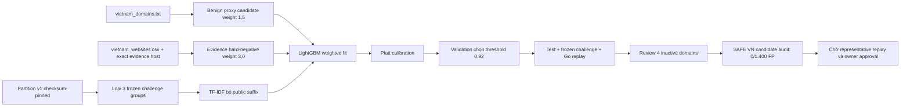

# Candidate TF-IDF phi suffix và hard-negative có trọng số

> **Tài liệu Living Document** — Cập nhật đồng bộ mỗi khi có thay đổi.
> Tuân thủ quy tắc tại `.agents/AGENTS.md` Section 5.

## Tóm tắt (Abstract)

Model v1 đưa toàn bộ FQDN vào character TF-IDF nên vocabulary học được n-gram của public suffix và nguồn dữ liệu, trong đó feature liên quan `.vn` có contribution lớn trên ba false positive đã được owner xác nhận. Candidate v2 loại public suffix theo Mozilla Public Suffix List khỏi riêng TF-IDF input nhưng giữ nguyên 22 handcrafted features. Training bổ sung hai tầng benign proxy: 11.115 ML-candidate từ source Việt Nam checksum-pinned có weight `1,5`, trong đó 252 record có evidence host chính thức nhận weight `3,0`. Ba domain human-reviewed bị loại theo registrable-domain group khỏi train, validation, calibration và test trước khi trở thành frozen challenge. Tại operating point `0,92` chọn trên validation, held-out runtime-candidate FPR giảm từ `2,3990%` xuống `1,6835%`, còn recall tăng từ `75,3996%` lên `77,0735%`; frozen challenge giảm từ `3/3` false positive xuống `0/3`. Owner review sau đó xác định bốn SAFE VN candidate còn lại đều chưa cấp phát và trả NXDOMAIN, nên chúng được ghi `unknown/unresolved` và tách khỏi benign FPR: audit hiệu chỉnh đạt `0/1.400` runtime-candidate FP mà không retrain model. Candidate chưa mở staging hoặc `enforce`; bước còn lại là representative regression replay và phê duyệt của owner.

## Sơ đồ Tổng quan



## Candidate A+B

### Mục tiêu (Objectives)

1. Loại TLD/source bias khỏi 512 character TF-IDF features mà không thay semantics của bundle v1 đang chạy.
2. Tăng ảnh hưởng của benign ML-candidate có provenance nhưng không trình bày list membership như human ground truth.
3. Ngăn train–test leakage bằng cách giữ ba domain owner-reviewed làm frozen challenge tách biệt.
4. Chọn operating threshold theo candidate-cohort false-positive budget trên validation, sau đó chỉ dùng test và frozen challenge để audit.
5. Xác minh bundle candidate bằng Go loader, checksum, core/DNS probability parity và shadow replay local; không provision hoặc thay runtime.

### Phương pháp & Lý do (Methodology & Rationale)

| Quyết định | Phương pháp chọn | Các phương pháp thay thế | Lý do |
|---|---|---|---|
| TF-IDF input | Giữ mọi label trước complete PSL suffix; `login.example.gov.vn` thành `login.example` | Dùng full FQDN; chỉ bỏ TLD cuối; bỏ toàn bộ TF-IDF | Complete suffix xử lý đúng `gov.vn`, `co.uk` và private suffix; handcrafted features vẫn giữ cấu trúc/TLD risk |
| Tương thích runtime | Manifest `1.0.0` mặc định `domain_ascii`; manifest `2.0.0` bắt buộc `domain_without_public_suffix` | Đổi âm thầm semantics của v1 | Bundle cũ giữ prediction contract; bundle v2 thiếu input view bị Go loader từ chối |
| Hard-negative | Hai tầng weight: source proxy `1,5`, exact official evidence `3,0` | Weight mọi whitelist như nhau; chỉ train ba challenge case; weight lớn hơn `10` | Trọng số phản ánh strength của provenance; ba challenge case không được dùng để fit |
| Frozen challenge | Loại cả registrable-domain group khỏi bốn partition | Chỉ xóa exact row khỏi train; đưa case vào train rồi test lại | Group exclusion ngăn biến thể subdomain hoặc duplicate source rò rỉ vào model |
| Threshold | Chọn `0,92` trên validation vì đồng thời giảm candidate FPR và tăng candidate recall so với v1/`0,85` | Giữ `0,85`; chọn threshold theo test; tối ưu accuracy tổng | Xác suất sau retraining/calibration không giữ nguyên scale; test phải tiếp tục là held-out audit |
| Model family | Giữ LightGBM 534 features | Transformer/LLM; deep character CNN | Failure mode nằm ở input bias và label weighting; thay model family tăng latency và deployment complexity trước khi chứng minh lợi ích |
| Trạng thái rollout | Giữ candidate private cho đến khi representative replay và owner approval hoàn tất | Provision ngay vào local staging; bật canary | SAFE VN runtime-candidate audit đã đạt `0/1.400` sau review, nhưng một proxy cohort không thay thế regression replay hoặc phê duyệt rollout |

### Cách thức Thực hiện (Implementation Details)

`ml/src/build_features.py` đọc `input_view` từ feature contract. Hàm transform dùng complete suffix do PSL trả về; nếu wildcard/private rule coi toàn bộ hostname là suffix, TF-IDF nhận document rỗng thay vì phát sinh chuỗi sai. Python multiprocessing thu chunk bằng ordered `executor.map`, qua đó giữ alignment giữa feature matrix và label rows; cách thu cũ bằng `as_completed` có thể đảo thứ tự chunk.

`ml/src/training_data.py` xác minh byte size và SHA-256 của `vietnam_websites.csv` theo `ml/data/data_manifest.json`, chỉ chấp nhận exact host `tinnhiemmang.vn` hoặc `giayphep.abei.gov.vn`, rồi giao với benign `vietnam_whitelist` ML-candidate đã thuộc train. Tập evidence có 252 row. Training policy đồng thời gán weight `1,5` cho 11.115 benign proxy candidate của source checksum-pinned; 252 evidence rows giữ weight lớn hơn là `3,0` bằng phép `max`, không bị tier yếu ghi đè.

`ml/src/train_lightgbm.py` truyền `sample_weight` cho Logistic Regression và LightGBM, đồng thời truyền validation weights vào early stopping. `ml/src/evaluate_model.py` báo riêng full-test metrics, runtime candidate metrics, SAFE VN candidate metrics và frozen challenge; các mẫu số không bị trộn. `internal/analysis/features.go` hỗ trợ song song contract v1/v2 và có test suffix invariance giữa `.com`/`.net`.

Addendum ngày 2026-08-24 ghi bốn domain theo đúng quyết định human-in-the-loop: `human_label=unknown`, `review_outcome=unresolved`, evidence là kết quả chưa cấp phát từ cổng tra cứu tên miền `.vn` và DNS NXDOMAIN. Evaluator xác minh checksum, trường review bắt buộc, canonical domain duy nhất và exact match với SAFE VN benign test cohort. Bốn row vẫn xuất hiện trong report cùng probability và `would_block`, nhưng được tách khỏi riêng SAFE VN benign denominator; candidate-cohort tổng, partition, model weights và bundle không thay đổi. Cách xử lý này tránh biến whitelist lịch sử hoặc domain chết thành ground truth benign.

Exporter private từng bị Go loader từ chối vì `SHA256SUMS` băm CRLF trong khi runtime chuẩn hóa LF. `ml/src/export_artifacts.py` hiện canonicalize CRLF thành LF trước SHA-256; regression test chứng minh file CRLF và LF tạo cùng digest. Policy timestamp được pin qua candidate config nên hai lần export liên tiếp tạo cùng `SHA256SUMS`. Replay service đặt `DisableAdblockSync=true`, ngăn background feed HTTP trong phép đo local cô lập. Các thay đổi không sửa `ml/models/v1/` hoặc signed evidence.

Codex (GPT-5) thực hiện khảo sát contribution, sửa feature/training/runtime contract, chạy rebuild, calibration, evaluation và replay theo chiến lược contract-first rồi leakage-first. Số lượng subagent là `0`; không áp dụng bỏ phiếu. Cơ chế kiểm soát chất lượng gồm unit test Python/Go, artifact validator, checksum gate, group-disjoint assertion, held-out evaluation và core/DNS replay. Human-in-the-loop đã cung cấp ba nhãn benign/false-positive cùng bốn quyết định unknown/unresolved; owner vẫn chịu trách nhiệm phê duyệt threshold hoặc rollout. AI agent không nâng benign proxy hay domain bất hoạt thành human-labelled benign.

Quy trình tái lập local:

```powershell
python -B ml/src/build_features.py `
  --config ml/configs/v2-suffix-debiased-hard-negatives.json `
  --num-workers 8

python -B ml/src/validate_artifacts.py `
  --derived-dir ml/data/derived/v2-suffix-debiased-hard-negatives

python -B ml/src/train_lightgbm.py `
  --config ml/configs/v2-suffix-debiased-hard-negatives.json
python -B ml/src/calibrate_model.py `
  --config ml/configs/v2-suffix-debiased-hard-negatives.json
python -B ml/src/evaluate_model.py `
  --config ml/configs/v2-suffix-debiased-hard-negatives.json
python -B ml/src/export_artifacts.py `
  --config ml/configs/v2-suffix-debiased-hard-negatives.json
```

### Số liệu (Metrics & Results)

#### Data và provenance gates

| Chỉ số | Kết quả |
|---|---:|
| Tổng partition rows sau exclusion | 2.772.087 |
| Train / validation / calibration / test | 1.929.707 / 273.808 / 281.225 / 287.347 |
| Frozen challenge | 3 domain / 3 registrable groups |
| Row bị loại khỏi train / calibration | 2 / 1 |
| Group overlap sau exclusion | 0 |
| Source benign proxy ML-candidate | 11.115 row, weight `1,5` |
| Exact-evidence hard-negative | 252 row, weight `3,0` |
| Evidence source rows qua exact-host gate | 10.313 row |
| Artifact validator | 33/33 checks pass |
| Feature build | 1.989,62 giây, peak Python allocation 2.599,75 MB, 8 workers |

#### Operating point chọn trên validation

| Model / threshold | Benign candidate FP | Candidate FPR | Malicious candidate TP | Candidate recall |
|---|---:|---:|---:|---:|
| v1 / `0,85` | 341/11.032 | 3,0910% | 11.175/15.325 | 72,9201% |
| v2 A+B / `0,92` | 221/11.032 | 2,0033% | 11.576/15.325 | 75,5367% |

Threshold `0,92` giảm validation candidate FPR `1,0877` điểm phần trăm và tăng recall `2,6166` điểm phần trăm so với operating point v1. Test không tham gia quyết định threshold.

#### Held-out test và critical benign audits

| Chỉ số | v1 / `0,85` | v2 A+B / `0,92` | Chênh lệch |
|---|---:|---:|---:|
| Runtime-candidate FPR | 228/9.504 = 2,3990% | 160/9.504 = 1,6835% | giảm 29,82% tương đối |
| Runtime-candidate recall | 10.991/14.577 = 75,3996% | 11.235/14.577 = 77,0735% | tăng 1,6739 điểm % |
| Full-test FPR | 2,1572% | 0,9796% | giảm 1,1777 điểm % |
| Full-test recall | 61,9551% | 52,5167% | giảm 9,4384 điểm %; không phải runtime candidate denominator |
| SAFE VN toàn tập, raw proxy | 0/44.840 | 6/44.840 = 0,0134% | gồm 4 domain bất hoạt chưa cấp phát |
| SAFE VN toàn tập, sau review | 0/44.840 | 2/44.836 = 0,0045% | tách 4 unknown/unresolved; không đổi nhãn model |
| SAFE VN runtime candidates, raw proxy | 0/1.404 | 4/1.404 = 0,2849% | cả 4 đều chưa cấp phát và NXDOMAIN |
| SAFE VN runtime candidates, sau review | 0/1.404 | 0/1.400 = 0% | đạt zero-event trên cohort đủ điều kiện hiện tại |
| `gov.vn`/`edu.vn` benign | 0/5.247 | 0/5.247 | không đổi |
| Frozen owner-reviewed challenge | 3/3 FP | 0/3 FP | failure mode mục tiêu đã được xử lý |

Ba challenge probabilities của v2 lần lượt là `0,037593`, `0,034868` và `0,081794`, thấp hơn threshold `0,92`. Kết quả này không chứng minh production FPR vì cohort chỉ có ba case được chọn có chủ đích.

#### Bundle và Go shadow replay

| Chỉ số | Kết quả |
|---|---:|
| Model version | `2.0.0-candidate` |
| Model revision | `97b2ef1f3f6e77e043b3c26502a919f69fd2ca225140a3b13f4dfbafea3aa691` |
| `SHA256SUMS` SHA-256 | `216f4389f168a72828ceef5e1abcd7d5c8044e876d9651905042a4e22d328d40` |
| Threshold | `0,92` |
| Model text size | 3.610.862 byte |
| Replay | 3 case × 3 round × 2 service |
| Offline/runtime probability mismatch | 0 / 0, tolerance `10^-6` |
| Response mismatch | 0/9 |
| Core/DNS errors | 0 / 0 |
| Enforce promotions | 0 |
| Latency p95 | 2.000 µs trên mỗi service, N = 9 |
| Frozen challenge FPR trong Go replay | 0/3 |

### Giới hạn và bước tối ưu tiếp theo

- Bốn SAFE VN runtime candidates vượt `0,92` đã được owner xác định là chưa cấp phát/NXDOMAIN. Chúng không phải false positive đã xác nhận và không được đưa vào train; addendum giữ chúng ở trạng thái `unknown/unresolved` để audit có thể tái kiểm chứng.
- `terms_review_id` của source vẫn là `pending-review`. Weight `1,5` giới hạn ảnh hưởng của tier này nhưng không giải quyết terms provenance cho production release.
- Full-test recall giảm vì model không được gọi cho lexical non-candidates trong runtime. Model selection phải ưu tiên candidate denominator, nhưng lexical gate vẫn cần audit riêng để phát hiện malicious non-candidate false negatives.
- Lần replay hiện dùng classifier/service objects local, chưa provision bundle vào Docker staging. Representative regression phải được chạy lại trên addendum và commit mới trước khi owner xem xét cho phép rebuild/restart staging ở `shadow`; `enforce` vẫn cần xác nhận riêng.
- Model family chưa cần đổi. Nếu hard-negative feedback tiếp tục không giảm critical benign FPR, phương án tiếp theo là thêm một feature contract v3 có suffix category được regularize rõ ràng hoặc adversarial source balancing; không đưa public suffix trở lại TF-IDF vocabulary.

### Liên kết Artifacts

- Feature contract: `ml/contracts/domain_feature_contract.v2.json`
- Candidate config: `ml/configs/v2-suffix-debiased-hard-negatives.json`
- Feature builder: `ml/src/build_features.py`
- Training provenance: `ml/src/training_data.py`
- Weighted training: `ml/src/train_lightgbm.py`
- Evaluation: `ml/src/evaluate_model.py`
- Runtime transform: `internal/analysis/features.go`
- Frozen challenge: `ml/evidence/whitelist-proxy-review/run-20260823-owner-reviewed-addendum/`
- Reviewed stale-domain addendum: `ml/evidence/whitelist-proxy-review/run-20260824-owner-reviewed-stale-addendum/`
- Private generated root: `ml/data/derived/v2-suffix-debiased-hard-negatives/` (Git-ignored)

---

## Lịch sử Thay đổi (Version History)

| Ngày | Thay đổi | Tác giả |
|---|---|---|
| 2026-08-24 | Ghi nhận 4 domain chưa cấp phát/NXDOMAIN, tách unknown/unresolved khỏi SAFE VN benign FPR và audit lại đạt 0/1.400 runtime-candidate FP | Codex (GPT-5) |
| 2026-08-23 | Triển khai suffix-debiased TF-IDF, tiered hard-negative, frozen challenge, threshold selection và Go bundle replay | Codex (GPT-5) |
