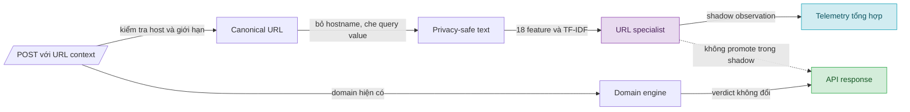

# V10 — URL-aware Signal Round

> **Tài liệu Living Document** — Cập nhật đồng bộ mỗi khi contract, evidence hoặc trạng thái rollout thay đổi.
> Tuân thủ quy tắc tại `.agents/AGENTS.md` Section 5.

## Tóm tắt (Abstract)

V10 mở rộng `POST /v1/analyze` bằng URL context tùy chọn sau khi nhánh domain-only v4–v9 không vượt gate representative `26/34`. Candidate kết hợp domain model v3 với URL specialist tuyến tính, trong khi hostname bị loại khỏi vector học máy và giá trị query được chuyển thành shape token. Dữ liệu được chia theo registrable domain, loại toàn bộ group đã xuất hiện trong baseline, frozen evidence và các vòng trước; cả mười phép kiểm tra overlap đều bằng `0`. Trên final source-disjoint gồm `179` malicious URL và `500` benign URL, candidate tăng từ `118` lên `151` malicious true positive mà không thêm benign false positive. Go runtime đạt parity trên `12` golden vector, không thực hiện network fetch và giữ nguyên quyết định domain-only khi URL thiếu hoặc parse lỗi. Candidate mang trạng thái `OFFLINE_ELIGIBLE_URL_SHADOW_CANDIDATE`; cấu hình runtime vẫn mặc định `disabled`, chưa restart service, chưa đổi traffic scope và chưa bật `enforce`.

## Sơ đồ Tổng quan

Sơ đồ trả lời câu hỏi: URL context đi qua những lớp nào mà không thay đổi tuyến DNS/domain-only?

## V10 — Đột phá tín hiệu URL-aware

### Mục tiêu (Objectives)

- Tạo signal mới từ path, query shape và caller-observed redirect chain, không tuning trực tiếp theo frozen representative cases.
- Tăng malicious true positive trên fresh, source-disjoint evidence với incremental benign false positive bằng `0`.
- Giữ xác suất và quyết định domain-only không đổi; lỗi URL phải fail-open về kết quả domain hiện có.
- Chuẩn bị native Go runtime cho shadow, không mở network I/O, không lưu raw URL và không hỗ trợ `enforce` trong vòng này.

### Phương pháp & Lý do (Methodology & Rationale)

| Quyết định | Phương pháp chọn | Các phương pháp thay thế | Lý do |
|---|---|---|---|
| Tín hiệu | URL/path/query-shape specialist | Tuning thêm domain v3; DNS liveness; source-adversarial neural model | V4–v9 đã cho thấy domain-only và DNS specialist không đạt precision gate; URL context bổ sung thông tin khác loại mà không sửa frozen labels |
| Representation | `18` handcrafted feature cùng character TF-IDF `8.192` chiều | Raw hostname TF-IDF; embedding/contrastive encoder | Loại hostname ngăn specialist học lại source/domain identity; linear sparse model có native Go inference nhỏ, dễ audit và không thêm neural runtime |
| Query handling | Giữ key, thay value bằng shape token | Giữ raw query; bỏ toàn bộ query | Raw value có rủi ro chứa token/PII; bỏ query làm mất cấu trúc hữu ích như độ dài, kiểu số và entropy |
| Data split | Source-disjoint final và group-disjoint theo registrable domain | Random row split; mở lại representative packet | Random split làm cùng site xuất hiện ở nhiều partition; representative packet không có path/redirect nên không đo đúng contract mới |
| Runtime | Optional, `disabled` mặc định, chỉ cho phép `shadow` | Enforce trực tiếp; fetch URL phía server | Shadow thu evidence mà không đổi verdict; server-side fetch tạo SSRF, latency và provenance ambiguity |
| Benign source | UCI PhiUSIIL legitimate subset | Common Crawl URL Index; popularity list | Common Crawl bị lỗi TLS cục bộ trước snapshot; UCI có provenance, license và label rõ, còn popularity list không cung cấp URL path/query đủ giàu |

Protocol được khóa trước selection tại `ml/configs/v10-url-aware-signal-protocol.json`. Lần thu Common Crawl thất bại trước khi tạo data product, prediction hoặc metric và được ghi trong `ml/experiments/v10-url-aware-collection-attempt.json`; thay đổi duy nhất là benign source. Split, feature, estimator, gate và forbidden-input policy được giữ nguyên.

### Cách thức Thực hiện (Implementation Details)

Pipeline snapshot loại `2.022.301` group từng xuất hiện trong baseline, signed/frozen evidence hoặc experiment cũ. Adaptation sử dụng Phishing.Database active URLs; final malicious sử dụng OpenPhish community feed; benign sử dụng legitimate subset của UCI PhiUSIIL. Seed được cố định theo protocol và SHA-256 của raw source, cohort, report và model được lưu trong manifests.

Selection chỉ train một candidate: standardized handcrafted features kết hợp character TF-IDF, linear SGD classifier và Platt calibration. Threshold `0,18363410163105026` được chọn trên threshold partition theo pre-registered zero-added-benign-FP gate, sau đó kiểm tra một lần trên development và final. `forbidden_inputs_read` bằng danh sách rỗng trong selection report.

Exporter chuyển vocabulary, IDF, scaler, linear coefficients và calibration sang JSON bundle có checksum. Native Go classifier canonicalize URL, chỉ nhận HTTP/HTTPS, giới hạn URL `4.096` byte và redirect chain `5` phần tử, từ chối credentials, yêu cầu canonical host trùng domain được phân tích và không import HTTP client. TF-IDF inference dùng sparse sorted entries; benchmark local Windows/amd64 sau tối ưu ghi nhận `31.342 ns/op`, `10.702 B/op` và `73 allocs/op` với `200` iterations.

`POST /v1/analyze` nhận `requested_url` và `redirect_chain`; GET và DNS không dùng URL context. Shadow observation không sửa verdict, score hoặc cache key. Response/telemetry chỉ chứa revision, probability, decision, trạng thái và lý do tổng hợp; raw URL và raw query value không được phản hồi. `SAFE_ZONE_URL_ML_MODE` chỉ chấp nhận `disabled` hoặc `shadow`, mặc định `disabled`; giá trị `enforce` bị từ chối ở startup.

AI agent sử dụng Codex (GPT-5) với chiến lược protocol-first: khóa hypothesis/gate, freeze group-disjoint evidence, selection một candidate, mở final một lần, rồi mới export/integrate. Số lượng subagent là `0`; không có voting. Kiểm soát chất lượng dựa trên checksum, forbidden-input audit, golden parity, tamper test, behavior test, full Go/Python suites, race detector, `go vet` và Compose validation. Người dùng phê duyệt mở rộng URL-aware; không có push, deploy, restart, traffic-scope change hoặc enforce action.

### Số liệu (Metrics & Results)

#### Dataset và leakage control

| Partition | Rows | Benign / malicious | Groups |
|---|---:|---:|---:|
| Adaptation train | 10.000 | 5.000 / 5.000 | 9.209 |
| Calibration | 2.000 | 1.000 / 1.000 | 1.738 |
| Threshold | 2.000 | 1.000 / 1.000 | 1.858 |
| Development | 2.000 | 1.000 / 1.000 | 1.767 |
| Final | 679 | 500 / 179 | 657 |

Cả `10/10` cặp partition có group overlap bằng `0`. UCI raw corpus có `235.795` hàng, trong đó `134.850` legitimate; sau exclusion còn `116.315` benign URL đủ điều kiện. OpenPhish final có `179` URL đủ điều kiện sau exclusion, nên final malicious size thấp hơn mục tiêu trần `250` nhưng không được bù từ adaptation source.

#### Selection và final

| Cohort | Domain v3 TP / FP | Combined TP / FP | Incremental TP / FP |
|---|---:|---:|---:|
| Threshold, 1.000 malicious + 1.000 benign | 471 / 62 | 914 / 62 | +443 / 0 |
| Development, 1.000 malicious + 1.000 benign | 433 / 52 | 907 / 52 | +474 / 0 |
| Final, 179 malicious + 500 benign | 118 / 37 | 151 / 37 | +33 / 0 |

URL specialist nhận riêng `76/179` malicious final URL và `0/500` benign URL tại threshold đã khóa. Domain-only probability parity, domain-only decision parity và parse-failure fallback đều đạt. Final report đặt trạng thái `OFFLINE_ELIGIBLE_URL_SHADOW_CANDIDATE`.

Representative malicious vẫn là `22/34` cho domain-only v3/v7. Packet này chỉ chứa domain, không chứa caller-observed URL/path/redirect context, nên V10 không đọc hoặc phát sinh score representative mới. Vì vậy `+33 TP / +0 FP` là evidence của product route URL-aware, không phải tuyên bố gate domain-only đã tăng thành `26/34`.

#### Kiểm chứng implementation

| Gate local | Kết quả |
|---|---|
| `go test ./...` | PASS trên toàn bộ package |
| `go test -race ./internal/analysis ./internal/risk` | PASS |
| `go vet ./...` | PASS |
| `python -m pytest ml` | `76 passed` trong `3,48 s` |
| `docker compose config --quiet` | PASS |
| Native golden parity | `12/12` vector PASS; tampered checksum bị từ chối |
| URL privacy/security audit | Không HTTP client trong classifier; response test không chứa raw URL/query secret |

### Trade-off và Rủi ro Còn lại

- Lợi ích chỉ xuất hiện khi client gửi URL context qua POST. DNS, GET và request chỉ có domain giữ nguyên hành vi cũ.
- Final source-disjoint kiểm tra source transfer tốt hơn random split, nhưng `179` malicious URL và benign proxy UCI chưa thay thế telemetry traffic thật. Giá trị `37/500` benign FP vốn đến từ domain v3 cũng cho thấy combined route chưa giải quyết false positive nền.
- Query redaction giảm rủi ro dữ liệu nhạy cảm nhưng làm mất semantic value. Model chỉ học key và shape, không thể dùng nội dung token cụ thể.
- Threshold URL là ngưỡng specialist đã calibration cho contract V10; nó không tương đương threshold domain model và không nên được chỉnh theo frozen cases.
- JSON bundle khoảng `545 KB` và native inference tránh Python/CGO, đổi lại vocabulary lookup vẫn tạo khoảng `73` allocations mỗi request. Số liệu benchmark là local microbenchmark, chưa phải tail latency dưới tải thật.
- Shadow chưa được bật. Chưa có evidence về coverage của caller-supplied context, calibration drift, latency p95/p99 hoặc false positive trên traffic thật.

### Điều kiện cho Bước Kế tiếp

Vòng đột phá tín hiệu đã hoàn tất offline. Bước kế tiếp là Vòng tích hợp shadow: bật `SAFE_ZONE_URL_ML_MODE=shadow` trên phạm vi staging hoặc traffic được phê duyệt, theo dõi coverage, parse/fallback rate, would-promote precision, latency và raw-data redaction. Thao tác này cần xác nhận riêng vì yêu cầu thay đổi cấu hình, restart service và traffic scope. `enforce` vẫn ngoài phạm vi cho đến khi shadow evidence đạt gate vận hành và có rollback drill.

### Liên kết Artifacts

- Protocol: `ml/configs/v10-url-aware-signal-protocol.json`
- Collection attempt: `ml/experiments/v10-url-aware-collection-attempt.json`
- Snapshot: `ml/experiments/v10-url-aware-snapshot.json`
- Selection report: `ml/experiments/v10-url-aware-selection.json`
- Final report: `ml/experiments/v10-url-aware-final-evaluation.json`
- Dataset builder: `ml/src/build_v10_url_snapshot.py`
- Selector và final evaluator: `ml/src/select_v10_url_aware.py`, `ml/src/evaluate_v10_url_aware_final.py`
- Bundle exporter: `ml/src/export_v10_url_bundle.py`
- Native bundle: `ml/models/url-v1/`
- Go classifier: `internal/analysis/url_classifier.go`
- Runtime/API contract: `internal/risk/url_ml.go`, `internal/risk/env.go`, `internal/api/handlers/analysis.go`
- Tests: `ml/tests/test_url_context.py`, `ml/tests/test_v10_url_selection.py`, `internal/analysis/url_classifier_test.go`, `internal/risk/url_ml_test.go`, `internal/api/handlers/analysis_test.go`
- Official data sources: [UCI PhiUSIIL](https://archive.ics.uci.edu/dataset/967/phiusil-phishing-url-dataset), [Phishing.Database](https://github.com/Phishing-Database/Phishing.Database), [OpenPhish feeds](https://openphish.com/phishing_feeds.html), [Common Crawl URL Index](https://commoncrawl.org/url-index)

---

## Lịch sử Thay đổi (Version History)

| Ngày | Thay đổi | Tác giả |
|---|---|---|
| 2026-08-26 | Hoàn tất V10 từ protocol đến native Go shadow-ready integration; final source-disjoint đạt `+33 TP / +0 FP`, runtime vẫn `disabled` | Codex (GPT-5) |
| 2026-08-25 | Ghi nhận Common Crawl TLS failure trước snapshot và thay duy nhất benign source bằng UCI PhiUSIIL | Codex (GPT-5) |
