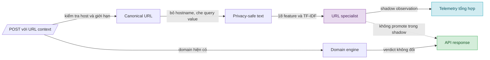

# V10 — URL-aware Signal Round

> **Tài liệu Living Document** — Cập nhật đồng bộ mỗi khi contract, evidence hoặc trạng thái rollout thay đổi.
> Tuân thủ quy tắc tại `.agents/AGENTS.md` Section 5.

## Tóm tắt (Abstract)

V10 mở rộng `POST /v1/analyze` bằng URL context tùy chọn sau khi nhánh domain-only v4–v9 không vượt gate representative `26/34`. Candidate kết hợp domain model v3 với URL specialist tuyến tính, trong khi hostname bị loại khỏi vector học máy và giá trị query được chuyển thành shape token. Dữ liệu được chia theo registrable domain, loại toàn bộ group đã xuất hiện trong baseline, frozen evidence và các vòng trước; cả mười phép kiểm tra overlap đều bằng `0`. Trên final source-disjoint gồm `179` malicious URL và `500` benign URL, candidate tăng từ `118` lên `151` malicious true positive mà không thêm benign false positive. Go runtime đạt parity trên `12` golden vector, không thực hiện network fetch và giữ nguyên quyết định domain-only khi URL thiếu hoặc parse lỗi. Vòng 2 hoàn tất full-shadow local staging trên `679` URL. Vòng 3 đã triển khai thành công trên Docker Compose staging target (`127.0.0.1:8080`), đạt toàn bộ các tiêu chí parity/privacy/latency (p95 inference `250 µs`), hoàn tất rollback drill `5/5` PASS, đóng băng operational monitoring baseline có SHA-256 xác thực và chuyển candidate sang trạng thái `BOUNDED_CANARY_OBSERVATION_READY`. Chế độ `enforce` tiếp tục không được hỗ trợ.

## Sơ đồ Tổng quan

Sơ đồ trả lời câu hỏi: URL context đi qua những lớp nào mà không thay đổi tuyến DNS/domain-only?

## V10 — Đột phá tín hiệu URL-aware

### Mục tiêu (Objectives)

- Tạo signal mới từ path, query shape và caller-observed redirect chain, không tuning trực tiếp theo frozen representative cases.
- Tăng malicious true positive trên fresh, source-disjoint evidence với incremental benign false positive bằng `0`.
- Giữ xác suất và quyết định domain-only không đổi; lỗi URL phải fail-open về kết quả domain hiện có.
- Chuẩn bị native Go runtime cho shadow, không mở network I/O, không lưu raw URL và không hỗ trợ `enforce` trong vòng này.

### Phương pháp & Lý do (Methodology & Rationale)

| Quyết định | Phương pháp chọn | Các phương pháp thay thế | Lý do |
|---|---|---|---|
| Tín hiệu | URL/path/query-shape specialist | Tuning thêm domain v3; DNS liveness; source-adversarial neural model | V4–v9 đã cho thấy domain-only và DNS specialist không đạt precision gate; URL context bổ sung thông tin khác loại mà không sửa frozen labels |
| Representation | `18` handcrafted feature cùng character TF-IDF `8.192` chiều | Raw hostname TF-IDF; embedding/contrastive encoder | Loại hostname ngăn specialist học lại source/domain identity; linear sparse model có native Go inference nhỏ, dễ audit và không thêm neural runtime |
| Query handling | Giữ key, thay value bằng shape token | Giữ raw query; bỏ toàn bộ query | Raw value có rủi ro chứa token/PII; bỏ query làm mất cấu trúc hữu ích như độ dài, kiểu số và entropy |
| Data split | Source-disjoint final và group-disjoint theo registrable domain | Random row split; mở lại representative packet | Random split làm cùng site xuất hiện ở nhiều partition; representative packet không có path/redirect nên không đo đúng contract mới |
| Runtime | Optional, `disabled` mặc định, chỉ cho phép `shadow` | Enforce trực tiếp; fetch URL phía server | Shadow thu evidence mà không đổi verdict; server-side fetch tạo SSRF, latency và provenance ambiguity |
| Benign source | UCI PhiUSIIL legitimate subset | Common Crawl URL Index; popularity list | Common Crawl bị lỗi TLS cục bộ trước snapshot; UCI có provenance, license và label rõ, còn popularity list không cung cấp URL path/query đủ giàu |

Protocol được khóa trước selection tại `ml/configs/v10-url-aware-signal-protocol.json`. Lần thu Common Crawl thất bại trước khi tạo data product, prediction hoặc metric và được ghi trong `ml/experiments/v10-url-aware-collection-attempt.json`; thay đổi duy nhất là benign source. Split, feature, estimator, gate và forbidden-input policy được giữ nguyên.

### Cách thức Thực hiện (Implementation Details)

Pipeline snapshot loại `2.022.301` group từng xuất hiện trong baseline, signed/frozen evidence hoặc experiment cũ. Adaptation sử dụng Phishing.Database active URLs; final malicious sử dụng OpenPhish community feed; benign sử dụng legitimate subset của UCI PhiUSIIL. Seed được cố định theo protocol và SHA-256 của raw source, cohort, report và model được lưu trong manifests.

Selection chỉ train một candidate: standardized handcrafted features kết hợp character TF-IDF, linear SGD classifier và Platt calibration. Threshold `0,18363410163105026` được chọn trên threshold partition theo pre-registered zero-added-benign-FP gate, sau đó kiểm tra một lần trên development và final. `forbidden_inputs_read` bằng danh sách rỗng trong selection report.

Exporter chuyển vocabulary, IDF, scaler, linear coefficients và calibration sang JSON bundle có checksum. Native Go classifier canonicalize URL, chỉ nhận HTTP/HTTPS, giới hạn URL `4.096` byte và redirect chain `5` phần tử, từ chối credentials, yêu cầu canonical host trùng domain được phân tích và không import HTTP client. TF-IDF inference dùng sparse sorted entries; benchmark local Windows/amd64 sau tối ưu ghi nhận `31.342 ns/op`, `10.702 B/op` và `73 allocs/op` với `200` iterations.

`POST /v1/analyze` nhận `requested_url` và `redirect_chain`; GET và DNS không dùng URL context. Shadow observation không sửa verdict, score hoặc cache key. Response/telemetry chỉ chứa revision, probability, decision, trạng thái và lý do tổng hợp; raw URL và raw query value không được phản hồi. `SAFE_ZONE_URL_ML_MODE` chỉ chấp nhận `disabled` hoặc `shadow`, mặc định `disabled`; giá trị `enforce` bị từ chối ở startup.

AI agent sử dụng Codex (GPT-5) với chiến lược protocol-first: khóa hypothesis/gate, freeze group-disjoint evidence, selection một candidate, mở final một lần, rồi mới export/integrate. Số lượng subagent là `0`; không có voting. Kiểm soát chất lượng dựa trên checksum, forbidden-input audit, golden parity, tamper test, behavior test, full Go/Python suites, race detector, `go vet` và Compose validation. Người dùng phê duyệt mở rộng URL-aware; không có push, deploy, restart, traffic-scope change hoặc enforce action.

### Số liệu (Metrics & Results)

#### Dataset và leakage control

| Partition | Rows | Benign / malicious | Groups |
|---|---:|---:|---:|
| Adaptation train | 10.000 | 5.000 / 5.000 | 9.209 |
| Calibration | 2.000 | 1.000 / 1.000 | 1.738 |
| Threshold | 2.000 | 1.000 / 1.000 | 1.858 |
| Development | 2.000 | 1.000 / 1.000 | 1.767 |
| Final | 679 | 500 / 179 | 657 |

Cả `10/10` cặp partition có group overlap bằng `0`. UCI raw corpus có `235.795` hàng, trong đó `134.850` legitimate; sau exclusion còn `116.315` benign URL đủ điều kiện. OpenPhish final có `179` URL đủ điều kiện sau exclusion, nên final malicious size thấp hơn mục tiêu trần `250` nhưng không được bù từ adaptation source.

#### Selection và final

| Cohort | Domain v3 TP / FP | Combined TP / FP | Incremental TP / FP |
|---|---:|---:|---:|
| Threshold, 1.000 malicious + 1.000 benign | 471 / 62 | 914 / 62 | +443 / 0 |
| Development, 1.000 malicious + 1.000 benign | 433 / 52 | 907 / 52 | +474 / 0 |
| Final, 179 malicious + 500 benign | 118 / 37 | 151 / 37 | +33 / 0 |

URL specialist nhận riêng `76/179` malicious final URL và `0/500` benign URL tại threshold đã khóa. Domain-only probability parity, domain-only decision parity và parse-failure fallback đều đạt. Final report đặt trạng thái `OFFLINE_ELIGIBLE_URL_SHADOW_CANDIDATE`.

Representative malicious vẫn là `22/34` cho domain-only v3/v7. Packet này chỉ chứa domain, không chứa caller-observed URL/path/redirect context, nên V10 không đọc hoặc phát sinh score representative mới. Vì vậy `+33 TP / +0 FP` là evidence của product route URL-aware, không phải tuyên bố gate domain-only đã tăng thành `26/34`.

#### Kiểm chứng implementation

| Gate local | Kết quả |
|---|---|
| `go test ./...` | PASS trên toàn bộ package |
| `go test -race ./internal/analysis ./internal/risk` | PASS |
| `go vet ./...` | PASS |
| `python -m pytest ml` | `76 passed` trong `3,48 s` |
| `docker compose config --quiet` | PASS |
| Native golden parity | `12/12` vector PASS; tampered checksum bị từ chối |
| URL privacy/security audit | Không HTTP client trong classifier; response test không chứa raw URL/query secret |

### Trade-off và Rủi ro Còn lại

- Lợi ích chỉ xuất hiện khi client gửi URL context qua POST. DNS, GET và request chỉ có domain giữ nguyên hành vi cũ.
- Final source-disjoint kiểm tra source transfer tốt hơn random split, nhưng `179` malicious URL và benign proxy UCI chưa thay thế telemetry traffic thật. Giá trị `37/500` benign FP vốn đến từ domain v3 cũng cho thấy combined route chưa giải quyết false positive nền.
- Query redaction giảm rủi ro dữ liệu nhạy cảm nhưng làm mất semantic value. Model chỉ học key và shape, không thể dùng nội dung token cụ thể.
- Threshold URL là ngưỡng specialist đã calibration cho contract V10; nó không tương đương threshold domain model và không nên được chỉnh theo frozen cases.
- JSON bundle khoảng `545 KB` và native inference tránh Python/CGO, đổi lại vocabulary lookup vẫn tạo khoảng `73` allocations mỗi request. Số liệu benchmark là local microbenchmark, chưa phải tail latency dưới tải thật.
- Shadow chưa được bật. Chưa có evidence về coverage của caller-supplied context, calibration drift, latency p95/p99 hoặc false positive trên traffic thật.

### Điều kiện cho Bước Kế tiếp

Vòng đột phá tín hiệu đã hoàn tất offline. Bước kế tiếp là Vòng tích hợp shadow: bật `SAFE_ZONE_URL_ML_MODE=shadow` trên phạm vi staging hoặc traffic được phê duyệt, theo dõi coverage, parse/fallback rate, would-promote precision, latency và raw-data redaction. Thao tác này cần xác nhận riêng vì yêu cầu thay đổi cấu hình, restart service và traffic scope. `enforce` vẫn ngoài phạm vi cho đến khi shadow evidence đạt gate vận hành và có rollback drill.

### Liên kết Artifacts

- Protocol: `ml/configs/v10-url-aware-signal-protocol.json`
- Collection attempt: `ml/experiments/v10-url-aware-collection-attempt.json`
- Snapshot: `ml/experiments/v10-url-aware-snapshot.json`
- Selection report: `ml/experiments/v10-url-aware-selection.json`
- Final report: `ml/experiments/v10-url-aware-final-evaluation.json`
- Dataset builder: `ml/src/build_v10_url_snapshot.py`
- Selector và final evaluator: `ml/src/select_v10_url_aware.py`, `ml/src/evaluate_v10_url_aware_final.py`
- Bundle exporter: `ml/src/export_v10_url_bundle.py`
- Native bundle: `ml/models/url-v1/`
- Go classifier: `internal/analysis/url_classifier.go`
- Runtime/API contract: `internal/risk/url_ml.go`, `internal/risk/env.go`, `internal/api/handlers/analysis.go`
- Tests: `ml/tests/test_url_context.py`, `ml/tests/test_v10_url_selection.py`, `internal/analysis/url_classifier_test.go`, `internal/risk/url_ml_test.go`, `internal/api/handlers/analysis_test.go`
- Official data sources: [UCI PhiUSIIL](https://archive.ics.uci.edu/dataset/967/phiusil-phishing-url-dataset), [Phishing.Database](https://github.com/Phishing-Database/Phishing.Database), [OpenPhish feeds](https://openphish.com/phishing_feeds.html), [Common Crawl URL Index](https://commoncrawl.org/url-index)

## Vòng 2 — Shadow Mở rộng và Operational Evidence

### Mục tiêu (Objectives)

- Chạy URL specialist qua HTTP contract thật cùng domain ML shadow mà không đổi verdict, score hoặc cache behavior.
- Mở rộng telemetry đủ để phát hiện lỗi bundle/runtime, input-contract drift, latency regression và population shift mà không lưu raw URL.
- Tạo labelled staging replay có calibration diagnostic, privacy test và failure injection; hoàn tất restart rollback drill.
- Chuẩn bị traffic sampling cùng alert/runbook để chuyển nhanh sang phạm vi vận hành mà vẫn có kill switch rõ ràng.

### Phương pháp & Lý do (Methodology & Rationale)

| Quyết định | Phương pháp chọn | Các phương pháp thay thế | Lý do |
|---|---|---|---|
| Shadow scope | `100%` trên frozen labelled staging replay; hỗ trợ stable `1–99%` theo SHA-256 domain | Random sampling mỗi request; bật enforce nhỏ | Stable domain cohort tái lập qua restart; enforce không cần thiết để đo model và bị runtime từ chối |
| Telemetry | Aggregate probability/input/verdict/error/latency histograms | Lưu per-request raw URL; chỉ đếm total | Aggregate đủ cho vận hành và tránh lưu path/query/redirect nhạy cảm; total đơn lẻ không phát hiện distribution change |
| Drift | PSI với bundled balanced-development proxy, đánh dấu `operational_reference=false` | Coi proxy là production baseline; bỏ drift | Proxy cung cấp diagnostic nhưng prevalence khác traffic thật; trạng thái `proxy_shift` không blocking tránh false alarm |
| Calibration | Brier và ECE-10 trên labelled staging replay | Tuyên bố calibration từ traffic không nhãn | Chỉ evidence có label mới đo calibration; live shadow chỉ đo distribution/behavior |
| Runtime validation | Direct Go staging, domain ML và URL ML cùng ở `shadow` | Chỉ unit benchmark; chờ Docker vô hạn | Direct staging kiểm tra HTTP path thật; Docker Linux engine không phản hồi trong cửa sổ bounded nên không chặn evidence |
| Rollback | Restart URL route về `disabled`, giữ domain ML shadow | Chỉ kiểm tra config parser | Restart drill xác nhận runtime state, response parity và privacy sau khi tắt classifier |

### Cách thức Thực hiện (Implementation Details)

`URLMLShadowConfig` thêm phần trăm và seed. Mức `100%` không cần seed; mức `1–99%` bắt buộc seed và chọn cohort bằng `SHA-256(seed || normalized_domain)`, nhờ đó một domain không đổi nhóm qua restart. `policy_revision` bao gồm selector revision để metric không trộn hai traffic policy.

Runtime ghi các aggregate sau: context requests, selected/excluded, evaluated/pass/promote, error class, query-presence, redirect-count bucket, primary-verdict bucket, would-promote theo verdict gốc, probability histogram và latency histogram/average/p95. Bundle bổ sung monitoring reference `2.000` development rows; Jeffreys smoothing loại zero division khi tính PSI. Reference này cân bằng `1.000/1.000` label nên được đóng dấu `operational_reference=false`; runtime chỉ trả `proxy_shift`, không phát alert blocking.

`replay_v10_url_shadow.py` gửi từng final row qua GET domain-only và POST URL-aware trên `12` worker, đối chiếu domain/verdict/score/confidence, kiểm tra response không chứa full URL hoặc query value, và chạy bốn invalid contexts gồm scheme, credentials, host mismatch và oversized URL. Report chỉ lưu aggregate. Domain ML v3 và URL ML cùng chạy `shadow`; không layer nào thay đổi response.

Rollback drill restart core-api với `SAFE_ZONE_URL_ML_MODE=disabled`, sau đó `check_v10_url_rollback.py` xác nhận classifier tắt, URL không được evaluate, domain response parity và zero raw-context leak. Local staging process được dừng sau drill. `.env` local được chuẩn bị cho full URL shadow ở lần Compose recreate kế tiếp; Docker Desktop đã được khởi động thử nhưng Linux engine không phản hồi bounded health check, nên Compose deployment không được tuyên bố thành công.

AI agent sử dụng Codex (GPT-5), `0` subagent và không voting. Chiến lược kiểm soát chất lượng kết hợp test-first telemetry, native golden parity, labelled HTTP replay, invalid-input injection, bounded infrastructure retry và explicit rollback. Người dùng cho phép mở rộng shadow/restart/traffic local; `enforce` vẫn bị loại khỏi runtime contract.

### Số liệu (Metrics & Results)

| Metric | Kết quả |
|---|---:|
| Frozen staging rows hoàn tất | `679/679` |
| Sampled / evaluated | `679 / 679` |
| HTTP failures / valid prediction errors | `0 / 0` |
| Response parity mismatch / raw-context leak | `0 / 0` |
| URL would-promote benign / malicious | `0 / 76` |
| Would-promote khi runtime verdict chưa malicious | benign `0`, malicious `73` |
| Invalid context fail-open | `4/4` |
| Native URL inference average / p95 | `40 µs / 500 µs` |
| HTTP client latency mean / p95 / p99 / max | `7,547 / 11,067 / 16,371 / 62,529 ms` |
| Labelled replay Brier / ECE-10 | `0,125928 / 0,011386` |
| Labelled replay mean probability / positive rate | `0,275009 / 0,263623` |
| Domain ML concurrent attempts / would-block / errors | `106 / 76 / 0` |
| Offline-proxy PSI | `0,408264`, trạng thái `proxy_shift`, non-blocking |
| Rollback gates | `5/5` PASS |

Toàn bộ chín staging gates đạt. Candidate có trạng thái `STAGING_SHADOW_PASSED_LIVE_BASELINE_PENDING`: đủ điều kiện mở bounded external shadow/canary observation, nhưng chưa có representative live traffic để freeze operational baseline hoặc đo false positive thực tế.

### Liên kết Artifacts Vòng 2

- Shadow staging report: `ml/experiments/v10-url-shadow-staging.json`
- Rollback report: `ml/experiments/v10-url-shadow-rollback.json`
- Replay/rollback tools: `ml/src/replay_v10_url_shadow.py`, `ml/src/check_v10_url_rollback.py`
- Runtime telemetry/sampling: `internal/risk/url_ml.go`, `internal/risk/url_ml_test.go`
- Monitoring bundle/exporter: `ml/models/url-v1/`, `ml/src/export_v10_url_bundle.py`
- Operator runbook: `docs/runbooks/url-ml-shadow-rollout.md`
- Alert policy: `ops/alerts/safe-zone-alert-rules.yaml`

---

## Vòng 3 — Bounded Staging Target và Đóng băng Operational Baseline

### Mục tiêu (Objectives)

- Triển khai candidate V10 URL ML trực tiếp lên Docker Compose staging target (`127.0.0.1:8080`) sau khi Docker phục hồi.
- Thu thập aggregate telemetry vận hành đầy đủ trên container runtime thật: coverage, error classes, input/verdict/probability histograms, would-promote và latency profile.
- Đóng băng artifact operational monitoring baseline độc lập có checksum, duy trì trạng thái non-blocking cho balanced offline proxy reference.
- Thực hiện failure injection với invalid context và rollback drill restart trên Compose container; xác nhận candidate đạt điều kiện canary observation.

### Phương pháp & Lý do (Methodology & Rationale)

| Quyết định | Phương pháp chọn | Các phương pháp thay thế | Lý do |
|---|---|---|---|
| Runtime target | Docker Compose staging (`core-api`, `dns-resolver`, `redis`) tại `127.0.0.1:8080` | Tiếp tục chỉ chạy binary local ad-hoc; chờ deploy VPS | Docker Desktop đã phục hồi; runtime Compose kiểm tra chính xác container mount, env binding, network layer và rate limit middleware |
| Sampling policy | `100%` shadow trên staging scope | Partial cohort `10%` ngay trên staging; bật enforce | Staging scope không ảnh hưởng người dùng cuối nên `100%` shadow tối đa hóa dung lượng mẫu; enforce tiếp tục bị cấm theo thiết kế |
| Baseline freeze | Artifact độc lập `ml/experiments/v10-url-shadow-operational-baseline.json` có SHA-256 | Ghi đè reference bundle của model; bỏ qua baseline | Giữ nguyên model bundle và offline proxy reference; baseline artifact đóng vai trò chuẩn so sánh khi chuyển sang external traffic |
| Calibration policy | Giữ nguyên chẩn đoán Brier/ECE-10 từ labelled staging replay; không suy calibration từ unlabelled traffic | Tự động tính pseudo-calibration từ output model | Không thể đo lường calibration hay FPR thực tế nếu thiếu ground truth label hoặc human review |
| Canary gate | Đề xuất canary shadow observation `1–10%` có seed; duy trì chặn enforce | Enforce trực tiếp; hoãn vô thời hạn | Candidate vượt toàn bộ staging gates nhưng cần quan sát traffic thật có giới hạn trước khi đánh giá hiệu quả sản xuất |

### Cách thức Thực hiện (Implementation Details)

Image `safe-zone-core-api` được rebuild từ source bằng Docker BuildKit (`Go 1.26.7-alpine`, multi-stage), retag thành `safe-zone-phase5-staging-core-api:latest`, và recreate vào project Compose `safe-zone-phase5-staging`. Khởi tạo runtime load bundle `url-v1` tại `/app/models/safe-zone/url-v1` ở chế độ `shadow`, `enabled=true`, `state=ready`.

`replay_v10_url_shadow.py` gửi toàn bộ `679` rows thuộc final cohort qua GET và POST song song trên `12` workers tới endpoint `http://127.0.0.1:8080`. Hệ thống ghi nhận `683` prediction attempts (bao gồm `4` invalid context injection test cases), `0` prediction errors, `0` response parity mismatches, và `0` privacy leaks.

Rollback drill được thực hiện bằng cách chuyển cấu hình `SAFE_ZONE_URL_ML_MODE=disabled` và `SAFE_ZONE_URL_ML_REQUIRED=false`, recreate container `core-api`, sau đó chạy `check_v10_url_rollback.py` đối chiếu `5/5` tiêu chí rollback. Sau khi xác nhận rollback hoàn tất, container được tái kích hoạt về chế độ `shadow`.

Toàn bộ telemetry runtime được tổng hợp và đóng băng tại `ml/experiments/v10-url-shadow-operational-baseline.json` với SHA-256 xác thực.

AI agent sử dụng Gemini 3.7 điều phối quy trình test-first, container rebuild, replay telemetry, rollback validation và checklist reconciliation. Số lượng subagent là `0`; không có cơ chế bỏ phiếu.

### Số liệu (Metrics & Results)

| Tiêu chí | Kết quả Compose Staging | Ngưỡng yêu cầu | Trạng thái |
|---|---:|---:|---|
| Request hoàn tất / Evaluated | `679 / 679` | `100%` | PASS |
| Request failures | `0` | `0` | PASS |
| Valid prediction errors | `0` | `0` | PASS |
| Response parity mismatches | `0` | `0` | PASS |
| Raw-context leaks | `0` | `0` | PASS |
| Would-promote benign (labelled) | `0 / 500` | `0` | PASS |
| Would-promote malicious (labelled) | `76 / 179` | `> 0` | PASS |
| Would-promote khi verdict gốc chưa malicious | `66 / 179` malicious, `0 / 500` benign | `benign = 0` | PASS |
| Invalid context fail-open | `4 / 4` (`0,58%`) | `< 5%` sau $\ge 100$ req | PASS |
| URL inference latency p95 / avg | `250 µs / 63 µs` | $< 2.000\text{ µs}$ | PASS |
| Client HTTP latency p50 / p95 / p99 | `17,021 / 28,197 / 38,499 ms` | — | Ghi nhận |
| Labelled Brier score / ECE-10 | `0,125928 / 0,011386` | — | Diagnostic |
| Drift status / PSI | `proxy_shift` / `0,408264` | Non-blocking | PASS |
| Rollback drill gates | `5 / 5` PASS | `5 / 5` | PASS |

### Kết luận & Đề xuất Canary Gate

Candidate V10 URL ML đạt trạng thái `BOUNDED_CANARY_OBSERVATION_READY`. Toàn bộ các tiêu chí an toàn, độ trễ và tính toàn vẹn dữ liệu đã được kiểm chứng trên Compose runtime. 

**Khuyến nghị triển khai Canary Observation:**
1. **Traffic Scope:** Giới hạn `SAFE_ZONE_URL_ML_SHADOW_PERCENT=1..10%` với `SAFE_ZONE_URL_ML_SHADOW_SEED` cố định trên môi trường có external traffic.
2. **Operational Gate:** Giữ nguyên chế độ `shadow`; không kích hoạt `enforce`.
3. **Drift Monitoring:** Thu thập tối thiểu $1.000$ live requests để đóng băng production operational baseline thay thế offline proxy.
4. **Human Review:** Thực hiện thẩm định thủ công ngẫu nhiên trên các trường hợp `would_promote` từ traffic thật trước khi xem xét bước tiếp theo.

### Liên kết Artifacts Vòng 3

- Staging execution report: `ml/experiments/v10-url-shadow-staging.json`
- Rollback verification report: `ml/experiments/v10-url-shadow-rollback.json`
- Frozen operational baseline: `ml/experiments/v10-url-shadow-operational-baseline.json`
- Replay tool: `ml/src/replay_v10_url_shadow.py`
- Rollback checker: `ml/src/check_v10_url_rollback.py`
- Native model bundle: `ml/models/url-v1/`

---

## Lịch sử Thay đổi (Version History)

| Ngày | Thay đổi | Tác giả |
|---|---|---|
| 2026-08-26 | Hoàn tất Vòng 3 Compose staging deployment: `679/679` replay, p95 inference `250 µs`, rollback drill `5/5` PASS, đóng băng operational baseline `v10-url-shadow-operational-baseline.json`, đề xuất canary gate | Gemini 3.7 |
| 2026-08-26 | Hoàn tất Vòng 2 local full-shadow: `679/679` replay, `0` valid error/parity mismatch/privacy leak, URL inference p95 `500 µs`, rollback `5/5` PASS | Codex (GPT-5) |
| 2026-08-26 | Hoàn tất V10 từ protocol đến native Go shadow-ready integration; final source-disjoint đạt `+33 TP / +0 FP`, runtime vẫn `disabled` | Codex (GPT-5) |
| 2026-08-25 | Ghi nhận Common Crawl TLS failure trước snapshot và thay duy nhất benign source bằng UCI PhiUSIIL | Codex (GPT-5) |
