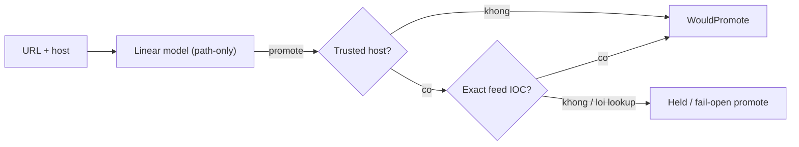

# URL-shadow negatives + trusted-host hold (URL FP 24→12, recall giữ)

> **Tài liệu Living Document** — Cập nhật đồng bộ mỗi khi có thay đổi.
> Tuân thủ quy tắc tại `.agents/AGENTS.md` Section 5.

## ★ Tóm tắt (Abstract)

URL model path-only: 24/24 benign-host + lure-path đều promote p=1.0 bão
hòa; decomposition cho thấy `path_entropy` một mình đã +32..+75 margin mọi
case — threshold tuning vô vọng (neg/pos overlap toàn phần 82..165).
Guard ở tầng observation (không đụng model): hold promote trên
trusted-brand host khi thiếu host-side evidence, exact-feed IOC thắng hold
(nguyên tắc PR-59), lookup lỗi fail-open. Kết quả: FP 24→12, FN 0, watch
giữ nguyên. Shadow-only (URL chưa enforce) nên production verdict không
đổi. Residual 12 FP ngoài trust set được đếm công khai, không giấu.

## Sơ đồ Tổng quan

## ★ URL negatives + hold

### ★ Mục tiêu (Objectives)

Mục tiêu là đo FP thật của URL-shadow trên benign-host (thay con số cũ
"14 host tổng hợp"), chứng minh threshold tuning bất lực bằng margin
decomposition, và hạ FP bằng guard host-aware mà recall positives giữ
tuyệt đối — tất cả offline, zero production impact.

### ★ Phương pháp & Lý do (Methodology & Rationale)

| Quyết định | Phương pháp chọn | Các phương pháp thay thế | Lý do |
|---|---|---|---|
| Fixture contract-pin, không truth corpus | must_not_promote/must_promote/watch + provenance synthetic rõ ràng | Gán benign ground-truth cho URL tổng hợp | URL tổng hợp không có ground truth; pin hành vi thì trung thực, gán nhãn thật thì bịa |
| Không tune threshold | Decomposition chứng minh overlap neg/pos toàn phần | Nâng threshold 0.18 | Mọi ngưỡng giữ recall đều giữ gần hết FP — tuning là theater |
| Hold ở observation, không sửa model | `observeURLML` + trusted set có sẵn | Sửa bundle/threshold | Không retrain ở đây; model là artifact bất biến (SHA pin); guard là policy có thể đo |
| Trust set = IsTrustedBrandSuffix, không mở rộng | Cùng set với feed bypass H2 | Thêm infra/tenant/reserved vào hold | Mở rộng là whitelist creep vi phạm non-goals; 12 residual ngoài set là động lực cho tenant-work, không phải cái để giấu |
| Exact-feed thắng hold | `matchExactThreatFeed` trước hold | Hold tuyệt đối | Tenant bị compromise trên trusted host (tension H2 ở tầng URL) vẫn bắt được — cùng nguyên tắc PR-59 |
| Fail-open khi lookup lỗi | Không hold khi error | Hold mặc định | Guard mù không được suppress; tương lai enforce sai sẽ là FP diện rộng |

### ★ Cách thức Thực hiện (Implementation Details)

Hệ thống thêm fixture `url_shadow_negatives.v1.json` (24 negatives +
8 positives + 3 watch) và test diagnostic ở tầng classifier; guard trong
`observeURLML` (cần ctx cho feed lookup — đổi signature, 1 caller):
promote + trusted host + không exact IOC → `Held` + `HoldReason`
`trusted_host_without_host_evidence`, counter `heldPromote`, status
`would_promote_held`, feedback record false trung thực. Test gated ở tầng
risk với bundle thật + shadow 100%: FP≤12, FN=0, override exact-feed,
fail-open không redis. Nếu dùng AI agent: mô hình `muse-spark`, chiến lược
đo-trước-guard-sau (decomposition quyết định thiết kế), kiểm soát bằng
recall tuyệt đối + ceiling residual, vai trò con người duyệt.

### ★ Số liệu (Metrics & Results)

- Baseline classifier: 24/24 FP p=1.0000; margin 82..8416, entropy
  +32..+75 mọi case; IP-host ngoài scope model (fail-open đúng contract).
- Sau guard (risk e2e): FP 12, held 12, FN 0/8, watch 3 giữ nguyên.
- Residual: 12 FP ngoài trust set (news/CDN/tenant/reserved) + tenant
  compromise là FN đã biết khi thiếu exact IOC — để 08c/inspection.
- Hồi quy: risk/analysis/eval/api xanh; eval v2+contract 0 drift; lint,
  gosec, gofmt sạch. URL chưa enforce nên prod verdict bất động.
- CI flake vá cùng PR: `TestSuspiciousDomain...` panic close-of-closed-channel
  trên runner tải nặng (lớp đã biết từ PR-05) — mock giờ `sync.Once` +
  assert exactly-once sau quiet window 200ms: hồi quy ordering vẫn đỏ
  (clean fail), package không còn panic.
- Gitleaks `generic-api-key` báo đúng 1 chỗ (`token=AbC…` tổng hợp trong
  fixture): allowlist file-specific cho fixture trong `.gitleaks.toml`
  (đúng tiền lệ fixtures-tổng-hợp của repo), verify bằng binary gitleaks
  8.30.1 local — đối chứng âm (bỏ allowlist) báo lại đúng chỗ.

### Liên kết Artifacts

- Code: `internal/risk/url_ml.go` (hold), `internal/analysis/...` (không đổi)
- Fixture/test: `internal/analysis/testdata/url_shadow_negatives.v1.json`,
  `url_shadow_negatives_test.go`, `internal/risk/url_shadow_guard_test.go`
- Bundle pin: `ml/models/url-v1` (SHA256SUMS)
- Kế hoạch: `docs/research/security/decision-engine-rebuttal-plan.md`
  (Giai đoạn 7 cohort URL)

---

## Lịch sử Thay đổi (Version History)

| Ngày | Thay đổi | Tác giả |
|---|---|---|
| 2026-09-13 | URL-shadow negatives + trusted-host hold (chưa merge) | Muse Spark |
