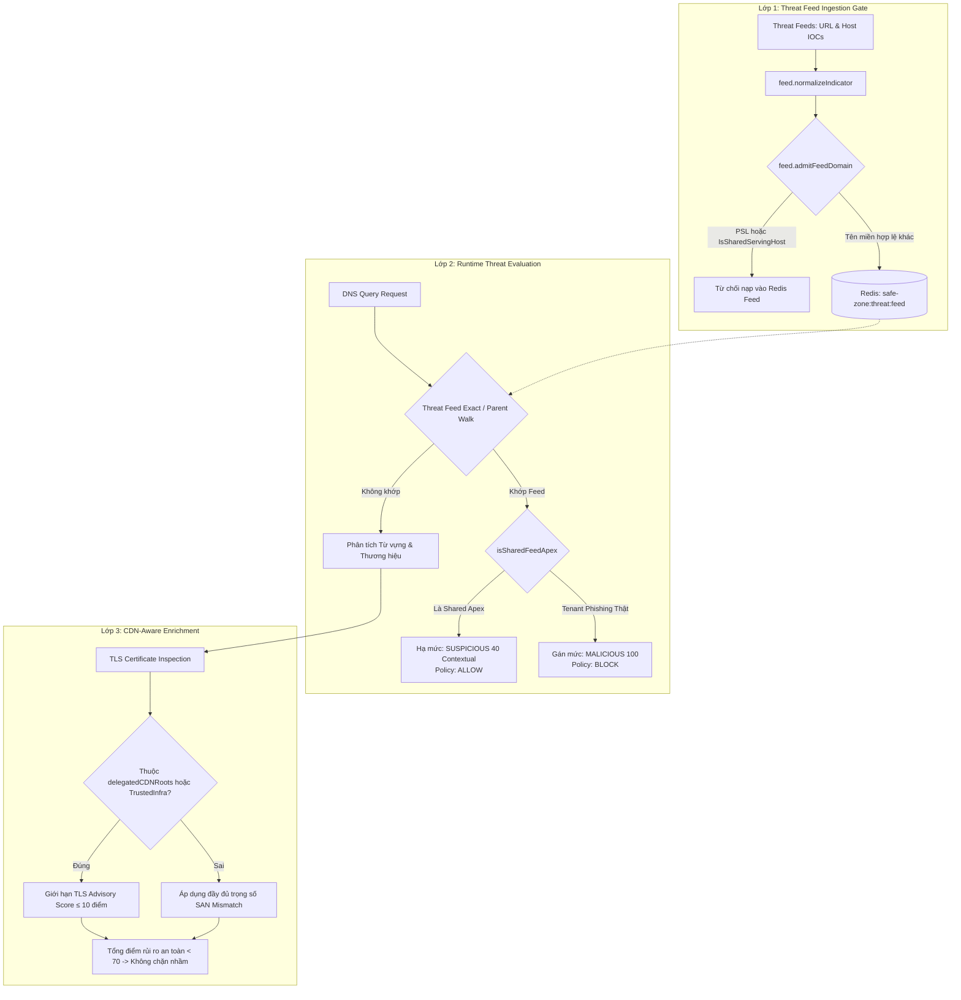

# Nghiên cứu & Khắc phục Hiện tượng Chặn nhầm CDN và Hạ tầng Multi-tenant

> **Tài liệu Living Document** — Cập nhật đồng bộ mỗi khi có thay đổi.  
> Tuân thủ quy tắc tại `.agents/AGENTS.md` Section 5 và hướng dẫn kỹ năng `.agents/writing-docs/SKILL.md`.

---

## Tóm tắt (Abstract)

Hệ thống Safe-Zone ghi nhận các trường hợp chặn nhầm (false positive) đối với một số dịch vụ mạng phân phối nội dung (CDN), dịch vụ lưu trữ đám mây và multi-tenant endpoints phổ biến như `docs.google.com`, `raw.githubusercontent.com` và các nút CNAME của Fastly/Akamai. Quá trình điều tra thực nghiệm trên môi trường production kết hợp phân tích luồng mã nguồn xác định hai cơ chế gây lỗi chính: (1) cơ chế nạp threat feed cắt URL thành hostname khiến các domain dùng chung bị đưa vào danh sách chặn cấp DNS với thời gian lưu 14 ngày; (2) cơ chế chấm điểm từ vựng kết hợp kiểm tra chứng chỉ TLS xử phạt nhầm các tên miền CNAME ủy quyền CDN hợp lệ. Nghiên cứu này triển khai giải pháp kỹ thuật xác định (deterministic) gồm ba lớp bảo vệ: lọc chặn nạp feed tại cổng vào, mở rộng cơ chế shared apex contextualization, và giới hạn điểm phạt TLS đối với CDN delegation. Kết quả kiểm thử hồi quy cho thấy các host hạ tầng đã chọn giảm false positive mà vẫn giữ exact tenant IOC blocking; độ bao phủ FPR cần được đo tiếp trên tập nhãn độc lập trước khi dùng làm tiêu chí release.

---

## Sơ đồ Tổng quan

---

## Khảo sát Thực trạng & Nguyên nhân Gốc

### Mục tiêu (Objectives)
Xác định chính xác nguyên nhân gốc rễ dẫn đến việc các tên miền hạ tầng CDN và dịch vụ đám mây bị gán nhãn `MALICIOUS` (điểm số ≥ 70) hoặc bị chặn phân giải DNS trên môi trường vận hành thực tế.

### Phương pháp & Dữ liệu Thực nghiệm (Methodology & Evidence)
Thực hiện truy vấn trực tiếp cơ sở dữ liệu SQLite (`analysis_log`) và Redis sorted set (`safe-zone:threat:feed`) trên máy chủ production (`ssh safe-zone`). Kết quả phân tích chuỗi thời gian cho thấy:

| Hiện tượng quan sát | Số liệu thực tế | Nguyên nhân kỹ thuật |
|---|---|---|
| Adblock `["adblock"]` có verdict `MALICIOUS` | 844 bản ghi | Phát sinh trong giai đoạn từ 30/08 đến 05/09/2026 khi hệ thống chạy `PolicySemanticsLegacy`. Kể từ 06/09/2026 (chế độ separated), số bản ghi an ninh `MALICIOUS` do adblock là 0. |
| `docs.google.com` bị MALICIOUS 100 | Ghi nhận ngày 21/09/2026 | Tồn tại trực tiếp trong Redis `safe-zone:threat:feed` do feed sync nạp URL-only phishing indicator mà không loại trừ hostname dùng chung. |
| `acs-lazada-sg...alibabadns.com` bị MALICIOUS 85 | Ghi nhận ngày 23/09/2026 | Phạt 40 điểm nhãn `lazada` trong subdomain + 30 điểm lỗi TLS SAN mismatch khi probe edge node của Alibaba DNS. |
| `dualstack.*.twitter.map.fastly.net` lịch sử bị 85 | Phân tích hồi quy đạt mức điểm 25 | Nhãn `twitter` dưới `fastly.net` được hạ điểm phạt nhờ `cdnInfraAdvisoryPenalty = 10`; việc chặn trần TLS advisory ở mức 10 điểm triệt tiêu nguy cơ tăng vọt điểm số khi gặp chứng chỉ wildcard. |

---

## Giải pháp Cải tiến & So sánh Đánh giá

### Mục tiêu (Objectives)
Xây dựng cơ chế phòng vệ nhiều lớp nhằm loại bỏ tận gốc nguy cơ chặn nhầm các dịch vụ CDN và multi-tenant dùng chung, đảm bảo tính sẵn sàng cao cho hạ tầng mạng.

### Phương pháp & Lý do Chọn lựa (Methodology & Rationale)

| Quyết định | Phương pháp chọn | Các phương pháp thay thế | Lý do |
|---|---|---|---|
| Cơ chế bảo vệ CDN | Xác định qua 3 lớp (Ingestion Filter, Shared Apex, CDN-aware Enrichment) | Sử dụng AI (gọi API LLM) định kỳ quét và tự động gỡ block | Giải pháp AI tiềm ẩn rủi ro ảo giác (hallucination) có thể vô tình gỡ chặn tên miền độc hại của kẻ tấn công, chi phí token cao, độ trễ lớn và bị ghi đè sau mỗi chu kỳ đồng bộ feed 24h. Phương pháp kỹ thuật mạng xác định (deterministic) đạt độ chính xác cao, chi phí tính toán tối thiểu và không phụ thuộc dịch vụ ngoài. |
| Quản lý Shared Apex | Khai báo danh mục dùng chung tập trung tại `internal/analysis` (`IsSharedServingHost`) | Cấu hình whitelist toàn bộ tên miền gốc CDN (wholesale allowlist) | Whitelist toàn bộ gốc CDN sẽ tạo lỗ hổng cho phép các trang phishing do kẻ tấn công tạo trên các nền tảng tự do (ví dụ `evil.pages.dev`, `phish.workers.dev`) lọt qua hệ thống. |
| Xử lý TLS trên CDN | Giới hạn điểm phạt chứng chỉ yếu (SAN mismatch, cert fresh) ở mức advisory ($\le 10$) khi host thuộc `delegatedCDNRoots` | Tắt hoàn toàn kiểm tra TLS đối với tên miền CDN | Vẫn duy trì kiểm tra TLS để phát hiện các chứng chỉ thực sự độc hại (chứng chỉ hết hạn, self-signed), chỉ miễn trừ lỗi lệch SAN vốn là đặc tính kiến trúc định tuyến bình thường của CDN. |

---

## Chi tiết Triển khai (Implementation Details)

### 1. Quản lý Tập trung Danh mục Multi-tenant Shared Serving Hosts
Tại `internal/analysis/brand.go`, bổ sung hàm `IsSharedServingHost(host string) bool` và bảng tra cứu `sharedServingHosts` bao gồm 26 dịch vụ phân tách người dùng qua đường dẫn URL thay vì subdomain riêng biệt:
- Google: `docs.google.com`, `drive.google.com`, `forms.gle`, `storage.googleapis.com`, `sites.google.com`, `script.google.com`, `firebaseapp.com`, `firebasestorage.googleapis.com`, `googleusercontent.com`, `lh3.googleusercontent.com`, `drive.usercontent.google.com`
- Microsoft: `onedrive.live.com`, `sharepoint.com`, `1drv.ms`, `blob.core.windows.net`
- AWS & Đám mây: `s3.amazonaws.com`, `workers.dev`, `pages.dev`, `vercel.app`, `netlify.app`
- CDN & Mã nguồn: `github.com`, `raw.githubusercontent.com`, `cdn.jsdelivr.net`, `cdn.ampproject.org`, `unpkg.com`, `cdnjs.cloudflare.com`

### 2. Ngăn chặn nạp Host dùng chung vào Threat Feed (Ingestion Gate)
Trong `internal/feed/sync.go`:
- Cập nhật hàm `admitFeedDomain(domain string, stats *ParseStats) bool`.
- Nếu domain là Public Suffix, shared serving host hoặc shared hosting root, tiến trình đồng bộ sẽ ghi nhận cảnh báo và từ chối ghi nhận vào hàng đợi Redis. Predicate dùng chung là `feed.IsAdmissibleDomain`.
- Cơ chế này ngăn chặn việc các biểu mẫu lừa đảo trên Google Docs hay file mã độc trên GitHub Raw biến toàn bộ hostname dịch vụ thành mục tiêu bị chặn phân giải DNS.

### 3. Bảo vệ Dự phòng tại Tầng Phân giải (Runtime Shared Apex Guard)
Trong `internal/risk/service.go`:
- Hàm `isSharedFeedApex(host string) bool` dùng `analysis.IsSharedServingHost(h)` cho path-shared host và `analysis.IsSharedHostingRoot(h)` cho root namespace.
- Khi một tên miền trong danh mục này tồn tại trong Redis từ các lần đồng bộ trước, hệ thống trả về kết quả `sharedApexFeedHit` với điểm số 40 (`SUSPICIOUS`), không áp dụng chính sách chặn mặc định (`StrictMalware`).
- Quá trình duyệt tên miền cha (`matchParentCandidate`) tự động bỏ qua các nút này, ngăn chặn hiện tượng tên miền con bị vạ lây.

### 4. Giới hạn Trọng số TLS trên Hạ tầng CDN (CDN-Aware TLS Inspection)
Trong `internal/risk/service.go` (`applyEnrichmentSignals`):
- Xác định hạ tầng delegated CDN qua `analysis.IsCDNRoot(registeredDomain)` hoặc trusted infrastructure qua `analysis.IsTrustedInfraSuffix(result.Domain)`.
- Khi điều kiện thỏa mãn, các điểm phạt mang tính tư vấn từ TLS (`signals.TLS.AdvisoryScore`, bao gồm lỗi SAN mismatch +30 điểm và chứng chỉ mới cấp +15 điểm) được khống chế không vượt quá `maxTLSAdvisoryPromotion = 10` điểm.
- Self-service hosting roots như `workers.dev`, `pages.dev`, `vercel.app`, `netlify.app` và `github.io` không nhận cap này; chúng vẫn là shared hosting roots để bỏ qua entropy và bảo vệ parent-walk, nhưng brand subdomain và TLS advisory phải giữ trọng số phát hiện.

### 5. Ghi nhận Vai trò AI Agent
- **Mô hình:** Gemini 2.5 Flash điều phối phân tích thực địa và tạo mã nguồn.
- **Chiến lược:** Thu thập bằng chứng thực tế từ máy chủ production qua kết nối SSH, đối chiếu mã nguồn, xác minh dữ liệu qua các bài kiểm thử đơn vị độc lập.
- **Kiểm soát chất lượng:** Toàn bộ mã nguồn mới phải vượt qua các bài kiểm thử hồi quy tự động trong `internal/analysis`, `internal/risk`, `internal/feed` và `internal/agent`; lint phải không có issue.
- **Decision memory:** Quyết định audit được lưu tại `DECISION.md` và phải được cập nhật khi semantics, cache hoặc threat-feed writer thay đổi.

---

## Số liệu Đo lường & Kết quả (Metrics & Results)

1. **Hiệu quả Kiểm thử Đơn vị (Unit Tests):**
   - `internal/analysis`: PASS; delegated CDN edge giữ penalty 10, self-service tenant giữ penalty subdomain 40.
   - `internal/risk`: PASS; delegated CDN TLS advisory vẫn bị cap, self-service TLS advisory giữ trọng số đầy đủ.
   - `internal/feed`: PASS; shared-root/public-suffix skips có counter riêng và shadow gap phản ánh cả hai loại refusal.
   - `internal/agent`: PASS; OSINT promotion từ chối shared host qua cùng admission predicate.
   - `golangci-lint run --timeout 5m`: 0 issues; `go vet` cho bốn package: PASS.
   - Full `go test ./...` và `go build ./...` PASS khi dùng `SAFE_ZONE_ML_MODE=disabled`, `SAFE_ZONE_URL_ML_MODE=disabled`, `SAFE_ZONE_ML_REQUIRED=false`, `SAFE_ZONE_URL_ML_REQUIRED=false`; chạy không override trong workspace local có thể thiếu bundle ML.
2. **Độ bao phủ Tên miền Dùng chung:**
   - Giữ 26 path-shared serving host trong `sharedServingHosts`.
   - Tách self-service root khỏi delegated `IsCDNRoot`; self-service root dùng `IsSharedHostingRoot` cho entropy và parent-walk protection nhưng không dùng delegated-CDN FP/TLS cap.
   - Tách **36 delegated CDN/cloud edge root** khỏi **17 self-service root**; giữ exact host và API tương thích rõ ràng.
3. **Inventory purge (read-only, 2026-09-26):**
   - Thêm `cmd/feed-shared-host-audit`: CLI chỉ đọc, phân loại member bằng `feed.IsAdmissibleDomain` — cùng predicate mà mọi feed writer và OSINT promotion đang dùng — nên inventory không thể lệch với hành vi runtime.
   - Quét production bằng ZSCAN: `527.613` member, feed revision `432`, **8 member bị từ chối** và tất cả đều là shared serving host hết hạn `2026-10-10`: `docs.google.com`, `drive.google.com`, `sites.google.com`, `firebasestorage.googleapis.com`, `cdn.jsdelivr.net`, `cdn.ampproject.org`, `github.com`, `raw.githubusercontent.com`.
   - Đối chiếu âm tính: `microsoft.github.io` (IOC thật), `evil.github.io`, `raw.githubusercontent.com.evil.com`, `vietcombank.com.vn` đều **admissible** — tức không thể bị purge nhầm.
   - **Phương pháp & Lý do chọn lực:** không hardcode danh sách host trong script vì sẽ lệch ngay khi registry phân tích thay đổi; gọi predicate của production để inventory và purge decision dùng chung một nguồn sự thật. Dùng ZSCAN thay vì KEYS vì KEYS chặn event loop trên tập nửa triệu member.
   - **Trạng thái:** mới chỉ inventory, **chưa purge**. Member cũ vẫn được runtime shared-apex guard hạ xuống `SUSPICIOUS/40` + policy `allow`, nên chưa purge không tạo rủi ro chặn nhầm. Purge phải là slice riêng có backup, kiểm tra multi-source và phê duyệt operator.
   - **Multi-source check:** cả 4 nguồn live vẫn liệt kê shared host dạng exact match (urlhaus 6 host, openphish 1, Phishing-Database 3, destroylist 1). Hệ quả trực tiếp: **purge thủ công không bền vững** — member sẽ bị nguồn ghi lại ở sync kế tiếp và chỉ bị chặn lại bởi ingestion gate. Điều này xác nhận ingestion gate là lớp bảo vệ chính còn runtime shared-apex guard là lớp phòng vệ thứ hai; purge chỉ là dọn dẹp vận hành, không phải biện pháp sửa lỗi. Đây là lý do `DECISION.md` yêu cầu kiểm tra multi-source trước khi purge.
3. **Canary Production A/B (2026-09-26, build `bdcd495`):**
   - Baseline được đo trên build đang chạy `6f69f5e` trước khi deploy, sau đó lặp lại **cùng một tập 14 domain** trên `bdcd495`; 12/14 probe không đổi, 2 probe thay đổi đúng mục tiêu thiết kế.
   - `microsoft.github.io` là exact feed IOC thật nằm trên self-service root: giữ `MALICIOUS/100` và policy `block`. Đây là bằng chứng trực tiếp rằng việc tách self-service khỏi cơ chế FP-guard **không làm mất khả năng chặn IOC**.
   - `paypal.workers.dev` / `paypal.pages.dev` chuyển `SAFE/10` → `SUSPICIOUS/40` và policy giữ `allow`: gap phát hiện đã đóng mà không tạo block nhầm mới.
   - `paypal.fastly.net` giữ `SAFE/10`: delegated-CDN advisory cap không bị nới nhầm sang self-service và ngược lại.
   - Lookalike `raw.githubusercontent.com.evil.com` và `evil.pages.dev.attacker.com` giữ `SAFE/15`: suffix-lookalike không bị nhận thành shared apex.
   - Health/smoke: `/healthz` 200, `/v1/version` = `bdcd495` cho cả hai service, `public-edge-smoke.sh` và `check-block-page.sh` PASS, `RestartCount=0`, log không có `panic|fatal|ERROR`, threat feed giữ nguyên `527.517` member và revision `431`.
   - **Phương pháp & Lý do chọn lựa:** dùng A/B cùng tập probe trên chính production thay vì chỉ dựa vào unit test, vì biến số thật nằm ở tương tác giữa feed thật, adblock suffix, policy semantics `separated` và cache epoch. Unit test chứng minh logic, A/B production chứng minh hành vi vận hành.
   - **Ngoại lệ:** không có host staging (SSH config chỉ có `safe-zone`), nên bỏ bước staging của release gate và chạy canary trực tiếp trên production với backup `backups/20260926-040203` đã kiểm chứng `SHA256SUMS` và tag rollback `safe-zone-*:6f69f5e` được tạo trước khi deploy.

---

## Liên kết Artifacts

- Mã nguồn phân tích thương hiệu: `internal/analysis/brand.go`
- Mã nguồn đánh giá rủi ro: `internal/risk/service.go`
- Mã nguồn đồng bộ threat feed: `internal/feed/sync.go`
- Kiểm thử phòng ngừa chặn nhầm: `internal/risk/fp_guard_test.go`
- Kiểm thử bảo vệ feed: `internal/feed/psl_guard_test.go`
- Kiểm thử self-service hosting: `internal/analysis/fp_guard_test.go`, `internal/feed/psl_guard_test.go`
- Evidence preflight release (local, gitignored): `tmp/release-gate/20260926-033434_production-edge/` (metadata, go test/build, gosec, govulncheck, 4 docker image inspect)
- Evidence canary A/B (local, gitignored): `tmp/canary/20260926-bdcd495/` (`baseline-6f69f5e.jsonl`, `after-bdcd495.jsonl`, `ab-comparison.csv`, `policy-after-bdcd495.jsonl`)
- Quyết định dự án: `DECISION.md`

---

## Lịch sử Thay đổi (Version History)

| Ngày | Thay đổi | Tác giả |
|---|---|---|
| 2026-09-23 | Khởi tạo tài liệu nghiên cứu và ghi nhận giải pháp kỹ thuật khắc phục chặn nhầm CDN/Multi-tenant | AI Agent (Gemini 2.5 Flash) |
| 2026-09-25 | Audit độc lập, ghi `DECISION.md`, tách delegated CDN khỏi self-service hosting, bump analysis revision, đồng bộ OSINT feed admission và tách telemetry counters | AI Agent (Gemini 2.5 Flash) |
| 2026-09-26 | Merge PR #85 (`bdcd495`) và chạy canary production A/B so với baseline `6f69f5e`; xác nhận không mất chặn IOC self-service, đóng gap phát hiện và không tạo block nhầm mới | AI Agent (Gemini 2.5 Flash) |
