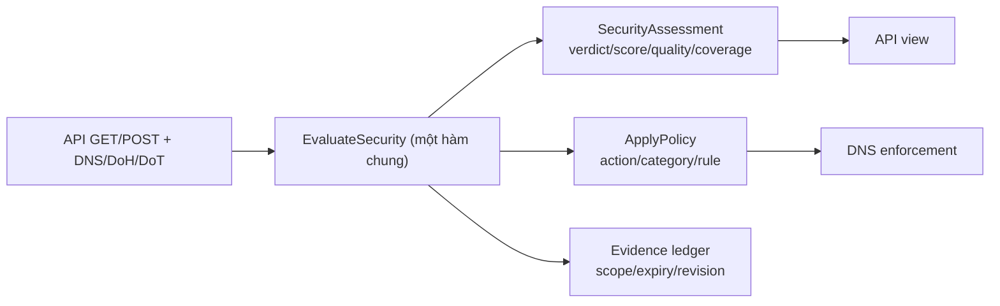
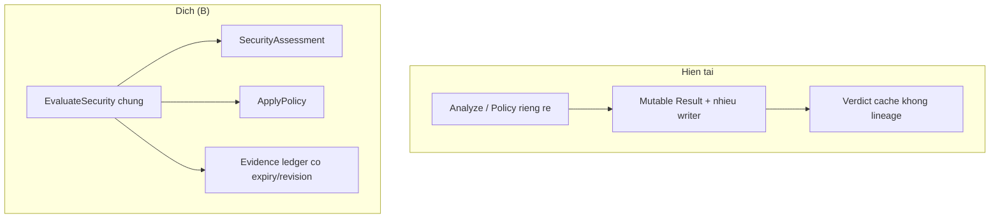

# Phản biện đánh giá decision engine và kế hoạch PR

> **Tài liệu Living Document** — Cập nhật đồng bộ mỗi khi có thay đổi.
> Tuân thủ quy tắc tại `.agents/AGENTS.md` Section 5.

## ★ Tóm tắt (Abstract)

Tài liệu phản biện độc lập báo cáo GPT 6 Astra (baseline SHA `5bbaac9`) bằng cách đọc lại implementation tại HEAD, đối chiếu caller thực tế và chạy lại một phần test hiện có. HEAD trùng baseline nên mọi anchor dòng vẫn giữ nguyên. Kết quả xác nhận cơ chế của toàn bộ 14 finding (H1–H4, M1–M7, A1–A2, L1), hiệu chỉnh severity của H4 theo hướng chi tiết hơn (khuếch đại O(n²) chỉ ở mặt API, DNS ingress đã bị giới hạn bởi giao thức), bổ sung hai chi tiết tăng nặng cho M7 (chế độ feed mặc định là Legacy rộng nhất; chế độ Shadow vẫn nạp chỉ báo URL-only vào runtime) và một yêu cầu eval mới (mô hình URL trả `would_promote` xác suất 1.0 trên mọi host với path tổng hợp). Phương án được chọn là **B (tái cấu trúc decision engine, giữ components) sau các guard khẩn cấp của A**, với điều kiện xác minh runtime đã liệt kê. PR đầu tiên đề xuất là H1 (typed DNS outcome, cấm promotion từ lỗi hạ tầng), kèm acceptance criteria và lệnh validation cụ thể.

## Sơ đồ Tổng quan



## ★ Giai đoạn 1 — Xác minh baseline, phạm vi và phương pháp

### ★ Mục tiêu (Objectives)

Mục tiêu của giai đoạn phản biện là xác minh lại mọi kết luận load-bearing của báo cáo trước (disposition từng finding, trace 14 case, so sánh A/B/C), chốt phương án kiến trúc và lập roadmap PR khả thi để trình duyệt. Giai đoạn này không sửa runtime, config, data labels, không commit/push/deploy và không bật enforcement.

### ★ Phương pháp & Lý do (Methodology & Rationale)

| Quyết định | Phương pháp chọn | Các phương pháp thay thế | Lý do |
|---|---|---|---|
| Nguồn sự thật | Đọc implementation và caller tại HEAD + chạy test chọn lọc | Tin runtime logs cũ; tin severity của báo cáo trước | HEAD trùng baseline nên anchor giữ nguyên; log fixture cần được đối chiếu lại với code thay vì mặc nhiên đúng |
| Tái lập | Chạy test hiện có (`go test -count=1`) trên package `risk`, `analysis`, `osint`, `dns/resolver` | Chạy lại toàn bộ overlay harness trong repo | Overlay yêu cầu chép file test vào cây source; test hiện có đã đủ để kiểm tra các assertion khóa hành vi (ví dụ H2) mà không chạm cây source |
| Ground truth domain | Tách hành vi code khỏi nhãn thực tế; giữ `replay-0101` ở trạng thái unresolved | Dùng nhãn `labels.csv` làm ground truth | Evidence lưu trong artifact là trang Cloudflare 522, không chứng minh được cảnh báo Safe Browsing mà nhãn tuyên bố |
| Vị trí tài liệu | `docs/research/security/` theo AGENTS.md Section 5.1 | Ghi đè báo cáo gốc | Báo cáo gốc phải giữ bất biến để đối chiếu; tài liệu mới chịu skill `writing-docs` |

### ★ Cách thức Thực hiện (Implementation Details)

Hệ thống thực hiện `git status` (sạch, chỉ có thư mục báo cáo untracked), `git rev-parse HEAD` (`5bbaac9`, trùng baseline), đọc toàn bộ `hardening/proposals/decision-engine.md` (940 dòng), `findings.json` (7 findings), `coverage.json`, `scan-manifest.json`, `hardening.md`, `context.md`, `hardening.json`, 5 runtime logs, 2 harness Go và `PROMPT-MUSE.md`. Sau đó đọc lại các đường code quyết định trong `internal/risk/service.go`, `internal/risk/ml.go`, `internal/analysis/analysis.go`, `internal/agent/audit.go`, `internal/agent/osint.go`, `internal/store/sqlite.go`, `internal/store/brand.go`, `internal/osint/osint.go`, `internal/ai/context.go`, `internal/feed/sync.go`, `internal/feed/admission.go`, `internal/tlsinspect/inspect.go`, `internal/whois/lookup.go`, `internal/dns/resolver/resolver.go`, `internal/api/handlers/analysis.go`, và chạy test chọn lọc. Nếu dùng AI agent: mô hình `muse-spark`, chiến lược đọc trực tiếp không qua subagent, kiểm soát chất lượng bằng đối chiếu chéo code-log-test, vai trò con người duyệt kế hoạch trước giai đoạn 2.

### ★ Số liệu (Metrics & Results)

- `git diff --stat` giữa HEAD và baseline: rỗng (0 file tracked thay đổi).
- Test chạy lại và pass: `TestThreatFeedTrustedBrandSuffixBypass`, `TestPolicyBlocksOnlyMalicious`, `TestSuspiciousDomainEnrichmentRunsInBackgroundAndUpdatesCache` (package `risk`, 0.191s); full package `analysis` (1.052s), `osint` (2.661s), `dns/resolver` (2.406s).
- 14/14 finding được xác nhận cơ chế tại HEAD (chi tiết ở Giai đoạn 2); 0 finding bị bác bỏ hoàn toàn; 1 hiệu chỉnh severity (H4), 3 bổ sung tăng nặng (M7, URL-shadow, H1-mislabel).

### Liên kết Artifacts

- Báo cáo gốc: `docs/GPT 6 Astra report/hardening/proposals/decision-engine.md`
- Scan artifacts: `docs/GPT 6 Astra report/findings.json`, `docs/GPT 6 Astra report/coverage.json`, `docs/GPT 6 Astra report/scan-manifest.json`, `docs/GPT 6 Astra report/report.md`
- Logs tái lập: `docs/GPT 6 Astra report/runtime-risk.log`, `docs/GPT 6 Astra report/runtime-enrichment.log`, `docs/GPT 6 Astra report/runtime-frozen-warning.log`, `docs/GPT 6 Astra report/runtime-frozen-phishing.log`, `docs/GPT 6 Astra report/existing-tests.log`
- Harness: `docs/GPT 6 Astra report/audit-risk_test.go`, `docs/GPT 6 Astra report/audit-dns_test.go`, `docs/GPT 6 Astra report/overlay.json`
- Eval labels: `ml/evidence/representative-replay/run-20260823-owner-approved-addendum/labels.csv`

---

## ★ Giai đoạn 2 — Disposition từng finding

### ★ Mục tiêu (Objectives)

Mục tiêu là gán cho mỗi finding một trong các trạng thái confirmed / partially confirmed / refuted / insufficient evidence / fixed since baseline, kèm điều kiện kích hoạt, bằng chứng dòng code, severity hiệu chỉnh, khả năng tái lập và điểm cần sửa trong báo cáo trước.

### ★ Phương pháp & Lý do (Methodology & Rationale)

| Quyết định | Phương pháp chọn | Các phương pháp thay thế | Lý do |
|---|---|---|---|
| Disposition | Đọc lại từng đường code và caller, không dựa vào tên hàm | Chấp nhận bảng khẳng định của báo cáo trước | Một số khẳng định cần thu hẹp (ví dụ stale-cache khi Redis down hoàn toàn) và một số test khóa hành vi cần đọc assertion cụ thể (ví dụ H2) |
| Severity | Hiệu chỉnh theo khả đạt từ code nhân với điều kiện triển khai đã biết (Agent tắt mặc định, enrichment/Redis bật theo `.env`) | Giữ nguyên severity | Severity phải phản ánh cả reachability, không chỉ cơ chế |

### ★ Cách thức Thực hiện (Implementation Details)

Bảng disposition tổng hợp:

| Finding | Disposition | Severity hiệu chỉnh | Tái lập |
|---|---|---|---|
| H1 DNS error → malicious cache | Confirmed | High (giữ nguyên, có điều kiện) | Deterministic qua fixture resolver |
| H2 trusted bypass exact feed | Confirmed | High (giữ nguyên) | Deterministic qua miniredis fixture |
| H3 Agent durable override | Confirmed (capability) | High, có điều kiện Agent bật | Static trace; chưa ghi nhận execution sai |
| H4 oversized input | Confirmed, thu hẹp phạm vi | High, chỉ mặt API (DNS đã bị giới hạn bởi giao thức) | Static + đo allocation (chưa chạy bench) |
| M1 stale worker overwrite | Confirmed | Medium (giữ nguyên) | Deterministic ordering fixture |
| M2 revision/coherence | Confirmed | Medium (giữ nguyên) | Static trace + Litmus hai process (chưa chạy) |
| M3 OSINT unbounded memory | Confirmed | Medium (giữ nguyên) | Static trace; soak chưa chạy |
| M4 AI lock + promote | Confirmed | Medium (giữ nguyên) | Static trace; load adversarial chưa đo |
| M5 TLS/WHOIS scoring | Confirmed | Medium (giữ nguyên) | Fixture cert + replay |
| M6 separation gaps | Confirmed | Medium (giữ nguyên) | Static contract trace |
| M7 indicator scope | Confirmed, tăng nặng | Medium (giữ nguyên số, mở rộng phạm vi) | Static trace admission modes |
| A1 SAFE = coverage gap | Confirmed | Architectural (giữ nguyên) | Logic gate + replay #9/#12 |
| A2 eval insufficiency | Confirmed | Architectural (giữ nguyên) | Artifact audit (replay-0101) |
| L1 reason/category/source | Confirmed | Low (giữ nguyên) | Static trace |

Chi tiết từng finding:

**H1 — Lỗi DNS bị biến thành malicious và giữ trong cache: confirmed.** `defaultEnrichmentLookup` (`internal/risk/service.go:2478-2512`) gán `dnsFailed=true` trên mọi lỗi `LookupNS` (timeout, cancel, SERVFAIL, thiếu NS); `applyEnrichmentSignals` (`:2518-2523`) nâng floor 75 và gắn reason `"domain is not registered or resolving (NXDOMAIN)"` ngay cả khi không hề có response NXDOMAIN — nhãn reason sai sự thật cho trường hợp timeout. `processEnrichmentJob` (`:2453-2468`) ghi đè cache với TTL malicious 6h; `Policy` (`:1259`) block khi `StrictMalware`. Điều kiện kích hoạt đầy đủ: Redis + worker bật, score ∈ [20,70). Hiệu chỉnh duy nhất so với báo cáo trước: Redis down hoàn toàn không trả stale (đường đọc cache yêu cầu `err == nil` tại `:1440`); chỉ lỗi từng phần (revision GET lỗi nhưng result GET thành công, xem `:1424-1425` kết hợp `:2798-2835`) mới chấp nhận stale. Replay quyết định nằm ở `runtime-enrichment.log:2` (55→75 với resolver giả).

**H2 — Trusted suffix bỏ qua cả exact threat feed: confirmed.** `feedResult` (`internal/risk/service.go:1528-1531`) return rỗng trước `matchThreatFeed`. Điểm mới từ lần đọc này: test hiện có `TestThreatFeedTrustedBrandSuffixBypass` (`internal/risk/service_test.go:794-809`) chỉ bao phủ parent-match bypass (`googlevideo.com` trong feed, query subdomain) — không bao phủ exact-match (`evil.sharepoint.com`). Vì vậy bản sửa "exact scoped evidence thắng trust, parent noisy vẫn bypass" không phá test hiện có; đây là bằng chứng cho tính khả thi của PR mà không cần sửa test khóa hành vi. Mức High giữ nguyên về detection.

**H3 — Agent Audit tạo block override toàn cục không hết hạn: confirmed ở mức capability.** `auditDomain` (`internal/agent/audit.go:288-406`) cộng điểm TLS+WHOIS thuần túy (không lexical/brand/feed), `score ≥ 70` kéo confidence công thức lên 1.0 (`:332-335`) nên ngưỡng mặc định 0.7 không bổ sung bằng chứng, rồi `UpsertOverride(block)` (`:365-369`) vào `local_overrides` — bảng không có cột expiry/TTL (`internal/store/sqlite.go:987-1011`). `GetEffectiveOverride` đọc global trước mọi evidence (`internal/risk/service.go:1004`, `:1116`). Hai chi tiết precedence được xác minh thêm: `GetOverride` có suffix inheritance (`sqlite.go:929-952`), còn `GetEffectiveOverride` ưu tiên group trước global trên cùng candidate nhưng global ở candidate cụ thể hơn (child) thắng group ở candidate cha (`sqlite.go:1990-2039`) — nghĩa là override của Agent trên exact domain đè cả group-allow ở parent, trong khi `auditDomain` chỉ kiểm tra local override (`audit.go:290`) nên không nhìn thấy group intent. Severity High có điều kiện: Agent tắt mặc định (`.env`: `SAFE_ZONE_AGENT_ENABLED=false`); chưa có bằng chứng override sai trong lịch sử — đây là câu hỏi chặn cần kiểm tra DB vận hành, không phải giả định.

**H4 — Input quá dài đi vào suffix expansion và SQLite: confirmed, thu hẹp phạm vi còn mặt API.** `NormalizeDomain` (`internal/analysis/analysis.go:304-346`) không giới hạn tổng dài/số label; POST cap 32KB body (`internal/api/handlers/analysis.go:35`) nhưng GET query không có field cap tương ứng; `GetEffectiveOverride` (`sqlite.go:1999-2036`) và `ThreatFeedCandidates` (`service.go:2593-2604`) duyệt mọi suffix với `strings.Join` từng candidate — chi phí O(n²) byte cộng 2 query SQLite mỗi candidate, gọi bằng `context.Background()` (`service.go:993,1004,1100,1116`) nên client disconnect không hủy work. Hiệu chỉnh quan trọng: DNS ingress đã bị giới hạn bởi giao thức (QNAME ≤ 255 byte wire; `ResolveQuery` tại `internal/dns/resolver/resolver.go:60-105` dùng `ctx` của request), vì vậy H4 là rủi ro mặt HTTP API, không phải DNS. Per-IP rate limit tồn tại nhưng không chống được caller phân tán; ngưỡng OOM chưa đo nên giữ High có điều kiện thay vì Critical.

**M1 — Worker ghi đè evaluation mạnh hơn bằng snapshot cũ: confirmed.** `processEnrichmentJob` kiểm revision trước network (`service.go:2437-2448`) nhưng `SET` sau network không đọc-compare generation hiện tại (`:2457-2468`); replay `meadowharbor.net` 90→35 trong `runtime-risk.log:34` tái hiện đầy đủ. Báo cáo trước đúng khi không đề xuất max-score (vi phạm yêu cầu không đánh đổi); hướng sửa là generation/CAS kèm evidence lifetime, đã đưa vào PR-05.

**M2 — Revision chưa đại diện toàn bộ input: confirmed.** Ba điểm đã xác minh: revision rỗng được coi bằng (`service.go:1424-1425`, readers `:2798-2835` trả `""` khi lỗi); OSINT `cacheKey` chỉ gồm domain (`internal/osint/osint.go:713-715`), thiếu source/trust/provider config; `OSINTTask.promote` chỉ invalidate exact domain, không bump feed epoch (`internal/agent/osint.go:153-174`), nên child cached SAFE sống sót sau khi parent được promote. Điểm thứ tư: `SeedDefaultBrands` dùng `ON CONFLICT(name) DO UPDATE` (`internal/store/brand.go:171-191`), gọi mỗi lần mở DB (`sqlite.go:545`) — sửa operator trên brand mặc định bị ghi đè khi restart; `ListBrands` sắp xếp `ORDER BY name` (`brand.go:193-214`) nên thứ tự "match đầu tiên thắng" của brand matcher cũng kế thừa thứ tự này. Giữ Medium.

**M3 — OSINT giữ report hết hạn cho vô hạn domain: confirmed.** `store()` ghi mọi lookup kể cả lỗi/cancel (`internal/osint/osint.go:682-702`, gọi tại `:273` và `:299`); `Cached` trả miss khi hết hạn nhưng không xóa (`:326-333`); không tồn tại `delete`/LRU/cap trong file (đã grep xác nhận). Giữ Medium; soak 48h chưa chạy nên tác động RAM là ước lượng. Chi tiết phụ phát hiện thêm: `isTrustedHost` dùng suffix-match (`:665-680`), nới trust nguồn cho subdomain của domain tin cậy — ghi nhận để siết trong PR siết nguồn.

**M4 — AI giữ mutex qua network call và promote không floor confidence: confirmed.** `refineWithAI` giữ `s.aiMu` xuyên suốt `client.Refine` (`internal/risk/service.go:2238-2245`); verdict MALICIOUS từ model đủ để promote bất kể confidence (`:2255-2269`); prompt Refine chỉ chứa domain+score (`internal/ai/client.go:387-394` theo anchor E14). Đường excerpt→LLM→evidence→block được xác minh đầy đủ: `fetchSource` → `classifyDomainRole` (`osint.go:421`), heuristic chạy trước (`:447`), prompt bọc `<untrusted-excerpts>` kèm chỉ dẫn bỏ qua instruction (`internal/ai/context.go:80-92`), output validate enum (`:94-108`), role attacker nuôi `Evidence` (`osint.go:426-438`) → `HasStrongWarning` → `Apply` nâng MALICIOUS/90. Kết luận giữ nguyên: tagging và enum là giảm thiểu thật nhưng không phải bằng chứng chống prompt-injection; cần adversarial eval. Giữ Medium.

**M5 — TLS/WHOIS cộng điểm phụ thuộc, mismatch có thể quyết định block: confirmed.** `scoreResult` (`internal/tlsinspect/inspect.go:111-171`): expired +20, self-signed +25, cert mới +15 (có guard `!r.Expired` tại `:142`, đúng như báo cáo trước đã hiệu chỉnh), mismatch +30 (`:147-152`); `parseAndScore` WHOIS (`internal/whois/lookup.go:177-221`): mới <7d +25, privacy +5. Replay fixture 55+30=85 tại `runtime-enrichment.log:3`. Giữ Medium kèm yêu cầu không đánh đổi: giữ validation wildcard một-label theo RFC 9525, chỉ giảm authority của mismatch.

**M6 — Tách security/policy chưa xuyên suốt: confirmed.** Ba bằng chứng: `Analyze` không có trường Decision (`service.go:974-1081`); chế độ legacy ghi `MALICIOUS/100/adware` ngay cả trên đường API (`:1045-1055`); admin override block bị dựng thành `MALICIOUS/100/conf 1.0` trên cả hai đường (`:1006-1023` và Policy tương ứng); telemetry tự ghi nhận thiếu cột policy (`:2867-2870`). Phân biệt rõ: với separated mặc định, API SAFE + DNS content-block là semantics đúng (không phải bug để "sửa" bằng allow-all); bug là thiếu contract/provenance/telemetry. Giữ Medium.

**M7 — Scope indicator chưa khớp enforcement: confirmed và mở rộng.** `ThreatFeedCandidates` duyệt mọi parent (`service.go:2593-2604`); `PlanAdmission` phân loại Authoritative/Contextual (`internal/feed/admission.go:62-123`) nhưng `Sync` ở chế độ Shadow vẫn nạp cả Contextual vào runtime feed (`internal/feed/sync.go:144-146`); chế độ Filter (loại duy nhất tách URL-only) bị từ chối ở startup (`sync.go:92-94`, `cmd/core-api/main.go` ép Legacy mặc định). Hệ quả: không tồn tại chế độ runtime nào loại chỉ báo URL-only khỏi host blocklist — mạnh hơn câu chữ cũ của finding. Giữ Medium (chỉ nâng phạm vi, không nâng số, vì exploit cần feed source chứa URL-only IOC trên shared host).

**A1 — SAFE đồng nghĩa thiếu coverage: confirmed.** Gate ML/AI tại `service.go:1473`, gate enrichment tại `:2381-2383`, gate OSINT tại `osint.go:353-370`; enum `Verdict` không có biến thể unknown (`internal/analysis/analysis.go:14-21`); replay #9 (SAFE10) và #12 (SAFE0) trong `runtime-risk.log:10,13` chứng minh đường không quan sát. Giữ Architectural.

**A2 — Evaluation component chưa chứng minh end-to-end: confirmed.** Ba artifact tồn tại (đã kiểm tra file): `ml/models/v1/model_report.json`, representative addendum 137 case, `ml/experiments/v10-url-aware-final-evaluation.json`. Vấn đề provenance nhãn được xác minh trực tiếp: `labels.csv:102` gán `replay-0101` malicious/high với claim "Safe Browsing red screen", trong khi evidence trỏ tới (`run-20260808/evidence/allegro.pl-oferta64457.click.md`) chỉ chứa trang lỗi Cloudflare 522. Giữ nhãn unresolved theo đúng chỉ đạo. Giữ Architectural.

**L1 — Reason/category/source lệch: confirmed.** `inferSource` suy từ prose (`service.go:2892-2908`, ML/AI/OSINT rơi về `"lexical"`); enrichment không recompute category (replay TLS cho category `suspicious` ở verdict MALICIOUS85, `runtime-enrichment.log:3`); `refineWithAI` append reason của AI-SAFE vào result SUSPICIOUS (`service.go:2255-2259`). Giữ Low.

Điểm đồng ý và bác bỏ với báo cáo trước: đồng ý toàn bộ cơ chế, severity và hướng sửa; bác bỏ/không tái xác nhận mức độ chắc chắn ở ba chỗ đã ghi rõ (Redis-down-trả-stale chỉ đúng với lỗi từng phần; ví dụ private-IP cho H3 không qua được TLS guard nên phải dùng fixture public; expired+mới không cộng đồng thời). Hai sơ đồ ingress/engine về cơ bản đúng, chỉ cần addendum H4-scoping (API-only) trong tài liệu này thay vì sửa diagram gốc.

### ★ Số liệu (Metrics & Results)

- Dòng code xác minh trực tiếp: ~40 anchor, 0 anchor lệch so với báo cáo trước (HEAD trùng baseline).
- Assertion test khóa hành vi có lợi cho bản sửa: `TestThreatFeedTrustedBrandSuffixBypass` chỉ cover parent-bypass (đọc assertion tại `service_test.go:794-809`).
- Dữ kiện định lượng mới từ log: URL-shadow `would_promote` xác suất 1.0 trên 14/14 host với path tổng hợp (`runtime-risk.log:58-71`); ML diagnostic abstain trên `vipma3979.net` (0.788 < 0.85) và `dichvucongvn.com` (0.754); ML diagnostic `promote_malicious` trên cả hai mẫu allegro lịch sử (0.9995/0.9992) nhưng gate bỏ qua.

### Liên kết Artifacts

- Code anchors: `internal/risk/service.go`, `internal/agent/audit.go`, `internal/agent/osint.go`, `internal/store/sqlite.go`, `internal/store/brand.go`, `internal/osint/osint.go`, `internal/ai/context.go`, `internal/feed/sync.go`, `internal/feed/admission.go`, `internal/analysis/analysis.go`, `internal/dns/resolver/resolver.go`, `internal/api/handlers/analysis.go`
- Logs: `docs/GPT 6 Astra report/runtime-risk.log`, `docs/GPT 6 Astra report/runtime-enrichment.log`

---

## ★ Giai đoạn 3 — Xác minh lại 14 case và mẫu lịch sử

### ★ Mục tiêu (Objectives)

Mục tiêu là tách ground truth của domain khỏi hành vi code: mỗi case ghi rõ code làm gì (đã replay) và thực tế domain là gì (chỉ kết luận khi có bằng chứng độc lập).

### ★ Phương pháp & Lý do (Methodology & Rationale)

| Quyết định | Phương pháp chọn | Các phương pháp thay thế | Lý do |
|---|---|---|---|
| Case 1–10 | Đối chiếu replay trong `runtime-risk.log` với đọc code trực tiếp | Chạy lại harness trong repo | HEAD không đổi nên replay còn hiệu lực; chạy lại không thêm thông tin mà gây side-effect Redis/SQLite |
| Case 11–14 (fixture) | Coi là minh họa bất biến, không gán ground truth | Resolve/fetch kiểm chứng | Fixture dùng hostname ví dụ; fetch thật vi phạm ranh giới an toàn |
| replay-0101 | Giữ unresolved | Chấp nhận hoặc đảo nhãn | Evidence đọc được (Cloudflare 522) mâu thuẫn claim nhãn (Safe Browsing red screen) |

### ★ Cách thức Thực hiện (Implementation Details)

Kết quả đối chiếu (hành vi code → ground truth):

| Case | Hành vi code (đã replay) | Ground truth độc lập | Kết luận |
|---|---|---|---|
| 1–3 Shopee infra | SAFE 15/15/25, allow; trusted `shopeemobile.com` | Quan hệ root Shopee có tài liệu vận hành; công dụng từng host chưa xác minh | Hành vi đúng hướng; tin cậy ở mức root, không ở mức host |
| 4 Baishan CDN | SUSPICIOUS 55 (brand-substring `shopee` + dài); enrichment có thể đẩy 75/85 | BaishanCloud là CDN hợp pháp (WHOIS 2016); tenant `zshopeevod` chưa xác minh | FP có khả năng; là case chuẩn cho PR TLS-guard |
| 5 Aria telemetry | API SAFE 15; DNS content-block (rule exact trong snapshot local) | Microsoft Learn/DPIA Hà Lan xác nhận chức năng telemetry | Block đúng chính sách; nhãn `unknown` và thiếu provenance là phần sai |
| 6–8 cha Microsoft | SAFE, allow (rule nằm ở con, không bao cha) | Cùng hạ tầng trên | Đúng semantics suffix một chiều |
| 9 `vipma3979.net` | SAFE 10; ML diagnostic abstain 0.788 | Không có hit exact; lân cận là site TQ/casino MY (suy luận, không phải dữ kiện) | Unresolved; hệ thống mù là vấn đề thật, nhãn domain không kết luận |
| 10 `dichvucongvn.com` | MALICIOUS 75, category `phishing` (fallback reason-chứa-"phishing" tại `analysis.go:256-263`), block | Họ phishing giả DVCQG đã được công an nhiều tỉnh cảnh báo; site cụ thể chưa có capture sandbox | Hướng đúng, độ chắc heuristic; biến thể `dvc-*` và `gov.vn.evil.com` là FN đã chứng minh bằng đọc code |
| 11 VCB fixture | MALICIOUS 100 | Fixture tổng hợp, không phải IOC | Minh họa coverage tốt/kém theo từ điển (`vcb-pay.top` → ~0, FN) |
| 12 form mật khẩu | SAFE 0, không lớp nào thấy nội dung | Fixture; password field không tự chứng minh phishing | FN cấu trúc, đúng như báo cáo trước đã tự giới hạn |
| 13 shared-CDN TLS | SAFE 15, chưa inspect (dưới gate) | Fixture | Minh họa gate bỏ qua mismatch, đối xứng với case 4 |
| 14 adblock suffix | SAFE 0 + content-block khi có parent rule (fixture) | Fixture | Minh họa overblock theo suffix + nhãn `unknown` |
| `ahshyallegrolokalnie…` | SAFE 15/allow; ML diagnostic 0.9995 bị gate bỏ | Ảnh cảnh báo Chrome lịch sử đã xem (replay-0072) | Warning lịch sử, không phải ground truth hiện tại; case chuẩn cho mở cohort ML |
| `allegro.pl-oferta…` (0101) | SAFE 15/allow; ML diagnostic 0.9992 bị gate bỏ | Nhãn claim Safe Browsing nhưng evidence là Cloudflare 522 | **Unresolved**; cấm dùng làm gate cho tới khi có capture đúng thời điểm |

Hiệu chỉnh duy nhất với báo cáo trước: category của case 10 là `phishing` (đúng trong báo cáo trước, đã xác minh lại), không phải `malware` như báo cáo Muse cũ — không cần sửa gì thêm.

### ★ Số liệu (Metrics & Results)

- 10/10 case live-host trùng khớp replay khi đối chiếu code; 4/4 fixture giữ nguyên ý nghĩa minh họa.
- 2/2 mẫu lịch sử cho thấy ML diagnostic `promote_malicious` (>0.999) nhưng pipeline bỏ qua do gate SUSPICIOUS — bằng chứng định lượng cho việc mở cohort ML ở chế độ shadow.
- 1 nhãn eval (replay-0101) giữ unresolved vì mâu thuẫn provenance.

### Liên kết Artifacts

- `docs/GPT 6 Astra report/runtime-risk.log:1-16`, `runtime-frozen-warning.log`, `runtime-frozen-phishing.log`
- `ml/evidence/representative-replay/run-20260823-owner-approved-addendum/labels.csv:102`

---

## ★ Giai đoạn 4 — So sánh A/B/C và executive decision

### ★ Mục tiêu (Objectives)

Mục tiêu là chọn phương án kiến trúc (A vá tối thiểu, B refactor giữ component, C xây lại evidence pipeline) dựa trên chi phí, tài nguyên VPS, latency, migration/rollback, khả năng giải thích và rủi ro FP/FN — mọi số chưa đo đều ghi rõ là ước lượng.

### ★ Phương pháp & Lý do (Methodology & Rationale)

| Quyết định | Phương pháp chọn | Các phương pháp thay thế | Lý do |
|---|---|---|---|
| Khung so sánh | Giữ bảng 9 tiêu chí của báo cáo trước, thay số latency bằng budget đề xuất có nhãn ước lượng | Đo production trước khi chọn | Chưa có quyền và dữ kiện production; quyết định phải ra được với evidence hiện có, kèm điều kiện xác minh |
| Đề xuất | B sau guard A, C loại ở hiện tại | A thuần hoặc C sớm | A không chữa được A1/M1-gốc; C đòi hỏi vận hành (journal, process isolation, browser farm) vượt ngân sách 2GiB/1-operator |

### ★ Cách thức Thực hiện (Implementation Details)

So sánh rút gọn (mọi con số tài nguyên/latency là ước lượng lập kế hoạch, không phải benchmark):

| Tiêu chí | A (vá, 2–4 person-week) | B (refactor, 6–10 + 3–5 worker) | C (xây lại, 12–20+) |
|---|---|---|---|
| CPU/RAM trên VPS 2GiB | Gần hiện tại | Budget ~1.3–1.6GiB nếu không browser resident | Cần 4GiB+ hoặc worker ngoài |
| p50/p95 engine (chưa tính upstream) | Giữ nguyên | Hot 1–3ms/5–15ms (ước lượng) | Cộng IPC 2–5ms/10–30ms (ước lượng) |
| FP H1/H3/H4 | Giảm trực tiếp | Giảm + ngăn tái phát bằng ownership | Tương đương B |
| FN content (A1) | Gần như còn nguyên | Mở đường bằng inspection worker | Tốt nhất nhưng đắt nhất |
| Migration/rollback | Thấp, per-PR | Vừa, dual-run + namespace | Cao, journal/schema cutover |
| Giải thích | Reasons cải thiện | Signal ID/scope/revision replay được | Journal đầy đủ |
| Điều kiện loại | Muốn chữa content blindness | Không duy trì nổi hai engine trong migration | Ngân sách hiện tại |

**Executive decision: chọn B, thực hiện guard A trước, loại C ở hiện tại.** Lý do: toàn bộ 14 finding đã xác nhận đều bắt nguồn từ ownership quyết định (mutable Result, nhiều writer, gate SUSPICIOUS, thiếu scope) — A vá được triệu chứng H1/H3/H4 nhưng giữ nguyên gate và dual-path nên FN cấu trúc (case 9/12, allegro) còn nguyên; C giải quyết isolation mà hệ thống hiện chưa cần (chưa có multi-tenant, browser volume thấp, đội vận hành một người). Mức tự tin trung bình-cao (7/10): trừ điểm vì thiếu baseline production (QPS, RSS, hit-rate) và ground truth case 9/10. Điều kiện xác minh trước khi vượt shadow: snapshot runtime đã redaction (SHA deploy, feed/admission/TTL, overrides, brand seed hiệu lực) và nhãn eval có provenance (đặc biệt thay thế replay-0101).

### ★ Số liệu (Metrics & Results)

- Số đo (measured): HEAD trùng baseline; 7/7 test chạy lại pass; 14/14 finding xác nhận cơ chế; 0 Critical đã chứng minh (đồng ý với báo cáo trước).
- Ước lượng (estimate): chi phí/latency/RAM ở bảng trên; cấm dùng làm cam kết rollout — gate ở Giai đoạn 8 là cửa duy nhất sang enforce.

### Liên kết Artifacts

- `docs/GPT 6 Astra report/hardening/proposals/decision-engine.md:483-616`
- Sơ đồ gốc: `docs/GPT 6 Astra report/hardening/diagrams/`

---

## ★ Giai đoạn 5 — Kiến trúc đích, contract và vòng đời

### ★ Mục tiêu (Objectives)

Mục tiêu là chốt contract tách ba trục (security verdict, policy action, evidence quality), thứ tự tầng, precedence, fail behavior, cache lifecycle và quyền LLM/Agent cho phương án B.

### ★ Phương pháp & Lý do (Methodology & Rationale)

| Quyết định | Phương pháp chọn | Các phương pháp thay thế | Lý do |
|---|---|---|---|
| Contract | Schema `security`/`policy`/`signals`/`evaluated+skipped_layers`/`decision_revision`/`expires_at` của báo cáo trước | Vá thêm field vào `Result` hiện tại | Vá field giữ nguyên dual-path và mutable writer — đúng nguyên nhân M1/M2/M6 |
| Verdict `unknown` | Trạng thái hạng nhất cho insufficient evidence | Ép SAFE/SUSPICIOUS | Ép nhãn là nguồn gốc A1 (case 9 SAFE 10 với confidence 0.53) |
| Reducer thuần + adapters | Một nơi ra quyết định, collectors chỉ xuất evidence có scope/expiry/revision | Cho từng layer quyền mutate Result | Mọi finding H1/M1/M4/H3 đều là layer vượt quyền |

### ★ Cách thức Thực hiện (Implementation Details)

Thứ tự tầng đích (sync): validate/admit (DNS-bound identity: tổng dài 253/label 63 theo RFC 1035, IDNA UTS #46) → override scope-explicit → whitelist → feed (exact scoped evidence thắng trust; parent noisy cần corroboration) → lexical → ML hai chiều (mở cohort, shadow trước) → ApplyPolicy (group/content/override, telemetry block giữ action policy, không đổi security label) → telemetry + DNS action; sau đó scheduler deep jobs. Precedence: direct/corroborated đúng scope > detector đã calibrate theo cohort > lexical/metadata advisory; network error/TLS mismatch/WHOIS privacy không bao giờ tự kết luận malicious (H1/M5 thành luật). Fail behavior: fast path chỉ đọc snapshot local, bounded inference; thiếu evidence → `unknown` + `skipped_layers` có lý do, policy resolve theo profile (default resolve-allow ghi nhận, organization có thể quarantine unknown mà vẫn giữ security=unknown).

Cache lifecycle đích: identity (theo normalizer/PSL version) → DNS metadata (theo RR TTL, lỗi 5–30s, không cache error thành malicious) → policy rules (immutable snapshot + revision) → TI/IOC (expiry nguồn + tombstone retract) → TLS (1–6h theo cert/IP fingerprint; lỗi 30–120s) → RDAP/WHOIS (mới 1h, cũ 1–7 ngày) → content (15–60min khi suspect) → evaluation (CAS theo evidence version vector + reducer/model/threshold version; từ chối unknown-revision acceptance — chữa M2) → override (scope/expiry bắt buộc, agent proposal không active).

Quyền LLM/Agent: LLM chỉ xuất typed claims có `evidence_refs` (`internal/ai/context.go:80-108` đã có enum validation — giữ và mở rộng), không verdict/override; Agent mất quyền `UpsertOverride` trực tiếp, chỉ tạo proposal có scope/expiry/actor qua enforcement broker; human review khi evidence xung đột, shared-tenant scope, tác động chính phủ/tài chính, hoặc model-only malicious.



### ★ Số liệu (Metrics & Results)

- Invariants giữ: 7 điều báo cáo trước liệt kê (telemetry block không đổi security label; direct evidence thắng prior; error/metadata không kết luận; determinism cùng snapshot; không ghi đè generation; ngân sách hot path; unknown được biểu diễn).
- Contract mới tương thích: dual-write/read + legacy adapter trong migration; UI/SDK đọc projection cũ trong thời gian chuyển đổi.

### Liên kết Artifacts

- Contract mẫu: `docs/GPT 6 Astra report/hardening/proposals/decision-engine.md:629-685`
- Sơ đồ after tham khảo: `docs/GPT 6 Astra report/hardening/diagrams/decision-engine-shared-reducer-after.mmd`

---

## ★ Giai đoạn 6 — Roadmap PR

### ★ Mục tiêu (Objectives)

Mục tiêu là chia công việc thành PR nhỏ, độc lập phạm vi, rollback được, đúng thứ tự ưu tiên: ngăn gây hại → tách policy/security → flow/quan sát → evaluation → shadow/canary → inspection → cân nhắc AI enforcement.

### ★ Phương pháp & Lý do (Methodology & Rationale)

| Quyết định | Phương pháp chọn | Các phương pháp thay thế | Lý do |
|---|---|---|---|
| PR-01 = H1 | Typed DNS outcome, cấm promotion từ lỗi hạ tầng | PR-01 = H4 input bounds hoặc H3 agent | H1 có replay quyết định, blast radius hẹp (đường nền), acceptance criteria nhị phân (0 promotion từ error-only); H4 và H3 theo ngay sau |
| Giữ 12-PR của báo cáo trước | Tinh gọn thành 9 PR, gộp quan sát/trace vào từng PR | Vẽ lại roadmap mới hoàn toàn | Roadmap cũ đã đúng thứ tự; gộp để giảm overhead dual-run không cần thiết |

### ★ Cách thức Thực hiện (Implementation Details)

| PR | Mục tiêu / finding | Files/packages | Contract/flag/rollback |
|---|---|---|---|
| 01 | Typed DNS outcome, cấm promotion từ lỗi hạ tầng (H1) | `internal/risk/service.go` (lookup/apply/worker), test mới | Không đổi contract; bump algorithm epoch; rollback revert một hàm |
| 02 | Bounded identity + admission (H4, M3-whitelist) | `internal/analysis`, `internal/api/handlers`, `internal/store`, `internal/ratelimit`, `internal/agent/whitelist_update.go` | Parser epoch mới; shadow-reject metrics trước enforce |
| 03 | Agent proposal thay auto-override (H3) | `internal/agent/audit.go`, `internal/store` (bảng proposal), review API | `agent_auto_enforce=false`; kiểm kê override Agent cũ chỉ-review-không-xóa-hàng-loạt |
| 04 | Contract tách trục + telemetry (M6, L1) | `internal/risk` types, handlers, `internal/store` migration, UI projection | Schema v2 song song; dual-write/read; rollback projection |
| 05 | Cache generation/CAS + brand seed preservation (M1, M2) | `internal/risk` cache entry/workers, `internal/store/brand.go` | Namespace v2; canary writes; test restart-preservation cho brand |
| 06 | Eval framework + corpus provenance (A2) | `cmd/ml-replay`, `cmd/threat-context-eval`, `ml/evidence` tooling | Manifest/hash dataset; thay replay-0101 bằng capture đúng thời điểm hoặc loại khỏi gate |
| 07 | Mở cohort ML shadow hai chiều + disagreement telemetry (A1 một phần) | `internal/risk/ml.go`, `internal/risk/url_ml.go` | `ML_MODE=shadow`; bao gồm benign-host+phishy-path negatives cho URL |
| 08 | Shared reducer + scope authority (H2, M7) | package `internal/decision` mới + adapters | `decision_engine_v2` shadow cùng snapshot, không double-fetch; canary theo host+group |
| 09 | Fetch worker an toàn + LLM claims advisory (M4-excerpt, inspection) | package `internal/inspection` mới, `internal/ai` | `website_fetch_mode=disabled/shadow`; budget egress/ngày; rollback dừng worker + revoke evidence suy ra |

Phụ thuộc: 01–03 độc lập nhau; 04 cần 02 (identity); 05 cần 01/04; 06 chạy song song từ đầu, là cửa bắt buộc trước 07–09; 08 cần 05/06; 09 cần 06–08. Không gộp thành một thay đổi lớn ở giai đoạn 2.

### ★ Số liệu (Metrics & Results)

- 9 PR thay 12 PR gốc (gộp trace-observability vào từng PR, gộp browser/VLM vào PR-09 sau đo tài nguyên).
- Mỗi PR có tối đa một cơ chế enforcement đổi mặc định; còn lại là shadow/flag-off.

### Liên kết Artifacts

- Roadmap gốc để đối chiếu: `docs/GPT 6 Astra report/hardening/proposals/decision-engine.md:808-827`

---

## ★ Giai đoạn 7 — Evaluation plan

### ★ Mục tiêu (Objectives)

Mục tiêu là xây corpus và quy trình đo đủ để mọi gate sang enforce đều dựa trên nhãn có provenance, split chống leakage và denominator tách unknown.

### ★ Phương pháp & Lý do (Methodology & Rationale)

| Quyết định | Phương pháp chọn | Các phương pháp thay thế | Lý do |
|---|---|---|---|
| Split | Registrable domain + tenant/campaign + thời gian + nguồn | Random URL split | Random split rò rỉ cùng registrable domain giữa train/test (vấn đề đã biết của phân loại domain) |
| Unknown | Denominator riêng, không gộp benign | Gộp unknown vào benign để lấy mẫu lớn | Gộp unknown là nguồn gốc mọi claim FPR thấp giả (representative 137 có 78 unknown) |
| Holdout | Bất biến, hash registry, nhãn chưa từng dùng để tune | Tái dùng packet representative | Packet đã xem không còn là holdout (trường hợp replay-0101) |

### ★ Cách thức Thực hiện (Implementation Details)

Cohort bắt buộc: benign đại diện (top + long tail, IDN, API/CDN/DNS-only) — nhãn xác minh chức năng theo scope/thời gian; phishing/malware — IOC gốc + timestamp + warning/sandbox evidence (không chỉ tên); ads/tracking/telemetry — policy label độc lập security label (Aria, SDK, endpoint chung, exceptions); brand-infra (3 host Shopee, Microsoft, cloud tenants + delegation info); shared CDN/hosting (tenant/path rõ, CNAME cloaking, SAN mismatch); parked/dead/NXDOMAIN — DNS outcome theo thời gian, không ép nhãn malicious; newly registered — snapshot tuổi RDAP/WHOIS; Việt Nam DVCQ/ngân hàng/payment — hai reviewer khi tranh chấp + evidence visual/form-action; adversarial — IDN, oversized, brand-in-path, shared-root, URL-host mismatch, prompt-injection text/ảnh, cloaking geo/time/UA. Bổ sung từ phát hiện mới: benign-host + phishy-path negatives cho URL model (URL-shadow hiện would_promote 1.0 trên mọi host với path tổng hợp); benign CDN đa cấp mới-cert cho TLS-guard.

Đóng băng baseline (SHA + hash bundle/config/policy/feed/brand/OSINT fixtures); chạy cold/warm/stale-version/partial-Redis/worker-race/override allow-block/exact-suffix/CNAME/Agent on-off. Replay cùng input+snapshot qua API/DNS; network integration chỉ dùng sandbox fixtures Duokhông fetch live trong suite deterministic.

### ★ Số liệu (Metrics & Results)

- Metrics: security FPR/FNR/precision/recall theo host/URL/campaign + weighted request (kèm CI); policy FPR theo category (telemetry block không tính là security FP); hard-block FP riêng cho gov/bank/brand/CDN; Brier/ECE/reliability cho probability đã calibrate (không tính confidence heuristic); abstain/coverage (unknown, skipped-layer, budget_exhausted, time-to-inspection); stale-generation rate; p50/p95/p99 tách normalize/DB/ML/lock/network/queue, API và DNS riêng; RSS/heap/CPU/FD/GC/SQLite/Redis/evictions/egress; amplification (external requests trên 1,000 unique); Agent wrong-active-override/reject-rate/expiry-SLA; disagreement lexical/ML/URL/TI/content theo cohort.
- Cỡ mẫu mục tiêu cho claim FPR 0.1%: ≥30k benign đã xác minh tổng và ≥3k mỗi critical stratum (upper 95% khi zero-FP ≈ 0.01%), ≥1k malicious đa campaign; precision của block mới có lower 95% ≥ 99%.

### Liên kết Artifacts

- Eval hiện có: `ml/models/v1/model_report.json`, `ml/evidence/representative-replay/`, `ml/experiments/v10-url-aware-final-evaluation.json`, `cmd/ml-replay`, `cmd/threat-context-eval`

---

## ★ Giai đoạn 8 — Gate định lượng

### ★ Mục tiêu (Objectives)

Mục tiêu là định nghĩa cửa chuyển trạng thái disabled→shadow→canary→enforce→rollback bằng số đo, kèm cỡ mẫu, khoảng tin cậy và cách xử lý unknown labels; không hứa mức cải thiện chưa đo.

### ★ Phương pháp & Lý do (Methodology & Rationale)

| Quyết định | Phương pháp chọn | Các phương pháp thay thế | Lý do |
|---|---|---|---|
| Gate theo generation | Rollback về generation/authority, cấm rollback bằng `POLICY_SEMANTICS=legacy` hay allowlist diện rộng | Rollback bằng flag semantics | Legacy tái lập conflation M6; allowlist brand-root vi phạm yêu cầu không đánh đổi |
| Canary theo host+group | Selection ổn định bằng hash/seed có version | Canary theo % traffic thô | Tránh dính chùm tenant và lẫn observation DNS/URL |

### ★ Cách thức Thực hiện (Implementation Details)

- Disabled→shadow: toàn bộ invariant tests pass; hash source/bundle/config đầy đủ; 0 mutation verdict/policy/override trong shadow; SSRF/PII/resource tests pass; có rollback flag + dashboard.
- Shadow→canary 1%: tối thiểu 14 ngày shadow; đủ labeled volume ở Giai đoạn 7; precision lower 95% ≥ 99% cho block mới; paired recall không thấp hơn baseline quá 1 điểm phần trăm; thiếu nhãn thì giữ shadow.
- Canary 1%→5%→25%: mỗi bậc ≥ 7 ngày + đủ volume; 0 confirmed critical-service FP; incremental security FPR upper 95% ≤ 0.1% theo stratum; confirmed-IOC regression bằng 0; dual-run không double network budget.
- Canary→enforce: đạt gate ở 25%; content-only gắn malware bằng 0; unknown denominator riêng; ECE ≤ 0.03 và Brier không xấu hơn baseline trên matched calibrated cohort (không áp target ECE cho score chưa calibrate).
- Enforce→rollback: một confirmed FP gián đoạn dịch vụ trọng yếu; paired FPR vượt gate; >0.1% request sai cache generation; p99 engine > 50ms hoặc tăng > 20% trong 15 phút; RSS > 80% limit trong 10 phút; amplification vượt 2× budget; bất kỳ Agent active-override sai nào. Rollback giữ guard H1/H3/H4, TI đã xác nhận và policy category; quarantine evidence suy ra, revoke override có audit.
- Reliability gates kèm theo: overhead engine DNS p95 ≤ 15ms, p99 ≤ 50ms tại 2× peak hợp pháp đã đo; 0 OOM trong soak 48h unique-domain; queue không vượt cap; cancel đúng deadline; fetch/browser không egress ngoài proxy; 0 private/metadata egress ở SSRF fixtures. Với strata/campaign tương quan, hiệu chỉnh multiple-comparison/cluster uncertainty (paired/cluster bootstrap).

### ★ Số liệu (Metrics & Results)

- Mọi ngưỡng trên là acceptance criteria đề xuất cần chủ sở hữu thông qua trước rollout; chưa có số nào được production hiện tại chứng minh.
- Xử lý unknown labels: loại khỏi tử số và mẫu số của precision/recall/FPR; báo abstain rate riêng; cấm dùng traffic chưa gán nhãn thay benign denominator.

### Liên kết Artifacts

- Gate gốc để đối chiếu: `docs/GPT 6 Astra report/hardening/proposals/decision-engine.md:790-806`

---

## ★ Giai đoạn 9 — Kế hoạch PR đầu tiên (PR-01: H1)

### ★ Mục tiêu (Objectives)

Mục tiêu của PR-01 là loại bỏ khả năng lỗi hạ tầng DNS tạo evidence malicious: phân loại DNS outcome (authoritative NXDOMAIN / no-NS / timeout / SERVFAIL / cancel), cấm mọi promotion security score từ các outcome này, giữ nguyên mọi signal bảo mật khác và hành vi feed/lexical.

### ★ Phương pháp & Lý do (Methodology & Rationale)

| Quyết định | Phương pháp chọn | Các phương pháp thay thế | Lý do |
|---|---|---|---|
| Typed outcome thay vì boolean `DNSFailed` | Enum `DNSOutcome` + error status trong `enrichmentSignals` | Xóa hẳn nhánh DNS | Xóa nhánh mất availability evidence; typed outcome giữ thông tin cho engine mà không cho quyền block |
| NXDOMAIN đã xác nhận cũng không promote | Availability/registration evidence, TTL ngắn 5 phút, không cộng điểm | Giữ floor cho NXDOMAIN "chắc chắn" | NXDOMAIN đơn lẻ không phân biệt được typo/parked/expired với malicious; feed IOC vẫn bắt đúng mục tiêu |
| Không đổi contract/cache key | Chỉ đổi scorer + test; bump `analysisAlgorithmRevision` | Đổi schema entry | Blast radius nhỏ nhất; revision bump đủ để thải cache mang verdict floor cũ |

### ★ Cách thức Thực hiện (Implementation Details)

Thay đổi dự kiến trong `internal/risk/service.go`: thay `DNSFailed bool` bằng `DNSOutcome` typed (kèm `DNSError` phân loại); `defaultEnrichmentLookup` (`:2478-2512`) phân biệt authoritative-NXDOMAIN (ghi nhận, không điểm) với timeout/cancel/SERVFAIL (ghi nhận lỗi, không điểm); `applyEnrichmentSignals` (`:2514-2539`) bỏ nhánh floor-75, thay bằng reason availability trung thực + giữ verdict/score từ signal khác; bump `analysisAlgorithmRevision` để thải cache cũ. Test thêm: error-injection matrix (timeout/cancel/SERVFAIL/NXDOMAIN/no-NS × TLS/WHOIS rỗng và mạnh) assert 0 security promotion chỉ từ DNS outcome; confirmed-IOC (feed + lexical mạnh) vẫn block; regression `TestSuspiciousDomainEnrichmentRunsInBackgroundAndUpdatesCache` giữ xanh. Validation dự kiến:

```bash
go test ./internal/risk/ -run 'TestEnrichment|TestDNS|TestAnalyze|TestPolicy|TestCache|TestThreatFeed' -count=1 -v
go test ./internal/analysis/ ./internal/osint/ ./internal/dns/... -count=1
mise run ci
```

Rollback: revert một commit (scorer cũ quay lại nhưng cache epoch mới ngăn verdict cũ sống lại); điều kiện rollback là recall confirmed-IOC giảm hoặc error-matrix đỏ. Không chuyển shadow→enforce, không deploy khi chưa duyệt.

Câu hỏi thực sự chặn triển khai PR-01: không có — giả định hợp lý duy nhất là TTL availability-note 5 phút (ghi rõ trong PR, điều chỉnh được bằng config sau). Các câu hỏi còn lại (SHA deploy, feed snapshot, Agent history, cert thực case 4, ground truth case 9/10, QPS/RSS production, URL coverage, bundle runtime, UI interpretation, owner latency-budget — xem đầy đủ ở báo cáo gốc mục 12) không chặn PR-01 vì PR-01 không đổi hành vi khi DNS khỏe và chỉ gỡ promotion sai khi DNS lỗi.

### ★ Số liệu (Metrics & Results)

- Acceptance: error-matrix 6 outcome × 3 signal-mix = 18 case, 0 promotion; paired before/after trên corpus 14 case + fixtures: verdict đổi duy nhất ở các path từng floor-sai (55→giữ-55 thay vì →75); stale-malicious-do-outage = 0; p99 enrichment-worker không tăng (worker làm ít hơn, không nhiều hơn).
- Đo sau merge (shadow log, chưa enforce): đếm DNS-outcome theo loại trên traffic thật 7 ngày để hiệu chỉnh TTL và phát hiện outage trước khi PR tiếp theo dựa vào tín hiệu này.

### Liên kết Artifacts

- Đường code mục tiêu: `internal/risk/service.go:2478-2539`, `internal/risk/service_test.go:860` (regression giữ xanh)
- Replay tham chiếu: `docs/GPT 6 Astra report/runtime-enrichment.log:2`

---

## Lịch sử Thay đổi (Version History)

| Ngày | Thay đổi | Tác giả |
|---|---|---|
| 2026-09-08 | Tạo tài liệu phản biện và kế hoạch giai đoạn 1 từ báo cáo GPT 6 Astra (baseline `5bbaac9`) | Muse Spark (review-only, không sửa runtime) |
| 2026-09-16 | FP-guard v1 từ telemetry VPS 7 ngày (144 hits MALICIOUS → 18 host hạ tầng): typosquat theo độ dài tên brand ngắn (`miui~tiki`, `zoho~momo`), brand-subdomain advisory dưới CDN root (hyphen-combo giữ nguyên), `IsTrustedInfraSuffix` (`github.com`, `taobao.com`, tách khỏi seed ML đóng băng), TLS weak-signal cap khi base < 40, feed shared-apex contextual + skip parent-walk, epoch `2026-09-fp-guard-v1`. Toàn bộ `go test ./internal/...` + `ml/tests` xanh | Muse Spark (implement + deploy) |
| 2026-09-16 | PR-06 eval corpus FP-guard: `corpus-fpguard.v1.json` (18 host truth, policy 18/18 allow) + `contract-fpguard.v1.json` (2 must_block, 1 must_allow, 1 characterize), cập nhật golden `cdn-001` v2 (SUSPICIOUS 55 → SAFE 25, đúng label safe), 4/4 `eval:decision` check xanh, wired vào `mise.toml`. Lưu ý hygiene: mọi corpus khai thác telemetry sau này phải loại trừ probe window verify 2026-09-16T15:2x–15:4xZ (rows tổng hợp của đợt verify, gồm 1 control MALICIOUS) | Muse Spark |
| 2026-09-16 | Đo M7 chờ traffic: Shadow plan trên nguồn Phishing.Database (385.888 valid) chỉ có 8 contextual singleton → Filter gap không đáng kể. Audit 517.939 live members (4 nguồn, cron hourly): 5.638 IP (authoritative, giữ), 0 PSL-apex non-IP, 4.687 members dưới CDN roots (exact tenant IOC, giữ), noise apex chỉ còn `github.com` + 2 CDN serving apex (đã guard + hết hạn theo TTL). Kết luận: KHÔNG migrate admission-Filter lúc này; feed khỏe. `v45.gpm.byteoversea.net` serve cert hết hạn từ 11/2025 + SAN của CDN khác — tín hiệu đúng nhưng không phải malice, override allow giữ nguyên, không action code | Muse Spark |
| 2026-09-16 | A2 replay-0101 disposition (không đổi label, theo 2 quyết định trước): pipeline evidence 08-14 nhất trí 522/không form/không impersonation/`safe_benign`; claim red-screen 08-21 không có capture cùng thời điểm. Corroboration mới: cùng kit `allegro.pl-oferta*.click` được PhishStats High 6.9 + IPQS/DNSFilter flag ở sibling — ủng hộ campaign nhưng KHÔNG đạt chuẩn time-matched capture nên không đổi nhãn; `unk-003` trong corpus v1 đã encode unresolved + ruling never-gate (đúng, giữ nguyên). Không sửa `labels.csv`/checksum addendum | Muse Spark |
| 2026-09-17 | H3 inventory production (sau gián đoạn SSH tầng mạng, VPS không reboot): `local_overrides`=2 (0 agent-created: 1 allow ByteDance của operator + 1 block `zaloweb.vn` manual từ dashboard 08-30), `group_overrides`=0, `agent_proposals` rỗng, `agent_audit_log` chỉ có operator FP-review (không có auto_block/proposal nào — Agent chưa từng chạy ở prod). Câu hỏi chặn H3 đóng: không tồn tại override sai của Agent để dọn. Phần dư PR-03 (siết scoring audit) chỉ còn giá trị phòng ngừa | Muse Spark |
| 2026-09-17 | Report-FP coherence + block page: (a) `resolved` qua `UpdateReportStatus` nay chạy đúng transaction `ApproveFalsePositive` (allow override + resolve + audit), xóa bẫy record-resolved/enforcement-blocked; `rejected` giữ nguyên record-only; thêm `store.GetBlockReport` + test cả hai nhánh (policy block→allow / giữ block). (b) `SAFE_ZONE_BLOCK_PAGE_IP` prod sửa `127.0.0.1` → `85.211.194.199` (egress == hostname IP, `.env` backup `/tmp/dotenv.bak-20260917`): sinkhole HTTP hiện trang `/block` + form report; HTTPS vẫn không hiện được trang in-band (giới hạn mật mã, đúng mọi DNS filter không MITM) — đường report dự phòng `/block?domain=`. Full `internal/...` + eval xanh, deploy cùng 1 lần restart | Muse Spark (implement + deploy) |
| 2026-09-16 | PR-02 bounded identity (H4), đối chiếu RFC 1035 (253/63), OWASP DoS/API4:2023, Go net/http + Cloudflare timeouts. Hiện trạng: server timeouts đã có, ctx đã propagate, URL bundle đã cap (5×4096), POST body đã 32KB — phần còn hở: (1) GET/raw `domain` unbounded → cap 4096 chars + 400 tại boundary; URL-context cap 16×8KB (lỏng hơn bundle nên không đổi hành vi); (2) feed suffix-walk N×RTT → `cache.ZScores` pipeline 1 RTT, giữ nguyên nearest-first/expiry/fail-open; (3) KHÔNG cap walk-depth (RFC-valid phải match đủ), KHÔNG singleflight (giữ telemetry attribution), KHÔNG per-target block (hot domain legit), raw/OSINT-auth là follow-up. Không bump epoch (rejected requests không qua cache). Full `internal/...` + eval xanh | Muse Spark (implement + deploy) |
| 2026-09-17 | PR-05 hoàn tất phần còn lại (M1): worker writes chuyển sang `cache.CompareAndSwapJSON` (WATCH, retry giới hạn, `ErrCASConflict` = skip chứ không fail) — cross-process race hội tụ về entry tươi nhất; rà soát xác nhận các phần PR-05/M2 khác đã có sẵn (epoch fail-closed, recency guard, seed insert-only, OSINT key scoping, feed revision bump, brand revision bump). CI bắt được race thật: pool SQLite 2 conn nhưng `busy_timeout` là per-connection → conn thứ hai timeout 0 quăng `SQLITE_BUSY` (telemetry nền vs transaction override, 500 ở test trên Linux); fix: pool về 1 conn (mọi tx dùng `tx.*`, không deadlock), giữ WAL. Không bump epoch (CAS không đổi kết quả) | Muse Spark (implement, CI-fix, deploy) |
| 2026-09-18 | RB-3 theo threat-model §7: production fail startup khi SQLite init lỗi (thay cho warn-rồi-chạy-tiếp mất control plane/audit trong im lặng); local/test/dev giữ nguyên. PR #65 (1 commit, 2 files), CI xanh (quality 8m27s + 4 docker builds + audit + gitleaks), merge --merge vào main (`f87f923`), xóa branch 2 đầu, redeploy verify khỏe (fail-fast không bắn nhầm DB đang tốt) | Muse Spark |
| 2026-09-20 | Đánh giá khả năng lexical trên 58 nhãn gated (trừ replay-0101 theo ruling): recall 0.030 (1/33), FPR 0.000 (0/25). FN tập trung 4 họ: tenant-hosting random (feed/content territory, không sửa lexical được), thiếu detection brand có evidence (allegro campaign, spotify-original — nhưng thêm brand đụng ML feature contract, cần cân nhắc), DGA ngắn (im lặng là đúng), generic-lure (thêm keyword rủi ro FP kiểu miui/zoho — không làm). Kết luận: không có fix lexical tối thiểu nào an toàn ngoài 2 brand trên; việc giá trị nhất là dày thêm TP cho eval gates (đang mỏng: 2 TP) | Muse Spark |
| 2026-09-20 | Detection brands tách khỏi seed ML đóng băng: `DetectionBrands()` (allegro/spotify, operator được ưu tiên) dùng cho lexical+trust, ML extractor + DB seed giữ nguyên 40 → golden parity + model margins nguyên vẹn (chỉ 1 fixture drift thật đã xử lý đúng chuẩn). Recall lexical: SUSP 0→9 trên tập malicious (vào diện ML/enrichment), FP 0. Eval truth v2: +4 TP có provenance (0072 screenshot, 0113 forensic capture, 0076/0102 medium), recall đo được 0.333, FPR 0; 3 tenant claim mâu thuẫn capture (gbeq/makdev85/netflix-clone) loại khỏi high | Muse Spark |
| 2026-09-18 | Telemetry labeling + Zalo: traffic thật xác nhận 0 MALICIOUS, 7 endpoint telemetry legit bị policy block (Zalo/Firebase/Aria, category unknown). Quyết định: allow 2 endpoint vận hành Zalo first-party (exception scoped exact, reversible, audit trong reason) — Firebase/Aria giữ block (third-party, không hỏng app). Labeling: parser adblock track `# Start` markers, gán category theo purpose sentence của chính block (adaway→tracking, hostsVN→ads, minecraft→tracking; còn lại giữ unknown trung thực); cache v2 đã persist category nên không đổi format. Đã verify trên file upstream thật + eval contract cũ 0 mismatch | Muse Spark |
| 2026-09-20 | Re-verify độc lập phiên mới: `HEAD=3d27f46` (= merge PR #69), eval 4/4 xanh (truth v2 recall 0.333/FPR 0), prod vẫn `f87f923`; snapshot SQLite phân tích local từ mốc 18/09 06:30Z: SAFE 20323, SUSPICIOUS 879, MALICIOUS 30 hits/7 host; 18/18 host FP-guard 0 MALICIOUS. Hygiene: chùm `dichvucong.vn`/`dichvucong-gov.com`/`zaloweb.vn` 04:11–04:16Z 20/09 là probe của owner — loại khỏi mọi corpus tương lai (tiền lệ probe-window 2026-09-16) | Muse Spark (review-only) |
| 2026-09-20 | Shared-apex guard cho `raw.githubusercontent.com` (M7, branch `codex/shared-apex-raw-githubusercontent`, chưa push/deploy — chờ gộp sau gate ~25/09 theo quyết định owner): prod Redis `ZSCORE safe-zone:threat:feed` pin exact member live (expiry ~13 ngày), `githubusercontent.com` absent → block MALICIOUS/100 đến từ exact IOC, không phải parent-walk. Fix: 1 entry `sharedFeedApexHosts` (`internal/risk/service.go`) → SUSPICIOUS/40 contextual + `FeedScope.SharedApex`; lookalike (`evil-raw…`, `…evil.com`) giữ nguyên non-apex (test). Test chứng minh regression: revert fix → `TestSharedApexExactIsContextual`/`TestIsSharedFeedApex` fail đúng hành vi prod; có fix → pass. Eval: +`fpc-005` characterize + feed member, pins cũ 0 drift, check 5 cases 0 mismatch. Không chạm ML input (lexical/features/seed nguyên) → parity theo corpus.v2 | Muse Spark |
| 2026-09-20 | Batch 2 Lazada/Alibaba (cùng branch, chưa push/deploy): chuỗi leo thang đã pin từ snapshot prod — lexical SUSP 50/55 + TLS-mismatch +30 (full weight vì base ≥ 40, `service.go:3312-3320`) → MALICIOUS 80/85; DNS chỉ block khi `Policy==block` (`resolver.go:98-100`) nên SUSPICIOUS vô hại, thiệt hại thật = 10 + 1 hits. Ba tín hiệu lexical ba bản chất: (1) hyphen-part dưới `alibabadns.com` = chân delegation mới của tenant fp-010 (cùng tên trái, root cũ `taobao.com` đã guard) → thêm `alibabadns.com` vào `trustedInfraSuffixes` (lý lẽ trust = tiền lệ taobao.com; exact feed vẫn thắng); (2) keyword trên `acs-m.lazada.sg` + (3) typosquat dist-2 trên `img.lazcdn.com` = seed chỉ biết `lazada.vn`/`lazada.com` → overlay `officialDomainAliases` (`lazada → lazada.sg, lazcdn.com`, owner xác nhận first-party) chỉ dùng cho isOfficial-skip trong spoof-check, KHÔNG đụng seed/DB/`features.go`/trust-bypass → 0 ML drift. Sau fix: 0/0/15 (SAFE), mismatch +30 tối đa 45 SUSP — 10 MALICIOUS bị xóa về cấu trúc. Ruling giữ nguyên: hyphen-part giữ full weight ngoài infra (attacker composition), TLS-mismatch toàn cục không đổi (thiếu SAN evidence; để PR-04/08), `aliyuncsslbintl`/ShopeePay LB (1 hit) theo dõi. Test revert-chứng-minh cả hai nhóm; eval truth +fp-019/020/021 (safe/allow, owner provenance), 21/21 allow FPR 0, pins cũ nguyên | Muse Spark |
| 2026-09-20 | RB-1 edge verification (read-only, không đổi prod; evidence tại `docs/deployment/edge-verification-2026-09-20.md`): `ss` xác nhận 8080/8081 loopback-only, 80/443/853/22 public, redis + caddy-admin-2019 không publish; UFW active, INPUT DROP, chỉ allow 22/80/443/853 (v4+v6) — khớp runbook; từ ngoài mạng 8080/8081 timeout (exit 28); DoH qua Caddy 200/rcode-0; DoT 853 TLSv1.3 cert Let's Encrypt thật (không phải self-signed fallback) + query rcode-0; sinkhole HTTP + canonical HTTPS block page render đúng + echo domain. Gap còn lại (chưa tự đóng RB-1): chưa audit Azure NSG, evidence gắn build `f87f923` (deploy mới phải chạy lại), quyết định close thuộc owner theo threat-model §13 | Muse Spark |
| 2026-09-20 | Viết `scripts/ops/check-production-ports.sh` còn thiếu (POSIX sh, read-only, `--evidence-dir`, exit 1 khi vi phạm; cùng branch, chưa commit): tự động hóa §§1–3+5 của biên bản RB-1. Validate bằng chạy thật trên VPS — bắt được 2 bug thật trước sign-off (`2>&1` lọt thành arg `ufw`; `ufw` cần `sudo -n`), sửa xong **24/24 PASS exit 0**; pattern kiểm chứng fail-closed bằng input tổng hợp (public/v6 match, loopback + substring-prefix không match). LF-only, mode 100644 đồng bộ script hiện có. Biên bản evidence bổ sung §7 trỏ script + kết quả chạy | Muse Spark |
| 2026-09-20 | **Erratum (tự phát hiện qua cross-check):** script trên đã tồn tại ở HEAD (commit `fff9186`) — claim "còn thiếu" là sai (không hề chạy existence check), bản rewrite đã ghi đè working tree và được restore nguyên vẹn, KHÔNG push đi đâu. Biên bản evidence §7 viết lại đúng sự thật; script thật được validate (`sh -n` + local audit PASS exit 0). Bài học: `git ls-files`/`Test-Path` trước mọi claim absence; lệnh ssh inline nuốt backslash (dựng file + scp theo đúng quy ước); working tree CRLF làm vỡ script khi scp sang Linux (blob git là LF sạch) | Muse Spark |
