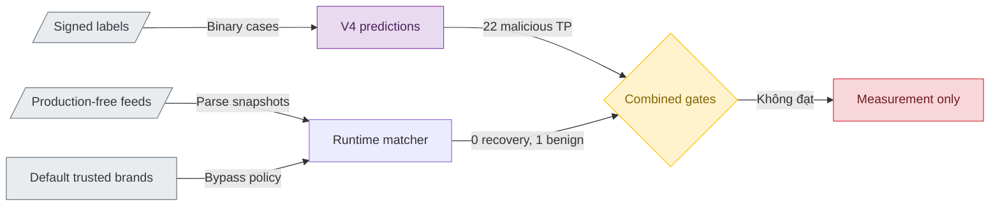

# Đánh giá threat context của preset production-free

> **Tài liệu Living Document** — Cập nhật đồng bộ mỗi khi có thay đổi.
> Tuân thủ quy tắc tại `.agents/AGENTS.md` Section 5.

## Tóm tắt (Abstract)

Candidate v4 chỉ phát hiện `22/34` representative malicious case tại threshold `0,92`, vì vậy hệ thống cần đo phần coverage mà runtime threat context bổ sung trước khi tiếp tục thay đổi model. Evaluation ngày 2026-08-24 dùng snapshot mới của đúng hai nguồn trong preset `production-free`, parser hiện hữu, exact/parent-suffix matching, TTL `336` giờ và `analysis.DefaultTrustedBrands`. Hai feed không phục hồi case nào trong `12` model false-negative; combined malicious recall giữ nguyên `22/34`. OpenPhish lại match một representative benign case do URL indicator được collapse xuống hostname, làm combined benign false positive tăng từ `0/25` lên `1/25`. Whitelist không được giả lập vì local SQLite có `0` row và endpoint Tranco mặc định không cung cấp snapshot tại thời điểm thu thập. Kết quả chỉ là measurement evidence; candidate v4 và preset context này không đủ điều kiện release.

## Sơ đồ Tổng quan

## Evaluation production-free ngày 2026-08-24

### Mục tiêu (Objectives)

- Đo incremental malicious recall của threat feeds trên đúng `12` false-negative của model v4, không dùng kết quả để tuning frozen packet.
- Phát hiện benign collision phát sinh từ parser, suffix matching hoặc trusted-brand bypass trước khi thay đổi traffic scope.
- Tạo report aggregate có checksum, không commit domain hoặc case-level prediction mới.
- Dừng nghiên cứu feed expansion nếu preset hiện tại không tạo positive marginal value.

### Phương pháp & Lý do (Methodology & Rationale)

| Quyết định | Phương pháp chọn | Các phương pháp thay thế | Lý do |
|---|---|---|---|
| Feed scope | URLhaus Recent và OpenPhish Community theo `production-free` | Thêm PhishDestroy, Phishing.Database hoặc source trả phí | Giữ nguyên traffic/source policy hiện tại và đo marginal value trước khi mở rộng |
| Matching | Tái sử dụng `risk.ThreatFeedCandidates` và `feed.Parse` | Viết matcher Python riêng; replay Redis đang chạy | Dùng cùng normalization, URL-to-host collapse và parent suffix semantics với runtime mà không cần service state |
| Model join | Prediction v4 từng case ở threshold `0,92`, lưu Git-ignored và pin SHA-256 | Chỉ so aggregate `22/34`; export/provision bundle | Cho phép đo overlap/feed-only recovery mà không tạo bundle release cho candidate `NO-GO` |
| Freshness | `as_of`, `collected_at`, stale `36` giờ và TTL `336` giờ nằm trong protocol | Coi mọi snapshot là active; dùng thời gian chạy không pin | Kết quả tái lập và phản ánh expiry policy của feed sync |
| Whitelist | Khai báo `not_simulated` | Giả định Tranco có domain; dùng nguồn top-domain khác | Local SQLite rỗng và endpoint cấu hình unavailable; thay nguồn sẽ không còn khớp runtime scope |
| Report detail | Aggregate theo label/source, không có case ID/domain | Commit danh sách residual và matched cases | Giảm nguy cơ dùng frozen packet như danh sách hard-coded remediation |

### Cách thức Thực hiện (Implementation Details)

CLI `cmd/threat-context-eval` đọc protocol checksum-pinned, xác minh signed labels có đúng `34` malicious và `25` benign rows, rồi kiểm tra prediction JSONL khớp `case_id`, normalized domain, label và threshold action. Mỗi source được hash trước khi parse; source quá TTL bị loại khỏi matching. Runtime kiểm tra trusted-brand bypass trước exact/parent-suffix membership. Source attribution là non-exclusive nhưng combined coverage dùng union theo case.

OpenPhish snapshot có `300` URL lines, được parser rút còn `201` hostname unique; URLhaus có `5.292` hostname unique. Một OpenPhish URL trên domain đã được signed review là benign tạo exact hostname collision. Tài liệu không ghi domain/case ID và không thay đổi signed evidence.

AI agent sử dụng Codex (GPT-5) với chiến lược bounded-scope, checksum-first và stop-on-marginal-value. Số subagent là `0`; không dùng voting. Kiểm soát chất lượng gồm unit tests cho union, trusted-brand bypass, checksum drift và TTL expiry, Python prediction validation, full Go/Python tests và diff audit. Con người vẫn giữ quyền duyệt label, rollout và mọi thay đổi traffic scope.

### Số liệu (Metrics & Results)

| Chỉ số | Model v4 | Feed bổ sung | Combined |
|---|---:|---:|---:|
| Malicious TP / 34 | 22 | 0 feed-only | 22 |
| Malicious false-negative / 34 | 12 | 0 recovered | 12 |
| Recovery trên model false-negative | n/a | 0/12 = 0% | 0% |
| Benign FP / 25 | 0 | 1 feed-only | 1 |
| Trusted-brand bypass / 59 binary cases | n/a | 0 | 0 |
| Exact / suffix feed matches | n/a | 1 / 0 | 1 / 0 |

| Source | Unique valid | Invalid | Duplicate | Malicious match | Benign match |
|---|---:|---:|---:|---:|---:|
| OpenPhish Community | 201 | 0 | 99 | 0 | 1 |
| URLhaus Recent | 5.292 | 9 | 10.842 | 0 | 0 |

Hai source đều fresh và chưa expired tại `as_of=2026-08-24T11:40:09Z`. Feed context không tạo incremental malicious recall trên packet này và làm xấu benign guardrail. Parser hoạt động theo contract hiện tại; collision xuất phát từ việc URL-level indicator được nâng thành domain-level block, không phải lỗi checksum hay suffix matching.

Quyết định là `MEASUREMENT_ONLY_MODEL_REMAINS_NO_GO`. Không sync Redis, export/provision model, restart service, đổi preset hoặc bật enforce.

### Liên kết Artifacts

- CLI: `cmd/threat-context-eval/`
- Protocol: `ml/configs/threat-context-production-free-20260824.json`
- Aggregate report: `ml/experiments/threat-context-production-free-20260824.json`
- Prediction exporter: `ml/src/evaluate_time_forward_candidate.py`
- ML false-negative analysis: `docs/research/ml/representative-false-negative-analysis.md`
- Raw feed snapshots và case-level predictions: `ml/data/derived/threat-context-20260824/` (Git-ignored)

---

## Lịch sử Thay đổi (Version History)

| Ngày | Thay đổi | Tác giả |
|---|---|---|
| 2026-08-24 | Thêm checksum-pinned production-free context evaluation; ghi nhận `0/12` recovery và `1/25` benign collision | Codex (GPT-5) |
