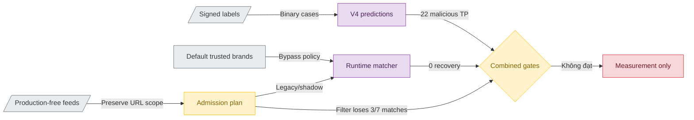

# Đánh giá threat context của preset production-free

> **Tài liệu Living Document** — Cập nhật đồng bộ mỗi khi có thay đổi.
> Tuân thủ quy tắc tại `.agents/AGENTS.md` Section 5.

## Tóm tắt (Abstract)

Candidate v4 chỉ phát hiện `22/34` representative malicious case tại threshold `0,92`. Evaluation ngày 2026-08-24 cho thấy preset `production-free` không phục hồi case nào trong `12` model false-negative và tạo một benign collision vì URL indicator bị nâng thành domain-level block. Ablation tiếp theo bảo toàn URL scope và chỉ coi host là authoritative khi indicator mô tả toàn host, dùng IP, hoặc có ít nhất hai URL resource khác nhau. Candidate xóa cả representative collision và collision trên `152.923` benign final-test rows, đồng thời giữ `94,52%` feed hosts. Tuy nhiên, nó chỉ giữ `4/7` malicious matches trên broad final test. Filter vì vậy là `NO-GO`; runtime giữ nguyên semantics và chỉ bổ sung shadow telemetry. Whitelist không được giả lập, signed evidence không bị sửa, không có Redis write, traffic change hoặc enforce rollout.

## Sơ đồ Tổng quan

## Evaluation production-free ngày 2026-08-24

### Mục tiêu (Objectives)

- Đo incremental malicious recall của threat feeds trên đúng `12` false-negative của model v4, không dùng kết quả để tuning frozen packet.
- Phát hiện benign collision phát sinh từ parser, suffix matching hoặc trusted-brand bypass trước khi thay đổi traffic scope.
- Tạo report aggregate có checksum, không commit domain hoặc case-level prediction mới.
- Dừng nghiên cứu feed expansion nếu preset hiện tại không tạo positive marginal value.

### Phương pháp & Lý do (Methodology & Rationale)

| Quyết định | Phương pháp chọn | Các phương pháp thay thế | Lý do |
|---|---|---|---|
| Feed scope | URLhaus Recent và OpenPhish Community theo `production-free` | Thêm PhishDestroy, Phishing.Database hoặc source trả phí | Giữ nguyên traffic/source policy hiện tại và đo marginal value trước khi mở rộng |
| Matching | Tái sử dụng `risk.ThreatFeedCandidates` và `feed.Parse` | Viết matcher Python riêng; replay Redis đang chạy | Dùng cùng normalization, URL-to-host collapse và parent suffix semantics với runtime mà không cần service state |
| Model join | Prediction v4 từng case ở threshold `0,92`, lưu Git-ignored và pin SHA-256 | Chỉ so aggregate `22/34`; export/provision bundle | Cho phép đo overlap/feed-only recovery mà không tạo bundle release cho candidate `NO-GO` |
| Freshness | `as_of`, `collected_at`, stale `36` giờ và TTL `336` giờ nằm trong protocol | Coi mọi snapshot là active; dùng thời gian chạy không pin | Kết quả tái lập và phản ánh expiry policy của feed sync |
| Whitelist | Khai báo `not_simulated` | Giả định Tranco có domain; dùng nguồn top-domain khác | Local SQLite rỗng và endpoint cấu hình unavailable; thay nguồn sẽ không còn khớp runtime scope |
| Report detail | Aggregate theo label/source, không có case ID/domain | Commit danh sách residual và matched cases | Giảm nguy cơ dùng frozen packet như danh sách hard-coded remediation |

### Cách thức Thực hiện (Implementation Details)

CLI `cmd/threat-context-eval` đọc protocol checksum-pinned, xác minh signed labels có đúng `34` malicious và `25` benign rows, rồi kiểm tra prediction JSONL khớp `case_id`, normalized domain, label và threshold action. Mỗi source được hash trước khi parse; source quá TTL bị loại khỏi matching. Runtime kiểm tra trusted-brand bypass trước exact/parent-suffix membership. Source attribution là non-exclusive nhưng combined coverage dùng union theo case.

OpenPhish snapshot có `300` URL lines, được parser rút còn `201` hostname unique; URLhaus có `5.292` hostname unique. Một OpenPhish URL trên domain đã được signed review là benign tạo exact hostname collision. Tài liệu không ghi domain/case ID và không thay đổi signed evidence.

AI agent sử dụng Codex (GPT-5) với chiến lược bounded-scope, checksum-first và stop-on-marginal-value. Số subagent là `0`; không dùng voting. Kiểm soát chất lượng gồm unit tests cho union, trusted-brand bypass, checksum drift và TTL expiry, Python prediction validation, full Go/Python tests và diff audit. Con người vẫn giữ quyền duyệt label, rollout và mọi thay đổi traffic scope.

### Số liệu (Metrics & Results)

| Chỉ số | Model v4 | Feed bổ sung | Combined |
|---|---:|---:|---:|
| Malicious TP / 34 | 22 | 0 feed-only | 22 |
| Malicious false-negative / 34 | 12 | 0 recovered | 12 |
| Recovery trên model false-negative | n/a | 0/12 = 0% | 0% |
| Benign FP / 25 | 0 | 1 feed-only | 1 |
| Trusted-brand bypass / 59 binary cases | n/a | 0 | 0 |
| Exact / suffix feed matches | n/a | 1 / 0 | 1 / 0 |

| Source | Unique valid | Invalid | Duplicate | Malicious match | Benign match |
|---|---:|---:|---:|---:|---:|
| OpenPhish Community | 201 | 0 | 99 | 0 | 1 |
| URLhaus Recent | 5.292 | 9 | 10.842 | 0 | 0 |

Hai source đều fresh và chưa expired tại `as_of=2026-08-24T11:40:09Z`. Feed context không tạo incremental malicious recall trên packet này và làm xấu benign guardrail. Parser hoạt động theo contract hiện tại; collision xuất phát từ việc URL-level indicator được nâng thành domain-level block, không phải lỗi checksum hay suffix matching.

Quyết định là `MEASUREMENT_ONLY_MODEL_REMAINS_NO_GO`. Không sync Redis, export/provision model, restart service, đổi preset hoặc bật enforce.

### Liên kết Artifacts

- CLI: `cmd/threat-context-eval/`
- Protocol: `ml/configs/threat-context-production-free-20260824.json`
- Aggregate report: `ml/experiments/threat-context-production-free-20260824.json`
- Prediction exporter: `ml/src/evaluate_time_forward_candidate.py`
- ML false-negative analysis: `docs/research/ml/representative-false-negative-analysis.md`
- Raw feed snapshots và case-level predictions: `ml/data/derived/threat-context-20260824/` (Git-ignored)

## Ablation URL-host admission ngày 2026-08-24

### Mục tiêu (Objectives)

- Loại bỏ việc một URL có path mặc nhiên trở thành domain-level hard block.
- Giữ coverage của feed đủ cao để thay đổi không chỉ cải thiện benign metric bằng cách bỏ phần lớn malicious evidence.
- Tách evaluation/filter khỏi runtime rollout; chỉ shadow telemetry được phép đi vào đường sync ở giai đoạn này.
- Không dùng domain hoặc case cụ thể làm allowlist/rule và không sửa signed evidence.

### Phương pháp & Lý do (Methodology & Rationale)

| Quyết định | Phương pháp chọn | Phương án đã loại | Lý do |
|---|---|---|---|
| Evidence scope | Parser giữ `domain` so với `url`, path/query/fragment scope và distinct resource | Collapse URL ngay xuống hostname | Giữ thông tin cần thiết để admission có semantics rõ ràng |
| Corroboration | Domain indicator, root URL, IP URL hoặc ít nhất hai resource khác nhau là authoritative | Bỏ mọi URL có path; chỉ giữ root URL | Hai phương án thay thế làm mất quá nhiều URLhaus/OpenPhish coverage |
| Cohort benign | Toàn bộ `152.923` benign rows của frozen v4 final test và `25` signed representative benign cases | Chỉ kiểm tra collision đã biết | Tránh tối ưu rule theo một frozen case |
| Cohort malicious | `133.881` malicious final-test rows, candidate subset và retention trên toàn feed host set | Chỉ dùng số URL được feed tự gắn nhãn | Đo cả indicator retention lẫn khả năng giữ domain matches đã có |
| Runtime | Legacy vẫn là default; shadow ghi aggregate stats; filter chỉ chạy dry-run/evaluation | Bật filter trong agent sync | Candidate không đạt malicious-retention guardrail; sync additive cũng chưa có per-source removal an toàn |

Ablation này là exploratory/post-hoc vì aggregate final-test metrics đã được xem trong lúc thiết kế policy. Nó không được dùng làm release evidence hay để chọn một ngưỡng mới. Guardrail dùng để bác bỏ filter là giữ ít nhất `80%` broad malicious matches; candidate chỉ đạt `57,14%`.

### Cách thức Thực hiện (Implementation Details)

`feed.ParseEachIndicator` giữ loại indicator và URL resource scope nhưng vẫn bảo toàn contract cũ của `feed.ParseEach`: callback domain chỉ nhận unique normalized domain, còn `ParseStats.Valid` và `Duplicates` không đổi. `feed.PlanAdmission` gom aggregate host state trong một source snapshot. Duplicate y hệt không được tính là corroboration; resource path/query/fragment thứ hai mới nâng host thành authoritative. IP URL được giữ authoritative vì IP đã là identity hẹp nhất mà domain engine có thể xử lý.

`feed.Sync` hỗ trợ ba mode. `legacy` không đổi hành vi. `corroborated-url-host-shadow` tính và lưu aggregate admission stats trong source status nhưng vẫn ghi toàn bộ legacy host set. `corroborated-url-host-filter` bị từ chối nếu không phải dry-run. Khóa này tránh người vận hành vô tình giảm coverage và tránh giả định rằng additive multi-source Redis set có thể thu hồi an toàn membership của từng source.

`cmd/threat-context-eval` dùng chính `feed.PlanAdmission`, checksum-pinned protocol và runtime matcher để replay representative packet. Broad final-test audit chỉ xuất aggregate counts; report không chứa domain/case ID. AI agent là Codex (GPT-5), dùng `0` subagent và không voting. Con người vẫn duyệt mọi push, restart, traffic scope, deploy và enforce change.

### Số liệu (Metrics & Results)

| Chỉ số | Legacy | Candidate | Chênh lệch |
|---|---:|---:|---:|
| Unique feed hosts | 5.493 | 5.192 authoritative | giữ 94,52% |
| Contextual singleton path hosts | 0 | 301 | +301 shadow signals |
| Broad benign matches / 152.923 | 1 | 0 | -1 |
| Broad malicious matches / 133.881 | 7 | 4 | -3 |
| Broad matched-malicious retention | 100% | 57,14% | -42,86 điểm % |
| Candidate malicious matches | 1 | 1 | không đổi |
| Representative benign feed-only FP / 25 | 1 | 0 | -1 |
| Representative malicious TP / 34 | 22 | 22 | không đổi |

Theo source snapshot, OpenPhish giữ `147/201` authoritative hosts (`73,13%`) và URLhaus giữ `5.045/5.292` (`95,33%`). Union vẫn cao vì phần lớn URLhaus IP/host evidence được giữ, nhưng domain matches mất `3/7`; chỉ số host retention vì vậy không đủ đại diện cho security coverage.

Quyết định là `NO_GO_FILTER_SHADOW_ONLY`. Giá trị được đưa vào sản phẩm là provenance-aware parser, dry-run ablation và shadow telemetry không đổi verdict. Filter không được kích hoạt.

### Liên kết Artifacts

- Admission implementation: `internal/feed/admission.go`
- Candidate protocol: `ml/configs/threat-context-url-admission-20260824.json`
- Representative report: `ml/experiments/threat-context-url-admission-20260824.json`
- Broad aggregate ablation: `ml/experiments/url-host-admission-ablation-20260824.json`

---

## Lịch sử Thay đổi (Version History)

| Ngày | Thay đổi | Tác giả |
|---|---|---|
| 2026-08-24 | Thêm provenance-aware URL admission, broad ablation và shadow-only decision; filter không đạt malicious-retention guardrail | Codex (GPT-5) |
| 2026-08-24 | Thêm checksum-pinned production-free context evaluation; ghi nhận `0/12` recovery và `1/25` benign collision | Codex (GPT-5) |
