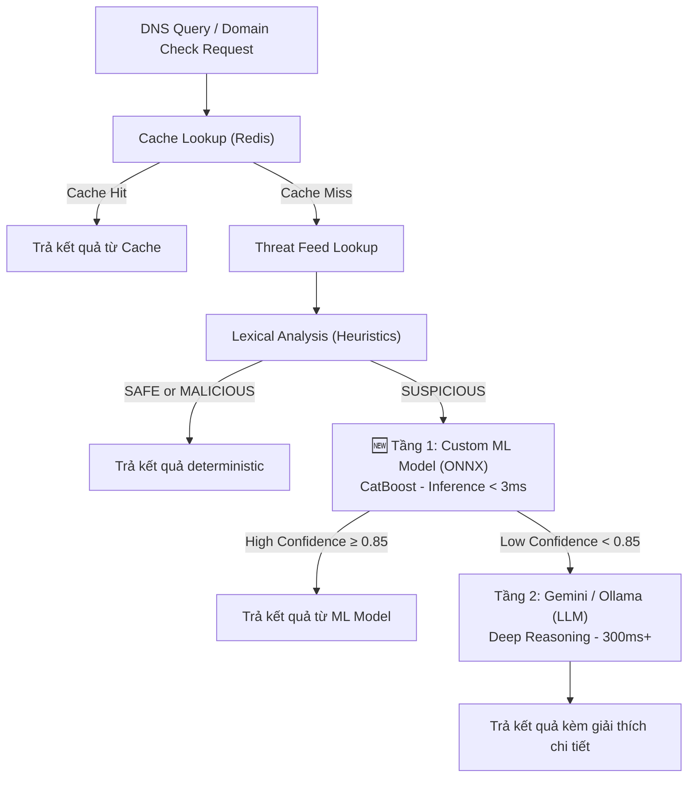

# Custom Domain Threat Detection AI Engine cho Safe Zone

## Bối cảnh & Mục tiêu

Safe Zone hiện dùng **Gemini API / Ollama** như một lớp AI bổ sung (secondary refinement) để đánh giá các domain có kết quả phân tích mơ hồ (`SUSPICIOUS`). Tuy nhiên, cách tiếp cận này có hạn chế:

- **Latency cao** (300ms – 2000ms mỗi request qua API).
- **Rate-limit** (Gemini Free Tier: 15 req/phút).
- **Không chuyên biệt** cho bài toán phát hiện domain độc hại.
- **Phụ thuộc bên ngoài** (Internet, API Key, nhà cung cấp).

### Mục tiêu mới

Huấn luyện một **Custom ML Model chuyên biệt cho phân tích Domain** sử dụng **CatBoost** kết hợp **Feature Engineering + Character N-gram Embedding**, export sang **ONNX** và nhúng trực tiếp vào Go backend.

| Chỉ tiêu | Gemini API (hiện tại) | Custom ML Model (mục tiêu) |
| :--- | :--- | :--- |
| Latency | 300ms – 2,000ms | **< 3ms** |
| Throughput | 15 req/phút (free) | **> 10,000 req/giây** |
| Chi phí API | Tốn tiền khi vượt quota | **0đ** |
| Kích thước model | N/A (cloud) | **~5 – 20 MB** trên RAM |
| Offline | ❌ Cần Internet | ✅ 100% Offline |
| Chuyên biệt domain | ❌ Model đa dụng | ✅ Train riêng cho domain detection |

---

## Kiến trúc tổng thể sau tích hợp (2-Tier AI Pipeline)



### Vị trí tích hợp trong codebase hiện tại

Dựa trên luồng xử lý hiện tại trong [service.go](file:///d:/Quorix/services/safe-zone/internal/risk/service.go):

```
Cache → Threat Feed → Lexical Analysis → [AI Refinement] → OSINT → Cache Save
```

Custom ML Model sẽ được chèn vào **trước** bước gọi Gemini/Ollama trong hàm `refineWithAI()`. Nếu ML Model trả về kết quả với confidence cao (≥ 0.85), sẽ **bỏ qua** việc gọi LLM API, tiết kiệm latency và chi phí.

---

## PHẦN 1: Hướng phát triển thống nhất

### 1.1. Thuật toán: CatBoost Classifier

**Lý do chọn CatBoost thay vì các lựa chọn khác:**

| Thuật toán | Phù hợp? | Lý do |
| :--- | :--- | :--- |
| **CatBoost** | ✅ **CHỌN** | Xử lý Categorical Features (TLD, Registrar) tự nhiên; Tốc độ inference cực nhanh; Export ONNX dễ dàng; Accuracy thường cao hơn XGBoost trên dữ liệu có mixed features |
| XGBoost / LightGBM | ✅ Tốt | Nhanh, phổ biến, nhưng cần One-Hot Encoding thủ công cho Categorical |
| TabPFN | ❌ | Không scale được > 10,000 mẫu |
| TabNet / TabFM | ❌ | Chậm hơn 10-50x so với CatBoost, accuracy không vượt trội |
| GPT / Gemini | ❌ (cho Tầng 1) | Latency 500ms+, chi phí cao, hallucination |

### 1.2. Chiến lược Vector hóa: Kết hợp Feature Engineering + Character Embedding

Sử dụng phương pháp **Early Fusion (Concatenation)**:

```
Final Vector = [Handcrafted Features (18-22 chiều)] + [Char N-gram TF-IDF (64-128 chiều)]
             = Vector tổng cộng ~90-150 chiều
```

#### Nhóm A: Handcrafted Features (18-22 chiều)

| # | Feature | Mô tả | Phát hiện |
| :--- | :--- | :--- | :--- |
| 1 | `domain_length` | Độ dài toàn bộ domain string | Phishing domain thường dài bất thường |
| 2 | `subdomain_depth` | Số lượng subdomain (đếm dấu `.`) | Subdomain sâu = nghi vấn |
| 3 | `domain_name_length` | Độ dài phần domain chính (không có TLD) | — |
| 4 | `num_hyphens` | Số lượng dấu `-` | `vietcombank-login-verify.com` |
| 5 | `num_digits` | Số lượng chữ số | `v1etc0mbank.com` |
| 6 | `digit_ratio` | Tỷ lệ chữ số / tổng ký tự | DGA domains có digit ratio cao |
| 7 | `vowel_ratio` | Tỷ lệ nguyên âm / phụ âm | Chuỗi ngẫu nhiên có vowel ratio bất thường |
| 8 | `shannon_entropy` | Entropy Shannon của chuỗi domain | DGA detection (entropy > 4.0 = nghi vấn) |
| 9 | `has_punycode` | Domain chứa `xn--` (IDN homograph attack) | `xn--vietcmbank.com` |
| 10 | `has_ip_pattern` | Domain chứa pattern IP address | `192-168-1-1.malware.com` |
| 11 | `num_special_chars` | Số ký tự đặc biệt (ngoài chữ cái, số, `.`, `-`) | — |
| 12 | `max_consonant_seq` | Chuỗi phụ âm liên tiếp dài nhất | Chuỗi ngẫu nhiên = DGA |
| 13 | `tld_risk_score` | Điểm rủi ro của TLD (`.xyz`=8, `.top`=7, `.vn`=1, `.com`=2) | TLD giá rẻ hay bị lạm dụng |
| 14 | `brand_similarity_max` | Điểm Levenshtein cao nhất so với danh sách thương hiệu | Typosquatting detection |
| 15 | `brand_similarity_brand` | Index của thương hiệu bị nhái nhiều nhất (categorical) | Biết domain đang nhái thương hiệu nào |
| 16 | `homoglyph_score` | Điểm tương đồng ký tự thị giác (o→0, l→1, a→@) | Visual spoofing |
| 17 | `num_tokens` | Số "từ" tách bằng `-` hoặc `.` | `login-verify-account-update.com` |
| 18 | `contains_phishing_keywords` | Chứa từ khóa phishing (`login`, `verify`, `secure`, `update`, `bank`) | Keyword-based phishing |
| 19 | `is_free_hosting` | Domain thuộc free hosting/dynamic DNS (`*.duckdns.org`, `*.ngrok.io`) | Free hosting abuse |
| 20 | `whois_age_days` | Tuổi domain (ngày) từ WHOIS (nếu có, nếu không = -1) | Domain mới = rủi ro cao |

#### Nhóm B: Character N-gram TF-IDF (64-128 chiều)

- Chia domain thành các cụm **2-gram và 3-gram ký tự** (ví dụ: `"vie"`, `"iet"`, `"etc"`, `"om"`).
- Dùng `TfidfVectorizer(analyzer='char', ngram_range=(2,3), max_features=128)` từ scikit-learn.
- Kết quả: Vector 128 chiều biểu diễn "dấu vân tay ký tự" của domain.
- **Lợi ích**: Máy tự học được các pattern ẩn mà Feature Engineering thủ công không bao phủ hết (ví dụ: các cụm ký tự phổ biến trong domain DGA Botnet).

### 1.3. Vai trò của Gemini / Ollama sau khi có Custom Model

Gemini / Ollama **KHÔNG bị loại bỏ**, mà chuyển vai trò:

| Vai trò | Trước (hiện tại) | Sau khi có Custom Model |
| :--- | :--- | :--- |
| **Tầng 1 (Real-time Filter)** | Gemini/Ollama xử lý mọi domain SUSPICIOUS | 🆕 **Custom ML Model** xử lý (< 3ms) |
| **Tầng 2 (Deep Investigation)** | Không có | Gemini/Ollama chỉ xử lý khi ML Model **không chắc chắn** (confidence < 0.85) |
| **Tầng 3 (SOC Dashboard Explain)** | Không có | Gemini/Ollama sinh **báo cáo giải thích chi tiết** bằng tiếng Việt khi SOC Analyst bấm "Phân tích chi tiết" |

---

## PHẦN 2: Chuẩn bị chi tiết

### 2.1. Datasets (Dữ liệu huấn luyện)

#### Dữ liệu Benign (Tên miền sạch) — Mục tiêu: 50,000 - 100,000 mẫu

| Nguồn | URL | Mô tả | Định dạng |
| :--- | :--- | :--- | :--- |
| **Tranco Top 1M** | [tranco-list.eu](https://tranco-list.eu/) | Top 1 triệu domain phổ biến nhất thế giới (tổng hợp từ nhiều nguồn) | CSV (`rank,domain`) |
| **Cisco Umbrella Top 1M** | [s3-us-west-1.amazonaws.com/umbrella-static/top-1m.csv.zip](http://s3-us-west-1.amazonaws.com/umbrella-static/top-1m.csv.zip) | Top 1 triệu domain từ Cisco DNS resolver | CSV |
| **Danh sách VN chính thống** | Tự tổng hợp | Các domain `.gov.vn`, `.edu.vn`, ngân hàng, báo chí, telco VN | Manual |

#### Dữ liệu Malicious (Tên miền độc hại) — Mục tiêu: 50,000 - 100,000 mẫu

| Nguồn | URL | Mô tả | Định dạng |
| :--- | :--- | :--- | :--- |
| **PhishTank** | [phishtank.org/developer_info.php](https://phishtank.org/developer_info.php) | Database phishing URLs được xác minh bởi cộng đồng | JSON / CSV |
| **URLhaus (abuse.ch)** | [urlhaus.abuse.ch/downloads/csv_recent](https://urlhaus.abuse.ch/downloads/csv_recent/) | Danh sách URLs phát tán malware | CSV |
| **OpenPhish** | [openphish.com/feed.txt](https://openphish.com/feed.txt) | Feed phishing URLs cập nhật liên tục | Text (1 URL/dòng) |
| **DGArchive / Bambenek** | [osint.bambenekconsulting.com/feeds](https://osint.bambenekconsulting.com/feeds/) | DGA domain feeds (Botnet C2) | Text |
| **Safe Zone Internal Feeds** | `data/` directory trong project | Các threat feed đã tích hợp sẵn | Có sẵn |

> [!IMPORTANT]
> **Cân bằng dữ liệu**: Tỷ lệ Benign : Malicious nên là **1:1** hoặc **60:40**. Nếu lệch quá (ví dụ 95% Benign, 5% Malicious), model sẽ thiên lệch (biased) và bỏ sót domain độc hại. Nếu dữ liệu Malicious ít hơn, dùng kỹ thuật **SMOTE** hoặc **class_weight='balanced'** trong CatBoost.

> [!TIP]
> **Dữ liệu đặc thù Việt Nam**: Bạn nên bổ sung thêm các domain giả mạo thương hiệu VN (Vietcombank, Techcombank, Shopee, MoMo, VTV, VNPT, EVN...) thu thập từ các nguồn cảnh báo của NCSC Vietnam và kinh nghiệm thực tế. Đây là lợi thế cạnh tranh lớn mà các model AI chung không có.

### 2.2. Danh sách Thương hiệu Việt Nam (Brand List)

File [internal/analysis/brand.go](file:///d:/Quorix/services/safe-zone/internal/analysis/brand.go) đã có sẵn danh sách trusted brands và logic Levenshtein/Homoglyph. Bạn cần **export danh sách này ra Python** để dùng làm Feature Engineering thống nhất giữa Training và Inference.

### 2.3. Môi trường & Công cụ

#### Python (Training & Export)

```
# Tạo virtual environment
python -m venv .venv
source .venv/bin/activate   # Linux/Mac
.venv\Scripts\activate      # Windows

# Cài đặt thư viện
pip install pandas numpy scikit-learn catboost onnx skl2onnx onnxmltools
pip install tldextract python-Levenshtein matplotlib seaborn jupyter
```

| Thư viện | Phiên bản khuyến nghị | Mục đích |
| :--- | :--- | :--- |
| `pandas` | >= 2.0 | Đọc/xử lý dataset CSV |
| `numpy` | >= 1.24 | Tính toán số học |
| `scikit-learn` | >= 1.3 | TF-IDF Vectorizer, train/test split, metrics |
| `catboost` | >= 1.2 | Thuật toán CatBoost Classifier |
| `tldextract` | >= 5.0 | Tách subdomain / domain / TLD chính xác |
| `python-Levenshtein` | >= 0.21 | Tính khoảng cách tương đồng thương hiệu |
| `onnx` | >= 1.14 | Định dạng model chuẩn |
| `onnxmltools` | >= 1.12 | Export CatBoost → ONNX |
| `matplotlib` / `seaborn` | — | Vẽ biểu đồ đánh giá model |
| `jupyter` | — | Notebook tương tác (tùy chọn) |

#### Go (Inference trong Safe Zone)

| Dependency | Mục đích |
| :--- | :--- |
| `github.com/yalue/onnxruntime_go` | Load và chạy inference model ONNX trong Go |
| ONNX Runtime shared library | File `.dll` (Windows) / `.so` (Linux) cần đặt cùng binary |

#### Phần cứng

| Bước | Yêu cầu tối thiểu | Khuyến nghị |
| :--- | :--- | :--- |
| Training (Python) | CPU 4 cores, 8GB RAM | Google Colab (miễn phí) hoặc máy local |
| Inference (Go) | CPU 1 core, 512MB RAM | Đã đủ — model ONNX chỉ chiếm ~5-20MB |

> [!NOTE]
> **Không cần GPU!** CatBoost train trên CPU với 100,000 mẫu chỉ mất **1-5 phút**. Inference ONNX mất **< 1ms** trên CPU.

---

## PHẦN 3: Các bước thực hiện chi tiết

### Phase 1: Thu thập & Chuẩn bị Dữ liệu

> **Thời gian ước tính: 1-2 ngày**

#### Bước 1.1: Tải Datasets

```bash
# Tạo thư mục làm việc
mkdir -p ml/data/raw ml/data/processed ml/models ml/notebooks

# Tải Tranco Top 1M (Benign)
curl -L "https://tranco-list.eu/download/ZQ946/full" -o ml/data/raw/tranco_top1m.csv

# Tải PhishTank (Malicious) — cần đăng ký API Key miễn phí
curl -L "http://data.phishtank.com/data/online-valid.csv" -o ml/data/raw/phishtank.csv

# Tải URLhaus (Malicious)
curl -L "https://urlhaus.abuse.ch/downloads/csv_recent/" -o ml/data/raw/urlhaus.csv
```

#### Bước 1.2: Làm sạch & Gán nhãn (Labeling)

```python
# ml/notebooks/01_prepare_data.py

import pandas as pd
from urllib.parse import urlparse
import tldextract

# --- Load Benign ---
tranco = pd.read_csv("ml/data/raw/tranco_top1m.csv", header=None, names=["rank", "domain"])
benign = tranco["domain"].head(50000).to_frame()  # Lấy top 50K
benign["label"] = 0  # 0 = SAFE

# --- Load Malicious (PhishTank) ---
phish = pd.read_csv("ml/data/raw/phishtank.csv")
phish["domain"] = phish["url"].apply(lambda u: tldextract.extract(u).fqdn)
malicious_phish = phish[["domain"]].drop_duplicates().head(30000)
malicious_phish["label"] = 1  # 1 = MALICIOUS

# --- Load Malicious (URLhaus) ---
urlhaus = pd.read_csv("ml/data/raw/urlhaus.csv", comment="#", 
                       names=["id","dateadded","url","url_status","last_online",
                              "threat","tags","urlhaus_link","reporter"])
urlhaus["domain"] = urlhaus["url"].apply(lambda u: tldextract.extract(str(u)).fqdn)
malicious_urlhaus = urlhaus[["domain"]].drop_duplicates().head(20000)
malicious_urlhaus["label"] = 1

# --- Gộp & Shuffle ---
dataset = pd.concat([benign, malicious_phish, malicious_urlhaus], ignore_index=True)
dataset = dataset.drop_duplicates(subset="domain").sample(frac=1, random_state=42).reset_index(drop=True)
dataset.to_csv("ml/data/processed/domain_dataset.csv", index=False)

print(f"Total: {len(dataset)} | Benign: {(dataset.label==0).sum()} | Malicious: {(dataset.label==1).sum()}")
```

---

### Phase 2: Feature Engineering & Vectorization

> **Thời gian ước tính: 1-2 ngày**

#### Bước 2.1: Viết Feature Extractor

```python
# ml/feature_extractor.py

import math
import re
import tldextract
import Levenshtein

# Danh sách thương hiệu VN (sync từ internal/analysis/brand.go)
VN_BRANDS = [
    "vietcombank", "techcombank", "mbbank", "tpbank", "vpbank", "bidv",
    "agribank", "sacombank", "acb", "hdbank", "vietinbank", "shinhanbank",
    "shopee", "lazada", "tiki", "sendo", "momo", "zalopay", "vnpay",
    "viettel", "vnpt", "mobifone", "fpt", "vtv", "vnexpress",
    "facebook", "google", "microsoft", "apple", "amazon", "paypal"
]

# TLD risk scores (higher = more risky)
TLD_RISK = {
    "xyz": 8, "top": 8, "tk": 9, "ml": 9, "ga": 9, "cf": 9, "gq": 9,
    "icu": 7, "buzz": 7, "click": 7, "link": 6, "info": 5, "online": 6,
    "site": 6, "club": 5, "pw": 8, "work": 5, "life": 4,
    "com": 2, "net": 2, "org": 2, "vn": 1, "gov.vn": 0, "edu.vn": 0,
}

PHISHING_KEYWORDS = [
    "login", "signin", "verify", "secure", "update", "confirm",
    "account", "banking", "password", "credential", "wallet",
    "suspend", "locked", "urgent", "alert", "notification"
]

FREE_HOSTING = [
    "duckdns.org", "ngrok.io", "ngrok-free.app", "herokuapp.com",
    "000webhostapp.com", "weebly.com", "blogspot.com", "wordpress.com",
    "netlify.app", "vercel.app", "pages.dev", "workers.dev"
]


def extract_features(domain_str: str) -> dict:
    """Trích xuất Feature Vector từ 1 chuỗi domain."""
    ext = tldextract.extract(domain_str)
    subdomain = ext.subdomain or ""
    domain_name = ext.domain or ""
    tld = ext.suffix or ""
    fqdn = ext.fqdn

    # --- Lexical Features ---
    length = len(fqdn)
    domain_name_len = len(domain_name)
    subdomain_depth = len(subdomain.split(".")) if subdomain else 0
    num_hyphens = fqdn.count("-")
    num_digits = sum(c.isdigit() for c in fqdn)
    num_dots = fqdn.count(".")
    digit_ratio = num_digits / max(length, 1)
    
    # Vowel ratio
    vowels = sum(1 for c in domain_name.lower() if c in "aeiou")
    consonants = sum(1 for c in domain_name.lower() if c.isalpha() and c not in "aeiou")
    vowel_ratio = vowels / max(vowels + consonants, 1)

    # Shannon Entropy
    if length > 0:
        prob = [float(fqdn.count(c)) / length for c in set(fqdn)]
        entropy = -sum(p * math.log2(p) for p in prob if p > 0)
    else:
        entropy = 0.0

    # Max consecutive consonant sequence
    consonant_seqs = re.findall(r"[^aeiou0-9.\-]+", domain_name.lower())
    max_consonant_seq = max((len(s) for s in consonant_seqs), default=0)

    # Special patterns
    has_punycode = 1 if "xn--" in fqdn else 0
    has_ip_pattern = 1 if re.search(r"\d{1,3}[.\-]\d{1,3}[.\-]\d{1,3}[.\-]\d{1,3}", fqdn) else 0
    num_special = sum(1 for c in fqdn if not c.isalnum() and c not in ".-")

    # Token count (words separated by - or .)
    num_tokens = len(re.split(r"[-.]", fqdn))

    # --- TLD Risk ---
    tld_risk = TLD_RISK.get(tld.lower(), 3)  # default = 3 (unknown)

    # --- Brand Similarity (Levenshtein) ---
    brand_scores = [(Levenshtein.ratio(domain_name.lower(), brand), i) 
                    for i, brand in enumerate(VN_BRANDS)]
    best_score, best_brand_idx = max(brand_scores, key=lambda x: x[0])
    
    # --- Homoglyph Score (simplified) ---
    homoglyph_map = {"0": "o", "1": "l", "3": "e", "5": "s", "@": "a", "!": "i"}
    decoded = "".join(homoglyph_map.get(c, c) for c in domain_name.lower())
    homoglyph_scores = [Levenshtein.ratio(decoded, brand) for brand in VN_BRANDS]
    homoglyph_score = max(homoglyph_scores) if homoglyph_scores else 0.0

    # --- Phishing Keywords ---
    keyword_count = sum(1 for kw in PHISHING_KEYWORDS if kw in fqdn.lower())

    # --- Free Hosting ---
    is_free_hosting = 1 if any(fqdn.endswith(fh) for fh in FREE_HOSTING) else 0

    return {
        "domain_length": length,
        "domain_name_length": domain_name_len,
        "subdomain_depth": subdomain_depth,
        "num_hyphens": num_hyphens,
        "num_digits": num_digits,
        "num_dots": num_dots,
        "digit_ratio": round(digit_ratio, 4),
        "vowel_ratio": round(vowel_ratio, 4),
        "shannon_entropy": round(entropy, 4),
        "max_consonant_seq": max_consonant_seq,
        "has_punycode": has_punycode,
        "has_ip_pattern": has_ip_pattern,
        "num_special_chars": num_special,
        "num_tokens": num_tokens,
        "tld_risk_score": tld_risk,
        "brand_similarity_max": round(best_score, 4),
        "brand_similarity_brand_idx": best_brand_idx,
        "homoglyph_score": round(homoglyph_score, 4),
        "phishing_keyword_count": keyword_count,
        "is_free_hosting": is_free_hosting,
    }
```

#### Bước 2.2: Áp dụng Feature Extraction lên toàn bộ Dataset

```python
# ml/notebooks/02_feature_engineering.py

import pandas as pd
from sklearn.feature_extraction.text import TfidfVectorizer
from feature_extractor import extract_features
import numpy as np

# Load dataset
df = pd.read_csv("ml/data/processed/domain_dataset.csv")

# --- Nhóm A: Handcrafted Features ---
print("Extracting handcrafted features...")
features_list = df["domain"].apply(extract_features).tolist()
features_df = pd.DataFrame(features_list)

# --- Nhóm B: Character N-gram TF-IDF Embedding ---
print("Computing character n-gram TF-IDF...")
tfidf = TfidfVectorizer(analyzer="char", ngram_range=(2, 3), max_features=128)
tfidf_matrix = tfidf.fit_transform(df["domain"])
tfidf_df = pd.DataFrame(
    tfidf_matrix.toarray(),
    columns=[f"ngram_{i}" for i in range(tfidf_matrix.shape[1])]
)

# --- Concatenate (Early Fusion) ---
X = pd.concat([features_df, tfidf_df], axis=1)
y = df["label"]

print(f"Final feature vector shape: {X.shape}")  # Expected: (~100K, ~148)

# Save
X.to_csv("ml/data/processed/features_X.csv", index=False)
y.to_csv("ml/data/processed/labels_y.csv", index=False)

# QUAN TRỌNG: Lưu TF-IDF Vectorizer để dùng lúc inference
import joblib
joblib.dump(tfidf, "ml/models/tfidf_vectorizer.joblib")
```

---

### Phase 3: Training CatBoost Model

> **Thời gian ước tính: 1 ngày**

#### Bước 3.1: Train & Evaluate

```python
# ml/notebooks/03_train_catboost.py

import pandas as pd
import numpy as np
from catboost import CatBoostClassifier, Pool
from sklearn.model_selection import train_test_split, StratifiedKFold
from sklearn.metrics import (classification_report, confusion_matrix, 
                             roc_auc_score, precision_recall_curve, f1_score)
import matplotlib.pyplot as plt
import seaborn as sns

# Load features
X = pd.read_csv("ml/data/processed/features_X.csv")
y = pd.read_csv("ml/data/processed/labels_y.csv").values.ravel()

# Train/Test split (80/20, stratified)
X_train, X_test, y_train, y_test = train_test_split(
    X, y, test_size=0.2, random_state=42, stratify=y
)

# Categorical feature indices (brand_similarity_brand_idx, tld_risk_score)
cat_features = ["brand_similarity_brand_idx", "tld_risk_score"]

# CatBoost Training
model = CatBoostClassifier(
    iterations=1000,
    learning_rate=0.05,
    depth=8,
    l2_leaf_reg=3,
    auto_class_weights="Balanced",      # Tự cân bằng nếu data lệch
    eval_metric="F1",
    random_seed=42,
    verbose=100,
    early_stopping_rounds=50,
)

model.fit(
    X_train, y_train,
    eval_set=(X_test, y_test),
    cat_features=cat_features,
    plot=True
)

# --- Evaluation ---
y_pred = model.predict(X_test)
y_prob = model.predict_proba(X_test)[:, 1]

print("\n" + "="*60)
print("CLASSIFICATION REPORT")
print("="*60)
print(classification_report(y_test, y_pred, target_names=["SAFE", "MALICIOUS"]))
print(f"ROC-AUC Score: {roc_auc_score(y_test, y_prob):.4f}")

# Confusion Matrix
cm = confusion_matrix(y_test, y_pred)
plt.figure(figsize=(8, 6))
sns.heatmap(cm, annot=True, fmt="d", cmap="Blues",
            xticklabels=["SAFE", "MALICIOUS"],
            yticklabels=["SAFE", "MALICIOUS"])
plt.title("Confusion Matrix - Domain Threat Detection")
plt.ylabel("Actual")
plt.xlabel("Predicted")
plt.savefig("ml/models/confusion_matrix.png", dpi=150, bbox_inches="tight")
plt.show()

# Feature Importance
importance = model.get_feature_importance(prettified=True)
print("\nTop 15 Most Important Features:")
print(importance.head(15))

# Save CatBoost native model
model.save_model("ml/models/domain_threat_catboost.cbm")
```

> [!IMPORTANT]
> **Mục tiêu chất lượng tối thiểu**:
> - **Precision ≥ 97%** (Hạn chế tối đa False Positive — không chặn nhầm domain sạch).
> - **Recall ≥ 95%** (Không bỏ sót quá nhiều domain độc hại).
> - **F1-Score ≥ 96%**.
> - **ROC-AUC ≥ 0.99**.
> 
> Nếu chưa đạt, cần quay lại bổ sung dữ liệu hoặc tinh chỉnh hyperparameters.

---

### Phase 4: Export Model sang ONNX

> **Thời gian ước tính: 0.5 ngày**

#### Bước 4.1: Convert CatBoost → ONNX

```python
# ml/notebooks/04_export_onnx.py

from catboost import CatBoostClassifier
import onnxmltools
from onnxmltools.convert.common.data_types import FloatTensorType

# Load trained model
model = CatBoostClassifier()
model.load_model("ml/models/domain_threat_catboost.cbm")

# Export to ONNX
num_features = 148  # 20 handcrafted + 128 n-gram TF-IDF
onnx_model = onnxmltools.convert_catboost(
    model,
    initial_types=[("features", FloatTensorType([None, num_features]))],
    target_opset=13
)

# Save ONNX file
import onnx
onnx.save_model(onnx_model, "ml/models/domain_threat_model.onnx")

# Verify file size
import os
size_mb = os.path.getsize("ml/models/domain_threat_model.onnx") / (1024 * 1024)
print(f"Model ONNX size: {size_mb:.2f} MB")  # Expected: 5-20 MB
```

#### Bước 4.2: Verify ONNX Inference (Python)

```python
# ml/notebooks/05_verify_onnx.py

import onnxruntime as ort
import numpy as np
import joblib
from feature_extractor import extract_features

# Load ONNX session
session = ort.InferenceSession("ml/models/domain_threat_model.onnx")
tfidf = joblib.load("ml/models/tfidf_vectorizer.joblib")

def predict_domain(domain: str) -> dict:
    # Extract handcrafted features
    feats = extract_features(domain)
    handcrafted = np.array(list(feats.values()), dtype=np.float32)
    
    # Extract TF-IDF features
    ngram = tfidf.transform([domain]).toarray().astype(np.float32).flatten()
    
    # Concatenate
    full_vector = np.concatenate([handcrafted, ngram]).reshape(1, -1)
    
    # ONNX Inference
    input_name = session.get_inputs()[0].name
    result = session.run(None, {input_name: full_vector})
    
    label = int(result[0][0])
    probabilities = result[1][0]  # [prob_safe, prob_malicious]
    
    return {
        "domain": domain,
        "verdict": "MALICIOUS" if label == 1 else "SAFE",
        "confidence": float(max(probabilities)),
        "prob_safe": float(probabilities[0]),
        "prob_malicious": float(probabilities[1]),
    }

# Test
test_domains = [
    "google.com",                          # Safe
    "vietcombank.com.vn",                  # Safe (real brand)
    "vietcombank-login-secure.xyz",        # Malicious (phishing)
    "asdkjhasd7823hkasd.top",             # Malicious (DGA)
    "shopee-khuyenmai-50percent.tk",       # Malicious (brand spoof)
    "facebook.com",                        # Safe
]

for d in test_domains:
    r = predict_domain(d)
    print(f"  {r['verdict']:10s} (conf: {r['confidence']:.3f}) | {d}")
```

---

### Phase 5: Tích hợp vào Go Backend (Safe Zone)

> **Thời gian ước tính: 2-3 ngày**

#### Bước 5.1: Cấu trúc thư mục mới

```
internal/
├── ai/
│   ├── provider.go          # Interface Provider (giữ nguyên)
│   ├── client.go            # Unified Client (sửa để thêm ML provider)
│   ├── ollama.go            # Ollama provider (giữ nguyên)
│   ├── context.go           # Prompt engineering (giữ nguyên)
│   └── 🆕 mlmodel.go        # Custom ML Model provider (ONNX inference)
├── analysis/
│   ├── analysis.go          # Giữ nguyên
│   ├── brand.go             # Giữ nguyên
│   └── 🆕 features.go       # Feature extraction logic (Go port)
├── risk/
│   └── service.go           # Sửa refineWithAI() để gọi ML trước LLM
ml/
├── models/
│   ├── domain_threat_model.onnx   # Trained model file
│   └── tfidf_vectorizer.joblib    # TF-IDF vocab (export sang JSON cho Go)
├── data/                          # Datasets
├── notebooks/                     # Training scripts
└── feature_extractor.py           # Python feature extractor (reference)
```

#### Bước 5.2: Tạo file mới — `internal/ai/mlmodel.go`

File này implement interface `ai.Provider`, load file ONNX và chạy inference:

```go
// internal/ai/mlmodel.go
package ai

// MLModelClient implements Provider using a locally-loaded ONNX model
// for ultra-fast domain threat classification (< 3ms inference).
type MLModelClient struct {
    session     *onnxruntime.Session
    tfidfVocab  map[string]int      // n-gram → index mapping
    maxFeatures int                  // 128 (TF-IDF dimensions)
    enabled     bool
    threshold   float64             // confidence threshold (default 0.85)
}
```

#### Bước 5.3: Tạo file mới — `internal/analysis/features.go`

Port logic `feature_extractor.py` sang Go thuần (không dependency Python):

```go
// internal/analysis/features.go
package analysis

// ExtractFeatureVector computes the full feature vector for a domain string.
// Returns a float32 slice ready for ONNX model input.
func ExtractFeatureVector(domain string, tfidfVocab map[string]int, maxFeatures int) []float32 {
    // 1. Handcrafted features (20 values)
    // 2. Character n-gram TF-IDF (128 values)
    // 3. Concatenate → return []float32 (148 values)
}
```

#### Bước 5.4: Cập nhật `internal/ai/client.go`

Thêm `mlmodel` vào `Config`, `Client` struct và logic dispatch trong `Refine()`:

```go
// Trong Config struct, thêm:
MLModelPath       string  // Path to .onnx file
MLModelThreshold  float64 // Confidence threshold (default 0.85)

// Trong Client struct, thêm:
mlmodel *MLModelClient

// Trong Refine(), flow mới:
// 1. Gọi mlmodel.Refine() trước
// 2. Nếu confidence >= threshold → trả kết quả ngay
// 3. Nếu confidence < threshold → fallback sang gemini/ollama
```

#### Bước 5.5: Cập nhật Environment Variables

```env
# .env.example — thêm mới:

# Custom ML Model Settings (ONNX-based Domain Classifier)
SAFE_ZONE_ML_MODEL_PATH=./ml/models/domain_threat_model.onnx
SAFE_ZONE_ML_MODEL_TFIDF_PATH=./ml/models/tfidf_vocab.json
SAFE_ZONE_ML_MODEL_THRESHOLD=0.85
```

#### Bước 5.6: Cập nhật flow trong `internal/risk/service.go`

```go
// refineWithAI — flow mới:
func (s *Service) refineWithAI(ctx context.Context, result analysis.Result) analysis.Result {
    // Bước 1: Thử ML Model trước (< 3ms)
    if s.ai.MLModelEnabled() {
        mlResult, err := s.ai.MLModelRefine(ctx, result.Domain, result)
        if err == nil && mlResult.Confidence >= s.mlThreshold {
            return mlResult  // Fast path — không cần gọi LLM
        }
    }

    // Bước 2: Fallback sang Gemini/Ollama (300ms+)
    if s.ai.Enabled() {
        aiResult, err := s.ai.Refine(ctx, result.Domain, result)
        if err == nil {
            return mergeResults(result, aiResult)
        }
    }

    return result  // Fail-open: trả kết quả heuristic gốc
}
```

---

## Verification Plan

### Automated Tests

```bash
# Python — Verify model quality
cd ml && python -m pytest tests/ -v

# Go — Unit tests cho feature extraction & ML provider
cd d:\Quorix\services\safe-zone
go test ./internal/analysis/ -run TestExtractFeatureVector -v
go test ./internal/ai/ -run TestMLModel -v

# Go — Integration test toàn bộ pipeline
go test ./internal/risk/ -run TestRefineWithMLModel -v

# Go — Benchmark inference latency
go test ./internal/ai/ -bench BenchmarkMLModelRefine -benchmem
```

### Manual Verification

- [ ] Chạy `predict_domain()` Python trên 100 domain đã biết (50 safe, 50 malicious) — xác nhận Precision ≥ 97%, Recall ≥ 95%.
- [ ] So sánh kết quả Go inference vs Python inference trên cùng 100 domain — kết quả phải giống nhau 100%.
- [ ] Benchmark Go inference: latency **< 5ms** per domain trên VPS 1 core.
- [ ] Chạy full Safe Zone pipeline với `SAFE_ZONE_AI_PROVIDER=hybrid` + ML model enabled, xác nhận Gemini chỉ bị gọi khi ML model confidence < threshold.
- [ ] Kiểm tra fail-open: tắt/xóa file `.onnx` → hệ thống phải fallback sang Gemini/Ollama mà không crash.

---

## Tổng kết Timeline

| Phase | Công việc | Thời gian |
| :--- | :--- | :--- |
| **Phase 1** | Thu thập & chuẩn bị dữ liệu | 1-2 ngày |
| **Phase 2** | Feature Engineering & Vectorization | 1-2 ngày |
| **Phase 3** | Training CatBoost & Evaluation | 1 ngày |
| **Phase 4** | Export ONNX & Verify | 0.5 ngày |
| **Phase 5** | Tích hợp vào Go Backend | 2-3 ngày |
| **Tổng** | | **~6-8 ngày làm việc** |

> [!TIP]
> **Quick Win**: Phase 1-4 (Python) có thể chạy hoàn toàn trên **Google Colab miễn phí** mà không cần setup môi trường local. Chỉ cần upload datasets và chạy notebook.
