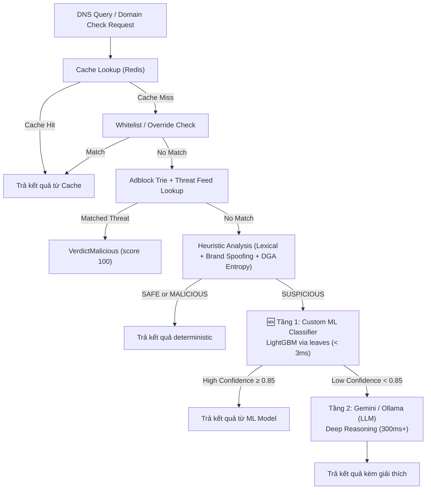

# Custom Domain Threat Detection AI Engine cho Safe Zone

> **Revision 2** — Cập nhật theo review của GumLoop (Claude Opus 5), đã xác minh lại toàn bộ codebase.

## Bối cảnh & Mục tiêu

Safe Zone hiện dùng **Gemini API / Ollama** như một lớp AI bổ sung (secondary refinement) để đánh giá các domain có kết quả phân tích mơ hồ (`SUSPICIOUS`). Cách tiếp cận này có hạn chế:

- **Latency cao** (300ms – 2000ms mỗi request qua API).
- **Rate-limit** (Gemini Free Tier: 15 req/phút).
- **Không chuyên biệt** cho bài toán phát hiện domain độc hại.
- **Phụ thuộc bên ngoài** (Internet, API Key, nhà cung cấp).

### Mục tiêu

Huấn luyện một **Custom ML Model chuyên biệt cho phân tích Domain** sử dụng **LightGBM** kết hợp **Feature Engineering + Character N-gram Embedding**, và tích hợp trực tiếp vào Go backend qua **`github.com/dmitryikh/leaves`** (Pure Go, không cần CGO).

| Chỉ tiêu | Gemini API (hiện tại) | Custom ML Model (mục tiêu) |
| :--- | :--- | :--- |
| Latency | 300ms – 2,000ms | **< 3ms** |
| Throughput | 15 req/phút (free) | **> 10,000 req/giây** |
| Chi phí API | Tốn tiền khi vượt quota | **0đ** |
| Kích thước model | N/A (cloud) | **~1 – 10 MB** trên disk |
| Offline | ❌ Cần Internet | ✅ 100% Offline |
| CGO | N/A | ✅ **CGO_ENABLED=0** compatible |
| Docker Alpine | N/A | ✅ Tương thích hoàn toàn |

---

## Các thay đổi so với Plan v1 (Theo review GumLoop)

> [!IMPORTANT]
> **5 lỗi chặn (blocker) đã được khắc phục:**

| # | Lỗi Plan v1 | Khắc phục Plan v2 |
| :--- | :--- | :--- |
| 1 | **CatBoost + `cat_features` không export được ONNX** (CatBoost issue #863) | Chuyển sang **LightGBM** — hỗ trợ export text/JSON format tốt, và `leaves` Go lib đọc native |
| 2 | **`onnxruntime_go` cần CGO + glibc**, trong khi Dockerfile dùng `CGO_ENABLED=0` + Alpine (musl) | Dùng **`github.com/dmitryikh/leaves`** — Pure Go, đọc LightGBM model text format, không cần CGO |
| 3 | **Viết lại data pipeline từ đầu** khi repo đã có `scripts/build_domain_dataset.py` | **Tái sử dụng** script có sẵn (314 dòng, hỗ trợ 10+ data sources, auto-balance 1:1, dedup, provenance tracking) |
| 4 | **Nhét ML Model vào `internal/ai/` + interface `ai.Provider`** (thiết kế cho LLM text-prompting) | Đặt ML Model vào **`internal/analysis/`** — đóng vai trò Advanced Heuristic Classifier, gọi **trước** LLM |
| 5 | **Chưa verify Docker build** với CGO_ENABLED=0 | Thêm Docker build verification vào Verification Plan |

---

## Kiến trúc tổng thể sau tích hợp (2-Tier AI Pipeline)



### Vị trí tích hợp trong codebase (mapping chính xác vào pipeline hiện tại)

Pipeline hiện tại trong [service.go](file:///d:/Quorix/services/safe-zone/internal/risk/service.go) method `analyze()`:

```
1. Domain Normalization
2. Client Group & Admin Overrides  →  early return nếu match
3. Local Whitelist Check            →  early return nếu match
4. Adblock Trie Matching            →  early return nếu match
5. Threat Feed Match                →  early return nếu match
6. Heuristic & Brand Analysis       →  Lexical rules + Brand spoofing + DGA entropy
7. 🆕 ML Classifier (chèn VÀO ĐÂY) →  Chỉ khi verdict == SUSPICIOUS
8. AI Refinement (Gemini/Ollama)    →  Chỉ khi ML confidence < threshold
9. OSINT Correlation
10. Redis Cache Save
```

> [!NOTE]
> ML Classifier được chèn **giữa bước 6 và bước 8** (thay thế vai trò "first responder" của Gemini/Ollama cho domain SUSPICIOUS). Gemini/Ollama vẫn được giữ lại làm "deep investigation" khi ML model không chắc chắn.

---

## PHẦN 1: Hướng phát triển thống nhất

### 1.1. Thuật toán: LightGBM Classifier

**Lý do chọn LightGBM (thay vì CatBoost/XGBoost):**

| Tiêu chí | LightGBM | CatBoost | XGBoost |
| :--- | :--- | :--- | :--- |
| **Go inference thuần (Pure Go)** | ✅ `dmitryikh/leaves` đọc text/JSON format | ⚠️ `leaves` hỗ trợ hạn chế, cần convert | ✅ `leaves` đọc binary format |
| **CGO_ENABLED=0** | ✅ | ⚠️ | ✅ |
| **Tốc độ training** | Rất nhanh (histogram-based) | Nhanh | Nhanh |
| **Categorical Features native** | ✅ (nhưng ta sẽ encode thủ công để đảm bảo tương thích `leaves`) | ✅ (nhưng ONNX export lỗi khi dùng) | ❌ Cần OHE |
| **Accuracy** | Rất cao | Rất cao | Rất cao |
| **Export format** | Text / JSON (nhẹ, dễ đọc) | CBM binary | Binary |

> [!TIP]
> **Tại sao không dùng CatBoost?** Mặc dù CatBoost xử lý categorical features tốt hơn, nhưng:
> 1. CatBoost ONNX export bị lỗi khi có `cat_features` (issue #863).
> 2. `dmitryikh/leaves` hỗ trợ LightGBM hoàn chỉnh nhất (text + JSON format).
> 3. Nếu encode categorical thành numerical trước khi train, LightGBM và CatBoost cho accuracy tương đương.

### 1.2. Chiến lược Vector hóa: Feature Engineering + Character N-gram TF-IDF (Early Fusion)

```
Final Vector = [Handcrafted Features (20 chiều, ALL numerical)]
             + [Char N-gram TF-IDF (128 chiều)]
             = Vector tổng cộng ~148 chiều (100% float)
```

> [!IMPORTANT]
> **Thay đổi quan trọng so với Plan v1:** Tất cả features đều phải là **numerical (float/int)**. Không dùng `cat_features` native của bất kỳ thư viện nào để đảm bảo `leaves` Go lib đọc được model.

#### Nhóm A: Handcrafted Features (20 chiều — 100% numerical)

| # | Feature | Kiểu | Mô tả | Encoding |
| :--- | :--- | :--- | :--- | :--- |
| 1 | `domain_length` | int | Độ dài toàn bộ FQDN | Giữ nguyên |
| 2 | `domain_name_length` | int | Độ dài phần domain chính | Giữ nguyên |
| 3 | `subdomain_depth` | int | Số lượng subdomain | Giữ nguyên |
| 4 | `num_hyphens` | int | Số lượng dấu `-` | Giữ nguyên |
| 5 | `num_digits` | int | Số lượng chữ số | Giữ nguyên |
| 6 | `num_dots` | int | Số lượng dấu `.` | Giữ nguyên |
| 7 | `digit_ratio` | float | Tỷ lệ chữ số / tổng ký tự | Giữ nguyên |
| 8 | `vowel_ratio` | float | Tỷ lệ nguyên âm / phụ âm | Giữ nguyên |
| 9 | `shannon_entropy` | float | Entropy Shannon | Giữ nguyên |
| 10 | `max_consonant_seq` | int | Chuỗi phụ âm liên tiếp dài nhất | Giữ nguyên |
| 11 | `has_punycode` | int (0/1) | Chứa `xn--` | Binary flag |
| 12 | `has_ip_pattern` | int (0/1) | Chứa pattern IP | Binary flag |
| 13 | `num_special_chars` | int | Số ký tự đặc biệt | Giữ nguyên |
| 14 | `num_tokens` | int | Số "từ" tách bằng `-` hoặc `.` | Giữ nguyên |
| 15 | `tld_risk_score` | int | Điểm rủi ro TLD (ordinal: 0-9) | **Giữ nguyên dạng số** — đây vốn là biến ordinal, không cần encode |
| 16 | `brand_similarity_max` | float | Điểm Levenshtein cao nhất so với brand list | Giữ nguyên |
| 17 | `brand_weighted_distance` | float | Weighted Levenshtein (QWERTY keyboard adjacency) | **🆕 Thay thế** `brand_similarity_brand_idx` — dùng giá trị distance thực thay vì index categorical |
| 18 | `homoglyph_score` | float | Điểm tương đồng ký tự thị giác | Giữ nguyên |
| 19 | `phishing_keyword_count` | int | Số từ khóa phishing | Giữ nguyên |
| 20 | `is_free_hosting` | int (0/1) | Thuộc free hosting / dynamic DNS | Binary flag |

> [!NOTE]
> **Thay đổi #17**: `brand_similarity_brand_idx` (categorical — index thương hiệu bị nhái) đã được thay bằng `brand_weighted_distance` (numerical — khoảng cách có trọng số QWERTY keyboard). Điều này:
> - Loại bỏ hoàn toàn Categorical Feature.
> - Tận dụng logic `WeightedLevenshteinDistance` đã có sẵn trong [brand.go](file:///d:/Quorix/services/safe-zone/internal/analysis/brand.go).
> - Cung cấp thông tin phong phú hơn cho model (khoảng cách thực vs chỉ index).

#### Nhóm B: Character N-gram TF-IDF (128 chiều)

Giữ nguyên so với Plan v1:
- `TfidfVectorizer(analyzer='char', ngram_range=(2,3), max_features=128)`.
- TF-IDF vocabulary sẽ được export sang JSON để Go re-implement khi inference.

### 1.3. Vai trò phân tầng sau khi có Custom Model

| Tầng | Component | Vị trí code | Vai trò | Latency |
| :--- | :--- | :--- | :--- | :--- |
| **Heuristic** | Lexical + Brand + DGA | `internal/analysis/` | Chấm điểm rule-based, phân loại SAFE/SUSPICIOUS/MALICIOUS | < 1ms |
| **🆕 ML Classifier** | LightGBM via `leaves` | `internal/analysis/ml_classifier.go` | Xử lý domain SUSPICIOUS — phân loại nhanh với confidence cao | < 3ms |
| **LLM Refinement** | Gemini / Ollama | `internal/ai/` | Fallback khi ML confidence thấp, hoặc sinh giải thích chi tiết | 300ms+ |

---

## PHẦN 2: Chuẩn bị chi tiết

### 2.1. Datasets — Sử dụng Pipeline có sẵn

> [!IMPORTANT]
> **KHÔNG cần viết script tải dữ liệu mới.** Repo đã có sẵn [scripts/build_domain_dataset.py](file:///d:/Quorix/services/safe-zone/scripts/build_domain_dataset.py) (314 dòng) với đầy đủ tính năng.

#### Tính năng của `build_domain_dataset.py` (đã xác minh):

| Tính năng | Chi tiết |
| :--- | :--- |
| **Whitelist Sources** | Tranco Top 100K, Cisco Umbrella Top 1M, Vietnam domains (`.gov.vn`, `.edu.vn`, ngân hàng, báo chí) |
| **Blacklist Sources** | PhishTank, OpenPhish, Phishing Army, URLhaus, HaGeZi TIF, Tempest Phishing, StevenBlack, VN scraped domains |
| **Normalization** | RFC-1035 FQDN chuẩn, loại bỏ schemes/paths/ports, xử lý BOM, IP filter, domain length validation (4-253 chars) |
| **Deduplication** | Cross-label: Blacklist ưu tiên hơn Whitelist khi trùng |
| **Balance** | Tự cân bằng 1:1 (deterministic seed=42) |
| **Output** | `domain_dataset.csv`, `domain_dataset_lite.csv` (max 300K), `domain_dataset_provenance.csv` (kèm source attribution) |

#### Cách sử dụng:

```bash
# Bước 1: Đặt raw data files vào đúng thư mục
# data/whitelist/general/  → Tranco CSV, Umbrella CSV
# data/whitelist/vietnam/  → vietnam_domains.txt, vietnam_websites.csv
# data/blacklist/vietnam/  → raw_scraped_domains.json
# data/blacklist/feeds/    → PhishTank CSV, OpenPhish txt, URLhaus CSV, etc.

# Bước 2: Chạy script
python scripts/build_domain_dataset.py

# Bước 3: Kết quả output
# ml/data/processed/domain_dataset.csv        ← Dataset chính (đầu vào cho Phase 2)
# ml/data/processed/domain_dataset_lite.csv   ← Phiên bản nhẹ (max 300K)
# ml/data/processed/cleaning_report.json      ← Báo cáo chi tiết quá trình xử lý
```

### 2.2. Danh sách Thương hiệu (Brand List)

Sử dụng trực tiếp `DefaultTrustedBrands` đã có trong [brand.go](file:///d:/Quorix/services/safe-zone/internal/analysis/brand.go):

- **Global**: Google, Binance, PayPal, Facebook, Apple, Microsoft, Amazon, Netflix, Instagram, Twitter, MetaMask, Coinbase, TrustWallet, Yahoo, LinkedIn.
- **VN Government**: Chinhphu, Bo Cong An, BHXH, VNEID, VTV.
- **VN Banks**: Vietcombank, Techcombank, BIDV, Vietinbank, MBBank, Agribank, VPBank, ACB, Sacombank, TPBank, VIB, HDBank, SHB, SCB.
- **VN E-Commerce/Wallets**: MoMo, ZaloPay, VNPay, Shopee, Tiki, Lazada.

**Export danh sách sang Python** để Feature Engineering nhất quán:

```python
# Sync từ internal/analysis/brand.go DefaultTrustedBrands
VN_BRANDS = [
    "google", "binance", "paypal", "facebook", "apple", "microsoft",
    "amazon", "netflix", "instagram", "twitter", "metamask", "coinbase",
    "trustwallet", "yahoo", "linkedin",
    "chinhphu", "bocongan", "bhxh", "vneid", "vtv",
    "vietcombank", "techcombank", "bidv", "vietinbank", "mbbank",
    "agribank", "vpbank", "acb", "sacombank", "tpbank", "vib",
    "hdbank", "shb", "scb",
    "momo", "zalopay", "vnpay", "shopee", "tiki", "lazada",
]
```

### 2.3. Môi trường & Công cụ

#### Python (Training & Export)

```bash
# Tạo virtual environment
python -m venv .venv
.venv\Scripts\activate   # Windows

# Cài đặt thư viện
pip install pandas numpy scikit-learn lightgbm
pip install tldextract python-Levenshtein matplotlib seaborn jupyter
pip install joblib
```

| Thư viện | Phiên bản khuyến nghị | Mục đích |
| :--- | :--- | :--- |
| `pandas` | >= 2.0 | Đọc/xử lý dataset CSV |
| `numpy` | >= 1.24 | Tính toán số học |
| `scikit-learn` | >= 1.3 | TF-IDF Vectorizer, train/test split, metrics |
| **`lightgbm`** | >= 4.0 | 🆕 **Thay CatBoost** — Thuật toán LightGBM Classifier |
| `tldextract` | >= 5.0 | Tách subdomain / domain / TLD chính xác |
| `python-Levenshtein` | >= 0.21 | Tính khoảng cách tương đồng thương hiệu |
| `matplotlib` / `seaborn` | — | Vẽ biểu đồ đánh giá model |
| `joblib` | — | Serialize TF-IDF vectorizer |

#### Go (Inference trong Safe Zone)

| Dependency | Mục đích |
| :--- | :--- |
| **`github.com/dmitryikh/leaves`** | 🆕 **Thay `onnxruntime_go`** — Pure Go, đọc LightGBM model text format, **CGO_ENABLED=0** compatible |

> [!IMPORTANT]
> **`leaves` KHÔNG cần CGO, KHÔNG cần shared library.** Hoạt động hoàn hảo với Dockerfile hiện tại:
> ```dockerfile
> RUN CGO_ENABLED=0 GOOS=linux go build -trimpath ...
> ```
> trên base image `alpine:3.20`.

#### Phần cứng

| Bước | Yêu cầu tối thiểu | Khuyến nghị |
| :--- | :--- | :--- |
| Training (Python) | CPU 4 cores, 8GB RAM | Google Colab (miễn phí) hoặc máy local |
| Inference (Go) | CPU 1 core, 512MB RAM | Đã đủ — model LightGBM text file chỉ nặng ~1-10MB |

> [!NOTE]
> **Không cần GPU!** LightGBM train trên CPU với 100,000 mẫu chỉ mất **30 giây – 2 phút**. Inference qua `leaves` mất **< 1ms** trên CPU.

---

## PHẦN 3: Các bước thực hiện chi tiết

### Phase 1: Thu thập & Chuẩn bị Dữ liệu

> **Thời gian ước tính: 0.5-1 ngày** (giảm nhờ tái sử dụng script có sẵn)

#### Bước 1.1: Chuẩn bị Raw Data

Tải các file dữ liệu nguồn và đặt vào đúng thư mục theo cấu trúc mà `build_domain_dataset.py` yêu cầu:

```
data/
├── whitelist/
│   ├── general/
│   │   ├── tranco_46ZYX.csv          # Tải từ tranco-list.eu
│   │   └── top-1m.csv                # Tải từ Cisco Umbrella
│   └── vietnam/
│       ├── vietnam_domains.txt        # Danh sách domain VN chính thống
│       └── vietnam_websites.csv       # CSV domain VN
├── blacklist/
│   ├── vietnam/
│   │   └── raw_scraped_domains.json   # Domain độc hại VN thu thập được
│   └── feeds/
│       ├── verified_online.csv        # PhishTank
│       ├── openphish.txt              # OpenPhish
│       ├── phishing_army.txt          # Phishing Army
│       ├── urlhaus.csv                # URLhaus (abuse.ch)
│       ├── hagezi_tif.txt             # HaGeZi Threat Intel Feed
│       ├── tempest_phishing.txt       # Tempest
│       └── stevenblack_hosts.txt      # StevenBlack hosts
```

#### Bước 1.2: Chạy Dataset Builder

```bash
cd d:\Quorix\services\safe-zone
python scripts/build_domain_dataset.py
```

Output (đã xác minh):
- `ml/data/processed/domain_dataset.csv` — Dataset chính (balanced 1:1).
- `ml/data/processed/domain_dataset_provenance.csv` — Kèm source attribution.
- `ml/data/processed/cleaning_report.json` — Báo cáo xử lý.

#### Bước 1.3: Kiểm tra chất lượng Dataset

```python
import pandas as pd
import json

df = pd.read_csv("ml/data/processed/domain_dataset.csv")
report = json.load(open("ml/data/processed/cleaning_report.json"))

print(f"Total samples:    {len(df)}")
print(f"Benign (label=0): {(df.label == 0).sum()}")
print(f"Malicious (label=1): {(df.label == 1).sum()}")
print(f"Balance ratio:    {(df.label == 0).sum() / (df.label == 1).sum():.2f}")
print(f"Duplicates:       {df.domain.duplicated().sum()}")

# Verify: ratio should be ~1.0 (balanced by script)
assert 0.8 <= (df.label == 0).sum() / max((df.label == 1).sum(), 1) <= 1.2, "Dataset is not balanced!"
```

---

### Phase 2: Feature Engineering & Vectorization

> **Thời gian ước tính: 1-2 ngày**

#### Bước 2.1: Feature Extractor (Python)

```python
# ml/feature_extractor.py

import math
import re
import tldextract
import Levenshtein

# --- Sync từ internal/analysis/brand.go ---
VN_BRANDS = [
    "google", "binance", "paypal", "facebook", "apple", "microsoft",
    "amazon", "netflix", "instagram", "twitter", "metamask", "coinbase",
    "trustwallet", "yahoo", "linkedin",
    "chinhphu", "bocongan", "bhxh", "vneid", "vtv",
    "vietcombank", "techcombank", "bidv", "vietinbank", "mbbank",
    "agribank", "vpbank", "acb", "sacombank", "tpbank", "vib",
    "hdbank", "shb", "scb",
    "momo", "zalopay", "vnpay", "shopee", "tiki", "lazada",
]

# --- TLD Risk Scores (ordinal, NOT categorical) ---
TLD_RISK = {
    "xyz": 8, "top": 8, "tk": 9, "ml": 9, "ga": 9, "cf": 9, "gq": 9,
    "icu": 7, "buzz": 7, "click": 7, "link": 6, "info": 5, "online": 6,
    "site": 6, "club": 5, "pw": 8, "work": 5, "life": 4,
    "com": 2, "net": 2, "org": 2, "vn": 1, "gov.vn": 0, "edu.vn": 0,
}

PHISHING_KEYWORDS = [
    "login", "signin", "verify", "secure", "update", "confirm",
    "account", "banking", "password", "credential", "wallet",
    "suspend", "locked", "urgent", "alert", "notification",
    "dichvucong", "vneid", "nganhang", "xacthuc",  # VN-specific
]

FREE_HOSTING = [
    "duckdns.org", "ngrok.io", "ngrok-free.app", "herokuapp.com",
    "000webhostapp.com", "weebly.com", "blogspot.com", "wordpress.com",
    "netlify.app", "vercel.app", "pages.dev", "workers.dev",
]

# --- QWERTY Keyboard Adjacency (sync từ brand.go keyboardAdjacency) ---
KEYBOARD_ADJ = {
    'q': 'wa', 'w': 'qeas', 'e': 'wrds', 'r': 'etdf', 't': 'ryfg',
    'y': 'tugh', 'u': 'yijh', 'i': 'uojk', 'o': 'ipkl', 'p': 'ol',
    'a': 'qwsz', 's': 'awedxz', 'd': 'serfcx', 'f': 'drtgvc',
    'g': 'ftyhbv', 'h': 'gyujnb', 'j': 'huiknm', 'k': 'jiolm',
    'l': 'kop', 'z': 'asx', 'x': 'zsdc', 'c': 'xdfv',
    'v': 'cfgb', 'b': 'vghn', 'n': 'bhjm', 'm': 'njk',
}


def weighted_levenshtein(s1: str, s2: str) -> float:
    """Weighted Levenshtein with QWERTY adjacency (substitution cost 0.5 for adjacent keys)."""
    len1, len2 = len(s1), len(s2)
    dp = [[0.0] * (len2 + 1) for _ in range(len1 + 1)]
    for i in range(len1 + 1):
        dp[i][0] = float(i)
    for j in range(len2 + 1):
        dp[0][j] = float(j)
    for i in range(1, len1 + 1):
        for j in range(1, len2 + 1):
            if s1[i - 1] == s2[j - 1]:
                cost = 0.0
            else:
                adj = KEYBOARD_ADJ.get(s1[i - 1].lower(), "")
                cost = 0.5 if s2[j - 1].lower() in adj else 1.0
            dp[i][j] = min(
                dp[i - 1][j] + 1.0,       # deletion
                dp[i][j - 1] + 1.0,       # insertion
                dp[i - 1][j - 1] + cost,  # substitution
            )
    return dp[len1][len2]


def extract_features(domain_str: str) -> dict:
    """Trích xuất Feature Vector (100% numerical) từ 1 chuỗi domain."""
    ext = tldextract.extract(domain_str)
    subdomain = ext.subdomain or ""
    domain_name = ext.domain or ""
    tld = ext.suffix or ""
    fqdn = ext.fqdn

    length = len(fqdn)
    domain_name_len = len(domain_name)
    subdomain_depth = len(subdomain.split(".")) if subdomain else 0
    num_hyphens = fqdn.count("-")
    num_digits = sum(c.isdigit() for c in fqdn)
    num_dots = fqdn.count(".")
    digit_ratio = num_digits / max(length, 1)

    # Vowel ratio
    vowels = sum(1 for c in domain_name.lower() if c in "aeiou")
    consonants = sum(1 for c in domain_name.lower() if c.isalpha() and c not in "aeiou")
    vowel_ratio = vowels / max(vowels + consonants, 1)

    # Shannon Entropy
    if length > 0:
        prob = [float(fqdn.count(c)) / length for c in set(fqdn)]
        entropy = -sum(p * math.log2(p) for p in prob if p > 0)
    else:
        entropy = 0.0

    # Max consecutive consonant sequence
    consonant_seqs = re.findall(r"[^aeiou0-9.\-]+", domain_name.lower())
    max_consonant_seq = max((len(s) for s in consonant_seqs), default=0)

    # Special patterns
    has_punycode = 1 if "xn--" in fqdn else 0
    has_ip_pattern = 1 if re.search(r"\d{1,3}[.\-]\d{1,3}[.\-]\d{1,3}[.\-]\d{1,3}", fqdn) else 0
    num_special = sum(1 for c in fqdn if not c.isalnum() and c not in ".-")
    num_tokens = len(re.split(r"[-.]", fqdn))

    # TLD Risk (ordinal integer — NOT categorical)
    tld_risk = TLD_RISK.get(tld.lower(), 3)

    # Brand Similarity — ALL NUMERICAL (no brand index)
    brand_lev_scores = [Levenshtein.ratio(domain_name.lower(), brand) for brand in VN_BRANDS]
    brand_similarity_max = max(brand_lev_scores) if brand_lev_scores else 0.0

    # 🆕 Weighted Levenshtein (QWERTY keyboard adjacency) — replaces brand_idx
    brand_weighted_dists = [weighted_levenshtein(domain_name.lower(), brand) for brand in VN_BRANDS]
    brand_weighted_distance = min(brand_weighted_dists) if brand_weighted_dists else 99.0

    # Homoglyph Score
    homoglyph_map = {"0": "o", "1": "l", "3": "e", "5": "s", "@": "a", "!": "i"}
    decoded = "".join(homoglyph_map.get(c, c) for c in domain_name.lower())
    homoglyph_scores = [Levenshtein.ratio(decoded, brand) for brand in VN_BRANDS]
    homoglyph_score = max(homoglyph_scores) if homoglyph_scores else 0.0

    # Phishing Keywords
    keyword_count = sum(1 for kw in PHISHING_KEYWORDS if kw in fqdn.lower())

    # Free Hosting
    is_free_hosting = 1 if any(fqdn.endswith(fh) for fh in FREE_HOSTING) else 0

    return {
        "domain_length": length,
        "domain_name_length": domain_name_len,
        "subdomain_depth": subdomain_depth,
        "num_hyphens": num_hyphens,
        "num_digits": num_digits,
        "num_dots": num_dots,
        "digit_ratio": round(digit_ratio, 4),
        "vowel_ratio": round(vowel_ratio, 4),
        "shannon_entropy": round(entropy, 4),
        "max_consonant_seq": max_consonant_seq,
        "has_punycode": has_punycode,
        "has_ip_pattern": has_ip_pattern,
        "num_special_chars": num_special,
        "num_tokens": num_tokens,
        "tld_risk_score": tld_risk,
        "brand_similarity_max": round(brand_similarity_max, 4),
        "brand_weighted_distance": round(brand_weighted_distance, 4),
        "homoglyph_score": round(homoglyph_score, 4),
        "phishing_keyword_count": keyword_count,
        "is_free_hosting": is_free_hosting,
    }
```

#### Bước 2.2: Áp dụng Feature Extraction lên toàn bộ Dataset

```python
# ml/notebooks/02_feature_engineering.py

import pandas as pd
import numpy as np
import json
from sklearn.feature_extraction.text import TfidfVectorizer
from feature_extractor import extract_features
import joblib

# Load dataset (output from build_domain_dataset.py)
df = pd.read_csv("ml/data/processed/domain_dataset.csv")

# --- Nhóm A: Handcrafted Features (ALL numerical) ---
print("Extracting handcrafted features...")
features_list = df["domain"].apply(extract_features).tolist()
features_df = pd.DataFrame(features_list)

# VERIFY: No categorical columns
assert features_df.select_dtypes(include=["object", "category"]).empty, \
    "ERROR: Found non-numerical columns! All features must be numerical."

# --- Nhóm B: Character N-gram TF-IDF Embedding ---
print("Computing character n-gram TF-IDF...")
tfidf = TfidfVectorizer(analyzer="char", ngram_range=(2, 3), max_features=128)
tfidf_matrix = tfidf.fit_transform(df["domain"])
tfidf_df = pd.DataFrame(
    tfidf_matrix.toarray(),
    columns=[f"ngram_{i}" for i in range(tfidf_matrix.shape[1])]
)

# --- Concatenate (Early Fusion) ---
X = pd.concat([features_df, tfidf_df], axis=1)
y = df["label"]

print(f"Final feature vector shape: {X.shape}")  # Expected: (~100K, ~148)
print(f"All numerical: {X.select_dtypes(include=[np.number]).shape == X.shape}")

# Save features
X.to_csv("ml/data/processed/features_X.csv", index=False)
y.to_csv("ml/data/processed/labels_y.csv", index=False)

# Save TF-IDF Vectorizer (Python joblib for re-training)
joblib.dump(tfidf, "ml/models/tfidf_vectorizer.joblib")

# 🆕 Export TF-IDF vocabulary as JSON (for Go inference re-implementation)
tfidf_vocab = {
    "vocabulary": {k: int(v) for k, v in tfidf.vocabulary_.items()},
    "idf": tfidf.idf_.tolist(),
    "max_features": 128,
    "ngram_range": [2, 3],
    "analyzer": "char",
}
with open("ml/models/tfidf_vocab.json", "w") as f:
    json.dump(tfidf_vocab, f, indent=2)

print("Saved: features_X.csv, labels_y.csv, tfidf_vectorizer.joblib, tfidf_vocab.json")
```

---

### Phase 3: Training LightGBM Model

> **Thời gian ước tính: 1 ngày**

#### Bước 3.1: Train & Evaluate

```python
# ml/notebooks/03_train_lightgbm.py

import pandas as pd
import numpy as np
import lightgbm as lgb
from sklearn.model_selection import train_test_split
from sklearn.metrics import (classification_report, confusion_matrix,
                             roc_auc_score, f1_score)
import matplotlib.pyplot as plt
import seaborn as sns

# Load features (ALL numerical — verified in Phase 2)
X = pd.read_csv("ml/data/processed/features_X.csv")
y = pd.read_csv("ml/data/processed/labels_y.csv").values.ravel()

# Train/Test split (80/20, stratified)
X_train, X_test, y_train, y_test = train_test_split(
    X, y, test_size=0.2, random_state=42, stratify=y
)

# LightGBM Dataset
train_data = lgb.Dataset(X_train, label=y_train)
valid_data = lgb.Dataset(X_test, label=y_test, reference=train_data)

# LightGBM Parameters
params = {
    "objective": "binary",
    "metric": ["binary_logloss", "auc"],
    "boosting_type": "gbdt",
    "num_leaves": 63,            # 2^6 - 1
    "learning_rate": 0.05,
    "feature_fraction": 0.8,
    "bagging_fraction": 0.8,
    "bagging_freq": 5,
    "max_depth": 8,
    "min_child_samples": 20,
    "is_unbalance": True,        # Auto-handle class imbalance
    "verbose": -1,
    "seed": 42,
}

# Train with early stopping
callbacks = [
    lgb.early_stopping(stopping_rounds=50),
    lgb.log_evaluation(period=100),
]

model = lgb.train(
    params,
    train_data,
    num_boost_round=1000,
    valid_sets=[valid_data],
    callbacks=callbacks,
)

# --- Evaluation ---
y_prob = model.predict(X_test)
y_pred = (y_prob >= 0.5).astype(int)

print("\n" + "=" * 60)
print("CLASSIFICATION REPORT")
print("=" * 60)
print(classification_report(y_test, y_pred, target_names=["SAFE", "MALICIOUS"]))
print(f"ROC-AUC Score: {roc_auc_score(y_test, y_prob):.4f}")
print(f"F1-Score:      {f1_score(y_test, y_pred):.4f}")

# Confusion Matrix
cm = confusion_matrix(y_test, y_pred)
plt.figure(figsize=(8, 6))
sns.heatmap(cm, annot=True, fmt="d", cmap="Blues",
            xticklabels=["SAFE", "MALICIOUS"],
            yticklabels=["SAFE", "MALICIOUS"])
plt.title("Confusion Matrix - Domain Threat Detection (LightGBM)")
plt.ylabel("Actual")
plt.xlabel("Predicted")
plt.savefig("ml/models/confusion_matrix.png", dpi=150, bbox_inches="tight")
plt.show()

# Feature Importance
importance = pd.DataFrame({
    "feature": X.columns,
    "importance": model.feature_importance(importance_type="gain")
}).sort_values("importance", ascending=False)
print("\nTop 15 Most Important Features:")
print(importance.head(15).to_string(index=False))

# 🆕 Save LightGBM model as TEXT FORMAT (required by leaves Go lib)
model.save_model("ml/models/domain_threat_lgbm.txt")

# Also save as JSON (backup/debugging)
model.save_model("ml/models/domain_threat_lgbm.json")

print(f"\nModel saved: domain_threat_lgbm.txt")
import os
size_kb = os.path.getsize("ml/models/domain_threat_lgbm.txt") / 1024
print(f"Model size: {size_kb:.1f} KB")
```

> [!IMPORTANT]
> **Mục tiêu chất lượng tối thiểu:**
> - **Precision ≥ 97%** (Hạn chế tối đa False Positive — không chặn nhầm domain sạch).
> - **Recall ≥ 95%** (Không bỏ sót quá nhiều domain độc hại).
> - **F1-Score ≥ 96%**.
> - **ROC-AUC ≥ 0.99**.
>
> Nếu chưa đạt, cần quay lại bổ sung dữ liệu hoặc tinh chỉnh hyperparameters.

---

### Phase 4: Verify Model & Export cho Go

> **Thời gian ước tính: 0.5 ngày**

#### Bước 4.1: Verify Model bằng Python

```python
# ml/notebooks/04_verify_model.py

import lightgbm as lgb
import numpy as np
import json
import joblib
from feature_extractor import extract_features

# Load model
model = lgb.Booster(model_file="ml/models/domain_threat_lgbm.txt")
tfidf = joblib.load("ml/models/tfidf_vectorizer.joblib")


def predict_domain(domain: str) -> dict:
    """Full inference pipeline: domain string → prediction."""
    # Extract handcrafted features (20 values, ALL numerical)
    feats = extract_features(domain)
    handcrafted = np.array(list(feats.values()), dtype=np.float64)

    # Extract TF-IDF features (128 values)
    ngram = tfidf.transform([domain]).toarray().astype(np.float64).flatten()

    # Concatenate → 148 values
    full_vector = np.concatenate([handcrafted, ngram]).reshape(1, -1)

    # LightGBM Inference
    prob_malicious = model.predict(full_vector)[0]
    label = 1 if prob_malicious >= 0.5 else 0

    return {
        "domain": domain,
        "verdict": "MALICIOUS" if label == 1 else "SAFE",
        "confidence": round(max(prob_malicious, 1 - prob_malicious), 4),
        "prob_malicious": round(prob_malicious, 4),
    }


# Test with known domains
test_domains = [
    ("google.com", "SAFE"),
    ("vietcombank.com.vn", "SAFE"),
    ("facebook.com", "SAFE"),
    ("vnexpress.net", "SAFE"),
    ("vietcombank-login-secure.xyz", "MALICIOUS"),
    ("asdkjhasd7823hkasd.top", "MALICIOUS"),
    ("shopee-khuyenmai-50percent.tk", "MALICIOUS"),
    ("techc0mbank-xacthuc.click", "MALICIOUS"),
]

print("=" * 70)
print(f"{'Domain':45s} {'Expected':12s} {'Predicted':12s} {'Conf':6s} {'✓':2s}")
print("=" * 70)
passed = 0
for domain, expected in test_domains:
    r = predict_domain(domain)
    ok = "✅" if r["verdict"] == expected else "❌"
    if r["verdict"] == expected:
        passed += 1
    print(f"{domain:45s} {expected:12s} {r['verdict']:12s} {r['confidence']:.3f}  {ok}")

print(f"\nPassed: {passed}/{len(test_domains)}")
```

#### Bước 4.2: Kiểm tra model text file đọc được bởi `leaves`

```python
# Verify model file structure is compatible with dmitryikh/leaves
with open("ml/models/domain_threat_lgbm.txt", "r") as f:
    first_line = f.readline().strip()
    assert first_line.startswith("tree"), \
        f"Model text file may not be in standard LightGBM text format. First line: {first_line}"
    print(f"✅ Model text file starts with '{first_line}' — compatible with leaves Go lib")
```

---

### Phase 5: Tích hợp vào Go Backend (Safe Zone)

> **Thời gian ước tính: 2-3 ngày**

#### Bước 5.1: Cấu trúc thư mục (đúng theo ADR-0006)

```
internal/
├── ai/
│   ├── provider.go          # Interface Provider (GIỮA NGUYÊN)
│   ├── client.go            # Unified Client (GIỮA NGUYÊN — LLM dispatch)
│   ├── ollama.go            # Ollama provider (GIỮA NGUYÊN)
│   └── context.go           # Prompt engineering (GIỮA NGUYÊN)
├── analysis/
│   ├── analysis.go          # Heuristic scoring (GIỮA NGUYÊN)
│   ├── brand.go             # Brand spoofing (GIỮA NGUYÊN)
│   ├── 🆕 features.go       # Feature extraction logic (Go port từ Python)
│   └── 🆕 ml_classifier.go  # LightGBM classifier via leaves (Advanced Heuristic)
├── risk/
│   ├── service.go           # SỬA: Chèn ML classifier giữa Heuristic và AI Refinement
│   └── env.go               # SỬA: Thêm env vars cho ML model
ml/
├── models/
│   ├── domain_threat_lgbm.txt   # 🆕 Trained LightGBM model (text format)
│   └── tfidf_vocab.json         # 🆕 TF-IDF vocabulary (JSON cho Go)
├── data/                        # Datasets (gitignored)
├── notebooks/                   # Training scripts
└── feature_extractor.py         # Python feature extractor (reference)
```

> [!NOTE]
> **Khác biệt quan trọng so với Plan v1:** ML Classifier đặt trong `internal/analysis/` (cùng layer với Heuristic Analysis) thay vì `internal/ai/` (layer cho LLM text-prompting). Điều này:
> - Đúng nguyên tắc separation of concerns: ML Classifier là **Scoring Engine**, không phải **Generative AI**.
> - Không phá vỡ interface `ai.Provider` (vốn thiết kế cho `Refine` bằng text prompt).
> - Giữ nguyên hoàn toàn ADR-0005 (`none`, `gemini`, `ollama`, `hybrid`).

#### Bước 5.2: Tạo `internal/analysis/features.go` — Feature Extraction (Go port)

```go
// internal/analysis/features.go
package analysis

import (
    "math"
    "strings"
    "unicode"
)

// FeatureVector holds the numerical feature vector for ML classification.
// All fields are float64 for direct use with leaves inference.
type FeatureVector struct {
    DomainLength        float64
    DomainNameLength    float64
    SubdomainDepth      float64
    NumHyphens          float64
    NumDigits           float64
    NumDots             float64
    DigitRatio          float64
    VowelRatio          float64
    ShannonEntropy      float64
    MaxConsonantSeq     float64
    HasPunycode         float64
    HasIPPattern        float64
    NumSpecialChars     float64
    NumTokens           float64
    TLDRiskScore        float64
    BrandSimilarityMax  float64
    BrandWeightedDist   float64
    HomoglyphScore      float64
    PhishingKeywordCount float64
    IsFreeHosting       float64
}

// ToSlice returns the feature vector as a float64 slice (20 values)
// in the exact same order as the Python feature_extractor.
func (fv *FeatureVector) ToSlice() []float64 {
    return []float64{
        fv.DomainLength, fv.DomainNameLength, fv.SubdomainDepth,
        fv.NumHyphens, fv.NumDigits, fv.NumDots,
        fv.DigitRatio, fv.VowelRatio, fv.ShannonEntropy,
        fv.MaxConsonantSeq, fv.HasPunycode, fv.HasIPPattern,
        fv.NumSpecialChars, fv.NumTokens, fv.TLDRiskScore,
        fv.BrandSimilarityMax, fv.BrandWeightedDist,
        fv.HomoglyphScore, fv.PhishingKeywordCount, fv.IsFreeHosting,
    }
}

// ExtractFeatures computes the full handcrafted feature vector for a domain.
// Uses the same logic as Python feature_extractor.py to ensure
// training ↔ inference consistency.
func ExtractFeatures(fqdn string, brands []TrustedBrand) *FeatureVector {
    // Implementation: port from Python extract_features()
    // Uses existing functions in analysis.go (ShannonEntropy)
    // and brand.go (LevenshteinDistance, WeightedLevenshteinDistance, ToSkeleton)
    // ...
}
```

#### Bước 5.3: Tạo `internal/analysis/ml_classifier.go` — LightGBM Inference

```go
// internal/analysis/ml_classifier.go
package analysis

import (
    "encoding/json"
    "os"
    "sync"

    "github.com/dmitryikh/leaves"
)

// MLClassifier wraps a LightGBM model loaded via leaves for fast
// domain threat classification. It acts as an advanced heuristic
// scoring engine, NOT a generative AI provider.
type MLClassifier struct {
    mu          sync.RWMutex
    model       *leaves.Ensemble
    tfidfVocab  map[string]int
    tfidfIDF    []float64
    maxFeatures int
    threshold   float64  // confidence threshold (default 0.85)
    enabled     bool
}

// NewMLClassifier loads a LightGBM text model and TF-IDF vocabulary.
func NewMLClassifier(modelPath, tfidfPath string, threshold float64) (*MLClassifier, error) {
    // Load LightGBM model via leaves (pure Go, no CGO)
    model, err := leaves.LGEnsembleFromFile(modelPath, true)
    if err != nil {
        return nil, err
    }

    // Load TF-IDF vocabulary from JSON
    data, err := os.ReadFile(tfidfPath)
    if err != nil {
        return nil, err
    }
    var vocab struct {
        Vocabulary  map[string]int `json:"vocabulary"`
        IDF         []float64      `json:"idf"`
        MaxFeatures int            `json:"max_features"`
    }
    if err := json.Unmarshal(data, &vocab); err != nil {
        return nil, err
    }

    return &MLClassifier{
        model:       model,
        tfidfVocab:  vocab.Vocabulary,
        tfidfIDF:    vocab.IDF,
        maxFeatures: vocab.MaxFeatures,
        threshold:   threshold,
        enabled:     true,
    }, nil
}

// Classify runs the ML model on a domain and returns a verdict with confidence.
// Returns (verdict, confidence, reasons, error).
func (c *MLClassifier) Classify(fqdn string, brands []TrustedBrand) (Verdict, float64, []string, error) {
    // 1. Extract handcrafted features (20 values)
    fv := ExtractFeatures(fqdn, brands)
    handcrafted := fv.ToSlice()

    // 2. Compute TF-IDF features (128 values)
    tfidf := c.computeTFIDF(fqdn)

    // 3. Concatenate → 148 values
    features := append(handcrafted, tfidf...)

    // 4. LightGBM inference via leaves
    predictions := model.PredictSingle(features, 0)
    probMalicious := predictions // For binary classification, this is P(malicious)

    // 5. Map to verdict
    confidence := math.Max(probMalicious, 1-probMalicious)
    if probMalicious >= 0.5 {
        return VerdictMalicious, confidence,
            []string{"ml_classifier: domain classified as malicious"}, nil
    }
    return VerdictSafe, confidence,
        []string{"ml_classifier: domain classified as safe"}, nil
}

// Enabled returns true if the ML classifier is loaded and ready.
func (c *MLClassifier) Enabled() bool {
    return c != nil && c.enabled
}
```

#### Bước 5.4: Cập nhật `internal/risk/service.go` — Pipeline Integration

```go
// Trong Service struct, thêm:
mlClassifier *analysis.MLClassifier

// Trong NewServiceFromEnv(), thêm initialization:
if mlModelPath != "" {
    clf, err := analysis.NewMLClassifier(mlModelPath, mlTFIDFPath, mlThreshold)
    if err != nil {
        logjson.Warn("ml_classifier_load_failed", "error", err.Error())
        // Fail-open: continue without ML classifier
    } else {
        s.mlClassifier = clf
        logjson.Info("ml_classifier_loaded", "model", mlModelPath)
    }
}

// Trong analyze(), CHÈN giữa bước Heuristic Analysis và AI Refinement:
// Step 6: Heuristic & Brand Analysis (existing)
result := s.analyzeLexical(normalized)

// Step 7 (🆕): ML Classifier — only for SUSPICIOUS verdicts
if result.Verdict == analysis.VerdictSuspicious && s.mlClassifier.Enabled() {
    mlVerdict, mlConf, mlReasons, err := s.mlClassifier.Classify(
        result.Domain, s.brandStore.ListBrands(),
    )
    if err == nil && mlConf >= s.mlClassifier.Threshold() {
        // ML classifier is confident — use its verdict directly
        result.Verdict = mlVerdict
        result.Confidence = mlConf
        result.Reasons = append(result.Reasons, mlReasons...)
        // SKIP LLM refinement (Step 8) — fast path!
    }
    // If ML confidence < threshold, fall through to Step 8 (LLM)
}

// Step 8: AI Refinement — Gemini/Ollama (existing, only if ML didn't resolve)
if result.Verdict == analysis.VerdictSuspicious {
    result = s.refineWithAI(ctx, result)
}
```

#### Bước 5.5: Cập nhật `internal/risk/env.go`

```go
// Thêm env vars mới:
mlModelPath  := config.String("SAFE_ZONE_ML_MODEL_PATH", "")
mlTFIDFPath  := config.String("SAFE_ZONE_ML_TFIDF_PATH", "")
mlThreshold  := config.Float64("SAFE_ZONE_ML_THRESHOLD", 0.85)
```

#### Bước 5.6: Cập nhật `.env.example`

```env
# --- Custom ML Classifier (LightGBM-based Domain Threat Detection) ---
# Path to trained LightGBM model file (text format, loaded by leaves Go lib)
# Leave empty to disable ML classifier (system falls back to Gemini/Ollama)
SAFE_ZONE_ML_MODEL_PATH=
# Path to TF-IDF vocabulary JSON (exported from Python training pipeline)
SAFE_ZONE_ML_TFIDF_PATH=
# Minimum confidence threshold for ML classifier to override verdict (0.0-1.0)
# If ML confidence < threshold, system falls through to Gemini/Ollama for deep analysis
SAFE_ZONE_ML_THRESHOLD=0.85
```

#### Bước 5.7: Cập nhật `go.mod`

```bash
cd d:\Quorix\services\safe-zone
go get github.com/dmitryikh/leaves
```

---

## Verification Plan

### Automated Tests

```bash
# Python — Verify model quality
cd ml && python notebooks/04_verify_model.py

# Go — Unit tests for feature extraction
go test ./internal/analysis/ -run TestExtractFeatures -v

# Go — Unit tests for ML classifier
go test ./internal/analysis/ -run TestMLClassifier -v

# Go — Integration test: full pipeline with ML classifier
go test ./internal/risk/ -run TestAnalyzeWithMLClassifier -v

# Go — Benchmark inference latency
go test ./internal/analysis/ -bench BenchmarkMLClassify -benchmem
```

### Docker Build Verification

```bash
# 🆕 CRITICAL: Verify CGO_ENABLED=0 build still works with leaves dependency
docker build --target build -t safe-zone-build-test .
# Must succeed without CGO errors

# Full image build
docker build -t safe-zone:ml-test .
docker run --rm safe-zone:ml-test /service --version
```

### Manual Verification Checklist

- [ ] **Python model quality**: Run `predict_domain()` trên 100 domain đã biết (50 safe, 50 malicious) — Precision ≥ 97%, Recall ≥ 95%.
- [ ] **Go ↔ Python consistency**: So sánh kết quả Go inference vs Python inference trên cùng 100 domain — kết quả phải giống nhau 100%.
- [ ] **Go inference latency**: Benchmark **< 5ms** per domain trên VPS 1 core.
- [ ] **Docker build**: `CGO_ENABLED=0` + Alpine base image build thành công, không có CGO errors.
- [ ] **Fail-open**: Xóa file `domain_threat_lgbm.txt` → hệ thống phải fallback sang Gemini/Ollama bình thường.
- [ ] **Pipeline flow**: Với ML model enabled, Gemini chỉ bị gọi khi ML confidence < threshold.
- [ ] **Regression test**: Toàn bộ existing tests (`go test ./...`) vẫn pass.

---

## Tổng kết Timeline

| Phase | Công việc | Thời gian | Thay đổi so với v1 |
| :--- | :--- | :--- | :--- |
| **Phase 1** | Thu thập & chuẩn bị dữ liệu | **0.5-1 ngày** | ⬇️ Giảm nhờ tái sử dụng `build_domain_dataset.py` |
| **Phase 2** | Feature Engineering & Vectorization | 1-2 ngày | ✏️ Encode categorical → numerical |
| **Phase 3** | Training **LightGBM** & Evaluation | 1 ngày | 🔄 CatBoost → LightGBM |
| **Phase 4** | Verify Model & Export cho Go | 0.5 ngày | 🔄 ONNX → LightGBM text format |
| **Phase 5** | Tích hợp vào Go Backend (`leaves`) | 2-3 ngày | 🔄 `onnxruntime_go` → `leaves`, đặt vào `internal/analysis/` |
| **Tổng** | | **~5-7 ngày làm việc** | ⬇️ Giảm ~1 ngày |

> [!TIP]
> **Quick Win**: Phase 1-4 (Python) có thể chạy hoàn toàn trên **Google Colab miễn phí**. Chỉ cần upload datasets từ `data/` lên Colab và chạy notebook.
