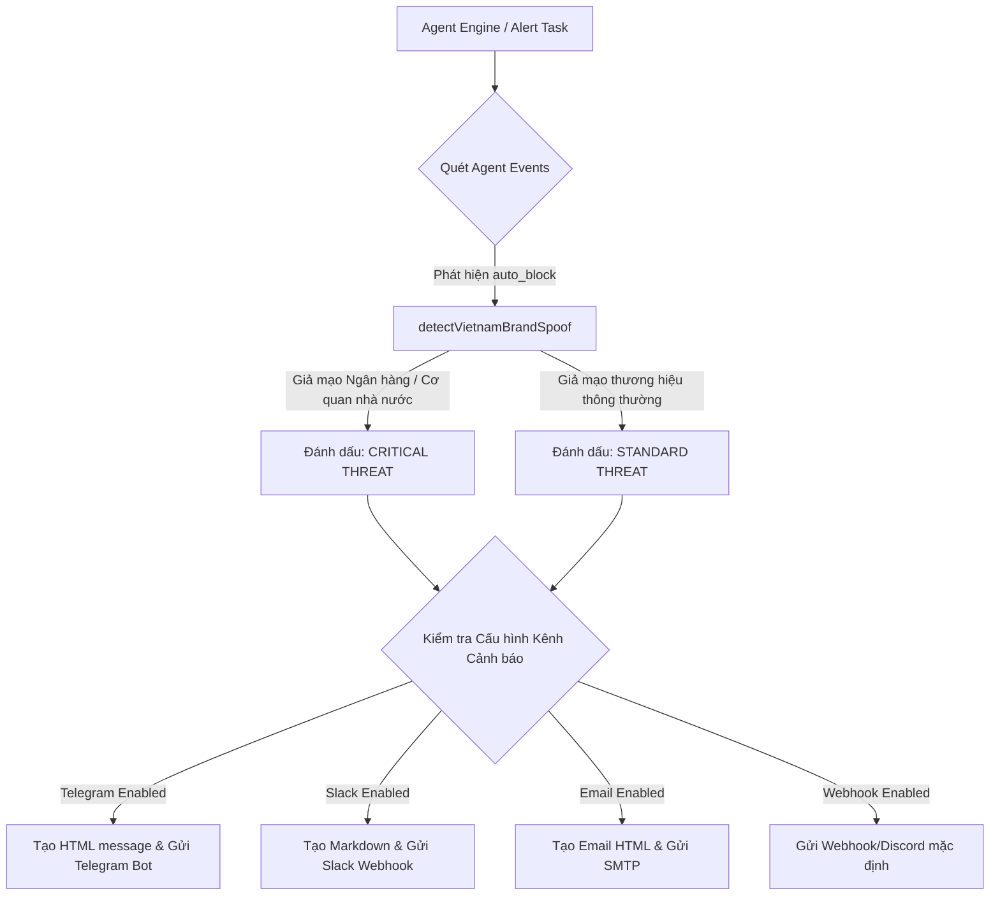

# Kế hoạch triển khai: Hệ thống Cảnh báo nâng cao đa kênh (Telegram / Slack / Email) & Phát hiện giả mạo

Tài liệu này mô tả chi tiết phương án thiết kế và triển khai Hướng D: Mở rộng cơ chế Webhook Alert hiện tại để hỗ trợ thông báo đa kênh, cho phép tùy biến nội dung đẹp mắt gửi thẳng về Telegram Bot, Slack Channel, hoặc Email của quản trị viên khi phát hiện đe dọa nghiêm trọng (đặc biệt là website giả mạo ngân hàng hoặc cơ quan nhà nước Việt Nam).

---

## 1. Mục tiêu (Goals)
*   **Hỗ trợ đa kênh nâng cao**: Tích hợp các kênh thông báo phổ biến bao gồm **Telegram Bot**, **Slack Incoming Webhook** và **Email SMTP** để quản trị viên nhận cảnh báo lập tức ở mọi nơi.
*   **Phát hiện Đe dọa Nghiêm trọng (Critical Phishing Identification)**: Tự động phân tích và nhận dạng các website giả mạo **Ngân hàng tại Việt Nam** (Vietcombank, Techcombank, Agribank,...) hoặc **Cơ quan nhà nước, tổ chức Chính phủ** (Chính phủ Việt Nam, Bộ Công an, BHXH,...).
*   **Giao diện thông báo trực quan (Beautiful Visual Formatting)**: Thiết kế nội dung thông báo đẹp mắt, bố cục mạch lạc, sử dụng các ký tự phân tách và emoji sinh động, làm nổi bật các trường hợp giả mạo đặc biệt nguy hiểm để cảnh báo trực quan cho admin.
*   **Thiết lập linh hoạt**: Cấu hình bật/tắt độc lập từng kênh thông báo dễ dàng qua tệp môi trường `.env`.

---

## 2. Thiết kế Kiến trúc (Architecture Design)

Hệ thống cảnh báo nâng cao được tích hợp trực tiếp vào Alert Task thuộc Agent Engine. Cứ định kỳ (mặc định 15 phút), Alert Task sẽ quét và tổng hợp các sự kiện đe dọa từ cơ sở dữ liệu để bắn cảnh báo.



### 2.1. Phân loại Thương hiệu Nhạy cảm Việt Nam
Chúng ta định nghĩa hàm phân loại thương hiệu dựa trên các thương hiệu đã được khai báo sẵn trong `analysis.TrustedBrands`:
*   **Cơ quan Nhà nước Việt Nam**: `chinhphu`, `bocongan`, `baohiemxahoi`, `vtv`.
*   **Ngân hàng Việt Nam**: `vietcombank`, `techcombank`, `bidv`, `vietinbank`, `mbbank`, `agribank`, `vpbank`, `acb`, `sacombank`, `tpbank`, `vib`, `hdbank`, `shb`, `scb`.

---

## 3. Các thay đổi đề xuất (Proposed Changes)

### 3.1. Cấu hình Môi trường
#### [MODIFY] [.env.example](file:///D:/Quorix/services/safe-zone/.env.example) & `.env`
Bổ sung các tham số cấu hình:
```bash
# --- Advanced Alert Settings ---
# Telegram Configuration
SAFE_ZONE_ALERT_TELEGRAM_ENABLED=false
SAFE_ZONE_ALERT_TELEGRAM_TOKEN=your_bot_token_here
SAFE_ZONE_ALERT_TELEGRAM_CHAT_ID=your_chat_id_here

# Slack Configuration
SAFE_ZONE_ALERT_SLACK_ENABLED=false
SAFE_ZONE_ALERT_SLACK_WEBHOOK_URL=your_slack_webhook_url_here

# Email Configuration
SAFE_ZONE_ALERT_EMAIL_ENABLED=false
SAFE_ZONE_ALERT_EMAIL_SMTP_HOST=smtp.gmail.com
SAFE_ZONE_ALERT_EMAIL_SMTP_PORT=587
SAFE_ZONE_ALERT_EMAIL_FROM=sender@gmail.com
SAFE_ZONE_ALERT_EMAIL_PASSWORD=your_app_password
SAFE_ZONE_ALERT_EMAIL_TO=admin@example.com
```

---

### 3.2. Package Agent

#### [MODIFY] [alert.go](file:///D:/Quorix/services/safe-zone/internal/agent/alert.go)
*   Mở rộng `AlertConfig` để bao gồm đầy đủ cấu hình cho Telegram, Slack và Email.
*   Cập nhật cấu trúc `AlertTask` để nạp các tham số này.
*   Phát triển các phương thức gửi tin nhắn:
    *   `sendTelegram(ctx, payload AlertPayload, criticalEvents []AlertEvent)`: Gửi HTTP POST tới API Telegram ở định dạng HTML đẹp mắt.
    *   `sendSlack(ctx, payload AlertPayload, criticalEvents []AlertEvent)`: Gửi HTTP POST tới Slack Incoming Webhook ở dạng Markdown/Block Kit trực quan.
    *   `sendEmail(ctx, payload AlertPayload, criticalEvents []AlertEvent)`: Gửi email HTML bảo mật thông qua giao thức SMTP (`net/smtp`).
*   Phát triển hàm helper `detectVietnamBrandSpoof(domain string)`:
    *   Gọi `analysis.CheckBrandSpoofing(domain, 30)` để phát hiện hành vi giả mạo.
    *   Nếu phát hiện giả mạo, đối chiếu với danh sách thương hiệu Việt Nam để phân loại thành **"Ngân hàng Việt Nam"** hoặc **"Cơ quan Nhà nước Việt Nam"** và lấy ra tên miền chính thức.
*   Cập nhật `Run(ctx context.Context)`:
    *   Khi duyệt qua danh sách các sự kiện `auto_block`:
        *   Chạy `detectVietnamBrandSpoof` trên từng tên miền.
        *   Nếu phát hiện giả mạo ngân hàng/cơ quan nhà nước, làm nổi bật thông báo bằng nhãn **[CẢNH BÁO ĐE DỌA NGHIÊM TRỌNG]** và định dạng trực quan.
    *   Phát tin nhắn đồng thời tới toàn bộ các kênh cảnh báo đang được kích hoạt (Telegram, Slack, Email, Webhook mặc định).

---

### 3.3. Entrypoint Core API

#### [MODIFY] [main.go](file:///D:/Quorix/services/safe-zone/cmd/core-api/main.go)
*   Cập nhật phần khởi tạo `AlertTask`: Nạp đầy đủ các biến cấu hình từ môi trường (`config.Bool`, `config.String`, `config.Int`).
*   Đảm bảo `AlertTask` nhận được đầy đủ tham số cấu hình mới khi khởi chạy.

---

## 4. Kế hoạch Kiểm thử & Xác minh (Verification Plan)

### 4.1. Kiểm thử Tự động (Automated Tests)
*   **Cập nhật `internal/agent/alert_test.go`**:
    *   Viết test case giả lập phát hiện website giả mạo ngân hàng (ví dụ: `vietcombbank.com.vn` spoof `vietcombank`).
    *   Kiểm tra hàm `detectVietnamBrandSpoof` phân loại chính xác `"Ngân hàng Việt Nam"` và chỉ ra thương hiệu chính thức `vietcombank.com.vn`.
    *   Viết unit test mock HTTP client cho Telegram, Slack và SMTP client để kiểm chứng payload gửi đi đúng định dạng trực quan, không bị lỗi cú pháp.

### 4.2. Chạy Kiểm thử Toàn bộ Hệ thống
*   Chạy toàn bộ test suite với Race Detector để bảo đảm không xảy ra tranh chấp dữ liệu:
    ```bash
    go test -race -v ./internal/agent/...
    ```
*   Biên dịch thử nghiệm hai ứng dụng chính để đảm bảo tính toàn vẹn mã nguồn:
    ```bash
    go build ./cmd/core-api
    go build ./cmd/dns-resolver
    ```
