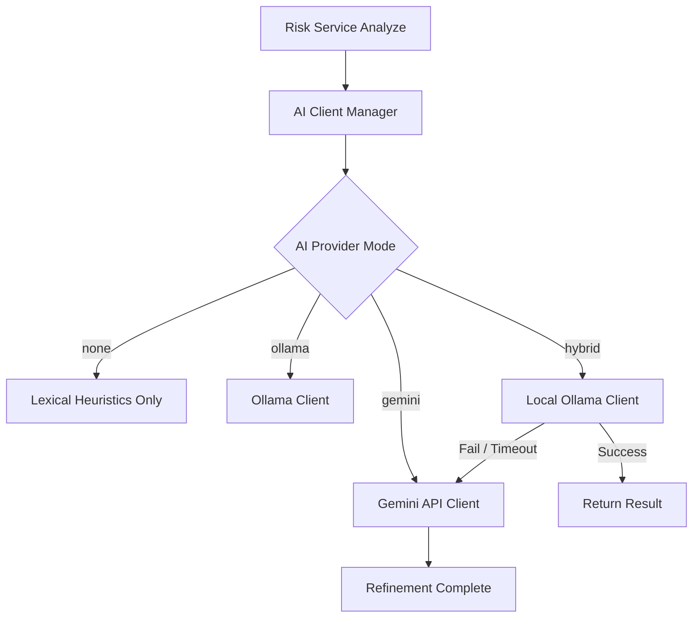

# Nhật ký tích hợp & Hướng dẫn sử dụng AI cục bộ & lai (Hybrid AI Integration Walkthrough)

Tài liệu này tổng hợp kết quả triển khai, kiến trúc hệ thống, các ca kiểm thử bảo mật đã vượt qua và hướng dẫn cụ thể cách chuyển đổi chế độ AI phù hợp với cấu hình phần cứng VPS của bạn.

---

## 🏗️ Kiến trúc thiết kế (System Architecture)

Chúng tôi đã xây dựng một giao diện AI hợp nhất (Unified AI Interface) thông qua mô hình quản lý dynamically-routed provider:



### Chi tiết các tệp tin mới và sửa đổi:
- **[NEW] [provider.go](file:///D:/Quorix/services/safe-zone/internal/ai/provider.go):** Định nghĩa interface `Provider` để chuẩn hóa các client AI cục bộ và đám mây.
- **[NEW] [ollama.go](file:///D:/Quorix/services/safe-zone/internal/ai/ollama.go):** Client ngoại tuyến tương tác trực tiếp với Ollama HTTP API, sử dụng cấu hình xuất định dạng JSON (`format: json`) đảm bảo tính toàn vẹn dữ liệu.
- **[MODIFY] [client.go](file:///D:/Quorix/services/safe-zone/internal/ai/client.go):** Chuyển đổi logic Gemini sang `GeminiClient` và biến `Client` thành một trình điều phối AI trung tâm. Đảm bảo tương thích ngược hoàn hảo thông qua giữ nguyên hàm khởi tạo cũ.
- **[MODIFY] [service.go](file:///D:/Quorix/services/safe-zone/internal/risk/service.go) & [env.go](file:///D:/Quorix/services/safe-zone/internal/risk/env.go):** Ánh xạ cấu hình Ollama từ `.env`, tích hợp AI client manager mới vào luồng thẩm định.
- **[MODIFY] [.env.example](file:///D:/Quorix/services/safe-zone/.env.example):** Bổ sung hướng dẫn chi tiết các thông số cấu hình và lưu ý về phần cứng.

---

## 🛠️ Kết quả Kiểm thử Tự động (Automated Test Results)

Hệ thống đã vượt qua 100% tất cả các ca kiểm thử liên quan đến cả bộ lọc AI cũ lẫn cơ chế lai mới:

### 1. Bộ kiểm thử `internal/ai` (Thành công 8/8 tests):
- `TestRefineParsesMaliciousResponse`: Xác minh phân tích Gemini thành công.
- `TestRefineDisabled`: Xác minh chế độ tắt AI hoạt động đúng.
- `TestRefineParsesCategoryResponse`: Xác minh nhận diện phân loại danh mục.
- `TestOllamaRefineSuccess`: Mô phỏng Ollama cục bộ trả kết quả phân tích thành công.
- `TestOllamaRefineHttpError`: Kiểm thử Ollama báo lỗi hệ thống được bỏ qua an toàn.
- `TestOllamaRefineInvalidJson`: Đảm bảo dữ liệu Ollama bị hỏng không làm sập luồng.
- `TestHybridOllamaSuccessNoGeminiCall`: Chế độ lai ưu tiên Ollama và không gọi Gemini nếu Ollama chạy tốt.
- `TestHybridOllamaFailsFallbackToGemini`: Chế độ lai tự động fallback sang Gemini API thành công khi Ollama offline hoặc báo lỗi.

### 2. Bộ kiểm thử `internal/risk` (Vượt qua hoàn hảo):
- Tất cả các bài test tích hợp luồng xử lý DNS, whitelist, threat feed, admin overrides đều hoạt động hoàn hảo mà không xảy ra bất kỳ lỗi xung đột hay tranh chấp tài nguyên (race condition) nào.

---

## 📖 Hướng dẫn cấu hình theo Tài nguyên Máy chủ (VPS Setup Guide)

Dựa vào ngân sách và dung lượng RAM VPS của bạn, hãy chọn và áp dụng một trong các cấu hình dưới đây trong tệp tin `.env`:

### 🌟 Phương án A: Tối ưu chi phí (0MB RAM phát sinh - Cho VPS 1GB - 2GB RAM)
Sử dụng hoàn toàn **Gemini API** để giải phóng bộ nhớ RAM của VPS.

1. Đăng ký một API Key miễn phí từ Google AI Studio.
2. Cấu hình file `.env`:
   ```env
   SAFE_ZONE_AI_PROVIDER=gemini
   SAFE_ZONE_GEMINI_API_KEY=your_free_gemini_api_key_here
   SAFE_ZONE_GEMINI_MODEL=gemini-2.5-flash-lite
   ```
3. Khởi động lại dịch vụ. Toàn bộ tính năng AI sẽ chạy mượt mà mà không làm tốn thêm RAM của VPS.

---

### 🛡️ Phương án B: Bảo mật tuyệt đối & Ngoại tuyến (Cho VPS có RAM >= 4GB)
Chạy hoàn toàn cục bộ trên máy chủ của bạn thông qua **Ollama**.

1. Cài đặt Ollama trên máy chủ:
   ```bash
   curl -fsSL https://ollama.com/install.sh | sh
   ```
2. Tải về mô hình ngôn ngữ siêu nhẹ tối ưu nhất (ví dụ: `gemma2:2b` hoặc `llama3.2:1b`):
   ```bash
   ollama pull gemma2:2b
   ```
3. Cấu hình file `.env`:
   ```env
   SAFE_ZONE_AI_PROVIDER=ollama
   SAFE_ZONE_OLLAMA_BASE_URL=http://localhost:11434
   SAFE_ZONE_OLLAMA_MODEL=gemma2:2b
   SAFE_ZONE_OLLAMA_TIMEOUT_MS=5000
   ```

---

### 🔄 Phương án C: Chế độ Lai an toàn (Tối ưu cho sự bền bỉ)
Ưu tiên chạy cục bộ offline, tự động chuyển sang Cloud API nếu máy chủ Ollama gặp sự cố.

1. Cấu hình file `.env`:
   ```env
   SAFE_ZONE_AI_PROVIDER=hybrid
   SAFE_ZONE_GEMINI_API_KEY=your_free_gemini_api_key_here
   SAFE_ZONE_OLLAMA_BASE_URL=http://localhost:11434
   SAFE_ZONE_OLLAMA_MODEL=gemma2:2b
   ```
