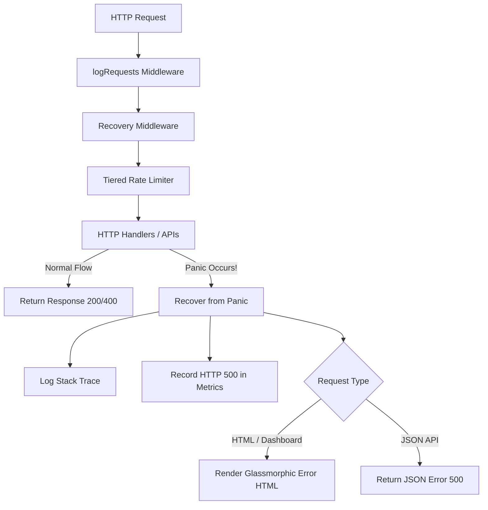

# Kế hoạch triển khai: Panic Recovery Middleware & Robustness Hardening

Tài liệu này mô tả chi tiết phương án thiết kế và triển khai cơ chế Phục hồi lỗi Runtime (Panic Recovery Middleware) cho các máy chủ HTTP (`core-api` và `dns-resolver`) trong dự án Safe Zone.

---

## 1. Mục tiêu (Goals)
*   **Ngăn chặn lỗi rò rỉ & Treo kết nối**: Tự động phục hồi từ bất kỳ lỗi runtime (panic) nào xảy ra trong các HTTP Handlers, ngăn ngừa việc ngắt kết nối đột ngột hoặc trả về phản hồi rỗng.
*   **Giao diện & Phản hồi thân thiện**: 
    *   Đối với các endpoint REST API: Trả về phản hồi JSON lỗi chuẩn hóa `{"error":"internal server error"}` kèm HTTP Status `500`.
    *   Đối với Web Dashboard: Trả về giao diện trang HTML báo lỗi hệ thống đẹp mắt, đồng bộ phong cách thiết kế Glassmorphism của Safe Zone, giúp người dùng dễ dàng bấm quay lại Dashboard.
*   **Giám sát & Đo lường (Telemetry Integration)**: Đồng bộ hóa sự cố vào hệ thống Metrics (`observability.Registry`) thông qua việc tự động tăng chỉ số lỗi HTTP 500, giúp quản trị viên theo dõi được tỷ lệ lỗi hệ thống qua Dashboard.
*   **Ghi log stack trace chi tiết**: Ghi nhận chi tiết thông tin panic và ngăn xếp cuộc gọi (stack trace) vào console/file log để phục vụ mục tiêu điều tra và sửa lỗi (debugging).

---

## 2. Thiết kế Kiến trúc (Architecture Design)

Chúng ta sẽ xây dựng một middleware tập trung tại package `serve` (`internal/serve/http.go`), giúp cả hai ứng dụng `core-api` và `dns-resolver` đều có thể tái sử dụng dễ dàng.



Để tránh hiện tượng vòng lặp import (circular import) giữa package `serve` và `observability`, chúng ta sẽ định nghĩa một interface `MetricsObserver` lỏng lẻo (duck typing) ngay tại `serve`:

```go
type MetricsObserver interface {
	Observe(method, path string, statusCode int, bytesWritten int, duration time.Duration)
}
```

---

## 3. Các thay đổi đề xuất (Proposed Changes)

### 3.1. Package Serve

#### [MODIFY] [http.go](file:///D:/Quorix/services/safe-zone/internal/serve/http.go)
*   Bổ sung định nghĩa interface `MetricsObserver`.
*   Phát triển hàm middleware `Recovery(next http.Handler, obs MetricsObserver) http.Handler` thực hiện:
    *   Sử dụng `recover()` để bắt lỗi.
    *   In chi tiết lỗi kèm vết ngăn xếp (`runtime/stack`).
    *   Đo lường thời gian xử lý và gọi `obs.Observe` ghi nhận lỗi 500.
    *   Phát hiện kiểu yêu cầu (qua header `Accept: text/html` hoặc đường dẫn `/dashboard`) để trả về HTML lỗi hoặc JSON lỗi tương ứng.

---

### 3.2. Core API Application

#### [MODIFY] [main.go](file:///D:/Quorix/services/safe-zone/cmd/core-api/main.go)
*   Tích hợp `serve.Recovery` bọc quanh router chính (`mux` hoặc `tiered.Wrap(mux)`) ngay bên dưới middleware ghi log request (`logRequests`).
*   Đảm bảo `logRequests` bọc ngoài cùng để nó có thể ghi nhận chính xác mã lỗi `500` được phục hồi từ `Recovery` middleware.
*   Truyền một con trỏ `*bool` qua context bằng `serve.ObservedPanicKey` để `Recovery` có thể báo ngược cho `logRequests` rằng lỗi panic đã được observe, tránh ghi metrics trùng lặp.

---

### 3.3. DNS Resolver Application

#### [MODIFY] [main.go](file:///D:/Quorix/services/safe-zone/cmd/dns-resolver/main.go)
*   Tương tự như `core-api`, tích hợp `serve.Recovery` bọc quanh luồng HTTP handler của DNS-over-HTTPS (DoH).
*   Áp dụng cùng mẫu `*bool` mutable marker trong `logRequests` để DoH panic không bị observe hai lần.

---

## 4. Kế hoạch Kiểm thử & Xác minh (Verification Plan)

### 4.1. Kiểm thử Tự động (Automated Tests)
*   **Tạo mới `internal/serve/http_test.go`**:
    *   Viết test case giả lập một Handler cố tình gây panic (ví dụ: truy cập con trỏ nil).
    *   Xác minh middleware `Recovery` phục hồi thành công, không làm crash tiến trình test.
    *   Kiểm chứng response trả về có mã trạng thái `500 Internal Server Error`.
    *   Xác thực định dạng trả về là JSON chuẩn hóa `{"error":"internal server error"}` khi không yêu cầu HTML.
    *   Xác thực định dạng trả về là HTML giao diện lỗi khi request gửi kèm header `Accept: text/html`.
    *   Xác minh chỉ số lỗi được ghi nhận chính xác vào mock metrics observer.

### 4.2. Chạy Kiểm thử Toàn bộ Hệ thống
*   Chạy test suite đa luồng để đảm bảo không phát sinh tranh chấp bộ nhớ:
    ```bash
    go test -race -v ./internal/serve/...
    go test -race -v ./cmd/core-api/...
    go test -race -v ./cmd/dns-resolver/...
    ```
*   Biên dịch thử nghiệm hai ứng dụng chính để đảm bảo tính toàn vẹn mã nguồn:
    ```bash
    go build ./cmd/core-api
    go build ./cmd/dns-resolver
    ```
