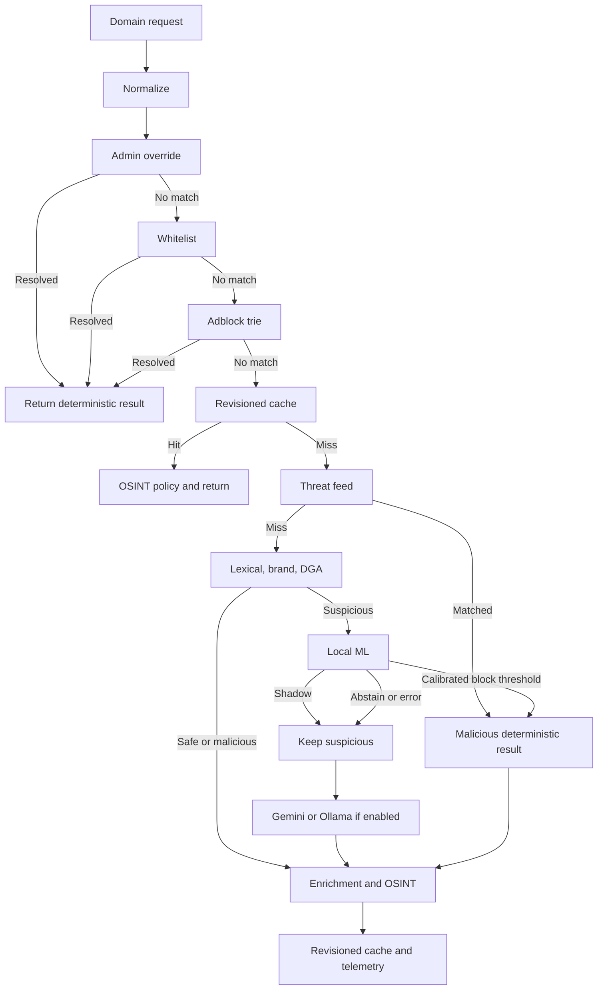

# Safe Zone AI Engine — Kế hoạch, thiết kế và hướng dẫn triển khai chuẩn

> **Revision 5 — 2026-07-30**  
> Đây là **tài liệu kỹ thuật duy nhất** cho toàn bộ Safe Zone AI Engine: deterministic analysis, Custom Domain ML, Gemini/Ollama refinement, OSINT-assisted classification và autonomous Agent workflow. Tài liệu đi cùng `docs/production-completion-checklist.md`, là checklist release/vận hành duy nhất.

## 0. Trạng thái và phạm vi tài liệu

### 0.1 Hai nguồn tài liệu chuẩn

Chỉ có hai tài liệu chuẩn cho AI Engine:

1. `docs/specs/safe-zone-ai-plan.md`: kiến trúc, contract, kế hoạch phát triển, data/ML lifecycle, cấu hình, triển khai, vận hành và incident response.
2. `docs/production-completion-checklist.md`: trạng thái hoàn thành, release gates, evidence và smoke/drill bắt buộc.

Các kế hoạch/spec/ADR/runbook AI chuyên biệt trước đây đã được hợp nhất vào hai tài liệu này và phải được xóa để tránh drift. General README, deployment, privacy, threat model và OPEX docs chỉ được tóm tắt/ngữ cảnh hóa AI rồi liên kết về tài liệu này; chúng không được định nghĩa contract AI khác.

Raw data, processed data, provenance chi tiết và model bundle không được đưa lên GitHub nếu chưa có phê duyệt bảo mật riêng.

### 0.2 Thuật ngữ

| Thuật ngữ | Nghĩa trong tài liệu này |
|---|---|
| Deterministic pipeline | Override, whitelist, adblock, threat feed, lexical, brand spoofing, DGA, TLS/WHOIS và các rule không phụ thuộc model generative. |
| Local ML | LightGBM classifier chạy trong Go qua `leaves`; không gọi mạng và không sinh văn bản. |
| LLM refinement | Gemini/Ollama qua `internal/ai`; chỉ refine kết quả mơ hồ và giữ fail-open. |
| ML candidate | Domain đã đi qua các lớp deterministic ưu tiên cao và có lexical verdict `SUSPICIOUS`. |
| Shadow mode | ML tính prediction và telemetry nhưng không thay đổi verdict. |
| Enforce mode | ML được phép promote `SUSPICIOUS` thành `MALICIOUS` theo policy đã phê duyệt. |
| Abstain | ML không đủ bằng chứng block; giữ `SUSPICIOUS`, sau đó đi LLM hoặc fail-open như hiện tại. |
| Model bundle | Tập artifact immutable gồm model, feature contract, calibration, report và checksum. |

### 0.3 Mục tiêu

1. Giảm số lần gọi Gemini/Ollama cho domain mơ hồ.
2. Phát hiện nhanh domain phishing/malware mới bằng classifier chuyên biệt.
3. Giữ thứ tự ưu tiên và safety invariant của pipeline hiện hữu.
4. Không làm raw data hoặc provenance nhạy cảm rời môi trường được phê duyệt.
5. Bảo đảm training Python và inference Go có feature/probability parity đã kiểm thử.
6. Cho phép disable, shadow, rollback và fail-open mà không làm gián đoạn analyzer/resolver.

### 0.4 Ngoài phạm vi phiên bản đầu

- Không thay thế whitelist, threat feed, lexical rules, TLS/WHOIS hoặc OSINT.
- Không thay đổi public API response schema chỉ để expose nội bộ model.
- Không tự động hạ `SUSPICIOUS` thành `SAFE` trong rollout đầu.
- Không dùng model để tự thêm whitelist hoặc override allow.
- Không huấn luyện online trong process `core-api`/`dns-resolver`.
- Không tự upload dữ liệu lên Google Colab, SaaS notebook hoặc storage bên thứ ba.
- Không coi broad ad/tracker blocklist là malicious ground truth nếu chưa có label policy riêng.

---

## 1. Kiến trúc đích

### 1.1 Pipeline request thực tế

Code hiện tại có hai tầng orchestration, cần giữ đúng thứ tự:

```text
AnalyzeWithOptions / Policy
├── normalize request
├── client group + admin override
├── local whitelist
├── adblock trie
└── Service.analyze
    ├── Redis analysis cache
    ├── threat feed
    ├── lexical + brand + DGA analyzer
    ├── Custom Local ML (chỉ lexical SUSPICIOUS)
    ├── Gemini/Ollama refinement nếu ML abstain
    ├── async TLS/WHOIS enrichment
    ├── OSINT correlation theo request mode
    ├── revisioned cache write
    └── telemetry
```



### 1.2 Quyết định kỹ thuật

| Hạng mục | Quyết định |
|---|---|
| Model | LightGBM binary classifier. |
| Runtime | `github.com/dmitryikh/leaves`, chỉ được chấp nhận sau compatibility spike với model thật. |
| Go package | Feature extraction/classifier trong `internal/analysis`; orchestration trong `internal/risk`. |
| Training | Python module có CLI, không phụ thuộc notebook state. |
| Feature set | Version đầu: handcrafted numerical features + character n-gram TF-IDF, được chọn lại qua ablation. |
| Policy | Promote `SUSPICIOUS → MALICIOUS` tại calibrated threshold; còn lại abstain. |
| Rollout | `disabled → shadow → enforce`; default production ban đầu là `disabled`. |
| Deployment | Model bundle được lấy từ private artifact storage và mount read-only vào cả `core-api` và `dns-resolver`. |
| Integrity | Bundle checksum + schema version + feature count + model revision bắt buộc. |
| Cache | Cache revision phải bao gồm model bundle, feature contract, calibration và threshold. |

### 1.3 Safety invariant

- Override và whitelist luôn có ưu tiên trước model.
- Adblock/threat feed match không cần ML xác nhận lại.
- ML không được biến deterministic `MALICIOUS` thành `SAFE`.
- ML không được biến `SUSPICIOUS` thành `SAFE` trong v1.
- Missing/corrupt/incompatible model phải tương đương ML disabled khi `SAFE_ZONE_ML_REQUIRED=false`.
- `SAFE_ZONE_ML_REQUIRED=true` chỉ dùng ở môi trường chủ động yêu cầu model; load failure phải fail startup, không chạy âm thầm với cấu hình sai.
- Kết quả ML block phải cập nhật nhất quán verdict, score, confidence, category, reasons, source và cache revision.

### 1.4 Tầng LLM hiện hữu: Gemini/Ollama

Custom ML và LLM là hai lớp khác nhau:

- Custom ML là classifier local, deterministic theo model bundle và chưa được triển khai ở baseline hiện tại.
- Gemini/Ollama đã được triển khai trong `internal/ai` và được `internal/risk` dùng để refine domain `SUSPICIOUS`.
- `ai.Provider` chỉ dành cho provider có contract `Refine(ctx, domain, current)`; không ép Custom ML vào interface này.

Provider manager hỗ trợ bốn mode:

| `SAFE_ZONE_AI_PROVIDER` | Hành vi | Yêu cầu | Privacy/network |
|---|---|---|---|
| `none` | Không tạo provider có hiệu lực; giữ deterministic/ML result. | Không. | Không gửi dữ liệu tới LLM. |
| `gemini` | Gọi Gemini khi có API key. | `SAFE_ZONE_GEMINI_API_KEY`. | Domain, current result và prompt cần thiết rời host tới Google API. |
| `ollama` | Gọi Ollama `POST /api/generate`, `stream=false`, `format=json`. | Ollama daemon/model reachable. | Local/offline nếu endpoint thực sự nằm trong hạ tầng nội bộ. |
| `hybrid` | Thử Ollama trước; khi lỗi/timeout/invalid response thì fallback Gemini nếu Gemini enabled. | Ollama; Gemini key nếu cho phép cloud fallback. | Có thể gửi dữ liệu ra cloud khi Ollama lỗi; không dùng mode này nếu policy cấm cloud fallback. |

Code hiện đặt provider config mặc định là `gemini`, nhưng Gemini chỉ `Enabled()` khi API key tồn tại. Production mới nên bắt đầu bằng `SAFE_ZONE_AI_PROVIDER=none`, sau đó enable có chủ đích.

### 1.5 LLM config contract

| Biến | Default trong code | Yêu cầu vận hành |
|---|---|---|
| `SAFE_ZONE_AI_PROVIDER` | `gemini` | Chọn rõ `none`, `gemini`, `ollama`, `hybrid`; không dựa vào default production. |
| `SAFE_ZONE_GEMINI_BASE_URL` | `https://generativelanguage.googleapis.com/v1beta` | Chỉ override tới endpoint tin cậy; giữ HTTPS/TLS. |
| `SAFE_ZONE_GEMINI_API_KEY` hoặc `*_FILE` | empty | Secret; không commit/log. Empty làm Gemini disabled. |
| `SAFE_ZONE_GEMINI_MODEL` | `gemini-2.5-flash-lite` | Pin/ghi nhận model release; kiểm quota/terms trước production. |
| `SAFE_ZONE_GEMINI_TIMEOUT_MS` | `3000` | Bounded timeout; benchmark theo network thực. |
| `SAFE_ZONE_OLLAMA_BASE_URL` | `http://localhost:11434` | Trong container, `localhost` là chính container; dùng service name/host route đúng deployment. |
| `SAFE_ZONE_OLLAMA_MODEL` | `gemma2:2b` | Model phải được pull, kiểm checksum/source và đủ RAM. |
| `SAFE_ZONE_OLLAMA_TIMEOUT_MS` | `5000` | Bounded timeout; tính cold-start trong smoke test. |

Không tuyên bố Gemini dùng `0 MB`, Ollama “bảo mật tuyệt đối”, hoặc một model/RAM cụ thể là phù hợp nếu chưa đo trên môi trường thật.

### 1.6 LLM response và merge contract

Provider phải trả structured JSON có schema logic:

```json
{
  "verdict": "SAFE|SUSPICIOUS|MALICIOUS",
  "confidence": 0.0,
  "category": "phishing|malware|uncategorized|...",
  "reason": "short explanation"
}
```

Contract runtime hiện tại:

1. Chỉ gọi refinement khi current verdict là `SUSPICIOUS`.
2. Clamp confidence vào `[0,1]`.
3. Timeout, HTTP error, empty candidate, invalid JSON hoặc invalid provider giữ current result.
4. `risk.refineWithAI()` chỉ promote current result khi AI verdict là `MALICIOUS`.
5. AI trả `SAFE`/`SUSPICIOUS` không hạ verdict; reason có thể được append để hỗ trợ điều tra.
6. AI không được override admin override, whitelist, adblock hoặc threat-feed early result.
7. Public behavior của `/v1/analyze`, `/v1/policy` và `/dns-query` không phụ thuộc provider availability.
8. Redis không phải dependency bắt buộc cho LLM refinement.

Stable reason hiện có nhắc “local ai” cho Gemini; khi refactor nên chuẩn hóa reason/source theo provider thực để telemetry không gây hiểu nhầm.

### 1.7 OSINT attacker/victim classification

OSINT context classifier dùng cùng provider order để phân biệt domain trong public warning là:

- `attacker`: trang lừa đảo/độc hại;
- `victim`: thương hiệu/trang hợp pháp bị giả mạo;
- `unclear`: không đủ bằng chứng.

Context snippets là untrusted input. Prompt phải tiếp tục yêu cầu bỏ qua instruction nằm trong excerpt và chỉ trả JSON. Khi tất cả providers lỗi, caller dùng deterministic context heuristics; provider outage không được biến victim domain thành attacker chỉ vì parse lỗi.

### 1.8 LLM test/review gates

- Valid malicious response được parse và chỉ promote đúng trường hợp.
- Disabled/no-key giữ baseline.
- HTTP error, timeout, invalid JSON và empty response fail-open.
- Ollama request dùng expected model, non-streaming và JSON format.
- Hybrid Ollama success không gọi Gemini.
- Hybrid Ollama failure fallback Gemini đúng policy.
- Domain-role parser chỉ nhận ba enum hợp lệ và chống prompt injection từ excerpt.
- `go test -race ./internal/ai ./internal/risk` pass.
- Provider change không đổi public API shape hoặc deterministic paths.

### 1.9 Autonomous Agent Engine hiện hữu

Agent Engine chạy trong process `core-api` khi `SAFE_ZONE_AGENT_ENABLED=true`; không có binary agent riêng.

Contract theo code hiện tại:

- scheduler tick mỗi 30 giây và chạy initial due check ngay khi start;
- mỗi task có interval, timeout, enabled state, last/next run, run/error count;
- task được launch bằng goroutine độc lập; các task khác không bị một task chậm block;
- cùng một task có single-flight guard, không chạy trùng khi state là `running`;
- mỗi run có context timeout và correlated `run_id`;
- panic được recover, log structured stack và ghi agent event khi store hỗ trợ;
- stop hủy context và đợi goroutines;
- scheduled run bỏ qua task disabled;
- manual trigger hiện tìm task theo tên và có thể execute task registered disabled. Đây là behavior cần được product/security quyết định và test; mặc định an toàn nên reject trigger disabled trừ khi có explicit force/admin design.

### 1.10 Agent task catalog

| Task name | Scheduled enable condition | Chức năng và safety behavior |
|---|---|---|
| `audit` | Luôn registered enabled khi Agent Engine bật. | Query suspicious telemetry, skip domain có override, chạy TLS+WHOIS song song, optional LLM cho ambiguous result, auto-block khi malicious và đạt confidence threshold, xóa cache. |
| `feedsync` | Có resolved feed sources và Agent Engine bật. | Multi-source additive feed sync vào Redis, parser-drift checks, per-source failure isolation, feed revision/cache invalidation. Redis thiếu thì no-op. |
| `osint-audit` | `SAFE_ZONE_OSINT_ENABLED=true`. | Query recent allowed/suspicious candidates, lookup public-warning evidence, promote confirmed block evidence vào threat-feed Redis set và invalidate cache. |
| `alert` | Ít nhất một webhook/Telegram/Slack/email channel enabled. | Query significant agent events và gửi multi-channel alerts với timeout/rate control. |
| `whitelist_update` | `SAFE_ZONE_AGENT_WHITELIST_ENABLED=true`; default code hiện là `true`. | Download Tranco-style ZIP/CSV, normalize, replace/update SQLite whitelist và rebuild Bloom filter. |

> **Production warning:** Engine initial due check chạy ngay. Vì `whitelist_update` default `true`, bật Agent Engine có thể lập tức tải và thay whitelist. Production phải đặt `SAFE_ZONE_AGENT_WHITELIST_ENABLED=false` cho tới khi source, memory, import semantics, backup và rollback đã được smoke-test.

### 1.11 Agent config chuẩn

#### Engine và audit

| Biến | Default | Ghi chú |
|---|---:|---|
| `SAFE_ZONE_AGENT_ENABLED` | `false` | Master switch cho Agent Engine. |
| `SAFE_ZONE_AGENT_AUDIT_INTERVAL_SECONDS` | `3600` | Chu kỳ audit. |
| `SAFE_ZONE_AGENT_AUDIT_TIMEOUT_SECONDS` | `300` | Timeout toàn cycle. |
| `SAFE_ZONE_AGENT_AUDIT_MIN_OCCURRENCES` | `3` | Candidate frequency. |
| `SAFE_ZONE_AGENT_AUDIT_MAX_PER_CYCLE` | `50` | Giới hạn memory/network work. |
| `SAFE_ZONE_AGENT_AUDIT_CONFIDENCE_THRESHOLD` | `0.7` | Auto-block threshold hiện hữu; phải review riêng, không đồng nhất với ML threshold. |
| `SAFE_ZONE_AGENT_ENRICH_TIMEOUT_SECONDS` | `5` | TLS/WHOIS timeout mỗi domain. |

Audit initial query window là 24 giờ. Existing admin override luôn được tôn trọng. Audit auto-block reason bắt đầu `agent:` và cache domain được invalid khi Redis enabled.

#### Feed sync và OSINT

| Biến | Default | Ghi chú |
|---|---:|---|
| `SAFE_ZONE_AGENT_FEED_SOURCES` | empty | Explicit comma-separated sources. |
| `SAFE_ZONE_AGENT_FEED_PRESET` | empty | Resolve preset trước startup. |
| `SAFE_ZONE_AGENT_FEED_INTERVAL_SECONDS` | `86400` | Chu kỳ sync. |
| `SAFE_ZONE_AGENT_FEED_TIMEOUT_SECONDS` | `120` | Dùng cho task và per-source client hiện tại. |
| `SAFE_ZONE_AGENT_FEED_STALE_AFTER_SECONDS` | `129600` | Feed stale policy. |
| `SAFE_ZONE_AGENT_FEED_DRIFT_INVALID_RATIO` | `0.20` | Parser drift ratio. |
| `SAFE_ZONE_AGENT_FEED_DRIFT_MIN_INVALID` | `25` | Minimum invalid count. |
| `SAFE_ZONE_AGENT_FEED_CACHE_INVALIDATION_MIN_WRITES` | `1` | Revision/cache invalidation gate. |
| `SAFE_ZONE_AGENT_OSINT_INTERVAL_SECONDS` | `3600` | OSINT audit interval. |
| `SAFE_ZONE_AGENT_OSINT_TIMEOUT_SECONDS` | `120` | Cycle timeout. |
| `SAFE_ZONE_AGENT_OSINT_MAX_PER_CYCLE` | `50` | Lookup cap. |
| `SAFE_ZONE_AGENT_OSINT_LOOKBACK_SECONDS` | `86400` | Candidate window. |

Feed sync là additive; source bị upstream remove không tự động bị xóa khỏi aggregate set. Source-aware expiry/rebuild policy trong threat-intelligence docs vẫn phải được thực hiện trước khi coi aggregate là authoritative dài hạn.

#### Alert và whitelist update

| Biến | Default | Ghi chú |
|---|---:|---|
| `SAFE_ZONE_AGENT_ALERT_INTERVAL_SECONDS` | `900` | Alert polling cycle. |
| `SAFE_ZONE_AGENT_ALERT_TIMEOUT_SECONDS` | `30` | Cycle/channel timeout. |
| `SAFE_ZONE_AGENT_ALERT_MIN_EVENTS` | `1` | Minimum event count. |
| `SAFE_ZONE_AGENT_WEBHOOK_URL` hoặc `*_FILE` | empty | Generic/Discord-compatible webhook. |
| `SAFE_ZONE_ALERT_TELEGRAM_ENABLED` | `false` | Cần token/chat ID. |
| `SAFE_ZONE_ALERT_TELEGRAM_TOKEN` hoặc `*_FILE` | empty | Secret. |
| `SAFE_ZONE_ALERT_TELEGRAM_CHAT_ID` | empty | Destination. |
| `SAFE_ZONE_ALERT_SLACK_ENABLED` | `false` | Cần webhook URL. |
| `SAFE_ZONE_ALERT_SLACK_WEBHOOK_URL` hoặc `*_FILE` | empty | Secret. |
| `SAFE_ZONE_ALERT_EMAIL_ENABLED` | `false` | Cần SMTP host/port/from/to/password. |
| `SAFE_ZONE_AGENT_WHITELIST_ENABLED` | `true` | **Set false ban đầu ở production.** |
| `SAFE_ZONE_AGENT_WHITELIST_SOURCE_URL` | Tranco 1M URL trong code | Phải review availability/terms/schema. |
| `SAFE_ZONE_AGENT_WHITELIST_INTERVAL_SECONDS` | `604800` | 7 ngày. |
| `SAFE_ZONE_AGENT_WHITELIST_TIMEOUT_SECONDS` | `600` | Download/import timeout. |

Email config gồm `SAFE_ZONE_ALERT_EMAIL_SMTP_HOST`, `SAFE_ZONE_ALERT_EMAIL_SMTP_PORT`, `SAFE_ZONE_ALERT_EMAIL_USERNAME`, `SAFE_ZONE_ALERT_EMAIL_FROM`, `SAFE_ZONE_ALERT_EMAIL_PASSWORD`/`*_FILE`, `SAFE_ZONE_ALERT_EMAIL_TO`.

### 1.12 Agent control API

| Method | Path | Auth | Hành vi |
|---|---|---|---|
| `GET` | `/v1/agent/status` | Authenticated user | Engine/task status, whitelist metrics, DB stats, telemetry retention. Engine disabled trả `enabled:false`. |
| `POST` | `/v1/agent/trigger?task=<name>` | Admin | Queue immediate trigger; 503 nếu engine disabled, 400 thiếu task, 404 unknown task. |
| `POST` | `/v1/settings/test-ai` | Admin | Hiện test Gemini key/endpoint; không phải generic Ollama/hybrid/ML health endpoint. |
| `POST` | `/v1/settings/test-alert` | Admin | Test alert settings theo handler hiện hữu. |

Agent task runtime events được ghi vào SQLite `agent_audit_log` khi store enabled. Dashboard chỉ là control surface; database events/logs/status mới là release evidence.

### 1.13 Agent production smoke procedure

1. Bật Agent với feed/OSINT/alert/whitelist tasks disabled trừ task đang test.
2. Xác minh `GET /v1/agent/status` và task names/defaults.
3. Trigger từng task bằng admin API; lưu response, logs có `run_id`, task status và DB event.
4. Audit drill: tạo/ghi nhận suspicious candidate trong staging, chạy `audit`, xác minh existing override được skip và auto-block chỉ xảy ra theo threshold.
5. Feed drill: dùng controlled fixture/source, xác minh partial failure, parser drift, revision và cache invalidation.
6. OSINT drill: dùng approved context fixture, xác minh victim không bị promote nhầm.
7. Alert drill: dùng test endpoint/channel staging, xác minh secret không xuất hiện trong log.
8. Whitelist drill: backup SQLite, import controlled small fixture, đo memory/time, verify Bloom reload, rồi restore/rollback.
9. Chỉ sau drill mới enable schedule production tương ứng.

### 1.14 AI/LLM incident response

#### Detect

```sh
docker compose logs core-api --tail=200 | grep -i "refinement\|ollama\|gemini\|ml_classifier\|agent"
```

Kiểm tra status/metrics, provider mode, model revision, Agent task `LastError`/`ErrorCount` và correlated `run_id`.

#### Ollama

```sh
curl -fsS http://127.0.0.1:11434/api/tags
```

- Xác minh daemon/model đã load.
- Xác minh URL từ network namespace của container, không chỉ từ host.
- Nếu offline/privacy bắt buộc, chuyển `SAFE_ZONE_AI_PROVIDER=none` khi Ollama chưa phục hồi; không chuyển `hybrid` nếu cloud fallback bị cấm.

#### Gemini

- Xác minh API key/file secret, base URL, model, quota/rate limit và bounded timeout.
- Rotate key nếu nghi lộ; không in key trong command/log/evidence.
- Chuyển `none` hoặc `ollama` để giữ deterministic service khi cloud lỗi.

#### Custom ML

- Chuyển `SAFE_ZONE_ML_MODE=shadow` hoặc `disabled` khi nghi false positive/model drift.
- Xác minh bundle checksum/revision/threshold và cache revision.
- Rollback bundle immutable rồi xác minh cả `core-api` và `dns-resolver` dùng cùng revision.

#### Agent

- Chuyển `SAFE_ZONE_AGENT_ENABLED=false` nếu scheduler gây side effect không kiểm soát.
- Kiểm tra/rollback auto-created overrides, threat-feed promotions hoặc whitelist import theo audit event.
- Không xóa evidence trước incident review; redact secrets/domain data theo privacy policy khi chia sẻ.

#### Expected behavior

LLM/ML/Agent degradation không được làm deterministic analysis ngừng hoạt động. Outage là degraded fidelity/automation, không phải blanket outage. Exception duy nhất là cấu hình chủ động `SAFE_ZONE_ML_REQUIRED=true` làm model bundle trở thành startup requirement.

### 1.15 Baseline implementation status

| Component | Trạng thái repo hiện tại |
|---|---|
| Lexical/brand/DGA deterministic analyzer | Implemented. |
| Gemini provider | Implemented, optional by effective API-key enablement. |
| Ollama provider | Implemented. |
| Hybrid Ollama→Gemini fallback | Implemented. |
| OSINT domain-role provider fallback | Implemented. |
| Agent Engine + audit/feed/OSINT/alert/whitelist tasks | Implemented; cần real-environment smoke/evidence và safety decisions nêu trên. |
| Custom LightGBM Domain ML | Planned trong các phase tiếp theo; chưa được coi là implemented chỉ vì dataset đã build. |

---

## 2. Trạng thái dữ liệu local và quản trị dữ liệu

### 2.1 Snapshot đã ghi nhận ngày 2026-07-30

Pipeline `scripts/build_domain_dataset.py` đã tạo snapshot local trong `ml/data/processed/`. Các số dưới đây là dữ liệu của snapshot, không phải hằng số cho lần build sau:

| Artifact | Snapshot |
|---|---|
| `domain_dataset.csv` | 2.772.090 mẫu: 1.386.045 SAFE và 1.386.045 MALICIOUS. |
| `domain_dataset_lite.csv` | 300.000 mẫu: 150.000 mỗi nhãn. |
| `domain_dataset_provenance.csv` | Source attribution và metadata blacklist Việt Nam. |
| `cleaning_report.json` | Thống kê normalize, dedup, conflict, sampling và source. |

Các fact quan trọng:

- Whitelist Việt Nam: 656.983 dòng raw, 441.372 FQDN unique hợp lệ sau normalize.
- Blacklist Việt Nam JSON: 78.235 FQDN unique hợp lệ và metadata tổ chức/ngày phát hiện.
- Có 8.385 cross-label conflicts trong snapshot.
- `top-1m.csv` đóng góp 911.493 SAFE sau final dedup; chưa được gọi là Cisco Umbrella cho đến khi provenance xác minh nguồn.
- Dataset builder hiện cân bằng 1:1 phục vụ training; tỷ lệ này không phản ánh production base rate.

Mỗi lần build mới phải cập nhật manifest và report; không copy các con số trên sang release report nếu checksum input/output đã thay đổi.

### 2.2 Cấu trúc input thật của builder

```text
data/
├── whitelist/
│   ├── general/tranco_46ZYX.csv
│   ├── general/top-1m.csv
│   └── vietnam/
│       ├── vietnam_domains.txt
│       └── vietnam_websites.csv
└── blacklist/
    ├── general/
    │   ├── hagezi_tif.txt
    │   ├── tempest_phishing.txt
    │   ├── verified_online.csv
    │   ├── phishing_army.txt
    │   ├── urlhaus.csv
    │   ├── stevenblack_hosts.txt
    │   └── openphish.txt
    └── vietnam/
        ├── raw_scraped_domains.json
        ├── raw_scraped_domains.txt
        └── part1.txt ... part4.txt
```

Không dùng đường dẫn tài liệu cũ `data/blacklist/feeds/` nếu builder chưa đổi theo layout đó.

### 2.3 Label policy và trust tier

Không được đồng nhất “có trong list” với ground truth cùng chất lượng. Mỗi source cần có `label_role`, `trust_tier`, thời gian và điều khoản sử dụng.

| Nhóm | Ví dụ | Vai trò mặc định |
|---|---|---|
| Strong malicious | Official/verified phishing or malware indicator có status/timestamp phù hợp | Positive ground truth sau validation. |
| Specialist community malicious | OpenPhish/Phishing Army hoặc nguồn chuyên biệt tương đương | Positive có source-aware evaluation; kiểm tra stale/terms. |
| Weak/mixed malicious | HaGeZi broad list hoặc nguồn tổng hợp rộng | Weak label/auxiliary; không tự động đặt cùng trọng số strong source. |
| Unwanted/ad/tracker | StevenBlack và broad hosts lists | Không coi mặc định là phishing/malware; tách khỏi binary malicious hoặc chỉ dùng experiment riêng. |
| Strong safe | Official domain được curate, trusted brand official/alt domains, nguồn nhà nước xác minh | Safe ground truth ưu tiên. |
| Weak safe | Tranco/top lists | Weak-safe; có thể chứa compromised/shared-hosting domain. |

Yêu cầu xử lý:

1. Thêm source policy machine-readable vào pipeline.
2. Không dùng mixed-purpose source làm positive binary nếu chưa review.
3. Không gắn nhãn malicious cho shared-hosting parent chỉ vì một tenant/path độc hại.
4. Giữ `first_seen`, `last_seen`, `status`, `retrieved_at` khi nguồn hỗ trợ.
5. Không suy diễn license cho model redistribution; review từng feed và ghi kết quả trong manifest.

### 2.4 Conflict policy

Runtime whitelist có ưu tiên trước feed, trong khi builder cũ dùng blacklist priority. Vì hai semantics khác nhau, cross-label conflicts không được đưa trực tiếp vào train/validation/test binary.

Mỗi conflict phải được export vào quarantine với:

- normalized FQDN;
- registrable domain;
- tất cả source thay vì chỉ source đầu tiên;
- source trust tier;
- indicator status/timestamps;
- lý do conflict;
- resolution state: `unresolved`, `safe`, `malicious`, `compromised`, `shared_hosting`, `stale`.

Conflict set được dùng để audit policy và tạo hard cases sau review, không dùng để làm đẹp metric.

### 2.5 Data manifest có thể commit

Tạo `ml/data/data_manifest.json` chỉ chứa metadata không nhạy cảm:

```json
{
  "manifest_version": 1,
  "pipeline_git_sha": "...",
  "generated_at": "RFC3339",
  "random_state": 42,
  "raw_sources": [
    {
      "logical_name": "urlhaus",
      "path": "data/blacklist/general/urlhaus.csv",
      "sha256": "...",
      "bytes": 0,
      "retrieved_at": "RFC3339",
      "trust_tier": "strong-malicious",
      "terms_review_id": "..."
    }
  ],
  "processed": [
    {
      "path": "ml/data/processed/domain_dataset.csv",
      "sha256": "...",
      "rows": 0
    }
  ],
  "cleaning_report_sha256": "...",
  "label_policy_version": 1
}
```

Manifest không chứa domain, URL indicator, `impersonated_org`, credentials hoặc nội dung raw.

### 2.6 Data security

- Raw/processed/provenance data ở private storage có access control, audit và retention policy.
- Không upload mặc định lên Colab hoặc dịch vụ ngoài tổ chức.
- Training ngoài workstation chỉ được dùng môi trường private đã phê duyệt.
- Golden fixtures commit vào Git chỉ gồm domain tổng hợp hoặc mẫu đã được security review.
- Logs của builder/trainer không dump domain hàng loạt.
- Model bundle được coi là private release artifact cho đến khi security/legal review cho phép phân phối rộng hơn.

### 2.7 Preflight bắt buộc

Các script cần có:

```powershell
python -B scripts/build_domain_dataset.py
python -B scripts/create_data_manifest.py
python -B scripts/validate_domain_dataset.py
```

`validate_domain_dataset.py` phải fail non-zero khi:

- input thiếu hoặc schema/header không đúng;
- invalid FQDN, bare IP, duplicate trong final set;
- checksum không khớp manifest;
- conflict chưa được loại khỏi trainable binary set;
- source count drift vượt ngưỡng mà không có approval;
- source policy/terms metadata bắt buộc bị thiếu;
- mandatory malicious records vượt balance strategy và builder không có policy rõ ràng;
- output label/source count không khớp cleaning report.

---

## 3. Phase 0 — Compatibility spike và feature contract

> **Gate bắt buộc:** không train full dataset trước khi canonicalization, feature schema, `leaves` và Docker compatibility pass.

### 3.1 Canonicalization contract v1

Tạo `ml/contracts/domain_feature_contract.v1.json` và code tham chiếu Python.

Contract phải xác định:

- input của ML là lower-case ASCII A-label/punycode FQDN;
- cách xử lý URL, wildcard, `www.`, port, path, query, fragment và trailing dot;
- giới hạn label/FQDN và invalid input;
- Unicode runtime: chuyển IDNA theo profile đã chọn hoặc skip ML nếu không thể canonicalize đúng contract;
- PSL snapshot/version/checksum;
- cách tính registrable domain/eTLD+1, gồm `com.vn`, `gov.vn`, `edu.vn` và private/shared-hosting suffix;
- feature name, index, dtype, rounding/default;
- error behavior: invalid/unsupported input không được đoán feature bằng parser khác.

Không dùng `tldextract` tự tải PSL trong lúc train. PSL phải được pin/cache và ghi hash vào artifact.

### 3.2 Feature set v1

Baseline giữ handcrafted numerical features, nhưng số lượng cuối cùng do contract quyết định sau loại constant/redundant features.

| Feature/tín hiệu | Contract bắt buộc |
|---|---|
| Domain length, dots, hyphens, digits, ratios | Tính trên cùng canonical FQDN và cùng denominator. |
| Registrable/main label length | Dùng cùng PSL contract ở Python/Go. |
| Entropy/consonant sequence | Ghi rõ alphabet, Unicode/A-label semantics và rounding. |
| Punycode/IP-like pattern | Pattern versioned và có golden tests. |
| Token count | Ghi delimiter và empty-token behavior. |
| TLD risk | Map/default nằm trong contract; coi là engineered score, không mặc định gọi ordinal. |
| Brand similarity | Frozen brand snapshot từ `analysis.Brand`: name, official domain, alt domains. |
| Weighted keyboard distance | Port semantics thật từ `internal/analysis/brand.go`, gồm adjacency hai chiều và digits. |
| Homoglyph | Dùng cùng skeleton map Unicode như Go, không giữ map Python giản lược. |
| Phishing keyword count | Frozen keyword snapshot/version; không tự lấy config runtime khác training. |
| Shared/free hosting | So khớp boundary: exact hoặc suffix `.`; không dùng `endswith()` trần. |
| Special characters | Nếu luôn bằng 0 sau RFC-1035 validation thì loại khỏi v1 hoặc ghi rõ deliberate constant. |

Feature array phải có thứ tự explicit trong manifest; không dựa vào thứ tự `dict`, reflection hoặc DataFrame.

### 3.3 Frozen brand/keyword semantics

- Model dùng brand snapshot đóng băng lúc train.
- Runtime admin có thể thay brand DB cho deterministic analyzer, nhưng thay đổi đó không được âm thầm đổi ML feature semantics.
- Model report phải ghi brand snapshot hash.
- Khi muốn model dùng brand list mới, phải train/release bundle mới.
- Brand snapshot phải dùng tên thật hiện có, ví dụ `baohiemxahoi`, không thay tùy ý bằng alias `bhxh` nếu training/runtime không cùng mapping.

### 3.4 Character n-gram TF-IDF contract

Baseline ban đầu có thể dùng `(2,3)` và `max_features=128`, nhưng phải benchmark/ablation trước khi khóa schema.

Manifest phải chứa đủ:

```json
{
  "feature_schema_version": 1,
  "handcrafted_feature_names": ["..."],
  "char_ngrams": {
    "range": [2, 3],
    "lowercase": true,
    "use_idf": true,
    "smooth_idf": true,
    "sublinear_tf": false,
    "norm": "l2"
  },
  "vocabulary_by_index": ["ab", "bc"],
  "idf_by_index": [1.0, 1.2],
  "psl_sha256": "...",
  "brand_snapshot_sha256": "...",
  "keyword_snapshot_sha256": "..."
}
```

Go phải tái tạo đúng:

1. preprocessing/lowercase;
2. character n-gram generation;
3. raw term frequency;
4. smoothed IDF;
5. vector index order;
6. L2 normalization;
7. unknown n-gram behavior.

Golden TF-IDF tolerance phải được đặt bằng test, ví dụ `1e-12` nếu hai implementation cho phép.

### 3.5 Ablation trước khi khóa schema

Đánh giá tối thiểu:

- deterministic features only;
- TF-IDF only;
- combined features;
- 128/512/1024/2048 vocabulary nếu tài nguyên cho phép;
- n-gram `(2,3)` và `(3,5)`;
- latency/model-size trade-off trong Go.

Không gọi character n-gram TF-IDF là “embedding” nếu tài liệu kỹ thuật cần phân biệt sparse TF-IDF với learned embedding.

### 3.6 `leaves` compatibility spike

1. Pin một version/commit cụ thể của `github.com/dmitryikh/leaves` trong branch thử nghiệm.
2. Train model nhỏ bằng version LightGBM dự kiến.
3. Export LightGBM text bằng `save_model()`.
4. Nếu cần JSON debug, dùng `model.dump_model()` + `json.dump()`; đổi extension trong `save_model()` không tạo JSON.
5. Load model thật bằng `leaves.LGEnsembleFromFile` với transformation phù hợp.
6. Kiểm tra `model.NFeatures()` bằng expected feature count trước prediction.
7. So raw/transformed prediction Python–Go trên ít nhất 1.000 frozen vectors.
8. Kiểm tra `CGO_ENABLED=0` và Docker Alpine.
9. Test malformed/truncated model và unsupported objective.

Không dùng header `tree` làm compatibility proof. `PredictSingle()` có thể trả giá trị im lặng khi vector không đủ chiều, nên dimension validation là startup gate.

### 3.7 Phase 0 acceptance criteria

- Contract v1 được review và versioned.
- Python/Go canonicalization parity pass trên golden corpus.
- Handcrafted + TF-IDF vectors parity pass.
- Mini model probability parity pass.
- Docker `CGO_ENABLED=0` build pass.
- Feature count/model objective/transformation được xác nhận.
- Chỉ sau đó mới phê duyệt dependency `leaves` cho implementation chính.

---

## 4. Phase 1 — Trainable dataset và leakage-safe evaluation

### 4.1 Output dẫn xuất

Tạo output gitignored:

```text
ml/data/derived/
├── train_candidates.parquet
├── validation_candidates.parquet
├── calibration_candidates.parquet
├── test_candidates.parquet
├── source_holdout.parquet
├── temporal_holdout.parquet
├── conflicts_excluded.parquet
├── hard_cases.parquet
└── split_manifest.json
```

Không ghi dense `features_X.csv` mặc định.

### 4.2 Xây candidate cohort giống production

Model production chỉ thấy lexical `SUSPICIOUS`, vì vậy cần đánh giá đúng population:

1. Normalize theo contract.
2. Loại cross-label conflict chưa resolve.
3. Gắn source/trust tier/timestamp/registrable-domain group.
4. Tách các mẫu chắc chắn sẽ short-circuit bởi strong whitelist/threat feed khi mô phỏng production.
5. Chạy analyzer hiện tại với analysis config snapshot đã ghi hash.
6. Đánh dấu `lexical_verdict`, score/reasons và `is_ml_candidate`.
7. Ưu tiên train/evaluate trên `is_ml_candidate=true` hoặc dùng weighting phù hợp.
8. Có thể train baseline full population, nhưng release report bắt buộc có metric riêng cho candidate cohort.

Analysis config, brand revision và keyword snapshot dùng để tạo cohort phải được ghi vào split manifest.

### 4.3 Hard cases

`hard_cases` tối thiểu gồm:

- trusted brands và official/alt domains;
- `gov.vn`, `edu.vn` và public-service domains;
- benign shared-hosting tenants;
- brand typos/homoglyph/punycode tổng hợp đã review;
- lexical false positives và false negatives đã xác minh;
- DGA-like benign domains;
- stale/compromised/conflict cases;
- Unicode/IDN cases, kể cả trường hợp v1 phải abstain.

Hard cases không được trộn vào train sau khi đã dùng để chọn threshold mà không tạo test set mới.

### 4.4 Group-aware split

Không dùng random row split làm split chính.

- Group key mặc định: registrable domain theo pinned PSL contract.
- Khi metadata cho phép, thêm campaign/impersonated-organization grouping.
- Không để cùng group ở train, validation, calibration và test.
- TF-IDF và mọi learned transform chỉ `fit()` trên train.
- Validation dùng chọn feature/hyperparameter.
- Calibration partition riêng dùng fit Platt/isotonic.
- Final test chỉ mở sau khi model/threshold đóng băng.
- Source holdout giữ ít nhất một nguồn ngoài train khi khả thi.
- Temporal holdout dùng `detected_date`/retrieval time khi coverage đủ.

### 4.5 Split manifest

`split_manifest.json` phải chứa:

- input data manifest hash;
- label policy version;
- canonicalization/PSL version;
- group key algorithm/version;
- seed;
- row/label/source/trust-tier counts từng partition;
- earliest/latest timestamps;
- checksums;
- assertion `group_overlap=0`;
- assertion `conflicts_in_trainable=0`.

### 4.6 Capacity strategy

Full snapshot 2.772.090 × 128 float64 đã cần khoảng 2,64 GiB chỉ cho dense TF-IDF values, chưa tính DataFrame/model overhead.

- Dùng sparse matrices hoặc batch transform.
- Dùng Parquet/NPZ/binary format phù hợp, không CSV dense.
- Dataset lite dùng cho development baseline, không thay final evaluation.
- Ghi peak RSS, wall time, CPU, disk và temporary storage.
- Feature extraction brand distance phải benchmark trước full run.
- Training requirement/timeline phải cập nhật từ profile thật, không dựa vào giả định 100K rows.

### 4.7 Phase 1 acceptance criteria

- Preflight và manifest pass.
- Conflict set đã cách ly.
- Source/label policy được áp dụng.
- Candidate cohort được tạo bằng analysis config versioned.
- Group overlap bằng 0.
- TF-IDF chưa fit trên validation/calibration/test.
- Capacity report xác nhận pipeline có thể chạy trên môi trường training đã phê duyệt.

---

## 5. Phase 2 — Feature engineering, training, calibration và evaluation

### 5.1 Cấu trúc training code

Do `.gitignore` hiện bỏ qua `*.py`, implementation phải đồng thời cho phép commit có chủ đích `ml/**/*.py` hoặc thay ignore rule tương đương.

```text
ml/
├── configs/
│   └── v1.json
├── contracts/
│   └── domain_feature_contract.v1.json
├── src/
│   ├── canonicalize.py
│   ├── build_features.py
│   ├── make_splits.py
│   ├── train_lightgbm.py
│   ├── calibrate_model.py
│   ├── evaluate_model.py
│   └── export_artifacts.py
├── tests/
│   ├── test_contract.py
│   ├── test_features.py
│   ├── test_splits.py
│   └── test_artifacts.py
└── notebooks/
    └── exploratory-only.ipynb
```

Notebook chỉ dùng khám phá. Release model phải được tạo bằng CLI/module tái lập được.

### 5.2 Dependency/reproducibility

- Dùng `pyproject.toml`/lockfile hoặc requirements lock với version chính xác.
- Pin Python, NumPy, pandas, scikit-learn, LightGBM, tldextract/PSL và Levenshtein implementation.
- Seed Python/NumPy/LightGBM.
- Ghi package versions, OS/architecture, CPU và Git SHA vào report.
- Không tự tải network resource trong training nếu không được manifest hóa.

### 5.3 Baselines

Trước LightGBM, ghi metric của:

1. deterministic analyzer hiện tại;
2. simple logistic regression trên TF-IDF;
3. LightGBM handcrafted-only;
4. LightGBM TF-IDF-only;
5. LightGBM combined.

Model phức tạp chỉ được chọn khi cải thiện candidate-cohort metric và false-positive budget đủ rõ.

### 5.4 LightGBM training

Hyperparameters là experiment, không phải hằng số trong plan. Tuning chỉ dùng train + group-disjoint validation.

- Không bật `is_unbalance=true` khi train set đã cân bằng 1:1 trừ khi experiment chứng minh.
- Nếu dùng class/sample weights để mô phỏng production prior hoặc trust tier, ghi rõ công thức.
- Early stopping dùng validation, không dùng final test.
- Không báo cáo metric trên tập đã dùng chọn hyperparameter.
- Lưu feature names/order và `best_iteration`.

### 5.5 Calibration

Raw LightGBM output không được gọi là confidence production.

1. Chọn Platt sigmoid hoặc isotonic dựa trên calibration partition và evidence.
2. Không fit calibration trên final test.
3. Export mapping đủ nhỏ và deterministic để Go áp dụng chính xác.
4. So calibration Python/Go bằng golden tests.
5. Đo Brier score, ECE và reliability curve.

### 5.6 Operating policy v1

| Calibrated `P(malicious)` | Shadow | Enforce v1 |
|---|---|---|
| `p >= block_threshold` | Ghi `would_block=true`, giữ verdict | Promote `SUSPICIOUS → MALICIOUS` |
| `p < block_threshold` | Ghi abstain | Giữ `SUSPICIOUS`; đi LLM nếu enabled |
| Error/unsupported input | Ghi error/skip | Giữ `SUSPICIOUS`; đi LLM nếu enabled |

Không dùng `max(p, 1-p) >= threshold`. Chưa có `allow_threshold` trong v1.

### 5.7 Chọn threshold

Threshold được chọn theo false-positive budget, không theo accuracy tổng:

- precision tại operating point;
- false positives trên SAFE VN;
- false positives trên trusted brands/public service/shared hosting;
- recall trên candidate malicious set;
- tác động dự kiến lên số LLM calls;
- production base-rate sensitivity.

Product owner phê duyệt trade-off; security owner phê duyệt scope enforce.

### 5.8 Báo cáo bắt buộc

- Precision/recall/F1, PR-AUC và ROC-AUC.
- Confusion matrix tại selected threshold.
- Candidate-cohort metrics.
- Group-disjoint final test metrics.
- Source/trust-tier breakdown.
- Source holdout và temporal holdout.
- VN blacklist recall.
- SAFE VN/trusted-brand/shared-hosting FPR.
- Calibration Brier/ECE.
- Baseline/ablation comparison.
- Model size/load time.
- Python batch inference performance.
- Go p50/p95/p99 latency, allocations và RSS trên VPS target sau Phase 3.

### 5.9 Phase 2 acceptance criteria

- Final test không được dùng trong tuning/calibration.
- Selected model tốt hơn deterministic baseline trên candidate cohort theo gate đã phê duyệt.
- False-positive budget pass trên critical benign sets.
- Calibration pass.
- Report có đủ breakdown và checksums.
- Chưa release nếu metric cao chủ yếu do source leakage hoặc easy full-population samples.

---

## 6. Phase 3 — Immutable artifact bundle và Python–Go parity

### 6.1 Bundle layout

```text
model-bundle/
├── domain_threat_lgbm.txt
├── feature_manifest.v1.json
├── calibration.json
├── policy.json
├── model_report.json
└── SHA256SUMS
```

Không đặt raw dataset, provenance domain-level hoặc joblib không cần runtime vào bundle.

### 6.2 `model_report.json`

Tối thiểu gồm:

- model name/version;
- model SHA-256 và feature count;
- data/split manifest hashes;
- label policy version;
- Python/LightGBM/scikit-learn versions;
- params, seed, best iteration;
- feature/PSL/brand/keyword snapshot hashes;
- calibration method/hash;
- selected threshold và approval metadata;
- metrics summary và link private tới full report;
- created/expires/retrain-after timestamps;
- training code Git SHA.

### 6.3 `policy.json`

```json
{
  "policy_version": 1,
  "block_threshold": 0.99,
  "allow_threshold": null,
  "allowed_actions": ["abstain", "promote_malicious"],
  "approved_at": "RFC3339",
  "approval_id": "..."
}
```

`0.99` chỉ là placeholder bảo thủ; giá trị release lấy từ calibration/approval.

### 6.4 Bundle revision

Tính deterministic revision từ:

```text
model hash
+ feature manifest hash
+ calibration hash
+ policy hash
```

Runtime env override threshold, nếu được cho phép, phải tham gia revision. Không được đổi threshold mà tái sử dụng cache revision cũ.

### 6.5 Golden parity corpus

Python xuất `golden_vectors.jsonl` chỉ từ domain tổng hợp hoặc fixture đã phê duyệt. Mỗi record gồm:

- input và canonical FQDN/skip reason;
- handcrafted vector;
- TF-IDF sparse entries hoặc full vector nhỏ;
- raw LightGBM probability;
- calibrated probability;
- expected action tại fixture policy.

Corpus phải phủ:

- common TLD và multi-label suffix;
- `com.vn`, `gov.vn`, `edu.vn`;
- deep subdomain;
- shared hosting boundaries;
- hyphen/digit/IP-like patterns;
- punycode/IDN/Unicode skip;
- brand/alt-domain/typos/homoglyph;
- invalid and edge-length input.

### 6.6 Go loader gates

Khi load:

- xác minh tất cả SHA256SUMS;
- reject path/bundle thiếu;
- reject unknown manifest/calibration/policy version;
- reject threshold ngoài `(0,1)`;
- reject feature name/order/count mismatch;
- reject unsupported LightGBM objective/transformation;
- reject PSL/brand/keyword contract không đầy đủ;
- xác minh `model.NFeatures()` chính xác;
- không log nội dung bundle hoặc domain fixture nhạy cảm.

### 6.7 Phase 3 acceptance criteria

- Feature parity pass theo tolerance.
- Raw probability parity pass.
- Calibrated probability parity pass.
- Loader reject mọi fixture corrupt/mismatch.
- Model immutable và thread-safe trong concurrent benchmark/race test.
- Bundle revision deterministic.
- Compatibility pass trên binary production và Docker Alpine.

---

## 7. Phase 4 — Tích hợp Go và Safe Zone runtime

### 7.1 Files dự kiến

```text
internal/analysis/
├── features.go
├── features_test.go
├── ml_classifier.go
├── ml_classifier_test.go
└── testdata/
    └── synthetic-model-bundle/

internal/risk/
├── env.go
├── service.go
└── service_test.go

ml/
├── configs/
├── contracts/
├── src/
└── tests/
```

Các fixture model trong Git phải nhỏ, synthetic và không chứa production domains.

### 7.2 Interface đề xuất

Giữ classifier tách khỏi `ai.Provider`:

```go
type MLMode string

const (
    MLModeDisabled MLMode = "disabled"
    MLModeShadow   MLMode = "shadow"
    MLModeEnforce  MLMode = "enforce"
)

type MLDecision struct {
    Probability float64
    Action      string // "abstain" or "promote_malicious"
    ModelVersion string
    Revision    string
}

type DomainClassifier interface {
    Enabled() bool
    Revision() string
    Classify(domain string) (MLDecision, error)
}
```

Classifier nên giữ immutable model/contract sau startup. Không giữ mutex trong hot path nếu dependency đã được xác minh thread-safe; nếu chưa, compatibility spike phải quyết định strategy.

### 7.3 Risk options/lifecycle

Thêm classifier/mode vào `risk.Options`; `NewServiceFromEnvForRole()` chỉ parse config và tạo dependency.

```go
type Options struct {
    // existing fields...
    MLClassifier analysis.DomainClassifier
    MLMode       analysis.MLMode
}
```

Điều này cho phép unit test inject fake classifier mà không cần production bundle.

Không gán vào một biến `s` chưa tồn tại trong `NewServiceFromEnv()`. Loader được tạo trước khi gọi `NewService`, hoặc trong constructor nhận `MLConfig` rõ ràng.

### 7.4 Cấu hình runtime

Dùng một bundle directory để tránh trộn model/manifest/calibration từ các release khác nhau:

```env
# disabled | shadow | enforce
SAFE_ZONE_ML_MODE=disabled

# Empty path means no classifier bundle.
SAFE_ZONE_ML_BUNDLE_DIR=/app/models/safe-zone/current

# false: bundle error disables ML and preserves service behavior.
# true: bundle error fails startup.
SAFE_ZONE_ML_REQUIRED=false

# Empty means use approved value from policy.json.
# An override must be validated and included in ModelRevision.
SAFE_ZONE_ML_BLOCK_THRESHOLD=
```

Validation:

- mode chỉ nhận ba giá trị;
- `enforce` cần bundle hợp lệ;
- threshold override nằm trong `(0,1)`;
- `required=true` + missing bundle fail startup;
- `disabled` không cần đọc bundle;
- structured logs chỉ ghi version/revision/error class, không ghi domain/data contents.

### 7.5 Merge policy

ML chỉ chạy khi lexical verdict `SUSPICIOUS`.

```text
if mode disabled:
    preserve current flow

if mode shadow:
    classify
    record would_block / abstain / error
    do not alter Result
    continue existing LLM refinement

if mode enforce and decision promote_malicious:
    Verdict    = MALICIOUS
    Confidence = calibrated P(malicious)
    Score      = approved ML block score, consistent with MALICIOUS
    Category   = phishing/malware according to defined policy, otherwise keep a valid malicious category
    Reasons   += model version + stable reason code
    Source     = ml_classifier in telemetry
    skip LLM refinement

otherwise:
    preserve SUSPICIOUS
    continue existing LLM refinement
```

Dùng stable reason code, ví dụ `ml_classifier_high_risk`, không tạo giải thích generative giả.

### 7.6 LLM interaction

- `internal/ai` và provider modes giữ nguyên.
- ML block không cần LLM xác nhận để tránh latency và semantic conflict.
- ML abstain tiếp tục `s.refineWithAI()`.
- LLM hiện chỉ promote malicious; behavior này không được âm thầm đổi trong cùng change set.
- Agent audit/enrichment có thể dùng final result nhưng không được tự diễn giải raw ML probability ngoài policy đã versioned.

### 7.7 Cache revision

Mở rộng `analysisCacheEntry` với `ModelRevision`, hoặc hợp nhất model revision vào `AnalysisRevision` theo cách deterministic.

Cache hit chỉ hợp lệ khi:

- analysis algorithm revision;
- dynamic analysis config revision;
- feed revision;
- brand revision cho deterministic analyzer;
- ML model/policy revision

đều khớp.

Model rollback, threshold override hoặc bundle change phải làm cache miss. Cả `core-api` và `dns-resolver` phải dùng cùng revision/bundle.

### 7.8 Telemetry và observability

Status/metrics cần expose metadata không nhạy cảm:

- `ml_mode`;
- `ml_enabled`;
- `ml_model_version`;
- short revision;
- load status/error class;
- prediction attempts;
- shadow would-block;
- enforce promotions;
- abstains;
- prediction errors/skips;
- LLM fallback after ML;
- p50/p95/p99 inference latency hoặc histogram tương đương.

Không log domain trên mỗi prediction ở info level. Domain-level telemetry hiện hữu phải tuân theo retention/privacy policy.

### 7.9 Error/panic handling

- Loader error: fail startup chỉ khi required.
- Per-prediction error: abstain và tiếp tục LLM/fail-open.
- Unsupported canonicalization: skip ML, không tự tạo vector khác contract.
- NaN/Inf/out-of-range probability: prediction error.
- Panic từ dependency không được làm crash request process; xử lý tại boundary phù hợp và có counter, nhưng không che lỗi cấu hình startup.

### 7.10 Phase 4 acceptance criteria

- Disabled mode có behavior tương đương trước thay đổi.
- Shadow không đổi verdict/cache semantics ngoài model revision đã định nghĩa.
- Enforce chỉ promote candidate đủ threshold.
- Result fields nhất quán.
- LLM chỉ bị skip khi ML đã enforce block.
- Cache invalidation đúng model revision.
- Cả API và DNS resolver dùng cùng policy.
- Race/concurrency tests pass.

---

## 8. Phase 5 — Packaging, deployment và controlled rollout

### 8.1 Quyết định artifact delivery

Mặc định production dùng **private artifact fetch + read-only bind mount**:

```text
private artifact registry
    → verified release/pre-deploy fetch
    → deploy/model-bundle/current/
    → /app/models/safe-zone/current:ro
```

Lý do:

- model bundle không nằm trên public GitHub;
- cùng bundle có thể mount vào `core-api` và `dns-resolver`;
- rollback không cần build lại source image;
- checksum vẫn được runtime kiểm tra.

Baked-in image chỉ là phương án release khác, cần quyết định/approval riêng và Dockerfile phải copy bundle vào final image. Dockerfile hiện chỉ copy executable nên không tự có model.

### 8.2 Repository/deployment changes

- Ignore `deploy/model-bundle/` trong Git nếu chứa private artifact.
- Không thêm model bundle vào `.dockerignore` nếu chọn baked-in build; nếu dùng mount thì build context không cần bundle.
- Thêm read-only mount cho cả `core-api` và `dns-resolver`.
- Truyền cùng `SAFE_ZONE_ML_MODE`, `SAFE_ZONE_ML_BUNDLE_DIR`, `SAFE_ZONE_ML_REQUIRED`.
- Pre-deploy script xác minh checksum/signature trước `docker compose up`.
- Runbook mô tả fetch, activate symlink/directory, rollback và cleanup retention.

Ví dụ mount:

```yaml
volumes:
  - ./deploy/model-bundle/current:/app/models/safe-zone/current:ro
```

### 8.3 Startup/readiness

- `disabled`: readiness không phụ thuộc model.
- `shadow/enforce`, `required=false`: readiness vẫn pass nếu model lỗi nhưng status phải báo disabled/degraded.
- `shadow/enforce`, `required=true`: service không ready/start nếu bundle invalid.
- `/metrics` hoặc status endpoint phải cho biết version/revision đang active.

### 8.4 Rollout stages

#### Stage 0 — Disabled verification

- Deploy code với `SAFE_ZONE_ML_MODE=disabled`.
- Xác minh tests, status, cache behavior và không có latency regression đáng kể.

#### Stage 1 — Shadow

- Bật `shadow` trên phạm vi/cụm được chọn.
- Thu `would_block`, abstain, errors, latency.
- So sánh với human overrides, strong feeds, LLM và kết quả enrichment xuất hiện sau đó.
- Không dùng self-generated ML verdict làm ground truth cho chính model.

#### Stage 2 — Canary enforce

- Bật enforce với threshold bảo thủ cho traffic/cụm nhỏ.
- Theo dõi false-positive reports, trusted-brand hits và rollback signals.
- Có kill switch chuyển ngay về `shadow`/`disabled`.

#### Stage 3 — Controlled expansion

- Mở rộng sau thời gian quan sát và approval.
- Không thêm safe downgrade trong cùng rollout.

### 8.5 Rollback

1. Chuyển `SAFE_ZONE_ML_MODE=shadow` hoặc `disabled` nếu cần dừng enforcement ngay.
2. Activate bundle version trước.
3. Restart/reload theo cơ chế đã chọn.
4. Model revision thay đổi làm cache miss.
5. Xác minh status/revision của cả hai service.
6. Ghi incident/reason và giữ bundle lỗi phục vụ forensic theo retention policy.

---

## 9. Verification plan

### 9.1 Python/data automated checks

```powershell
python -B scripts/validate_domain_dataset.py
python -B scripts/create_data_manifest.py
python -B -m pytest ml/tests -q
python -B ml/src/make_splits.py --manifest ml/data/data_manifest.json --config ml/configs/v1.json
python -B ml/src/train_lightgbm.py --config ml/configs/v1.json
python -B ml/src/calibrate_model.py --config ml/configs/v1.json
python -B ml/src/evaluate_model.py --bundle deploy/model-bundle/current
python -B ml/src/export_artifacts.py --config ml/configs/v1.json
```

Exact CLI có thể thay đổi khi implementation, nhưng release pipeline phải là non-interactive và fail non-zero khi gate fail.

### 9.2 Go checks

```powershell
go test ./internal/analysis -run "Test(FeatureContract|TFIDFParity|MLClassifier|ModelParity|BundleValidation)" -v
go test ./internal/risk -run "Test(MLDisabled|MLShadow|MLEnforce|MLCacheRevision|MLFailureFailsOpen)" -v
go test -race ./internal/analysis ./internal/risk
go test ./...
go build ./...
```

### 9.3 Docker checks

```powershell
docker build -t safe-zone:ml-test .
docker compose config
```

Sau đó chạy cả `core-api` và `dns-resolver` với synthetic bundle read-only, kiểm tra:

- process chạy dưới user `app`;
- bundle readable nhưng không writable;
- status trả đúng revision;
- required/optional failure semantics;
- exact production image build vẫn `CGO_ENABLED=0`.

Nếu kiểm tra binary trong image, binary nằm ở `/app/service`; không dùng đường dẫn `/service` không tồn tại.

### 9.4 Dataset assertions

- Invalid FQDN/IP/duplicate cuối cùng bằng 0.
- Conflict binary trainable bằng 0.
- Source/label counts khớp manifest/report.
- Group overlap train/validation/calibration/test bằng 0.
- TF-IDF fit chỉ trên train.
- Source/temporal holdout không bị trộn vào train.
- Không có production raw domain trong Git test fixture.

### 9.5 Model assertions

- Final test chưa được dùng tune/calibrate.
- Candidate-cohort report tồn tại.
- Critical benign false-positive budget pass.
- Calibration gate pass.
- Model report đủ version/hash/approval.
- Model feature count khớp contract.

### 9.6 Runtime assertions

- `disabled`: output tương đương baseline.
- `shadow`: verdict không đổi, telemetry có prediction.
- `enforce`: chỉ candidate vượt threshold được promote.
- Promote cập nhật score/category/reason/confidence nhất quán.
- Error/corrupt/missing model fail-open khi optional.
- ML block skip LLM; abstain đi LLM như hiện tại.
- Model/threshold rollback invalidates cache.
- Concurrent predictions không race.

### 9.7 Python–Go parity assertions

- Canonical FQDN/skip reason giống nhau.
- Handcrafted vector giống trong tolerance.
- TF-IDF vector giống trong tolerance.
- Raw probability giống trong tolerance.
- Calibrated probability giống trong tolerance.
- Action tại policy threshold giống nhau.

### 9.8 Performance assertions

Chỉ đặt SLO sau khi đo trên VPS target:

- model load time/RSS;
- p50/p95/p99 classification latency;
- allocations/op;
- throughput với concurrent load thực tế;
- ảnh hưởng lên API/DNS request latency;
- ảnh hưởng lên startup và image/deploy size.

Không dùng `<3ms`, `<1ms`, `>10.000 req/s` hoặc model `1–10MB` như cam kết trước benchmark.

---

## 10. Observability, drift và model lifecycle

### 10.1 Production feedback

Nguồn feedback hợp lệ:

- admin override sau phân tích;
- verified strong feed xuất hiện sau prediction;
- human-reviewed false-positive report;
- trusted brand/public-service incident;
- confirmed enrichment/OSINT evidence theo policy.

Không dùng prediction của model hoặc LLM chưa xác minh làm ground truth tự động.

### 10.2 Drift monitoring

Theo dõi theo model version:

- prediction/abstain rate;
- would-block/enforce rate;
- calibrated probability distribution;
- TLD/shared-hosting distribution;
- candidate volume;
- disagreement với strong feeds/human review;
- false-positive reports;
- feature missing/unsupported input rate.

Thiết lập cảnh báo khi distribution hoặc error rate vượt baseline đã phê duyệt.

### 10.3 Retraining trigger

Retrain khi một trong các điều kiện xảy ra:

- model hết hạn theo report;
- source/data drift có ý nghĩa;
- false-positive/false-negative budget vi phạm;
- canonicalization/PSL/brand/keyword contract thay đổi;
- LightGBM/`leaves` compatibility hoặc security dependency yêu cầu update;
- đủ verified production feedback để cải thiện hard cases.

Retraining luôn tạo bundle version mới và chạy lại toàn bộ release gates; không ghi đè artifact immutable.

### 10.4 Auditability

Mỗi production decision phải có thể truy ngược tới:

- model version/revision;
- policy/threshold revision;
- canonicalization/feature contract;
- analysis config revision;
- feed/brand/cache revision liên quan;
- stable reason/source code.

Không cần lưu full feature vector cho mọi request nếu vi phạm privacy/capacity; có thể lưu sampling/debug artifact theo approval.

---

## 11. Risk register

| Rủi ro | Tác động | Biện pháp |
|---|---|---|
| Weak/mixed labels | Metric cao giả, block nhầm | Trust tier, conflict quarantine, hard-case/holdout evaluation. |
| Group/source leakage | Test không phản ánh domain mới | PSL group split, source/temporal holdout. |
| TF-IDF leakage | IDF biết test data | Fit chỉ train. |
| Python–Go feature drift | Prediction runtime sai âm thầm | Versioned contract + golden parity. |
| Dynamic brand drift | Model feature semantics đổi | Frozen snapshot trong bundle. |
| Uncalibrated score | Threshold sai production prior | Dedicated calibration + false-positive operating point. |
| Broad list mislabeled malicious | Chặn ads/trackers như phishing | Exclude/tách label theo source policy. |
| Shared-hosting parent bias | Block nền tảng/tenant lành | Boundary-aware features và benign hard set. |
| Missing model in image/container | ML không hoạt động sau deploy | Private fetch + read-only mount + readiness/status. |
| Model/vocab mismatch | Silent wrong prediction | Single immutable bundle + checksum + feature count. |
| Stale cache after model change | Kết quả cũ tồn tại | ModelRevision trong cache validation. |
| Dependency pre-1.0/API drift | Build/parity lỗi | Pin commit/version + compatibility spike. |
| Sensitive data exfiltration | Vi phạm bảo mật | Private training/storage, no Colab default, sanitized fixtures. |
| False positive production | Mất truy cập domain hợp pháp | Shadow/canary, malicious-only promote, kill switch/rollback. |
| Resource pressure | DNS/API latency tăng | Sparse training, Go benchmarks, SLO theo VPS target. |

---

## 12. File change plan

### 12.1 New files dự kiến

- `ml/contracts/domain_feature_contract.v1.json`
- `ml/configs/v1.json`
- `ml/src/*.py`
- `ml/tests/*.py`
- `scripts/create_data_manifest.py`
- `scripts/validate_domain_dataset.py`
- `internal/analysis/features.go`
- `internal/analysis/features_test.go`
- `internal/analysis/ml_classifier.go`
- `internal/analysis/ml_classifier_test.go`
- synthetic `internal/analysis/testdata/...`
- deployment/runbook cho model bundle.

### 12.2 Existing files cần sửa

- `.gitignore`: cho phép commit training Python code, tiếp tục ignore raw/derived data và private bundles.
- `go.mod`/`go.sum`: pin `leaves` sau spike.
- `internal/risk/env.go`: parse mode/bundle/required/threshold.
- `internal/risk/service.go`: options, lifecycle, ML orchestration, result merge, cache revision.
- risk tests: disabled/shadow/enforce/fail-open/cache.
- `docker-compose.yml`: cùng read-only model mount/config cho `core-api` và `dns-resolver`.
- Docker/deploy scripts tùy artifact delivery đã chọn.
- status/metrics handlers: expose safe ML status/metrics.
- README/deployment docs/runbook: config, fetch, rollback, troubleshooting.
- `docs/production-completion-checklist.md`: thay nội dung kế hoạch trùng bằng link tới spec này.

### 12.3 Không sửa trong cùng scope nếu không cần

- Public analyzer API response schema.
- `ai.Provider` và Gemini/Ollama contracts.
- Existing deterministic verdict thresholds.
- Auto-block Agent policy ngoài việc đọc final result hiện hữu.
- Threat-feed semantics hoặc whitelist ordering.

---

## 13. Timeline và phase gates

| Phase | Công việc | Ước lượng ban đầu | Gate |
|---|---|---:|---|
| 0 | Contract + `leaves` compatibility spike | 1–2 ngày | Canonicalization/vector/probability parity và Docker pass. |
| 1 | Manifest, label policy, candidate cohort, non-leaky splits | 2–3 ngày | Conflict/group/source assertions pass. |
| 2 | Sparse features, baselines, LightGBM, calibration, evaluation | 3–5 ngày | Candidate quality/FPR/calibration approved. |
| 3 | Immutable bundle + Go loader/parity | 1–2 ngày | Bundle validation và golden parity pass. |
| 4 | Go/risk/cache/metrics integration | 2–4 ngày | Disabled/shadow/enforce tests và full regression pass. |
| 5 | Packaging, shadow, canary, controlled rollout | Theo dữ liệu vận hành | Product/security approval và rollback readiness. |

Timeline không phải release commitment. Dataset full, source review và parity debugging có thể làm ước lượng tăng. Không chuyển phase nếu gate trước chưa pass.

---

## 14. Definition of Done

Custom Domain ML chỉ được coi là hoàn thành khi:

- [ ] Data/label/source policy được versioned và review.
- [ ] Snapshot manifest/checksum tái lập được.
- [ ] Conflicts bị loại khỏi binary trainable set hoặc có resolution rõ ràng.
- [ ] Candidate cohort phản ánh lexical `SUSPICIOUS` production path.
- [ ] Group/source/temporal leakage gates pass.
- [ ] TF-IDF fit chỉ trên train.
- [ ] Calibration và false-positive operating point được phê duyệt.
- [ ] Bundle immutable có đầy đủ model/contract/calibration/policy/report/checksum.
- [ ] Python–Go canonicalization, feature và probability parity pass.
- [ ] `leaves` + `CGO_ENABLED=0` + Alpine pass với exact release model format.
- [ ] Disabled mode giữ behavior hiện hữu.
- [ ] Shadow mode không đổi verdict.
- [ ] Enforce v1 chỉ promote `SUSPICIOUS → MALICIOUS` tại threshold.
- [ ] Result, telemetry và cache revision nhất quán.
- [ ] Bundle được provision read-only cho cả `core-api` và `dns-resolver`.
- [ ] Metrics/status, kill switch và rollback runbook hoạt động.
- [ ] `go test -race`, `go test ./...`, `go build ./...` và production Docker verification pass.
- [ ] Product owner phê duyệt threshold/false-positive budget.
- [ ] Security owner phê duyệt data/model storage, access, retention và rollout scope.
