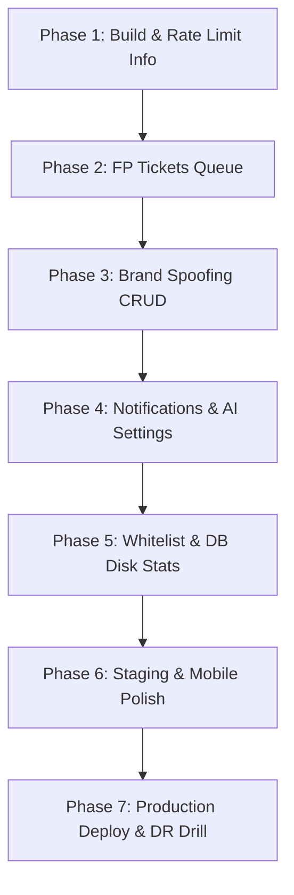

# Safe Zone Production-Ready Gap Analysis & AI Execution Roadmap

This document serves as the master checklist and execution roadmap to transition **Safe Zone** from its current local-first state to a fully-matured, "perfect production" deployment on a single budget VPS. 

It lists all functional gaps, UI/UX mismatches, and operational checklist items, and outlines a structured sequence of highly precise prompts for AI coding agents to address each gap sequentially.

---

## 1. Identified Mismatches & Gaps

### A. Backend Features Missing from UI/UX (Backend > UI)
These powerful backend capabilities are fully functional but completely inaccessible through the Admin Dashboard:

| Gap | Backend Location | Impact on VPS Deployment | Proposed UI Solution |
| :--- | :--- | :--- | :--- |
| **Brand Spoofing / Typosquatting CRUD** | `internal/serve/brands.go` `/v1/brands` | **Critical.** VN Phishing protection parameters (banks, gov domains) cannot be adjusted dynamically. | Add a new sub-panel or tab **"Brand Controls"** to list, create, edit, and delete spoofed brand profiles. |
| **Webhook Alert Configuration** | `internal/agent/alert.go` `AlertTask` | **High.** Operators cannot view or modify where security alerts (Discord/Slack) are sent. | Add a **"Notifications"** section under a new **"Settings"** tab to set and test Webhook URLs. |
| **Tranco Whitelist & Bloom Filter State** | `internal/risk/bloom.go` `internal/risk/whitelist.go` | **Medium.** Operators cannot verify if the memory-saving Bloom filter is active or if the Tranco Top 1M list is fresh. | Add a **"Whitelist Statistics"** card in the System tab showing loaded domain counts and last Tranco sync time. |
| **False-Positive Tickets Queue** | `cmd/core-api/main.go` `/block/report` | **Medium.** Admin cannot view or action incoming reports from blocked users. | Add a **"False-Positive Tickets"** sub-section inside Telemetry or a dedicated queue to review and approve allows. |
| **Build & Version Metadata** | `/v1/version` `buildinfo.Snapshot` | **Low.** Difficult to trace running build information on VPS. | Add a neat version stamp (e.g. `v0.1.0-prod`) in the dashboard footer or System tab. |
| **AI Provider & Quota Controls** | `internal/ai/client.go` `Gemini Client` | **High.** Cannot toggle AI refinement off, adjust model types, or input new API keys dynamically when quota is exhausted. | Add an **"AI Core Settings"** panel under the new **"Settings"** tab. |
| **Telemetry DB Disk Controls** | `internal/store/sqlite.go` `retentionDays` | **Critical.** SQLite logs can fill VPS disk. Admin cannot adjust log retention days or view database file size. | Add a **"Database Storage"** panel in the System tab showing DB size, disk space, and custom retention settings. |

### B. UI/UX Elements Simulating Backend Data (UI > Backend)
These visual elements in the current dashboard are placeholders or simulated, leading to potential operational confusion:

1. **Rate Limit Status Pill (`rate limit --`):**
   * *Status:* The UI Topbar has a status badge for Rate Limits, but the Backend `/` (status endpoint) does not return dynamic rate-limiting information yet.
   * *Solution:* Update `/` status handler to return rate limiting capacity/status and wire it to the UI.
2. **Task Error Traceback Tooltips:**
   * *Status:* UI intends to show hoverable tooltips for failing background task logs, but `/v1/agent/status` only returns `last_error` as a flat string.
   * *Solution:* Modify backend task status logs to capture truncated structural details or provide a dedicated task error query.
3. **Chart.js Fallback Experience:**
   * *Status:* Handled purely on the client side, showing static text counts when CDNs fail.

### C. UX & Manual QA Gaps
* **Mobile / Responsive Layout Verification:** All 5 main tabs must be smoke-tested at `375px` viewport widths to eliminate text overflows or overlapping interactive controls.
* **AJAX False-Positive Reports:** The blocked landing page (`block.html`) does full-page reloads on report submission. It must be refactored to perform smooth asynchronous AJAX posts.

### D. VPS Operations & Deployment Prerequisite Gaps
* **Performance Benchmarking:** Real CPX21 Hetzner benchmarks are needed (Cache-hit: 500 req/s, Cache-miss: 50 req/s).
* **Firewall Isolation:** Verifying external ports (`80`, `443`, `853`) are open and internal ports (`8080`, `8081`) are isolated via `scripts/check-production-ports.sh`.
* **Disaster Recovery Drill:** Verify SQLite and Caddy configuration backups can be fully restored via an offline staging VM test.

---

## 2. Structured AI Execution Roadmap

To address these gaps safely without breaking current backend contracts, the roadmap is divided into **7 sequential phases**. Each phase is written as a clear, comprehensive prompt for an AI agent to execute.

---

## 3. AI Agent Prompts

### Phase 1: Build & Rate Limit Info Integration
> [!NOTE]
> Focus: Link the backend status information of Rate Limits and Build snapshots to the dashboard topbar and footer.

*   **Task:**
    1. Update the `/` (statusHandler) in `cmd/core-api/main.go` to return rate limiter metadata (e.g. Rate limit limits and status).
    2. Add a footer stamp to `dashboard.html` that queries `/v1/version` and renders the Git commit hash and build environment dynamically.
    3. Modify `dashboard.html` client-side script to fetch Rate Limiter status from the API and update the `#rl-status` pill dynamically (e.g., green `active` or grey `disabled`).
*   **Input Files to Read:** [cmd/core-api/main.go](file:///d:/Quorix/services/safe-zone/cmd/core-api/main.go) (L322-361), [cmd/core-api/dashboard.html](file:///d:/Quorix/services/safe-zone/cmd/core-api/dashboard.html)
*   **Files to Edit:** `cmd/core-api/main.go`, `cmd/core-api/dashboard.html`
*   **Hard Rules:** Do not change rate limit middleware logic or breach `core-api` startup configurations.
*   **Acceptance Criteria:** 
    *   `/v1/version` successfully populates a clean stamp in the dashboard sidebar or footer.
    *   The Topbar Rate Limit chip dynamically updates according to the backend status instead of hardcoding `--`.
*   **Verification:** Run `go build ./...` and verify via browser console that status calls return successfully.

---

### Phase 2: False-Positive Tickets & Review Queue
> [!NOTE]
> Focus: Design an inbox panel for the admin to view and approve reports submitted by blocked users.

*   **Task:**
    1. Create a SQLite table `block_reports` in `internal/store/sqlite.go` if it doesn't already exist to persist `/block/report` submissions.
    2. Create a backend API `GET /v1/reports` (requires authentication) to list submitted tickets, complete with pagination.
    3. Build a sub-section or a new collapsible card inside the **Telemetry Tab** named **"User Reports Queue"**.
    4. Render submitted reports dynamically, showing: Domain, User Contact, Note, and Time.
    5. Add an **"Approve / Whitelist"** button that sends a payload to `/v1/overrides/review-false-positive` and a **"Dismiss"** button to archive the report.
*   **Input Files to Read:** [internal/store/sqlite.go](file:///d:/Quorix/services/safe-zone/internal/store/sqlite.go), [cmd/core-api/main.go](file:///d:/Quorix/services/safe-zone/cmd/core-api/main.go), [cmd/core-api/dashboard.html](file:///d:/Quorix/services/safe-zone/cmd/core-api/dashboard.html)
*   **Files to Edit:** `internal/store/sqlite.go`, `cmd/core-api/main.go`, `cmd/core-api/dashboard.html`
*   **Hard Rules:** Keep the existing payload signature for `/v1/overrides/review-false-positive` intact.
*   **Acceptance Criteria:**
    *   An admin can view the queue of false-positive requests submitted by blocked clients.
    *   Clicking "Approve" moves the domain into the Allowed Overrides list and resolves the ticket dynamically.
*   **Verification:** Simulate a block report post, verify it appears in the queue, and approve it via UI.

---

### Phase 3: Brand Spoofing & Typosquatting CRUD Panel
> [!NOTE]
> Focus: Expose the backend VN Brand spoofing management to the admin UI.

*   **Task:**
    1. Build a new dashboard tab or sub-panel under the Overrides tab named **"Phishing Protection / Brand Spoofing"**.
    2. Query `GET /v1/brands` to display the active list of protected brands (e.g. Vietcombank, Government portals).
    3. Construct a clean inline form **"Add Protected Brand"** containing fields: Brand Key, Brand Name, Domain list (comma-separated), and Allowed Edit Distance (Levenshtein).
    4. Implement dynamic JavaScript binds for **Create**, **Edit**, and **Delete** actions targeting the `/v1/brands` endpoint.
*   **Input Files to Read:** [internal/serve/brands.go](file:///d:/Quorix/services/safe-zone/internal/serve/brands.go), [cmd/core-api/dashboard.html](file:///d:/Quorix/services/safe-zone/cmd/core-api/dashboard.html)
*   **Files to Edit:** `cmd/core-api/dashboard.html`, `cmd/core-api/assets/safe-zone.css`
*   **Hard Rules:** Do not alter the `BrandManager` Go interface or SQL schema bindings.
*   **Acceptance Criteria:**
    *   All brand records are visualised in a clean tabular view.
    *   CRUD operations for brands operate flawlessly using native AJAX fetches without reloads.
*   **Verification:** Run `go test ./internal/serve/...` and perform manual validation on Chrome DevTools.

---

### Phase 4: Notifications & AI settings Dashboard (Settings Tab)
> [!NOTE]
> Focus: Provide operators with a dedicated settings configuration dashboard.

*   **Task:**
    1. Add a 6th navigation tab named **"Settings"** using a clean gear icon.
    2. Inside the Settings tab, design two cards:
       *   **AI Engine Settings:** Show the current AI Provider, active model, and Gemini Timeout. Provide a text field to update `SAFE_ZONE_GEMINI_API_KEY` (stored securely in SQLite config or `.env` snapshot) and a Test button to check API key validity.
       *   **Alert Notifications:** Provide a text input to set `SAFE_ZONE_AGENT_WEBHOOK_URL` dynamically and a **"Send Test Alert"** button to trigger a dummy Discord alert via `/v1/agent/trigger` (with a payload).
    3. Expose backend POST APIs on `/v1/settings` to persist these configurations dynamically in the database.
*   **Input Files to Read:** [internal/agent/alert.go](file:///d:/Quorix/services/safe-zone/internal/agent/alert.go), [cmd/core-api/dashboard.html](file:///d:/Quorix/services/safe-zone/cmd/core-api/dashboard.html), [internal/risk/service.go](file:///d:/Quorix/services/safe-zone/internal/risk/service.go)
*   **Files to Edit:** `cmd/core-api/dashboard.html`, `cmd/core-api/main.go`, `cmd/core-api/assets/safe-zone.css`
*   **Hard Rules:** Secret configurations saved to SQLite must be encrypted or heavily masked when fetched.
*   **Acceptance Criteria:**
    *   Webhooks and AI keys can be updated dynamically from the UI without restarting Docker containers.
    *   "Send Test Alert" fires a beautifully formatted message to the active Discord/Slack channel.
*   **Verification:** Test settings saving and confirm the Discord channel receives the manual test alert.

---

### Phase 5: Whitelist & DB Disk Stats Panel
> [!NOTE]
> Focus: Expose Tranco Top 1M / Bloom Filter stats and log storage capacity metrics in the System Tab.

*   **Task:**
    1. Update the `/metrics` or `/v1/agent/status` backend handler to return Bloom Filter operational metrics (e.g. Number of loaded whitelist domains, FPR, Bloom Filter size in RAM).
    2. Add a helper function in `internal/store/sqlite.go` to compute current SQLite file size on disk and free disk space. Expose this via `/metrics`.
    3. Modify `dashboard.html` System Tab to render:
       *   **Tranco Whitelist Health Card:** Displays `Bloom Filter RAM: 1.14 MB`, `Domains Loaded: 1,000,000`, `Last Sync: X hours ago`.
       *   **Storage Disk Health Card:** Displays `SQLite Size: X MB`, `Disk Free: X GB`, and a slider to set `Telemetry Log Retention Days` (submitting to the `/v1/settings` configuration API).
*   **Input Files to Read:** [internal/risk/bloom.go](file:///d:/Quorix/services/safe-zone/internal/risk/bloom.go), [internal/store/sqlite.go](file:///d:/Quorix/services/safe-zone/internal/store/sqlite.go), [cmd/core-api/dashboard.html](file:///d:/Quorix/services/safe-zone/cmd/core-api/dashboard.html)
*   **Files to Edit:** `internal/store/sqlite.go`, `cmd/core-api/main.go`, `cmd/core-api/dashboard.html`
*   **Hard Rules:** Disk checks must degrade gracefully if OS permissions block reading system storage stats.
*   **Acceptance Criteria:**
    *   System Tab displays disk consumption and Bloom filter performance data accurately.
    *   Admin can adjust log retention time directly via UI slider.
*   **Verification:** Build the binary and check that metrics return valid JSON disk parameters.

---

### Phase 6: Staging & Mobile Polish
> [!NOTE]
> Focus: Validate mobile responsiveness and polish UI interactions before final VPS staging deployment.

*   **Task:**
    1. Apply responsive media queries in `safe-zone.css` to align all 6 tabs perfectly on mobile viewports (`375px` to `768px`).
    2. Update `block.html` (the warning block landing page) to perform AJAX submissions when users click "Report False-Positive" and show a beautiful fading receipt instead of a full-page reload.
    3. Conduct the manual QA checks in [admin-dashboard-checklist.md](file:///d:/Quorix/services/safe-zone/docs/qa/admin-dashboard-checklist.md) and record the test suite signature.
*   **Input Files to Read:** [cmd/core-api/block.html](file:///d:/Quorix/services/safe-zone/cmd/core-api/block.html), [cmd/core-api/assets/safe-zone.css](file:///d:/Quorix/services/safe-zone/cmd/core-api/assets/safe-zone.css), [docs/qa/admin-dashboard-checklist.md](file:///d:/Quorix/services/safe-zone/docs/qa/admin-dashboard-checklist.md)
*   **Files to Edit:** `cmd/core-api/block.html`, `cmd/core-api/assets/safe-zone.css`
*   **Hard Rules:** Do not touch the Go-embedded template variables in `block.html`.
*   **Acceptance Criteria:**
    *   All tabs render cleanly on Chrome mobile emulator without layout breaks.
    *   False-positive ticket submit is fully asynchronous and displays an instant success toast.
*   **Verification:** Run browser emulator verification on staging.

---

### Phase 7: Production Deploy & DR Drill
> [!NOTE]
> Focus: Perform final deployment to VPS CPX21 Hetzner, check firewalls, and perform a backup/restore drill.

*   **Task:**
    1. Set `SAFE_ZONE_ENV=production` and `SAFE_ZONE_BLOCK_PAGE_IP=<VPS_PUBLIC_IP>` in `.env`.
    2. Deploy via Compose and run `scripts/check-production-ports.sh` and `scripts/public-edge-smoke.sh`.
    3. Run `scripts/safe-zone.ps1 backup` (or equivalent Linux backup script) to generate a full backup bundle (Redis dump, `.env`, SQLite DB, Caddy config).
    4. Spin up a clean staging server or empty directory, run `scripts/safe-zone.ps1 restore` with the generated backup, and verify the entire dashboard state is successfully restored.
    5. Execute load testing commands to confirm the VPS meets minimum performance targets (Cache-hit: 500 req/s, Cache-miss: 50 req/s).
*   **Input Files to Read:** [docs/production-completion-checklist.md](file:///d:/Quorix/services/safe-zone/docs/production-completion-checklist.md) (Section 8 & 11), [scripts/safe-zone.ps1](file:///d:/Quorix/services/safe-zone/scripts/safe-zone.ps1)
*   **Files to Edit:** Local config configurations (no source code edits).
*   **Hard Rules:** Never run restoring scripts directly on active production without first validating on an isolated staging clone.
*   **Acceptance Criteria:**
    *   Staging environment successfully restores 100% telemetry, override states, and group configurations.
    *   Load testing confirms latency and throughput are within production thresholds.
*   **Verification:** Archive staging verification logs in the production evidence bundle.
